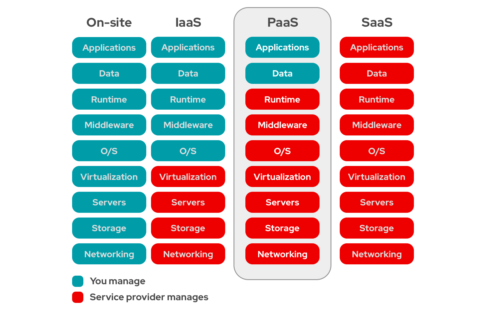

- 컴파일과 런타임
  - 컴파일: 소스 코드를 작성하고 해당 소스 코드를 기계어 코드로 변환하여 실행 가능한 프로그램이 되기 위한 편집 과정.
  - 런타임: 컴파일 과정을 마친 프로그램은 사용자에 의해 실행되며, 이러한 응용프로그램이 동작되는 시점을 런타임이라 부른다.

- 데이터 마이닝(Data Mining)
  - 정의: 대용량의 데이터로부터 사용자의 요구사항에 맞는 의미있는 정보와 지식을 분석하여, 추출하는 방법
  - 등장 배경
    - 기술적 측면: 프로세싱 속도 및 자료저장 구조, 기계학습(ML)기술의 발전, 대량의 데이터 축적 및 데이터마이닝 도구의 발전
    - 비즈니스 측면: Mass 마케팅에서 Target 마케팅으로 패러다임 변화, 대량의 데이터로부터 의미있는 정보 추출을 통한 기업의 새로운 비즈니스 창출/개선/활용.

- 웹 마이닝(Web Mining)
  - 정의: 웹 환경에서 얻어지는 웹 문서, 고객의 정보 및 데이터로부터 특정 행위, 패턴 등의 유용한 정보를 이용하여 마케팅 및 의사결정에 활용하기 위한 마이닝 기법
  - 특징
    - 대용량: 대량의 웹로그를 기반으로 정보를 수집, 자료를 정제 및 클리닝 수행
    - 실시간성: Batch 작업(데이터를 실시간으로 처리하는 것이 아닌 일괄적으로 처리) 성격이 강한 일반 데이터 마이닝과 구별
    - One-to-One: 고객 행위 분석을 통한 개인화 지향(데이터 마이닝은 일반화)
    - 마이닝 기법: 신경망, 연관성, 순서화, 군집화, 의사결정 등에 마이닝 기법 사용

- BCP(Business Continuity Planning)
  - 정의: 지진, 홍수, 천재지변 발생 시, 시스템의 복구, 데이터 복원 등과 같은 단순 복구를 포함하여 기업 비즈니스의 연속성을 보장할 수 있는 체계
  - 등장 배경
    - 재해 대비 시스템 복구 기능이 정보시스템의 필수 요소로 인식되기 시작
    - 기업의 IT 시스템 안정성에 대한 법적 규제가 강화되는 추세
    - 시스템 중지로 인한 영업손실 방지
    - 재해 발생 시 조직 및 개인의 업무 정의 필요
    - 고객 정보 보호 및 업무 연속성 확보를 위한 안정장치 마련
    - 시스템 중단 시 발생하는 기업 이미지 실추 예방
  - 주요 계획
    - 재해 예방: 재해 발생 전 재해 발생 요인에 대응, 위기 관리를 통해 사전에 위기를 정성적, 정량적으로 분석
    - 대응 및 복구: 재해에 대한 정성적, 정량적 평가 항목을 도출, BIA(Business Impact Analysis)를 통한 파급 효과 분석 및 대응 방안 수립, Contingency Plan을 통한 복구 수립

- BCM(Business Continuity Management)
  - 정의: 예기치 않은 상황에서도 비즈니스를 지속적으로 운영하여 비즈니스의 연속성을 보장할 수 있는 경영 방식
  - 특징
    - 복원 능력(Resilience): 업무 중단 발생 시 견뎌낼 수 있는 능력
    - 반복 훈련(Simulation): 계획이 예상대로 수행되고 개선됨을 보장
    - 업무 중단 관리: IMP(Incident Management Plan, 사고 확산 통제), BCP를 통해 업무 중단 관리

- DRS(Disaster Recovery System)
  - 정의: 정보 시스템에 대한 비상 대비체계 유지와 각 업무 조직별 비상사태에 대비한 복구계획 수립을 통한 업무 연속성을 유지할 수 있는 체제
  - 필요성
    - 재해 상황에서 재해복구를 통한 서비스 연속성 확보
    - 연속성 확보를 통한 기업 신뢰도 확보
  - 구축 절차
    - 1단계: 업무 영향 분석
    - 2단계: 재해 복구 전략 수립
    - 3단계: 시스템 구축 및 복구 계획 수립
    - 4단계: 운영 및 모의 훈련

- BIA(Business Impact Analysis)
  - 재해 발생시 영향을 미칠 수 있는 위험을 정의하고, 업무 중단 영향에 대한 정량적, 정성적 분석을 통해 복구 우선순위를 도출하는 과정
  - 목적
    - 핵심 우선순위 결정: 모든 핵심점 사업의 프로세스에 우선순위를 부여함
    - 중단 시간 산정: 경쟁력 있는 기업으로 살아남기 위해 견딜 수 있는 최장시간의 산정
    - 자원 요구: 핵심 프로세스에 대한 지원 요구사항 정의, 시간에 민감한 프로세스에 대부분의 자원을 할당

- 클라우드 컴퓨팅

  - 정의: 하드웨어, 소프트웨어, 데이터 등의 IT 자원이 웹을 통해 표준화된 서비스의 형태로 제공되는 모델 

  - 클라우드로 제공되는 서비스에 대해 사용자는 언제, (IP지원이 되는) 어떤 장비를 통해서든, 원하는 만큼의 서비스를 골라서 사용할 수 있으며, 사용량에 기반하여 비용을 지불하는 비즈니스 모델

  - 3가지 서비스 모델

    > 사진 출처: https://www.redhat.com/ko/topics/cloud-computing/what-is-paas

    

    - SaaS(Software as a Service)
    - PaaS(Platform as a Service)
    - IaaS(Infrastructure as a Service)

  - 4가지 전개 모델

    - Private Cloud: 자사의 내부에 직접 클라우드 인프라를 구축하여 내부에 소속된 사람만 이용
    - Community Cloud: 공통의 관심사를 가진 특정 커뮤니티의 여러 조직이 클라우드를 함께 이용
    - Hybrid Cloud: 내부에 사설 클라우드를 구축하여 운영하다가 필요에 따라 외부의 공용 클라우드를 함께 이용 하는 것
    - Public Cloud: 누구나 함께 이용할 수 있게 구축된 대규모 클라우드서비스

  - 5가지 특징

    - 사용자 중심 서비스: 사용자가 사용한 만큼 비용을 지불
    - 네트워크 접근: 네트워크 기반의 서비스
    - 신속한 서비스 제공
    - 계량 가능한 서비스
    - 컴퓨팅 자원 공유

  - 모바일 클라우드
    - 클라우드 컴퓨팅을 모바일 서비스에 접목시킨 것
    - 구성: 단말, 애플리케이션 제공자, 클라우드 컴퓨팅

- NoSQL	
  - 전통적인 관계형 데이터베이스 보다 덜 제한적인 일관성 모델을 이용하는 데이터의 저장 및 검색을 위한 매커니즘을 제공
  - NoSQL 데이터베이스는 단순 검색 및 추가 작업을 위한 매우 최적화된 키 값 저장 공간.
  - Not only SQL이라 불리기도 한다.
  - MongoDB가 대표적이다.

