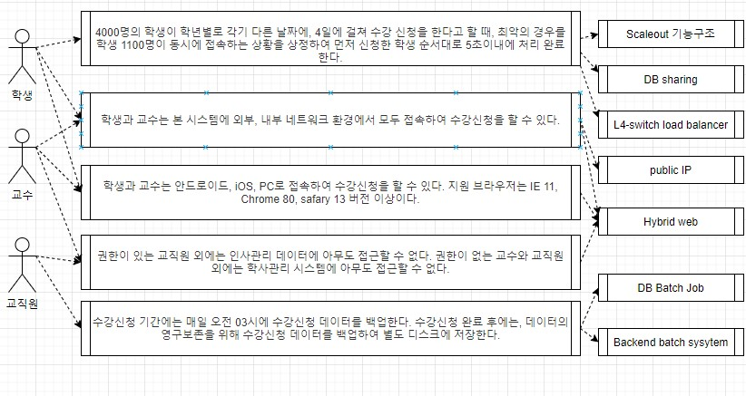
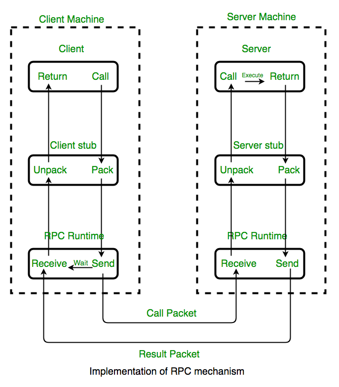

# 프레임워크와 라이브러리

- 프레임 워크
  - 정의
    - 소프트웨어의 특정 문제를 해결하기 위해서 상호 협력하는 클래스와 인터페이스의 집합
    - 소프트웨어의 구체적인 부분에 해당하는 설계와 구현을 재사용이 가능하게끔 일련의 협업화된 형태로 클래스들을 제공하는 틀이다.
    - 재사용이 가능하도록 소프트웨어 구성에 필요한 기본을 제공한다.
    - 정보 시스템의 개발 및 운영을 지원하는 도구 및 가이드 등을 포함한다.
  - 특징
    - 모듈화: 프레임워크는 구현을 인터페이스 뒤에 감춰 모듈화를 강화한다. 설계와 구현 병경에 따르는 영향을 최소화 한다.
    - 재사용성: 인터페이스를 통해 여러 애플리케이션에서 반복적으로 사용하는 일반적 컴포넌트를 정의하여 재사용성을 높인다.
    - 확장성: 다형성을 통해 애플리케이션이 프레임워크의 인터페이스를 확장
    - 제어의 역행: 프레임워크 코드가 전체 애플리케이션의 처리 흐름을 제어, 외부의 이벤트에 대해 애플리케이션이 어떤 메서드를 수행해야할지 결정
  - 구성 요소
    - 개발환경: 설계, 구현, 테스트 등 개발에 필요한 지원 도구 모음.
    - 실행환경: 라이브러리 코드 모음
    - 운영환경: 표준 프레임워크 기반 개발 시스템에 대한 운영 시 필요한 의사소통 및 모니터링 도구 모음
    - 관리환경: 표준 프레임웤에 대한 기술 지원, 업그레이드 등 관리하기 위한 내부 업무 시스템.
  - 비유하자면 자동차와 같다고 할 수 있다.


- 라이브러리
  - 정의
    - 특정 기능에 대한 도구, 함수를 모은 집합.
    - 소프트웨어 개발 시 공통으로 사용될 수 있는 특정한 기능을 모듈화한 기법
  - 구성
    - 도움말: 라이브러리를 사용할 수 있도록 하는 도움말
    - 설치 파일: 라이브러리 적용을 위해 제공되는 설치 파일
    - 샘플 코드: 라이브러리에 대한 이해를 돕기 위한 샘플 소스 코드
  - 종류
    - 표준 라이브러리: 프로그래밍 언어가 기본적으로 가지고 있는 라이브러리. 기본적인 기능 수행과 더불어 디버깅, 성능 측정 등을 위한 별도의 API가 존재한다.
    - 외부 라이브러리: 표준 라이브러리와 달리 별도의 파일 설치가 필요. 누구나 개발 가능하다.
  - 비유하자면 공구상자와 같다고 할 수 있다.


- 차이점
  - 제어의 권한
    - 프레임워크: 제어의 역전 개념이 적용된 대표적인 기술로 제어의 권한이 개발자가 아닌 프레임워크에게 있다.
    - 라이브러리: 제어의 권한이 라이브러리를 사용하는 개발자에게 있다.
  - 목적성
    - 프레임워크는 그것이 개발되는 단계에서부터 특정한 목적성을 가지고 만들어진다.
    - 라이브러리는 특정한 목적성 없이 편리한 도구들을 모아놓은 것 뿐이다.
    - 예를 들어 자동차는 빠른 이동이라는 분명한 목적이 존재한다. 그러나 공구상자는 용도만 존재할 뿐 특별한 목적성이 존재하지는 않고 상황에 따라 필요한 것을 꺼내서 쓰면 된다.
  - 규칙
    - 프레임워크는 목적성이 존재하기에 사용하는데 일정한 규칙을 지켜야 한다.
    - 라이브러리는 규칙이 존재하지 않으며 사용하는 사람이 임의로 변경시킬 수 있다.


# 아키텍처 그리기(설계하기)

- 아키텍처를 요구하는 대상들
  - 명세서
  - 프로젝트 매니저
  - 고객


- 사전적 정의
  - 아키텍처: 건물이나 다른 구조물을 계획, 설계, 건설하는 과정과 그 결과물
  - SW아키텍처
    - wiki: 소프트웨어 구성요소들 사이에서 유기적 관계를 표현하고, 소프트웨어 설계와 업그레이드를 통제하는 지침과 원칙
    - Software Architecture in Practic(3판): 시스템을 추론하는데 필요한 구조의 집합으로, 시스템은 소프트웨어 요소와 이들 사이의 관계, 그리고 이들 요소와 관계의 속성으로 구성된다.


- 아키텍처가 중요한 이유
  - 초기 설계 과정의 **결정사항**: 구현에 대한 제약사항 검토 및 시스템에 대한 구조 결정
  - 커뮤니케이션의 **기준점**: 서비스나 시스템 이해 당사자들 간의 공통분모
  - 재사용 가능한 **레퍼런스**: 아키텍처를 결정 짓게 한, 유사한 요구사항 및 설계 경험의 재사용


- 학사관리시스템을 예시로 보는 아키텍처 설계 방법

  - 결정요인 도출

    - 이해관계자 선별(시스템에 연관되는 사람이나, 다른 시스템): 학생, 교수, 교직원, 외부 시스템(인사 관리 시스템)
    - 기능요구사항: 학사 관리 기능, 수업 관리 기능, 수강 관리 기능, 사용자 관리 기능
    - 비기능요구사항(품질속성): 강의신청 기간에 원활한 진행, 언제 어디서나 접근 가능, 모바일에서도 접속 가능, 데이터 손실 방지 등.
    - 비기능요구사항(품질속성) 때문에 아키텍처를 그린다고 봐도 될 정도로 비기능요구사항은 매우 중요한 사항이다.
  - 결정요인들의 연관관계를 도식화(유스 케이스 다이어그램 사용)

  > 아래 다이어 그램을 그린 사이트 : https://app.diagrams.net/

  

  - 비기능 요구사항 기반으로 품질 속성 시나리오 작성

    - 스파이크 성 트래픽에 대한 처리(수강 신청 기간에 몰리는 접속량), public 환경(언제 어디서나 접근 가능),  하이브리드 웹(모바일에서 접속 가능), 권한을 통한 정보 보안, 주기적 데이터 백업(데이터 손실 방지) 등
    - 실제 서비스를 위해서는 기능 구현만을 목적으로 해선 안되며 위와 같은 품질 속성을 고려해야 한다.
    - 스파이크 성 트래픽에 대한 처리: 4000명의 학생이 학년별로 각기 다른 날짜에, 4일에 걸쳐 수강 신청을 한다고 할 때, 최악의 경우를 학생 1100명이 동시에 접속하는 상황을 상정(해당 일자에 수강신청하는 1000명+다른 용무로 접속하는 학생 100명)하여 먼저 신청한 학생 순서대로 5초이내에 처리 완료한다.
    - public환경: 학생과 교수는 본 시스템에 외부, 내부 네트워크 환경에서 모두 접속하여 수강신청을 할 수 있다.
    - 하이브리드 웹: 학생과 교수는 안드로이드, iOS, PC로 접속하여 수강신청을 할 수 있다. 지원 브라우저는 IE 11, Chrome 80, safary 13 버전 이상이다.
    - 권한을 통한 정보 보안: 권한이 있는 교직원 외에는 인사관리 데이터에 아무도 접근할 수 없다. 권한이 없는 교수와 교직원 외에는 학사관리 시스템에 아무도 접근할 수 없다.
    - 주기적 데이터 백업: 수강신청 기간에는 매일 오전 03시에 수강신청 데이터를 백업한다. 수강신청 완료 후에는, 데이터의 영구보존을 위해 수강신청 데이터를 백업하여 별도 디스크에 저장한다.

  - 품질 속성 시나리오에 따른 아키텍처 전략 수립

    

  - 아키텍처 도식화

    

  - 아키텍처 검증(평가)하기


# Server & Client Architecture

- DNS(Domain Name Server)
  - 클라이언트가 서버에 요청을 보낼 때 DNS를 통해 보내게 된다.
  - ISP(Internet Service Provider, 인터넷 서비스 제공) 업체(SKT, KT, LG)별로 DNS의 주소가 다르다.
  - DNS Cache: 매번 DNS에 요청을 보내는 대신 최초로 DNS에 요청을 보냈을 때 그 응답으로 받은 IP를 저장해둔다.
    - 저장 위치: 브라우저, 운영체제, 라우터, ISP 등에 저장한다.
  - TCP(Transmission Control Protocol) 3 Way HandShake
    - SYN(Synch): IP 주소에 해당하는 서버에 요청을 보낸다.
    - ACK(acknowledge)+SYN: 싱크가 맞으면 서버는 요청을 받았다는 확인을 클라이언트에 보낸다.
    - ACK: 클라이언트 역시 서버에 확인 응답을 보낸다.
  - DNS는 반의 모든 사람의 전화번호를 알고 있는 반장과 같고, DNS IP는 반장 직통 번호로 비유했을 때 번호를 모르는 같은 반 친구에게 연락하고자 한다면 아래의 과정을 거치게 된다.
    - 반장에게 연락한다
    - 반장에게 친구의 이름을 알려주고 전화번호를 물어본다.
    - 반장이 해당 학생의 번호를 찾아본다.
    - 전화번호를 전달 받는다.
    - 받은 번호를 저장한다(따라서 이후에는 이 친구의 번호를 얻기 위해서는 굳이 반장에게 연락할 필요가 없다).
    - 받은 번호로 전화한다.
  - 이를 Server & Client의 관계에 대입하여, 주소창에 www.google.com을 입력한 이후의 과정은 다음과 같다.
    - Client는 DNS Resolver에게  www.google.com라는 도메인과 함께 요청을 보낸다.
    - DNS Resolver는 Root Name Server로 www.google.com라는 도메인과 함께 요청을 보내는데,  Root Name Server는 도메인 중 마지막에 달린 `.com`, `.co.kr` 등을 분석하여 이들에 대한 정보를 가진 Server의 IP(TLD Name Server IP)를 DNS Resolver로 반환한다.
    - DNS Resolver는 이 응답을 가지고 www.google.com라는 도메인과 함께 TLD(Top Level Domain) Name Server로 다시 요청을 보낸다.  TLD Name Server는 `google.com`까지 분석하여 이 주소에 대한 정보를 가진 Server의 IP(Authoritative Name Server IP)를 DNS Resolver로 반환한다.
    - DNS Resolver는 이 정보를 가지고 Authoritative Name Server에 www.google.com라는 도메인과 함께 요청을 보내는데 Authoritative Name Server는 이를 분석하여 해당 도메인의 IP 주소를 반환한다.
    - DNS Resolver는 반환 받은  IP 주소를 Client에 반환한다.
    - DNS Cache를 통해 이를 저장한다.
    - TCP 3 Way HandShake를 통해 서버에 요청을 보낸다.


- HTTP request, response
  - 이는 TCP 연결이 이루어진 뒤의 과정이다.
  - HTTP(HyperText Transfer Protocol): HTML을 요청하고 전달 받기 위한 규약
  - Client는 Server에 Request Method(GET, POST 등)와 함께 요청을 보낸다.
  - 일반적으로 최초의 요청은 GET 메서드로 index.html을 요청한다. 서버는 이에 대한 요청으로 index.html과 함께 status code(성공했을 경우 200)를 반환한다.


- 위 내용을 정리하여, 구글 홈페이지가 브라우저에 보여지기까지의 과정은 다음과 같다.
  - 브라우저에 www.google.com을 입력한다.
  - DNS를 통해 IP 주소를 획득한다.
  - 획득한 IP 주소에 있는 서버와 TCP 3 Way Handshake를 진행한다.
  - 통신을 맺은 서버에 HTTP Request를 한다.
  - 서버에 보낸 HTTP Request를 통해 html 파일을 받는다.
  - 브라우저가 html을 분석하여 화면으로 그린다.


# 개발자는 항상 의심해야 한다

- 서버는 클라이언트를 무작정 믿어선 안된다.

  - 악의적인 의도를 가진 클라이언트의 요청을 막을 수 있어야 한다.

  - 서버는 클라이언트에 따라 능동적인 대처가 필요하다.

  - 서버는 클라이언트에서 어떤 사용자가 요청를 보낸 것인지 사용자에 대한 인증이 필요하다(토큰 사용).

  - 서버는 사용자가 보낸 요청이 유효한 것인지 유효성을 검증해야한다.

    - 예시1.회원가입시 비밀번호 검증 같은 경우 백과 프론트 모두에서 검증해야 한다.
    - 예시2.파일 업로드 기능 구현시 파일 유형을 엄격히 제한해야 한다. 현대카드의 경우 게시판에 업로드 기능이 있었는데 `.jsp` 확장자의 업로드도 허용하였다. 이 때문에 서버의 DB를 조회하여 사용자 정보가 유출된 적이 있었다.

  - Sql injection에 주의해야 한다.

  - XSS

    - Cross-Site Scripting

    ```html
    <script>악의적인 해커의 url로 사용자의 주요 정보 전송</script>
    ```

  - 클라이언트에서는 최소한의 처리만 해야하며 중요한 로직은 모두 서버에서 처리해야 한다.

    - 예를 들어 할인 로직의 경우 이를 프론트 단에서 처리할 경우, 악의적으로 이를 조작한다면 서버는 할인된 가격을 적용시킬 수 밖에 없다.
    - 클라이언트는 이러한 악의적인 조작에 서버보다 취약하므로 중요한 로직은 서버에서 처리해야 한다.


- 서버는 항상 자기 자신도 의심해야 한다.
  - 개발자는 개발을 진행하면서 자신이 보낸 요청에 대한 응답만을 확인하지만 실제 서비스는 N명의 요청이 동시에 들어온다는 것을 인식하고 있어야 한다.
    - JMeter와 같은 도구를 사용하요 부하 테스트를 수행한다.
  - 적절한 응답 시간과 데이터의 신뢰성을 확보해야 한다.
    - 응답 시간을 줄이기 위해 캐시를 고려해야 한다.
    - 캐시를 쓴다는 것은 메모리를 사용하겠다는 말이고 이는 결국 코드로 보면 변수 혹은 객체에 저장한다는 말이다.
    - 데이터 신뢰성의 경우 최대한 다양한 상황을 가정하고 테스트를 해봐야 한다. 예를 들어 한 사람만 사용할 때에는 포인트가 정상적으로 쌓이는 것 처럼 보이겠지만 여러 명이 사용할 경우 사실 포인트가 한 사람에게만 쌓이도록 코드가 짜여져 있을 수도 있다. 따라서 테스트를 보다 다양하고 정밀하게 진행해야 한다.
  - 서비스 및 컨텐츠 별로 사용 권한을 명확히 해야 한다.
  - 주요 데이터를 암호화 해야 한다.
  - 트랜잭션
    - 하나의 과정을 잘게 분할하여 분할 된 과정 중 하나만 실패하더라도 전체 과정을 취소시켜야 한다.
    - 여를 들어 상품 구매시 상품권 적용+신용카드 선택+쇼핑몰 포인트 적용의 과정을 거칠 때 쇼핑몰 포인트 적용이 실패했다면 이전의 상품권, 신용카드 선택도 모두 취소되어야 한다.
  - Logging
    - 서버가 작동하면서 발생하는 주요 이슈들을 기록해야 한다.
    - 단순 콘솔 출력 보다는 주요 logger(library)를 사용해야 한다.
    - 이는 서버 운영 시 발생하는 다양한 이슈들을 추적하는 시작점이 된다.
  - 서버 테스트 시나리오
    - 복수개의 요청을 반드시 수행해봐야 한다.
    - 눈에 보이지 않는 비 기능 요소에 대한 테스트 시나리오를 작성해야 한다.
    - 테스트 할 내용을 안다는 것 자체가 SW역량을 인증하는 것이다.


- HTTP(Hyper Text Transfer Protocol)
  - Stateless: HTTP는 stateless하다. 서버는 클라이언트의 상태에 관심이 없고, 클라이언트 역시 서버의 상태에 관심이 없다. 요청과 그에 따른 응답이 끝나면 둘 사이의 연결은 끊어지게 된다.
  - HTTP 서버는 불특정 다수의 요청을 전제(HTTP 서버만의 특성이라기 보다 서버의 특성에 가깝다)
  - Stateless의 단점은 무엇이며 이를 해결하기 위한 방법은 무엇인가
    - 단점: 클라이언트는 서버에 요청을 보낼때 마다 클라이언트에 대한 정보도 담아서 보내야 한다.
    - 해결법: 클라이언트는 상태를 유지하기 위해서 쿠키를, 서버는 상태를 유지하기 위해서 세션을 사용한다.


# 개발자의 나쁜 습관

- 코드관리
  - 무분별한 복붙
    - 무엇인지 모르고 복붙해서 사용하기만 한다면 유지보수에 문제가 발생한다.
    - 사용하는 측에서 문제를 발견하여 수정하더라도 원래의 소스코드에는 해당 내용이 반영되지 않는다.
  - 디버깅 미루기
    - 사소한 버그라도 디버깅을 미루면 후일 큰 문제가 발생할 수 있다.
    - 사소한 버그라도 놓치지 않도록 할 일 목록을 만들어 두어야 한다.
  - 지나치게 축약된 코드
    - 간결한 코드가 좋은것은 사실이다.
    - 그러나 간결성 보다는 가독성, 접근성이 먼저다.
    - 남이 보고 한 번에 파악할 수 있는 코드를 짜야 한다.
  - 이른 최적화
    - 최적화는 가장 마지막 단계에서 해야 한다.
    - 최적화를 마친 후 요구사항이 바뀌면 어차피 최적화도 다시 해야 한다.
  - 남이 알아볼 수 있는 코드를 짜라
    - 코드 스타일을 지켜서 짜야 한다.
    - 변수명, 함수명은 이름만 보고도 무슨 역할을 하는지 알아볼 수 있게 짜야 한다.


- 팀워크
  - 잦은 계획 변경
    - 무분별한 계획 변경은 일정 지연 및 개발 기간 부족으로 이어진다.
    - 계획 변경은 개발기간을 고려하여 신중하게 해야 한다.
  - 실현 가능성이 낮은 계획
  - 아이디어를 공유하지 않고 아이디어에 대한 피드백을 받지 않음
  - 혼자 일하는 개발자
  - 나쁜 코드를 짜는 것을 거부한다.
    - 프로젝트 마감일에 쫒겨 작동만 가능하도록 급조하여 만든 코드를 짜는 것을 무작정 거부하는 개발자
    - 나쁜 코드는 분명 지양해야 하지만 일정에 맞추는 것이 중요하다.
    - 나쁜 코드라도 빠르게 짤 수 있는 능력도 필요하다.
  - 거만한 태도
    - 자신의 실수를 인정하지 않는 태도
    - 다른 팀원에게 자신의 지식을 공유하지 않음
    - 자신의 코드에 집착하고 다른 사람의 의견을 수용하지 않음


- 코드 작성
  - 에러 메세지 무시
    - 에러 메세지를 제대로 읽지 않고 에러의 원인을 다 이해했다고 착각
    - 에러 메세지 분석에 시간을 들이는 것이 길게 보면 시간을 단축하는 일이다.
  - 하나의 개발자 툴 킷만 사용
    - 개발 스타일에 따라 잘 맞는 IDE가 있다.
    - 특정 언어, 특정 조직에 특화된 IDE가 있다.
  - 무분별한 라이브러리 사용
    - 예제 몇 가지를 보고 라이브러리를 마스터 했다고 생각
    - 프로젝트에 맞지 않는 라이브러리의 사용


- 테스트 및 유지보수
  - 통과할 정도의 테스트 만들기
    - 통과하지 못할 테스트도 만들어야 한다.
    - 테스트는 에러를 잡기 위해서 하는 것임을 기억해라.
  - 기능구현에만 집중하기
    - 기능 구현에만 몰두하면 성능, 보안 문제를 소홀히 하기 쉽다.
    - 기능 구현을 하면서도 끊임 없이 해당 기능과 관련하여 어떤 문제들이 있을지 생각하고 리스트화 해야 한다.


# 프로젝트 DB 설계

- DB 설계의 목적
  - 관련 조직의 정보 요구에 대한 정확한 이해
  - 분석자, 개발자, 사용자간 원활한 의사소통 수단
  - 데이터 중심의 분석 방법에서 DB 설계는 굉장히 중요한 부분
  - 현행 시스템만이 아닌 신규 시스템 개발의 기초 제공


- 설계 과정

  - 설계를 위한 요구사항 분석
    - DB에 대한 사용자의 요구사항을 수집하고 분석하여, 요구사항 명세서를 작성해야 한다.
    - 마구잡이로 설계한다면 기능 하나를 추가할 때마다 DB를 다시 설계해야 한다.
  - 개념적 설계
    - 작성한 요구사항 명세서에서 DB를 구성하는데 필요한 개체, 속성, 개체 간의 관계를 추출하여 ERD 작성
    - 개체와 속성을 추출(대부분 명사로 선별한다)
    - 개체는 테이블, 속성은 컬럼에 해당한다.
    - 개체 간의 관계를 추출(대부분 개체 사이의 관계를 나타내는 동사로 선별한다)
    - 분석 내용을 ERD로 작성
  - 논리적 설계
    - 모든 개체는 릴레이션으로 변환(개체의 속성을 정의)
    - N:M 관계는 릴레이션으로 변환(중계 테이블 생성)
    - 1:N 관계는 외래키로 표현
    - 1:1 관계는 외래키로 표현
    - 다중 값 속성은 독립 릴레이션으로 변환(회원 1명당 여러 명의 자녀가 있다고 하면 자녀를 독립 릴레이션으로 전환, 즉 한 컬럼의 데이터가 2 이상이라면 독립 릴레이션으로 변환)

  - 물리적 스키마 수현
    - ERD를 실제 테이블로 생성


- 반정규화
  - 정규화된 엔티티 타입, 속성, 관계를 시스템의 성능 향상, 개발과 운영의 단순화를 위해 모델을 통합하는 프로세스
  - 정규화 모델
    - 이상적인 논리모델은 모든 엔티티 타입, 속성, 관계가 반드시 한 개만 존재한다.
    - 따라서 입력, 수정, 삭제도 한 곳에서만 발생하므로 데이터 값이 변질되거나 이질화 될 가능성이 없다.
    - 반면 여러 테이블이 생성되어야 하므로 SQL 작성이 용이하지 않고 과다한 테이블 연결이 발생하여 성능이 저하될 가능성이 높다
  - 반정규화 모델
    - 반정규화는 여러 개의 테이블을 단순화시켜 SQL 작성이 용이하고 성능이 향상될 가능성이 높아진다.
    - 그러나 같은 데이터가 여러 테이블에 걸쳐 존재하므로 무결성이 깨질 우려가 있다.
  - 테이블 반정규화
    - 1:1 관계의 테이블 병합
    - 1:N 관계의 테이블 병합
    - 수퍼/섭 타입 테이블 병합
    - 수직 분할(집중화된 일부 컬럼을 분리)
    - 수평 분할(행으로 구분하여 구간별 분리)
    - 테이블 추가(중복테이블, 통계테이블, 이력테이블, 부분테이블)
  - 컬럼 반정규화
    - 중볼 컬럼 추가(자주 조회하는 컬럼이 있을 경우, 예를 들어 지점 테이블이 있고, 지점과 1:N 관계를 가지는 직원 테이블이 있다고 할 때,  지점 테이블에는 지점 위치라는 컬럼이 존재한다고 가정하면, 직원을 통해 지점위치를 알기 위해서는 직원 테이블에 있는 지점 위치 FK 값으로 지점을 조회하여 지점 위치를 조회해야 한다. 그러나 만일 직원이 근무하는 지점의 위치를 빈번히 조회해야 한다면, 아예 직원에 지점위치 컬럼을 넣는다.)
    - 파생 컬럼 추가(미리 계산한 값)
    - PK에 의한 컬럼 추가
    - 응용시스템 오작동을 위한 컬럼 추가(이전데이터 임시 보관)


# 데이터 크롤링

- 인터넷에서 데이터를 수집하는 방법
  - OpenAPI 등을 통해 공개된 데이터를 얻는 방법
  - HTTP GET Method를 사용해 HTML을 가져오는 방법
  - Selenium Web Driver 등을 사용해 사람이 하는 것과 유사한 자동화 방법
  - 사람이 수작업으로 데이터를 수집하는 방법


- 크롤러와 스크래퍼
  - 크롤러: 조직적, 자동화 된 방법으로 웹을 탐색/수집하는 프로그램
    - 구글, 네이버 등의 검색엔진 결과 데이터를 수집하기 위한 봇(Bot)
  - 스크래퍼: 웹 사이트에서 정보를 추출하는 프로그램
    - 상품별 가격을 알기 위해 해당 상품을 파는 페이지들의 가격을 추출
  - 크롤러 보다는 대부분 단순 스크래퍼 개발 수요가 많다.
  - 우리나라에서는 많은 기업들이 같은 의미로 혼용


- 구글은 어떻게 크롤링을 하는가?
  - 사용자가 검색하기 전, 수천억 개에 달하는 웹페이지에서 정보를 수집
  - 수집한 정보를 바탕으로 검색 색인에 정리
  - 과거 정보 수집으로 만들어진 웹 URL 목록과 웹사이트 소유자가 제공한 사이트맵에서 대상 페이지 목록 수집 후 페이지의 내용 수집
  - 사이트에 있는 링크를 사용하여 다른 페이지를 색인
  - 해당페이지를 수집하는 동안 새로운 사이트, 기존 사이트의 변경사항, 깨진 링크를 주의 깊게 확인


- 크롤링의 적법성

  - 주소 뒤에 /robots.txt를 붙이면 배제 표준 규칙을 확인 가능하다(e.g. https://www.google.com/robots.txt).
  - 홈 디렉토리에 위치한 robots.txt 파일에 포괄적인 크롤링 금지 또는 특정 검색엔진의 크롤링 금지, 특정 디렉토리에 대한 크롤링 금지 등을 표시하였음에도, 그 표시를 무시하고 크롤링하였다면 사이트 운영자의 의사에 반한 크롤링에 해당한다.
  - 운영자는 robots.txt 외에 페이지 하단 약관 등에 크롤링 금지 표시를 할 수 도 있다.
  - 크롤링의 매너
    - robots.txt를 열어보고 서버의 로봇 배제 표준을 준수 할 것
    - UserAgent를 속이지 않을 것
  - robots.txt의 로봇 배제 표준 규칙

  | 규칙                                                         | 내용                                              |
  | ------------------------------------------------------------ | ------------------------------------------------- |
  | User-agent:*  ,  Disallow: /                                 | 모든 검색엔진이 긁어가는 것 모두 막기             |
  | User-agent:*  ,  Disallow:                                   | 모두 허용하기                                     |
  | User-agent:*  ,  Disallow: /cgi-bin/, Disallow: /tmp/, Disallow: /private/ | cgi-bin, tmp, private 디렉토리 긁어가는 것만 막기 |
  | User-agent:BadBot ,  Disallow: /                             | 배드봇 검색로봇만 긁어가기 제외                   |
  | User-agent:WebCrawler  ,  Disallow:                          | 웹크롤러 검색로봇만 긁어가기 허락                 |

  - User Agent의 종류는 크게 다음의 두 가지다.
    - 인간이 조작하는 웹 브라우저 형식
    - 자동화된 에이전트(봇)의 형식


- Web Abusing
  - Web Abusing: 데이터 크롤링을 응용하여 데이터 수집이 아닌 다른 용도로 사용
  - 검색엔진과 쇼핑몰 등은 Web Abusing과의 전쟁 중이다.
    - 특정 검색어를 여러 번 검색하여 검색어 순위 조작을 하거나, 특정 상품을 여러 번 클릭하여 많이 본 제품으로 등록되게 하는 등 여러 문제가 발생한다.
  - 일반 사용자와 Abuser를 판단하는데 많은 자원이 투입된다. 


# 클라우드

- 클라우드(cloud)
  - 클라우드 컴퓨팅 또는 클라우드 서비스를 줄인 말
  - 클라우드 컴퓨팅은 인터넷 기반 컴퓨팅의 일종으로 정보를 자신의 컴퓨터가 아닌 인터넷에 연결된 다른 컴퓨터로 처리하는 기술을 말한다(위키백과)
  - 종류
    - 컴퓨터의 CPU와 메모리에 해당하는 컴퓨팅 서비스(컴퓨팅, 서버)
    - 컴퓨터의 하드디스크에 해당하는 저장 장치 서비스(스토리지)
    - 인터넷에 연결할 수 있는 네트워크 서비스(네트워크)


- 가상화
  - 하드웨어 기능을 시뮬레이션하여 애플리케이션 서버, 스토리지 및 네트워크와 같은 소프트웨어 기반 IT 서비스를 생성하는 기술
  - 클라우드는 가상화를 가능하게 하는 IT 환경이라고 할 수 있다.


- 사용처
  - 개인: 대개 저장공간을 빌리는 형식으로 클라우드 서비스를 사용한다.
  - 기업: 다양한 클라우드 서비스를 사용하지만 특히 서버 관련 클라우드 서비스를 많이 사용한다.


# Linux

- 리눅스는 왜 어려운가
  - Command 위주의 환경
    - CLI(Command Line Interface)로 GUI(Graphic User Interface)에 비해 처음 접하는 사람이 막막함을 느낀다.
  - 클라이언트 보다는 서버를 주로 다룬다.
    - 서비스 제공, 디스크 관리, 네트워크 관리, 상태 관리, 보안 관리 등의 다양하고 익숙하지 않은 서버의 역할을 수행해야 한다.
  - OS에 대한 기본 지식 필요
  - 다양한 배포판이 존재


- Linux Kernel
  - Linus Torvalds의 리눅스 재단에서는 Linux Kernel을 만들고 있다.
  - 다양한 개발자들이 개발에 참여하고 있으며 토발스는 maintainer를 맡고 있다.


- Linux Distro
  - Linux Kernel이 리눅스의 핵심 내용들을 담고 있다면 Linux Distro는 이를 사용 가능하도록 한 배포판이다.
  - 다양한 계열이 존재한다.
    - RedHat 계열에는 일반적으로 기업용으로 제공하는 CentOS와 개인용으로 제공하는 fedora가 있다.
    - debian 계열에는 ubuntu와 Linux Mint가 있다.
    - slacware 계열에는 SUSE가 있다.


# 캐싱

- 캐시
  - 데이터나 값을 미리 복사해 놓는 임시 장소
  - 캐시를 사용하는 경우
    - 데이터에 접근하는 시간이 캐시에 접근하는 시간에 비해 오래 걸리는 경우
    - 값을 다시 계산하는 시간을 절약하고 싶은 경우
  - 캐시에 데이터를 미리 복사해 놓으면 계산, 접근 시간 없이 빠른 속도로 데이터에 접근 가능
  - 캐시에는 공간 지역성(데이터의 근접성), 시간 지역성(데이터를 최근에 사용 했는지)을 고려하여 필요한 것들을 저장하게 된다.


- 바람직한 캐싱
  - Write가 빈번하고 Read는 거의 없는 경우 보다는 Read가 빈번하고 Write는 거의 없는 경우에 캐시를 사용하는 것이 좋다.
  - 메모리는 매우 중요한 자원이므로 신중하고 선별적으로 캐싱하는 정책이 필요하다.
  - 메모리는 한정적이며 휘발성이다. 따라서 메모리에 부하가 걸리게 된다면 메모리에 저장된 데이터가 모두 날아가 버릴 수 있다. 뿐만 아니라 메모리를 사용하는 다른 작업들에도 큰 영향을 미칠 수 있다. 따라서 메모리는 매우 신중하게 다뤄야 한다.


# 소프트웨어 테스팅

- 소프트웨어 테스팅
  - 사람이 만든 소프트웨어를 테스트 하는 작업
  - 하드웨어와 소프트웨어의 융합 제품이 많아 하드웨어 테스트와 소프트웨어 테스트의 경계는 점점 없어지는 추세
  - 수정사항 발생시 수정이 쉬움
  - 제작 과정에서 요구사항 변경이 빈번함


- 하드웨어 테스팅
  - 기계가 만든 하드웨어를 테스트 하는 작업
  - 수정사항 발생시 수정이 매우 어려움
  - 제작 과정에서 요구사항 변경이 어려움


- 소프트웨어 테스트의 7가지 원칙(ISTQB)
  - 테스트는 결함이 존재함을 밝히는 작업이다.
  - 완벽한 테스트는 불가능하다.
    - 비용 관점에서 완벽한 테스트는 불가능하다.
    - 효율적인 테스트 전략을 수립해야 한다.
  - 개발 초기에 테스트하라
    - 통합, 릴리즈 이후 진행되는 디버깅은 범위가 커져 매우 어렵다.
    - 또한 개발 후반부에 발견될 결함을 예방할 수 있다.
    - 개발 초기에만 하라는 것이 아니라 개발 초기부터 테스트 계획을 짜라는 것이다.
  - 결함은 집중된다.
    - 개발자, 환경, 모듈 등 여러 가지 원인으로 발생할 수 있다.
    - 그러나 그 원인을 중심으로 결함은 몰려서 발생하는 성향이 있다.
  - 살충제 패러독스
    - 동일한 테스트 케이스를 오래 사용하면 개발자들은 내성이 생기게 된다.
    - 환경, 시간에 맞게 테스트를 변경하는 작업이 필요하다.
  - 테스팅은 정황 의존적이다.
    - 상황에 따라 동일한 대상도 테스트 범위가 달라진다. 정황에 대한 파악 작업이 중요하다.
    - 예를 들어, 로그인 페이지를 수정했을 경우(정황)에 로그인, 회원가입, 회원 정보 수정 등에 대한 테스트를 해야 할 것이다.
  - 오류 부재의 궤변
    - 사용자 똔느 비즈니스의 요구를 충족시키지 못한다면, 결함을 모두 발견하여 제거하였다고 하더라도 품질이 높다고 볼 수 없다.
    - 개발한 시스템이 사용자의 필요와 기대에 부응하지 못한다면 결함을 찾는 활동도 의미가 없다.


- Verification, Validation
  - Verification
    - 요구 사항, 기본 설계, 상세 설계 등 문서화된 사항들을 충실히 구현했는지 여부
  - Validation
    - 고객 입장에서 정말 원하는 방식되로 구현이 되었는지를 평가
  - 만일 흔들리는 의자를 만들어 달라는 고객의 요구가 있었을 때, 고객이 원한 것은 흔들의자지만 개발자가 만든 것은 오뚜기처럼 모든 방향으로 흔들리는 의자라면 Verification은 충족(의자가 흔들린다)하지만 Validation은 충족하지 못한 것이다.


# 쿠키, 세션, 웹 스토리지, IndexedDB

- HTTP의 특징 
  - 상태를 가지고 있지 않다(Stateless)
    - 웹 사이트를 사용하다보면 다양한 종류의 정보(상태)를 알고 있어야 한다.
    - 예를 들면 사용자의 로그인 상태인지를 알고 있어야 함에도, 혹은 사용자의 계정에 관한 정보를 알고 있어야 함에도 HTTP는 상태를 가지고 있지 않으므로 로그인 여부, 누가 로그인 했는지 여부를 알 수 없다.
  - 연결 상황을 알지 못한다(Connectless)
    - 요청과 응답이 오고 나면 클라이언트와 서버의 요청은 끊어지게 된다.
    - 예를 들어 클라이언트가 서버에 로그인 요청을 보내고 서버가 이에 대한 응답을 줄 경우 서버가 응답을 준 순간 연결은 끊어지게 된다. 그러나 사용자가 계속 로그인 상태인지 여부를 서버와의 교신 없이도 알고 있어야 한다.
  - 따라서 상태를 저장할 무언가가 존재해야 한다.


- 쿠키

  - 정의: 인터넷 사용자가 어떠한 웹사이트를 방문할 경우 그 사이트가 사용하고 있는 서버를 통해 인터넷 사용자의 컴퓨터에 설치되는 작은 기록 정보 파일

  - 종류

    - Session Cookie: 만료 시간을 설정하고 웹 클라이언트 메모리에만 저장되며 브라우저 종료시 삭제 되는 쿠키
    - Persistent Cookie: 장기간 유지되는 쿠키(최대 1년), 파일로 저장되어 브라우저 종료와 무관하게 유지 되는 쿠키
    - Secure Cookie: HTTPS에서만 사용 가능, 쿠키 정보가 암호화 되어 전송되는 쿠키
    - Third-Party Cookie: 방문한 도메인과 다른 도메인의 쿠키

  - 특징

    - key-value의 쌍으로 존재한다.
    - 이름, 값, 만료 날짜, 경로 정보가 들어있다.

    - 만료 기간이 존재한다.
    - 4KB의 용량 제한이 있다.
    - 세션에 비해 속도는 빠르다.
    - 사용자의 하드 디스크에 저장되기에 보안에 취약하다는 단점이 존재한다.

  - 동작 방식

    - 클라이언트가 페이지를 요청

    - 서버에서 쿠키를 생성 후 HTTP 헤더에 쿠키를 포함시켜 응답
    - 브라우저가 종료되어도 쿠키 만료 기간이 있다면 사라지지 않고 클라이언트에서 보관한다.
    - 같은 요청을 할 경우 HTTP 헤더에 쿠키를 담아 서버로 보낸다.
    - 서버에서 쿠키를 읽어 클라이언트 정보를 찾아서 응답한다.
    - 쿠키의 정보를 변경 할 필요가 있을 경우 서버는 쿠키를 업데이트 하고 HTTP 헤더에 담아서 클라이언트로 보낸다.


- 세션
  - 정의: 클라이엍트와 웹서버 간 네트워크 연결이 지속 유지되고 있는 상태(브라우저를 열어 서버에 접속하고 접속을 종료하는 시점 까지의 상태)
  - 특징
    - 쿠키에 기반을 두고는 있으나 사용자 정보 파일을 브라우저에 저장하는 쿠키와 달리 세션은 서버 측에서 관리한다.
    - 서버의 메모리에 저장된다.
    - 서버는 클라이언트를 구분하기 위해 클라이언트에게 고유한 세션 ID를 부여하며 웹 브라우저가 서버에 접속해서 브라우저를 종료할 때까지 인증 상태를 유지한다.
    - 보안 면에서 쿠키보다 우수하다.
    - 서버의 메모리에 저장되므로 사용자가 많아질수록(많은 클라이언트와 연결 될 수록) 서버 메모리를 많이 차지하게 된다.
  - 동작 방식
    - 클라이언트가 서버에 접속 시 세션 ID를 발급 받는다.
    - 클라이언트는 자신에게 할당된 세션 정보를 쿠키에 저장해서 가지고 있는다(쿠키의 종류 중 Session Cookie가 이 쿠키다).
    - 클라이언트는 서버에 요청할 때, 이 쿠키의 세션 ID를 서버에 전달해서 사용한다.
    - 서버는 세션 ID를 전달 받아 해당 세션을 찾은 후 세션에 있는 클라이언트 정보를 가져온다.
    - 클라이언트 정보를 가지고 서버 요청을 처리하여 클라이언트에게 응답한다.


- 웹 스토리지
  - 정의: DOM 스토리지라고도하는 웹 스토리지는 웹 애플리케이션에 클라이언트 측 데이터를 저장하는 방법을 제공하는 것(wikipidia)
  - 특징
    - 쿠키의 단점을 보완하기 위해 HTML5부터 지원 시작
    - key-value의 쌍으로 존재한다. value에는 어떤 타입의 데이터를 담든 문자열이 된다.
    - 4KB 밖에 지원하지 않는 쿠키에 비해 5MB라는 저장 공간을 사용 가능
    - 로컬 스토리지와 세션 스토리지가 존재한다.
    - 두 스토리지 모두 JS의 `window`객체 안에 들어 있다.
  - 로컬 스토리지
    - 브라우저 자체에 반영구적으로 데이터를 저장하며, 브라우저가 종료되도 데이터가 유지된다.
    - 도메인이 다른 경우 로컬 스토리지에 접근할 수 없다. 예를 들어 네이버에서 로컬 스토리지에 저장한 데이터는 구글에서는 접근할 수 없다.
  - 세션 스토리지
    - 각 세션(브라우저의 탭)마다 데이터가 개별적으로 저장된다.
    - 세션을 종료할 경우 데이터가 자동으로 제거된다.
    - 같은 도메인이라도 세션이 다르면 데이터에 접근할 수없다.


- IndexedDB

  - 정의: Indexed Database API, WebSimpleDB 등의 이름으로도 불리는데, 색인(index)이 포함된 JSON 객체가 모여있는 트랜잭셔널 로컬 데이터베이스를 위해 W3C 가 권고한 웹 브라우저 표준 인터페이스의 하나 

  - 특징
    - 웹 스토리지 보다도 큰 저장 공간을 제공한다.
    - 많은 양의 구조화된 데이터를 저장하기에 적합하다.
    - SQL을 사용하는 관계형 데이터베이스(RDBMS)와 같이 트랜잭션을 사용하는 데이터베이스 시스템이다.
    - 그러나 IndexedDB는 RDBMS의 고정컬럼 테이블 대신 JavaScript 기반의 객체지향 데이터베이스이다.
    - key-value의 쌍으로 존재한다. key로 색인 된 객체를 저장하고 검색이 가능하다.
    - 모두 문자열로 저장하는 스토리지와 다르게 IndexedDB 는 javascript에서 사용하는 모든 타입의 데이터를 저장 가능하다.
    - 비동기적으로 동작한다.


# REST API

- API의 개념
  - 애플리케이션을 만들기 위한 하위 함수, 프로토콜, 도구들의 집합을 말한다.
  - 명확하게 정의된 다양한 컴포넌트 간의 통신 방법이다.


- 유형
  - 오픈 API
    - 누구나 쉽게 접근하여 정보를 공유하기 위해 만들어진 API
    - 기상청 API 등
  - 비공개 API
    - 권한이 있는 일부 사용자들에게만 정보를 제공하기 위해 만들어진 API
    - 사내 API 등


- 목적
  - API를 통해 프로그래머가 특정 기술을 사용하기 쉽게 만들어준다.
  - 개발자들에게 필요한 기능들을 추상화하고, 객체, 클래스 등을 제공한다.


- DSL(Domain-Specific Language, 도메인 특화 언어)
  - 특정 분야에 최적화된 프로그래밍 언어.
    - 특정한 목적이 있고 해당 목적의 달성만을 위해서 사용되는 언어
    - SQL의 경우 DB를 조작하는 데 사용하지만 그 이외의 목적으로는 사용하지 않는 DSL이다.
  - 해당 분야 또는 도메인의 개념과 규칙을 사용한다.
  - Python, Java 등의 범용 언어보다 덜 복잡하다.


# SSL과 TLS

> https://kanoos-stu.tistory.com/46
>
> https://12bme.tistory.com/80

- 대칭키와 비대칭키(혹은 공개키)

  > https://12bme.tistory.com/80

  - key
    - 암호를 만드는 행위인 암호화를 진행할 때 사용하는 일종의 비밀번호를 키라 부른다.
    - 이 키에 따라서 암호화된 결과가 달라지기에 키를 모르면 암호를 푸는 행위인 복호화를 할 수 없다. 
  - 대칭키
    - 동일한 키로 암호화와 복호화를 진행하는 암호화 기법에 사용되는 키.
    - 암호를 주고 받는 사람들 사이에 대칭키를 주고 받기 어렵다는 문제가 있다.
    - 대칭키가 유출될 경우 암호화된 내용을 복호화할 수 있기에 암호화가 의미가 없어진다.
  - 비대칭키(혹은 공개키)
    - 암호화할 때와 복호화할 때 각기 다른 키를 사용하는 암호화 방식에 사용되는 키를 의미한다.
    - A, B 두 개의 키가 있을 때, A키로 암호화하면 B키로 복호화할 수 있고, B키로 암호화하면 A키로 복호화할 수 있다.
    - 두 개의 키 중 하나를 비공개키(private key, 개인키, 비밀키)로 하고, 남은 하나를 공개키(public key)로 지정하여 비공개키는 자신만 가지고 있고, 공개키를 타인에게 공개한다.
    - 암호화는 공개키를 사용하고, 복호화에 비공개키를 사용한다.
    - 공개키를 제공받은 타인은 공개키를 사용해서 정보를 암호화하고 암호화한 정보를 비공개키를 가진 사람에게 전송하고, 비공개키를 가진 사람은 비공개키로 이 정보를 복호화한다.
    - 공개키가 유출된다고해도 비공개키를 모르면 복호화가 불가능하기에 대칭키보다 안전한 방식이다.
  - 위와 같은 비대칭키의 원리를 역으로 사용하면 아래와 같은 방식으로도 응용이 가능하다.
    - 비공개키의 소유자는 비공개키를 이용해서 정보를 암호화 한 후에 공개키와 함께 암호화된 정보를 전송한다. 
    - 정보와 공개키를 획득한 사람은 공개키를 이용해서 암호화된 정보를 복호화한다. 
    - 이 과정에서 공개키가 유출된다면 의도하지 않은 공격자에 의해서 데이터가 복호화 될 위험이 존재함에도 비공개키를 이용하여 정보를 암호화해서 보내는 이유는 이 과정이 데이터를 보호하는 것이 목적이 아니기 때문이다.
    - 암호화된 데이터를 공개키를 가지고 복호화 할 수 있다는 것은 그 데이터가 공개키와 쌍을 이루는 비공개키에 의해서 암호화 되었다는 것을 의미한다. 
    - 즉 공개키로 데이터를 복화할 수 있다는 것은 해당 데이터가 비공개키를 가진 사람으로 부터 온 것이라는 것을 보장한다.
    - 따라서 데이터를 보낸 사람의 신원을 보장해주게 된다.
    - 즉, 공개키로 암호화하고 비공개키로 복호화하는 방식은 데이터의 안전한 전송에 목적이 있고, 비공개키로 암호화하고 공개키로 복호화하는 방식은 데이터를 보낸 사람을 신뢰할 수 있는가를 인증하는 데 목적이 있다.
    - 이 방식은 전자서명에 사용된다.


- SSL(Secure Scokets Layer)
  - 원래 웹상의 데이터는 누구나 읽을 수 있는 일반 텍스트 형식으로 전송되었다.
    - 이러한 문제때문에 인터넷 통신의 개인정보 보호, 인증, 데이터 무결성을 보장하기 위해 Netscape가 1995년 처음으로 SSL을 개발하였다.
  - SSL은 암호화 기반 인터넷 보안 프로토콜이다. 
    - 전달되는 모든 데이터를 암호화하고 특정한 유형의 사이버 공격도 차단한다.
  - 다만 1996년 3.0 이후 업데이트가 되지 않고 있으며, 알려진 취약점들이 다수 존재해 앞으로 사라질 것으로 보인다.


- TLS

  - TLS 는 SSL의 업데이트 버전으로 SSL의 최종버전인 3.0과 TLS의 최초버전의 차이는 크지않다.
    - 그럼에도 이름이 바뀐것은 SSL을 개발한 Netscape가 업데이트에 참여하지 않게 되어 소유권 변경을 위해서이다.
    - 아직까지는 SSL이라는 명칭이 더 널리 사용된다.

  - SSL/TLS 를 사용하는 웹사이트 URL은 HTTP 대신 HTTPS가 사용된다.


- SSL 인증서
  - 클라이언트와 서버간의 통신을 제3자가 보증해주는 전자화된 문서.
  - SSL 인증서의 역할
    - SSL 인증서는 클라이언트가 접속한 서버가 신뢰할 수 있는 서버임을 보장한다. 
    - SSL 통신에 사용할 공개키를 클라이언트에 제공한다.
  - SSL인증서를 발급하는 역할을 하는 민간 기업들을 CA(Certificate Authority)라고 부른다.
    - 당연히 아무 기업이나 될 수는 없고 엄격하게 공인된 기업들만 참여가 가능하다.
    - 그 중에서도 모든 사람들이 신뢰할수 있다고 공인된 기관은 root CA라 부른다.
  - 인증서에는 다음과 같은 정보가 담겨있다.
    - 인증서를 발급한 CA 관련 정보.
    - 서비스의 도메인 등의 서비스 관련 정보.
    - 공개키의 암호화 방법 등 서버측의 공개키에 대한 내용.
    - 인증서의 유효 기간.
    - 서비스의 도메인, 공개키 등의 정보는 서비스가 CA로부터 SSL 인증서를 구매할 때 제출해야한다.
    - 당연히 위의 정보들은 CA의 비공개키에 의해서 암호화되며, 인증서의 내용을 종합해 해시화한 값을 fingerprint라 부른다.
  - 브라우저는 CA에 대한 정보를 가지고 있다.
    - 브라우저는 공인된 CA들에 대한 정보를 가지고 있다.
    - 웹 브라우저가 서버에 접속할 때 서버는 가장 먼저 인증서를 제공한다.
    - 브라우저는 이 인증서의 발급 기관(CA)가 자신의 CA 리스트에 있는지 확인한다.
    - CA 리스트에 있다면 해당 CA의 공개키를 활용하여 인증서를 복호화한다.
    - CA의 공개키에 의해서 인증서가 정상적으로 복화화 된다는 것은 해당 인증서가 CA의 비공개키에 의해 암호화 되었다는 것을 보장한다.


- SSL의 암호화
  - SSL은 대칭키 방식과 비대칭키 방식(공개키 방식)을 모두 사용한다.
    - 클라이언트와 서버가 주고 받는 실제 정보는 대칭키 방식으로 암호화한다.
    - 그리고 해당 대칭키를 비대칭키 방식으로 암호화해서 주고 받는다.
  - 두 방식을 모두 사용하는 이유는 다음과 같다.
    - 공개키 방식이 많은 컴퓨터 파워를 사용하기 때문이다. 
    - 만약 공개키를 그대로 사용하면 많은 접속이 몰리는 서버는 매우 큰 비용을 지불해야 할 것이다. 
    - 반대로 대칭키는 암호를 푸는 열쇠인 대칭키를 상대에게 전송해야 하는데, 암호화가 되지 않은 인터넷을 통해서 키를 전송하는 것은 위험하다. 
    - 따라서  속도는 느리지만 데이터를 안전하게 주고 받을 수 있는 공개키 방식으로 대칭키를 암호화하고, 실제 데이터를 주고 받을 때는 대칭키를 이용해서 데이터를 주고 받는 것이다.


- SSL의 동작 과정(handshake-session-session 종료)
  - Client hello
    - 클라이언트가 서버에 접속하는 단계
    - 클라이언트에서 생성한 랜덤 데이터, 클라이언트가 지원하는 암호화 방식, 세션 아이디 등을 서버로 전송한다.
    - 클라이언트가 지원하는 암호화 방식을 전송하는 이유는 서버와 클라이언트 사이에 지원하는 암호화 방식에 차이가 날 수 있기에 어떤 방식으로 암호화 할지 합의하기 위해서다.
    - 이미 SSL 핸드쉐이킹을 했다면 비용과 시간을 절약하기 위해서 기존의 세션을 재활용하는데, 이 때 사용하기 위해 세션 아이디를 전송한다.
  - Server hello
    - 서버가 Client hello에 대한 응답을 클라이언트로 보낸다.
    - 서버에서 생성한 랜덤 데이터, 서버가 선택한 클라이언트의 암호화 방식, SSL 인증서를 클라이언트로 전송한다.
  - 인증서 확인
    - 서버가 전송한 인증서가 CA에 의해서 발급된 것인지를 확인하기 위해서 클라이언트에 내장된 CA 리스트를 확인한다. 
    - 인증서가 CA에 의해서 발급된 것인지를 확인하기 위해서 클라이언트에 내장된 CA의 공개키를 이용해서 인증서를 복호한다.
    - 복호화에 성공했다면 인증서는 CA의 개인키로 암호화된 문서임이 암시적으로 보증된다.
    - 또한 Client hello 단계에서 클라이언트가 생성한 랜덤 데이터와 Server hello 단계에서 서버가 생성한 랜덤 데이터를 조합하여 pre master secret이라는 키를 생성한다.
    - pre master secret는 실제로 주고 받을 데이터를 암호화 할 때 사용한다.
    - pre master secret는 대칭키이기 때문이 절대 제 3자에게 노출되어서는 안된다.
  - 클라이언트는 pre master secret를 서버의 공개키(서버가 보낸 인증서 안에 담겨 있다)로 암호화해서 서버로 전송한다. 
    - 서버는 자신의 비공개키로 이를 복호화하여 저장한다.
    - 서버와 클라이언트는 모두 일련의 과정을 거쳐서 pre master secret 값을 master secret값으로 만든다.
    - master secret 값을 사용하여 session key를 생성하는데, 이 session key 값을 사용해서 서버와 클라이언트는 대칭키 방식으로 데이터를 암호화해서 주고 받게 된다.
    - 여기까지 완료되면 클라이언트와 서버 사이의 handshake 단계가 종료된다.
  - 세션 단계
    - 세션은 실제로 서버와 클라이언트가 데이터를 주고받는 단계이다. 
    - 이 단계에서 핵심은 정보를 상대방에게 전송하기 전에 session key 값을 이용해서 대칭키 방식으로 암호화 한 것이다. 
    - 암호화된 정보는 상대방에게 전송될 것이고, 상대방도 세션키 값을 알고 있기 때문에 암호를 복호화 할 수 있다.
  - 세션 종료
    - 데이터의 전송이 끝나면 SSL 통신이 끝났음을 서로에게 알려준다.
    - 이 때 통신에 사용된 대칭키인 세션키를 폐기한다.


# 동시성 병렬성

- 프로그램, 프로세스와 스레드

  > https://libertegrace.tistory.com/entry/Python-%EB%8F%99%EC%8B%9C%EC%84%B1%EA%B3%BC-%EB%B3%91%EB%A0%AC%EC%84%B1-%EB%AC%B8%EB%B2%95-Multithreading

  - program
    - 실행 가능한 파일로, 아직 메모리에 할당되지 않은 정적 상태를 말한다.

  - Process
    - 프로그램 인스턴스, 실행중인 프로그램을 말한다.
    - 즉, 메모리에 왈라와 실행되고 있는 독립적인 프로그램 인스턴스.
  - Thread
    - 프로세스 내에서 동작되는 여러 실행의 흐름 단위
    - 하나의 프로세스에 여러 개의 스레드가 존재할 수 있다.
  - 프로세스와 스레드의 비교
    - Process는 독립적이며, Thread는 프로세스의 서브넷이다.
    - Process는 각각 독립적인 자원을 가지지만, Thread는 프로세스의 자원을 공유한다.
    - Process는 자신만의 주소 영역을 가지지만, Thread는 주소 영역을 공유한다.
  - 멀티 프로세스
    - 한 개의 단일 어플리케이션을 여러 프로세스로 구성 후 실행하는 것을 의미한다.
  - 멀티스레드
    - 한 개의 단일 어플리케이션을 여러 스레드로 구성후 실행하는 것을 의미한다.
    - 사용자에 대한 응답성이 향상될 수 있고, 자원 공유가 효율적으로 이루어 질 수 있다는 장점이 있다.
    - 예를 들어,  A, B 두 개의 스레드가 존재하고 A스레드는 로직 처리, B 스레드는 처리된 결과를 사용자에게 보내주는 역할을 한다면, 단일 스레드일 때에 비해 응답성이 향상될 수 있다.
    - 또한 스레드는 프로세스의 자원을 공유하므로, 자원의 효율적 사용이 가능하다. 만일 10mb 정도의 용량을 필요로 하는 프로그램을 4GB짜리 프로세스 2개에서 실행한다면 각 프로세스별로 3.9GB를 놀리고 있는 셈이 되지만, 단일 프로세스에서 스레드만 늘려주면 자원의 추가 없이도 기존 자원만으로 사용이 가능하다.
    - 그러나 하나의 프로세스에서 동작하므로, 한 스레드만 문제가 생겨도 프로세스 내의 전체 스레드가 영향을 받는다는 문제가 있다.
    - 또한 자원 공유에서 문제가 발생할 수도 있고, 디버깅이 어렵다는 단점이 존재한다.


- 동시성과 병렬성

  > 동시성은 한 번에 많은 것을 다룬다.
  >
  > 병렬성은 한 번에 많은 것을 한다.
  >
  > 똑같지는 않지만, 연관성은 있다.
  >
  > 동시성은 구조, 병렬성은 실행에 관한 것이다.
  >
  > 동시성은 병렬화할 수 있는 문제를 해결하기 위해 해결책을 구조화하는 방법을 제공한다.
  >
  > -롭 파이크(Go 공동 창시자)

  - 동시성과 병렬성은 동시에 일어나는 여러 개의 작업을 처리하기 위한 방식이라는 점에서 공통점이 있다.
  - 그러나 두 방식에는 분명한 차이가 존재한다.
  - 동시성 예시
    - 만약 요리사 한 명이 주문과 요리를 동시에 하는 식당이 있다고 가정해보자.
    - 손님은 와서 요리를 주문하고, 요리가 완성되기 전까지 자리에 가서 기다리면서 핸드폰을 보거나 함께 온 사람과 이야기를 할 수 있다.
    - 요리사 역시 요리를 하는 중간 중간에 다른 손님으로부터 주문을 받을 수 있다.
  - 병렬성 예시
    - 여러 명의 은행원이 은행 업무를 보고 있다고 가정해보자.
    - 여러 명의 은행원이 존재하므로 여러명의 손님을 대상으로 상담은 가능하다.
    - 그러나 한 명의 은행원은 손님과의 상담이 끝날 때 까지 다른 손님을 상대할 수 없다.
  - 동시성이 병렬성보다 나은 것인가?
    - 위의 예시들만 보면 동시성이 병렬성 보다 나은 것 처럼 보이지만 그렇지만은 않다.
    - 예를 들어 방이 8개인 집을 청소해야한다고 생각해보면 한 사람이 이 방, 저 방을 돌면서 동시에 청소하는 것 보다는 8명이 방 하나씩 잡고 청소하는 것이 더 나을 것이다.
    - 이처럼 동시성과 병렬성은 각기 다른 특성을 갖고 있으므로 무엇이 더 우월하다고 할 수는 없다.
  - API 개발에서의 동시성과 병렬성
    - API 개발은 요청과 응답 사이에 대기 시간이 존재한다는 특성으로 인해 일반적으로 동시성이 병렬성 보다는 낫다.
    - 따라서 주로 비동기적으로 코드를 작성하여 동시성을 구현한다.
  - 동시성은 사실 동시에 실행되는 것은 아니다.
    - 동시성은 싱글 코어에서 둘 이상의 스레드가 번갈아가며 실행되는 것이다.
    - 가상 병렬 처리의 한 형태로, 둘 이상의 스레드가 하나의 코어 내에서 빠르게 교차되면서 실행되기에 동시라고 느껴지는 것이다.
    - 각 스레드가 교차는 부분을 **Context Switching**이라 부른다.
    - 이에 반해 병렬성은 둘 이상의 코어가 각기 스레드를 실행하는 것으로 실제로 두 개의 스레드는 동시에 실행된다.


- Context Switch

  > https://spurdev.tistory.com/13 참고

  - CPU가 현재 작업 중인 프로세스에서 다른 프로세스로 넘어갈 때 지금까지의 프로세스의 상태를 저장하고, 새 프로세스의 저장된 상태를 다시 적재하는 작업
    - 프로세스의 정보는 PCB에 저장된다.
    - 멀티태스킹, 인터럽트 핸들링, 사용자 모드와 커널 모드 간의 전환시에 발생한다.
  - 멀티태스킹
    - 실행 가능한 프로세스들이 운영체제의 스케줄러에 의해 조금씩 번갈아가변서 수행되는 것을 의미한다.
    - 프로세스들이 번갈아가며  CPU를 할당받는데 이를 Context Switching이라 한다.
    - 체감하기 힘든 속도로 발생하기 때문에 동시에 처리되는 것 처럼 느껴진다.
  - 인터럽트 핸들링
    - 인터럽트란 컴퓨터 시스템에서 예외 상황이 발생했을 때 CPU에게 알려 처리할 수 있도록 하는 것을 의미한다.
    - 인터럽트가 발생하면 Context Witching이 일어난다.
    - 구체적으로는 입/출력 요청, CPU 사용 시간 만료, 자식 프로세스 생성, 인터럽트 처리를 대기할 때 발생한다.
  - 사용자와 커널 모드 전환
    - Context switch가 필수는 아니지만 운영체제에 따라 발생할 수 있다.
  - Context switching이 발생하는 동안 오버헤드가 발생한다.
    - 따라서 자주 발생할 경우 성능이 저하될 수 있다.


# RPC

> https://velog.io/@jakeseo_me/RPC%EB%9E%80
>
> https://www.getoutsidedoor.com/2019/07/11/what-is-grpc/

- RPC(Remote Procedure Call, 원격 프로시저 호출)
  - 별도의 원격 제어를 위한 코딩 없이 다른 주소 공간에서 함수나 프로시저를 실행할 수 있게 하는 프로세스 간 통신 기술
    - 프로세스간 통신을 위해 사용하는 IPC(Inter Process Communication) 방법의 한 종류.
    - 분산 컴퓨팅 환경에서 프로세스 간 상호 통신 및 컴퓨팅 자원의 효율적인 사용을 위해서 발전된 기술이다.
    - 원격지의 프로세스에 접근하여 프로시저 또는 함수를 호출하여 사용한다.
    - RPC를 이용하면 프로그래머는 함수가 실행 프로그램에 로컬 위치에 있든 원격 위치에 있든 동일한 코드를 이용할 수 있다.
  - 함수와 프로시저의 차이
    - 함수(function): input에 따른 output의 발생을 목적으로 하는 것으로, Return값을 필수로 가져야한다.
    - 프로시저(Procedure): output 값 자체에 집중하기보단, 명령 단위가 수행하는 절차에 집중한 개념으로, Return 값이 없을 수도 있다.
  - RPC의 기능
    - 언어나 환경에 구애받지 않고 Client-Server 간의 커뮤니케이션을 가능하게 한다.
    - 일반적으로 프로세스는 자신의 주소공간 안에 존재하는 함수만 호출하여 실행 가능하다.
    - 그러나, PRC는 네트워크를 통한 메시징을 통해 다른 주소 공간의 함수나 프로시저를 호출할 수 있게 해 준다.
    - 이를 통해 MSA(Micro Service Architecture) 서비스를 만들 때, 언어나 환경에 구애받지 않고, 비즈니스 로직을 개발하는 데 집중할 수 있다.


- IDL(Interface Definition Language)

  - 소프트웨어 컴포넌트의 인터페이스를 묘사하기 위한 명세 언어
    - 어느 한 언어에 국한되지 않는 언어 중립적인 방법으로 인터페이스를 표현함으로써, 같은 언어를 사용하지 않는 소프트웨어 컴포넌트 사이의 통신을 가능하게 한다.
    - 즉, 두 개의 시스템을 연결하는 다리 역할을 한다.

  - RPC는 IDL을 사용하여 인터페이스를 명시한다.
    - 서버와 클라이언트가 서로 다른 언어를 사용하는 경우도 있다.
    - 서로 다른 언어가 요청과 응답을 주고 받기 위해 인터페이스를 통해 규칙을 명세하고, 각자의 시스템이 이해할 수 있는 형태로 변형하는 작업이 필요한데, IDL이 이러한 역할을 담당한다.
  - 정의된 IDL을 기반으로 rpcgen이라는 rpc 프로토콜 컴파일러를 통해 코드(stub)가 생성된다.
    - Stub은 클라이언트에게는 서버의 프로시저 호출을 위한 참조자가 된다.
    - 서버에게는 프로시저 이해를 위한 참조가 된다(서버 측의 stub을 skeleton이라 부른다.).
    - stub은 원시소스코드 형태로 만들어지므로 클라이언트, 서버 프로그램에 포함하여 빌드한다.


- RPC의 구조 및 동작 과정

  

  

  - 클라이언트가 클라이언트 스텁 프로시저를 작동시키고, 파라미터를 전달한다.
  - 클라이언트 스텁이 메시지에 파리미터를 Marshall(Pack, 직렬화)한다.
    - Marshall: 파라미터 값을 표준화된 형식으로 변환시키고, 각 파라미터를 메시지에 복사하는 과정
    - 데이터 형태를 XDR(eXternal Data Representation) 형식으로 변환한다.
    - XDR로 변환하는 이유는 integer, float과 같은 기본 데이터 타입에 대해서 머신마다 메모리 저장 방식(i.e. little endian, big endian)이 CPU 아키텍처 별로 다르며, 네트워크 전송 과정에서 바이트 전송 순서를 보장하기 위해서이다.
  - 클라언트 스텁이 메시지를 전송 계층(transport layer)에 넘겨준다.
    - 전송 계층은 해당 메시지를 원격 서버로 보낸다.
  - 서버 측에서 전송 계층이 받아온 메시지를 서버 스텁에 넘겨준다.
    - 서버 스텁은 메시지를 Demarshall(Unmarshall, Unpack)한다.
  - 서버 스텁은 프로시저를 호출한다.
  - 서버 프로시저가 종료되면, 서버 스텁을 반환하고, 서버 스텁은 반환 값을 Marshall하여 메시지에 담는다.
    - 이 메시지를 전송 계층에 전달한다.
  - 전송 계층은 반환 값을 다시 클라이언트의 전송 계층에 전달한다.
  - 클라이언트의 전송 계층은 받은 메시지를 클라이언트 스텁에 전달한다.
  - 클라이언트 스텁은 받아온 반환 파라미터값을 Demarshall하고, 실행한다.


## gRPC

> https://chacha95.github.io/2020-06-15-gRPC1/
>
> https://grpc.io/docs/what-is-grpc/introduction/

- gRPC
  - Google에서 개발한 RPC 시스템
  - TCP/IP 프로토콜과 HTTP 2.0 프로토콜을 사용한다.
    - HTTP 2.0은 HTTP 1.1의 프로토콜을 계승해 성능을 더욱 발전시켰다.
  - HTTP 2.0의 특징
    - Multiplexed Streams: 한 connection으로 동시에 여러 개의 메시지를 주고 받을 수 있으며, Response는 순서와 상관 없이 stream으로 주고 받는다.
    - Stream Prioritization: 리소스간 우선 순위를 설정해 클라이언트가 먼저 필요로하는 리소스부터 보내준다.
    - Server Push: 서버는 클라이언트의 요청에 대해 요청하지 않은 리소스를 마음대로 보내줄 수 있다.
    - Header Compression: Header table과 Huffman Encoding 기법을 사용해 header를 압축한다.
  - IDL로 protocol buffers를 사용한다.
    - google에서 자체 개발한 IDL이다.
    - 구조화된 데이터를 직렬화 할 수 있게 해준다.
    - 다른 방식(XML, Json 등)에 비해 간단하고, 파일 크기도 3~10배 작으며 속도도 20~100배 빠르다는 장점이 있다.
    - Json 같은 IDL도 사용이 불가능 한 것은 아니다.
  - Python, Java, C++, C#, JavaScript, Ruby 등에서 사용 가능하다.


- gRPC의 구조

  

  - 다른 RPC들과 마찬가지로 service를 정의하고, 원격으로 호출할 수 있는 메서드들을 정의하고, type을 반환한다.
  - 서버에서는 위와 같은 명세를 구현하고 gRPC 서버를 실행시킨다.
  - 클라이언트는 stub을 통해 gRPC 서버와 통신한다.


### Protocol Buffers

- Protocol Buffers
  - Google에서 개발한 IDL이다.
    - Open source로 개발되었다.
  - 구조화된 데이터를 직렬화하는 데 사용한다.
  - 일반적인 text 파일과 동일하지만, `.proto`라는 확장자를 지닌다.


- 개요

  - 구조 정의하기
    - 직렬화 하려는 데이터의 구조를 정의한다.
    - `message`라는 키워드를 사용하며, field라 불리는 name-value 쌍으로 정의한다.

  ```protobuf
  message HelloRequest {
    string name = 1;
  }
  
  message HelloReply {
    string message = 1;
  }
  ```

  - 서비스 정의하기
    - `message` 키워드를 통해 정의해둔 데이터들로 RPC method parameter들과 return type을 정의한다.

  ```protobuf
  service Greeter {
    rpc SayHello (HelloRequest) returns (HelloReply) {}
  }
  ```

  - 컴파일하기
    - protocol buffer compiler(`protoc`)을 통해 proto 파일을 컴파일한다.
    - 자신이 원하는 언어로 컴파일이 가능하며 컴파일 과정을 통해 message를 통해 정의한 데이터에 접근할 수 있는 방법과, raw bytes로 직렬화하거나 parsing하는 메서드가 각 언어에 맞게 생성된다.


# text encoding

- encoding
  - 컴퓨터는 전기 신호로 정보를 표현한다.
    - 전기 신호가 있으면 1, 없으면 0이 되며 이 신호의 유무가 데이터의 최소 단위가 되고 이를 비트(bit)라 한다.
    - 하나의 비트는 0 또는 1만 표현할 수 있기 때문에 다양한 데이터를 표현하는 것은 불가능하다.
    - 따라서 다양한 데이터를 표현하기 위해서 여러 비트를 하나로 묶은 byte라는 단위를 사용한다.
    - 바이트란 일정한 개수의 비트로 이루어진 연속된 비트열로, 바이트를 구성하는 비트의 개수가 정해진 것은 아니지만 일반적으로 8비트를 1바이트로 사용한다.
    - 한 개의 비트는 0 또는 1이라는 2개의 정보를 표현할 수 있는데 이를 8개로 묶으면 256(2의 8승)가지의 정보를 표현할 수 있다.
  - 문자열 역시 byte로 표현되는데, 문자를 byte로 변환하는 것을 encoding이라 부른다.


- ASCII(American Standard Code for Information Interchange)

  - 이름에서 알 수 있듯이 미국에서 정의한 부호 체계이다.

  - 7비트로 문자를 표현한다.

    - 즉 128개의 문자를 표현할 수 있으며, 33개의 출력 불가능한 제어 문자들과 95개의 출력 가능한 문자들로 이루어져 있다.
    - 제어문자들의 대부분은 더 이상 사용되지 않는다.
    - 95개의 문자는 52개의 영문 알파벳 대소문자와 10개의 숫자, 32개의 특수문자, 하나의 공백 문자로 구성된다.

    - 8비트가 아닌 7비트를 사용하는 이유는 1비트는 통신 에러 검출을 위해 사용하기 때문이며, 이를 위해 사용되는 비트를 Parity bit라 부른다.


- ANSI(American National Standards Institute) 코드
  - American National Standards Institute에서 만든 문자 코드이다.
  - ASCII 코드만으로는 영어가 아닌 언어를 표현하기에는 부족하다.
    - 따라서 1bit를 추가하여 0~127까지는 기존의 ASCII코드와 동일한 문자를 할당하고 나머지 128개로 각 나라의 문자를 표현하는 방식으로 만들었다.
  - 특정 인코딩 방식을 말하는 것이 아니라 code page를 의미한다.
    - 각 언어별로 code page가 존재하며, 어떤 코드 페이지를 사용하는 가에 따라 정의된 문자가 달라진다.
    - 예를 들어 cp949는 한글을 위한 code page이다.
  - EUC-KR
    - 한글을 위한 code page로 완성형 코드 조합이다.
    - 완성형 코드란 완성된 문자 하나하나 코드 번호를 부여한 것이다. 반대 개념으로 조합형 코드가 있다. 예를 들어 "감"이라는 문자가 있을 때  "ㄱ", "ㅏ", "ㅁ"에 각기 코드를 부여하고 이를 조합하여 만드는 것이 조합형, "감"이라는 문자 자체에 코드를 부여한 것이 완성형 코드이다.
    - ASCII에 속한 문자들은 1byte, 한글은 2bytes로 표현하는 가변 길이 인코딩 방식이다.
  - cp949
    - MS에서 EUC-KR을 확장하여 만든 완성형 코드 조합이다.


- Unicode
  - 등장 배경
    - 1byte로 표현 불가능한 언어들(자음과 모음의 조합으로 한 글자가 완성되는 한글, 1만자가 넘어가는 한자가 존재하는 중국어 등)이 존재.
    - ANSI 방식의 경우도 각 언어마다 각기 다른 code page를 지니고 있어 사용에 여러 언어를 동시에 사용하는 데 불편함이 있었다.
    - 이와 같은 문제를 해결하기 위해 세상의 모든 언어를 하나의 코드 표에 담은 unicode가 등장했다.
  - 총 1,114,112개의 문자를 표현 가능하다.
    - 따라서 기본다중언어판(BMP, Basic Multilingual Plane)이라 불리는 16비트(2bytes) 영역에 모든 문자를 집어넣을 수 있으리라 생각했다.
    - 그러나 고어, 사어, 각종 특수 문자등으로 인해 65,536개로도 부족하게 되었다.
    - 이에 따라 BMP의 2048자를 대행 코드 영역(Surrogates)으로 할당하고, 이 중 1024자를 상위 대행(high surrogates), 1024자를 하위 대행(low surrogates)로 정의하여 이 둘의 조합으로 다시 1,048,576자를 추가로 정의할 수 있도록 했다.
    - 따라서 기존의 65,536+추가된 1,048,576으로 총 1,114,112개의 문자를 표현 가능해졌다.
  - 유니코드는 전체 공간이 17개의 판(plane)으로 나뉘어 있다.
    - unicode가 표현할 수 있는 전체 문자의 수 인 1,114,112를 2bytes로 표현할 수 있는 문자의 수인 65,536로 나누면 17이 된다.
    - 1개의 BMP와 16개의 보충언어판(SMP, Supplementary Multilingual Plane)로 구성된다.


- UTF(Unicord Transformation Format)
  - 이름에서도 알 수 있듯 unicode로 인코딩하는 방식이다.
  - 뒤에 숫자가 붙는데 이 숫자는 몇 bit를 1byte로보고 인코딩 할 것인지를 의미한다.
    - 예를 들어 UTF-8은 8bit를 1byte로 보고 인코딩한다.
  - UTF-8 
    - 일반적으로 가장 많이 쓰이는 인코딩 방식이다.
    - 문자를 1byte~6bytes까지 가변적으로 인코딩하는 방식.
    - 예를 들어 ASCII 코드상의 문자들은 1bytes로, 아시아 문자는 3bytes로 인코딩한다.
    - 표현 가능한 길이는 최대 66bytes지만 다른 인코딩과의 호환을 위해 46bytes까지만 사용한다.


# Shorts

- statement(문)와 expression(표현식)
  - expression
    - 하나 이상의 값으로 표현될 수 있는 코드를 말한다.
    - 평가가 가능해서 하나의 값으로 환원된다.
    - 예를 들어 `3+3`이라는 표현식은 평가 된 후 6이라는 값으로 환원된다.

  - statement
    - 실행 가능한 최소한의 독립적인 코드 조각을 말한다.
    - 표현식과 달리 평가와 평가에 따른 값의 환원이 존재하지 않는다.

  - expression은 statement에 포함되는 개념이다.
    - 즉 statement 중 평가되어 값을 반환하는 것들을 expression이라 부른다.


- 컴파일과 런타임
  - 컴파일: 소스 코드를 작성하고 해당 소스 코드를 기계어 코드로 변환하여 실행 가능한 프로그램이 되기 위한 편집 과정.
  - 런타임: 컴파일 과정을 마친 프로그램은 사용자에 의해 실행되며, 이러한 응용프로그램이 동작되는 시점을 런타임이라 부른다.


- 컴파일과 인터프리터
  - 컴파일러: 한 언어에서 다른 언어로 번역하는 역할을 수행, 프로그래밍 언어를 기계어 혹은 바이트 코드 등으로 번역하는 역할에 국한된 의미가 아니다 Java를 C로 번역한다면 이 역시 컴파일이라 할 수 있다.
    - 컴파일러가 실행되면 프로그래밍 언어를 번역해서 하나의 바이너리(혹은 어셈블리)파일로 저장하고 실제 프로그래밍 실행(런타임)은 이 파일을 실행함으로써 일어난다.
    - 즉 통으로 번역하고 번역한 파일을 실행한다.
    - 장점: 바이너리를 실행하기에 실행 속도가 인터프리터에 비해 빠르다.
    - 단점: 수정사항이 생길 때 마다 다시 컴파일을 진행해야 한다.
    - C, C++, Java 등은 컴파일 언어에 속한다.
    - Java의 경우 약간은 애매한 측면이 있다 컴파일러로 통으로 번역을 해 .class 파일을 생성한 뒤 .class 파일을 인터프리터를 통해 한 줄씩 실행한다.
  - 인터프리터:  번역해야 할 파일을 받아 한 줄씩 실행시키는 역할을 수행
    - 한 줄씩 번역하고 한 줄씩 실행한다.
    - 장점: 컴퓨터 마다 컴파일을 해주지 않아도 된다(플랫폼 독립적이다)
    - 단점: 컴파일 언어에 비해 속도가 느리다.
    - Python, Javascript, Ruby 등이 인터프리터 언어에 속한다.


- 배치 프로그램(Batch Program)

  - 정의: 사용자와 상호 작용 없이 일련의 작업들을 작업 단위로 묶어 정기적으로 반복 수행하거나 정해진 규칙에 따라 일괄 처리하는 방법

  - 배치 프로그램의 필수 요소
    - 이벤트 배치: 사전에 정의해 둔 조건 충족 시 자동으로 실행
    - 온디맨드 배치: 사용자의 명시적 요구가 있을 때마다 실행
    - 정기 배치: 정해진 시점(주로 야간)에 정기적으로 실행
  - 배치 스케줄러
    - 일괄 처리를 위해 주기적으로 발생하거나 반복적으로 발생하는 작업을 지원하는 도구.


- 데이터 마이닝(Data Mining)
  - 정의: 대용량의 데이터로부터 사용자의 요구사항에 맞는 의미있는 정보와 지식을 분석하여, 추출하는 방법
  - 등장 배경
    - 기술적 측면: 프로세싱 속도 및 자료저장 구조, 기계학습(ML)기술의 발전, 대량의 데이터 축적 및 데이터마이닝 도구의 발전
    - 비즈니스 측면: Mass 마케팅에서 Target 마케팅으로 패러다임 변화, 대량의 데이터로부터 의미있는 정보 추출을 통한 기업의 새로운 비즈니스 창출/개선/활용.


- 웹 마이닝(Web Mining)
  - 정의: 웹 환경에서 얻어지는 웹 문서, 고객의 정보 및 데이터로부터 특정 행위, 패턴 등의 유용한 정보를 이용하여 마케팅 및 의사결정에 활용하기 위한 마이닝 기법
  - 특징
    - 대용량: 대량의 웹로그를 기반으로 정보를 수집, 자료를 정제 및 클리닝 수행
    - 실시간성: Batch 작업(데이터를 실시간으로 처리하는 것이 아닌 일괄적으로 처리) 성격이 강한 일반 데이터 마이닝과 구별
    - One-to-One: 고객 행위 분석을 통한 개인화 지향(데이터 마이닝은 일반화)
    - 마이닝 기법: 신경망, 연관성, 순서화, 군집화, 의사결정 등에 마이닝 기법 사용


- BCP(Business Continuity Planning)
  - 정의: 지진, 홍수, 천재지변 발생 시, 시스템의 복구, 데이터 복원 등과 같은 단순 복구를 포함하여 기업 비즈니스의 연속성을 보장할 수 있는 체계
  - 등장 배경
    - 재해 대비 시스템 복구 기능이 정보시스템의 필수 요소로 인식되기 시작
    - 기업의 IT 시스템 안정성에 대한 법적 규제가 강화되는 추세
    - 시스템 중지로 인한 영업손실 방지
    - 재해 발생 시 조직 및 개인의 업무 정의 필요
    - 고객 정보 보호 및 업무 연속성 확보를 위한 안정장치 마련
    - 시스템 중단 시 발생하는 기업 이미지 실추 예방
  - 주요 계획
    - 재해 예방: 재해 발생 전 재해 발생 요인에 대응, 위기 관리를 통해 사전에 위기를 정성적, 정량적으로 분석
    - 대응 및 복구: 재해에 대한 정성적, 정량적 평가 항목을 도출, BIA(Business Impact Analysis)를 통한 파급 효과 분석 및 대응 방안 수립, Contingency Plan을 통한 복구 수립


- BCM(Business Continuity Management)
  - 정의: 예기치 않은 상황에서도 비즈니스를 지속적으로 운영하여 비즈니스의 연속성을 보장할 수 있는 경영 방식
  - 특징
    - 복원 능력(Resilience): 업무 중단 발생 시 견뎌낼 수 있는 능력
    - 반복 훈련(Simulation): 계획이 예상대로 수행되고 개선됨을 보장
    - 업무 중단 관리: IMP(Incident Management Plan, 사고 확산 통제), BCP를 통해 업무 중단 관리


- DRS(Disaster Recovery System)
  - 정의: 정보 시스템에 대한 비상 대비체계 유지와 각 업무 조직별 비상사태에 대비한 복구계획 수립을 통한 업무 연속성을 유지할 수 있는 체제
  - 필요성
    - 재해 상황에서 재해복구를 통한 서비스 연속성 확보
    - 연속성 확보를 통한 기업 신뢰도 확보
  - 구축 절차
    - 1단계: 업무 영향 분석
    - 2단계: 재해 복구 전략 수립
    - 3단계: 시스템 구축 및 복구 계획 수립
    - 4단계: 운영 및 모의 훈련


- BIA(Business Impact Analysis)
  - 재해 발생시 영향을 미칠 수 있는 위험을 정의하고, 업무 중단 영향에 대한 정량적, 정성적 분석을 통해 복구 우선순위를 도출하는 과정
  - 목적
    - 핵심 우선순위 결정: 모든 핵심점 사업의 프로세스에 우선순위를 부여함
    - 중단 시간 산정: 경쟁력 있는 기업으로 살아남기 위해 견딜 수 있는 최장시간의 산정
    - 자원 요구: 핵심 프로세스에 대한 지원 요구사항 정의, 시간에 민감한 프로세스에 대부분의 자원을 할당


- 클라우드 컴퓨팅

  - 정의: 하드웨어, 소프트웨어, 데이터 등의 IT 자원이 웹을 통해 표준화된 서비스의 형태로 제공되는 모델 

  - 클라우드로 제공되는 서비스에 대해 사용자는 언제, (IP지원이 되는) 어떤 장비를 통해서든, 원하는 만큼의 서비스를 골라서 사용할 수 있으며, 사용량에 기반하여 비용을 지불하는 비즈니스 모델

  - 3가지 서비스 모델

    > 사진 출처: https://www.redhat.com/ko/topics/cloud-computing/what-is-paas

    

    - SaaS(Software as a Service)
    - PaaS(Platform as a Service)
    - IaaS(Infrastructure as a Service)

  - 4가지 전개 모델

    - Private Cloud: 자사의 내부에 직접 클라우드 인프라를 구축하여 내부에 소속된 사람만 이용
    - Community Cloud: 공통의 관심사를 가진 특정 커뮤니티의 여러 조직이 클라우드를 함께 이용
    - Hybrid Cloud: 내부에 사설 클라우드를 구축하여 운영하다가 필요에 따라 외부의 공용 클라우드를 함께 이용 하는 것
    - Public Cloud: 누구나 함께 이용할 수 있게 구축된 대규모 클라우드서비스

  - 5가지 특징

    - 사용자 중심 서비스: 사용자가 사용한 만큼 비용을 지불
    - 네트워크 접근: 네트워크 기반의 서비스
    - 신속한 서비스 제공
    - 계량 가능한 서비스
    - 컴퓨팅 자원 공유

  - 모바일 클라우드

    - 클라우드 컴퓨팅을 모바일 서비스에 접목시킨 것
    - 구성: 단말, 애플리케이션 제공자, 클라우드 컴퓨팅


- NoSQL	
  - 전통적인 관계형 데이터베이스 보다 덜 제한적인 일관성 모델을 이용하는 데이터의 저장 및 검색을 위한 매커니즘을 제공
  - NoSQL 데이터베이스는 단순 검색 및 추가 작업을 위한 매우 최적화된 키 값 저장 공간.
  - Not only SQL이라 불리기도 한다.
  - MongoDB가 대표적이다.


- TPS(Transaction for second)
  - 초당 트랜잭션의 개수
  - 일정 기간동안 실행된 트랜잭션의 개수를 구하고 다시 1초 구간에 대한 값으로 변경하여 구한다.


- boiler plate code
  - 판에서 찍어낸 듯한 코드라는 의미이다.
  - 아래 조건을 만족하는 코드를 일컫는다.
    - 꼭 필요하고 간단한 기능을 위한 코드다.
    - 반복적으로 사용해야 하는 코드다.
    - 중복되어 많은 양의 코드가 생산된다.


-  스키마(Schema)과 스킴(Scheme)
   - 스키마는 대략적인 계획이나 도식을 뜻한다.
   - 스킴은 구체적이고 확정된 것을 말한다.


- 오버헤드
  - 어떤 처리를 하기 위해 들어가는 간접적인 처리 시간, 메모리 등을 말한다.
  - 예를 들어 A라는 처리를 단순하게 실행한다면 10초가 걸리는데, 안전성을 고려하고 부가적인 B라는 처리를 추가한 결과 처리시간이 15초 걸렸다면, 오버헤드는 5초가 된다.

