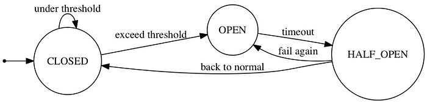
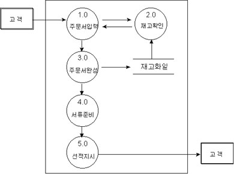

# API Throttling

> https://learn.microsoft.com/en-us/azure/architecture/patterns/throttling

- Throttling
  - Hardware에서 사용될 경우 hardware가 과열되어 손상되는 것을 방지하기 위해 클럭과 전압을 낮추거나 전원을 종료하여 발열을 줄이는 기능을 의미한다.
  - API throttling은 application에 가해지는 traffic의 양을 조절하여 application에 과도한 부하가 가해지는 것을 막는 기법을 의미한다.
    - 이 경우 rate limiting이라고도 불린다.


- 문제
  - Application에 가해지는 부하는 활성 유저수 혹은 수행되는 활동의 유형에 따라 달라진다.
    - 예를 들어 일과 시간이 새벽 시간 보다 활성 유저수가 많을 것이므로 일과 시간에 부하가 더 클 것이다.
    - 또한 매달 말에 비용이 많이 드는 분석을 수행해야 하는 service라면 매달 말에 부하가 커질 것이다.
  - 위 처럼 어느 정도 예측할 수 있는 부하의 변화도 있지만, 때로는 예측할 수 없는 부하의 변화도 있다.
  - 만약 예상치 못한 부하의 증가가 발생할 경우 application은 허용치 보다 많은 부하량을 감당하지 못 해 종료될 수도 있다.


- API Throttling 방식
  - Application이 가용한 자원에 한계를 설정하고, 한계에 도달할 경우 조절하는 방식을 사용한다.
    - 임계치는 시스템의 최대 수용량보다 낮게 설정되어야한다.
    - Application이 얼마만큼의 resource를 사용하는지 monitoring하다가 임계점을 넘어갈 경우 들어오는 request를 조절한다.
    - Request를 조절하는 방법으로는 아래와 같은 것들이 있다.
  - 특정 기간 동안에 n번 이상 API에 접근한 user들이 보내는 request를 거절하는 방법.
    - 사용자별 resource 사용량을 측정해야 가능한 방법이다.
  - 중요하지 않은 service들을 비활성화 하거나 속도를 늦춤으로써 필수적인 service들이 지속적으로 수행될 수 있도록 하는 방법


- Token Bucket Algorithm
  - Throttling에 가장 많이 사용되는 algorithm이다.
    - Token이 들어 있는 bucket에서 token을 하나씩 빼서 사용하는 것이 client가 request를 보낼 때 마다 server에서 token을 하나씩 빼가는 것과 비슷하여 이런 이름이 붙었다.
    - 만약 bucket에 더 이상 token이 남아있지 않으면 token이 다시 채워지기 전까지 throttling을 수행한다.
    - Burst와 refill이라는 개념을 사용한다.
  - Burst
    - Client가 사용할 수 있는 token 수에 해당한다.
    - 매 request마다 token이 소비된다.
  - Refill(Sustain)
    - Bucket에 token을 다시 채우는 것을 의미한다.
    - Refill이 빠르게 이루어질 수록 token이 바닥날 확률도 내려가게 된다.


- Token Bucket Algorithm외에도 아래와 같은 algorithm들이 있다.
  - Leaky Bucket
  - Fixed Window
  - Sliding Window


- Throttling 도입시 고려할 사항
  - Throttling은 신속하게 수행되어야한다.
    - 임계치에 도달하는 즉시 실행되어 시스템의 부하를 조절해야한다.
  - Client에게 요청을 거절할 수 밖에 없는 이유를 잘 설명해야한다.
    - 주로 429, 503 response code를 반환하는 방식으로 이루어진다.
    - 429는 특정 client가 특정 시간 동안 너무 많은 요청을 보낼 경우에 반환한다.
    - 503은 server에서 요청을 처리할 준비가 되지 않았을 때 반환한다.


# Circuit Breaker

> https://martinfowler.com/bliki/CircuitBreaker.html

- Circuit Breaker

  - 원격 접속의  성공/실패를 카운트하여 에러율(failure rate)이 임계치를 넘었을 때 자동적으로 접속을 차단하는 시스템이다.
    - 서비스가 여러 개의 component들고 구성되어 있을 때, 한 component에서 문제가 생길 경우 해당 component에 의존하는 다른 component들에서도 연속적으로 문제가 발생할 수 있다.
    - 이 경우 시스템 전체가 마비될 수 있으며, 어떤 컴포넌트가 에러의 원인인지를 파악하는 것도 쉽지 않다.
    - 따라서 이러한 연쇄적인 에러를 막을 수 있도록 의존하는 컴포넌트에서 에러가 일정 비율 이상으로 발생할 경우 더 이상 해당 컴포넌트에 접속하지 않도록 해야한다.

  - State Machine으로 나타낼 수 있다.

    - 접속 성공과 실패 이벤트가 발생할 때 마다 내부 상태를 업데이트하여 자동적으로 장애를 검출하고 복구 여부를 판단한다.

    - CLOSED: 초기 상태로 모든 접속은 평소와 같이 실행 된다.
    - OPEN: 에러율이 임계치를 넘은 상태로 보든 접속은 차단(fail fast)된다.
    - HALF_OPEN: OPEN 후 일정 시간이 지난 상태로 접속을 시도하여 성공하면 CLOSED, 실패하면 OPEN으로 되돌아간다.

  


- 함수로 구현할 수도 있고, 하나의 component가 될 수 도 있다.
  - 함수로 구현할 경우 주로 decorator를 사용한다.
  - [Python으로 circuit breaker를 구현한 package](https://github.com/fabfuel/circuitbreaker/tree/develop)가 있다.


# Data Flow Diagram(DFD)

> https://cjmyun.tripod.com/Knowledgebase/DFD.htm
>
> https://www.lucidchart.com/pages/data-flow-diagram

- Data Flow Diagram(DFD)
  - DFD는 데이터가 소프트웨어 내의 각 프로세스를 따라 흐르면서 변환되는 모습을 타나내는 그림이다.
    - 데이터 흐름도 혹은 자료 흐름도라고 부르기도 한다.
  - 구조적 방법론과 DFD
    - DFD는 구조적 방법론을 대표하는 diagram이다.
    - 다익스트라가 GOTO 문의 해로움을 들어 구조적 프로그래밍의 개념을 소개하면서 시작된 구조적 방법에서 데이터는 프로세스 사이에 주고 받는 형태로 나타난다.
    - 다만 OOP의 등장으로 프로세스에 따른 데이터의 흐름 보다는 데이터의 분석이 더 중요해지게 되었고, DFD보다는 ERD가 더 널리 사용되게 되었다.


- DFD의 구성 요소

  - 표기법
    - Yourdon and Coad, Gane and Sarson 등의 창작자의 이름을 붙인 다양한 표기법이 있다.
    - 아래는 Yourdon and Coad를 기준으로 설명한다.
    - 이 방식들은 표기법만 다를 뿐 모두 같은 구성 요소(process, data flow, data store, external entity)를 공유한다.
  - Process
    - 입력되는 데이터를 원하는 데이터로 변환하여 출력시키기 위한 과정으로 원과 원 내부의 이름으로 표현한다.
    - 원 안에는 프로세스가 수행하는 일 또는 프로세스를 수행하는 행위자를 기록한다.
    - 프로세스는 항상 새로운 가치를 부가해야한다.
  - Data Flow
    - DFD의 구성 요소들 간의 인터페이스를 나타낸다.
    - 대부분의 경우 process들 사이를 연결하지만 data store로부터의 흐름을 나타내기도 한다.
    - 명칭이 부여되거나 부여되지 않은 화살표로 표시한다.
    - 서로 다른 데이터 흐름에는 동일한 이름을 부여하지 않는다.
  - Data Store
    - 데이터의 저장이나 조회에 반응하는 수동적 객체를 의미한다.
    - 오른쪽에 선이 없는 직사각형으로 표기하며, 직사각형 내부에 저장소의 이름을 기록한다.
  - External Entity
    - 데이터를 생성, 소비함으로써 데이터 흐름도를 주도하는 활성 객체이다.
    - 보통 데이터 흐름도의 경계에 놓이게 되며 DFD 범위 밖에 사각형의 형태로 표시한다.

  


- 작성 규칙
  - 데이터 보존의 원칙
    - 어떤  process의 출력은 반드시 입력 data flow를 사용하여 생성된 것이어야 한다.
    - 즉 입력으로 사과를 받았는데 오렌지 쥬스를 출력해선 안 된다.
  - 최소 데이터 입력의 원칙
    - 어떤 프로세스가 출력 데이터 흐름을 산출하는데 반드시 필요한 최소한의 데이터 흐름만 입력해야 한다.
  - 지속성의 원칙
    - 프로세스는 데이터 흐름이 들어오면 항상 수행이 가능해야한다.
  - 순차처리의 원칙
    - 데이터 흐름을 통해 입력되는 데이터는 반드시 도착하는 순서대로 처리해야 한다.
    - 그러나 데이터 저장소에서 입력되는 데이터는 어떤 순서에 의해 접근해도 무방하다.
  - 영구성의 원칙
    - 데이터 흐름의 처리는 처리된 후 없어지지만 데이터 저장소의 데이터는 아무리 읽어도 없어지지 않는다.
  - 데이터 변환의 원칙
    - 어떤 종류의 프로세스가 DFD 상에 나타나야 하는지를 규정하는 원칙으로, 아래와 같은 경우 DFD에 프로세스를 나타내야한다.
    - 데이터 본질의 변환: 입력 받은 데이터를 다른 데이터로 변환하여 출력하는 경우.
    - 데이터 합성의 변환: 둘 이상의 데이터를 입력받아 이들을 합성하여 하나의 출력으로 변환하는 경우.
    - 데이터 관점의 변환: 입력 데이터가 프로세스의 처리에 따라 각기 다른 data flow를 형성할 경우.
    - 데이터 구성의 변환: 데이터 자체는 동일하지만 데이터의 구성이 변경될 경우.


# Shorts

- Type system

  - 모든 프로그래밍 언어는 어떤 category에 속한 object가 어떤 작업을 할 수 있고, 어떤 category가 어떻게 처리될지를 형식화하는 type system을 가지고 있다.
  - Dynamic Typing
    - Type checking을 run time에 수행하고, 변수의 type이 변경되는 것을 허용하는 방식을 말한다.
    - 대표적으로 Python이 있는데, 아래 코드는 절대 error가 발생하지 않는다.

  ```python
  # 1과 "foo"를 더하는 것은 불가능하지만, 해당 코드는 실행되지 않으므로 에러가 발생하지 않는다.
  if False:
      1 + "foo"
  ```

  - Static Typing
    - Type checking을 compile time에 수행하고, 일반적으로 변수의 type 변경이 불가능하다.
    - 대표적으로는 Java가 있는데, 아래 코드는 compile time에 error가 발생한다.

  ```java
  String foo;
  foo = 1;
  ```


- duck typing

  > if it walks like a duck and it quacks like a duck, then it must be a duck
  >
  > 만일 어떤 것이 오리 처럼 걷고 오리처럼 꽥꽥거린다면, 그것은 오리일 것이다.

  - Duck test에서 개념을 따 왔다.
  - 동적 타이핑 언어 및 다형성과 관련된 개념이다.
  - 객체의 type보다 해당 객체에 정의되어 있는 method 혹은 attribute가 더 중요하다는 개념이다.
    - 객체에 이미 존재하는 메서드를 호출하기 위해, 객체가 해당 메서드를 갖는 타입인지 확인하지 말고, 해당 메서드를 가지고 있다면 해당 타입으로 간주하라는 것이다.

  - 예시

  ```python
  class Duck:
      def fly(self):
          print("fly with wings")
  
          
  class Plane:
      def fly(self):
          print("fly with fuel")
          
          
  class Ostrich:
      def walk(self):
          print("walking")
  
          
  def fly_duck(duck):
      duck.fly()
  
  # Ostrich는 fly라는 메서드를 가지고 있지 않기에 error가 발생한다.
  for obj in [Duck(), Plane(), Ostrich()]:
      obj.fly()
  ```

  - 코드가 특정 type에 강하게 결합되지 않게 해준다는 장점이 있지만, 문제가 생길 경우 디버깅이 어려워진다는 단점이 있다.
  - Duck typing 덕분에 Python에서는 interface를 구현해야 하는 번거로움이 많이 줄어들었다.
    - Interface가 하는 역할을 duck typing이 해주고 있는 것이다.
    - 물론 그렇다고 Python에서 interface 자체가 쓸모 없다는 것은 아니다.


- Call by value, Call by reference, Call by sharing

  > https://en.wikipedia.org/wiki/Evaluation_strategy

  - 평가 전략(Evaluation Strategy)

    - 프로그래밍 언어에서 평가 전략이란 표현식을 평가하는 규칙들의 집합이다.
    - 그러나 주로 parameter 전달 전략(Parameter-passing strategy)의 개념을 가리킨다.
    - Parameter-passing strategy란 function에 전달되는 각 parameter의 값의 종류를 정의하고, 함수 호출시의 parameter를 평가할지 여부를 결정하고, 만약 평가한다면, 평가 순서를 결정하는 전략을 의미한다.

  - Parameter와 argument

    - Parameter(매개변수, 형식 매개변수(formal parameter))란 함수에 정의된 매개변수를 의미한다.
    - Argument(인자, 실인자(actual parameter))란 함수에 전달하는 값을 의미한다.
    - Parameter는 함수 선언부에 정의되고, argument는 함수 호출부에서 사용된다.

  ```python
  def f(a):	# 함수에 정의된 매개변수 a는 parameter
      return a
  
  f(1)		# 함수에 실제로 넘어가는 값인 1은 argument
  ```

  - Call by value
    - Argument 표현식의 평가된 값이 함수 내에서 일치하는 변수에 binding된다.
    - 주로 새로운 메모리에 값을 복사하는 방식으로 이루어진다.
    - 즉, 먼저 argument 표현식을 평가한다.
    - `f(1)`에서 argument 표현식에 해당하는 `1`이라는 표현식을 평가하면 `1`이라는 값을 얻게 된다.
    - 이 평가된 값을 함수 내에서 일치하는 변수인 `a`에 binding한다.
    - 이 때, 주로 1이라는 값을 복사하여 새로운 메모리 영역에 생성하는 방식을 사용한다.
    - 따라서 함수 내에서 값이 변경되어도 원본 값은 변경되지 않는다.
  - Call by reference
    - Parameter가 argument의 reference에 bound된다.
    - 이는 function이 argument로 사용된 변수를 변경할 수 있다는 것을 의미한다.
    - 이 방식은 프로그래머가 함수 호출의 영향을 추적하기 힘들게 만들고, 사소한 버그를 유발할 수도 있다.
  - Call by sharing(call by object, call by object-sharing)
    - Caller와 callee가 object를 공유하는 것이다.
    - 값이 원시 타입이 아니라 객체에 기반하고 있음을 표현하기 위해 주로 사용한다.
    - Callee에게 전달 된 값이 변경된다는 점에서 call by value와 다르고, 주소가 아닌 object를 공유한다는 점에서 call by reference와는 다르다.
    - Immutable object의 경우 call by value와 실질적인 차이가 존재하지 않는다.

  - Python과 Java, Javascript등의 언어는 Call by sharing 방식을 사용한다.

    - 그러나 일반적으로 call by sharing이라는 용어를 사용하지는 않는다.
    - Python community에서는 이를 call by assignment라 부른다.


- 도메인 로직(domain logic, 비즈니스 로직(Business logic))

  > https://velog.io/@eddy_song/domain-logic
  >
  > https://enterprisecraftsmanship.com/posts/what-is-domain-logic/

  - Problem space와 solution space
    - 하나의 프로젝트는 크게 problem space와 solution space라는 두 개의 영역으로 나눠진다.
    - Problem space는 일반적으로 domain 혹은 problem domain, core domain이라 부르며, software를 통해 해결하고자 하는 현실의 문제들을 의미한다.
    - Solution space는 business logic, business rules, domain logic, domain knowledge라 부르며, problem domain을 해결하기 위한 방안들을 의미한다.

  - 비즈니스 혹은 도메인
    - 소프트웨어 공학에서 비즈니스 혹은 도메인이라는 말은 소프트웨어가 해결하고자 하는 현실의 문제를 가리킨다.
    - 즉 소프트웨어의 존재 이유이다.
  - 도메인 로직
    - 소프트웨어가 해결하고자 하는 현실 문제를 해결하는 데 직접적으로 관련된 로직을 의미한다.
    - Software는 도메인 로직으로만 구성되지 않는다.
    - 개발을 하다 보면 다양한 코드를 작성하게 되며, 이들이 모두 domain model을 작성하는 것과 관련되지는 않는다.
    - 대부분의 경우 domain model을 DB 등의 data store, 외부 서비스, 사용자와 연결하기위해 많은 코드를 작성하게 된다.
    - 따라서 domain model과 직접적으로 관련된 코드와 그렇지 않은 코드를 구분하는 것은 쉽지 않다.
  - 애플리케이션 서비스 로직
    - 비즈니스 로직과 구분되는 현실 문제 해결에 직접적으로 관여하지 않는 로직을 의미한다.
    - 애플리케이션 서비스 로직은 애플리케이션 서비스 계층에서 결정들을 조율하고 의사결정 결과를 반영하는 등의 역할을 한다.
  - 도메인 로직과 애플리케이션 서비스 로직의 구분
    - 어떤 코드가 비즈니스에 대한 의사결정을 하고 있는가로 구분한다.

  - 왜 구분해야 하는가
    - 관심사의 분리를 가능하게 해준다.
    - 이를 통해 도메인과 관련된 로직에 보다 집중할 수 있게 된다.

  - 예시
    - 아래 코드는 application service layer를 보여준다.
    - 실제 비즈니스 로직은 atm 객체에서 처리하고 application service는 비즈니스에 관한 의사 결정 결과를 조율하고 반영하는 역할을 한다.
    - 비즈니스와 직접적으로 관련된 코드만 보고 싶다면 atm만 확인하면 된다.
    - 즉 아래와 같이 계층을 구분함으로써 코드를 보다 쉽게 읽을 수 있게 되고, 도메인 로직에 집중할 수 있게 된다.

  ```python
  class Bank:
      def __init__(self):
          self.atm = ATM()
          self.payment_gateway = None
          self.repository = None
  	
      # take_money 메서드 자체는 아무런 의사 결정을 하지 않는다.
      def take_money(amount):
          # 돈을 출금할 수 있는지에 대한 의사 결정은 atm 객체의 can_take_money 메서드를 통해 이루어진다.
          if self.atm.can_take_money(amount):
              # 수수료를 포함한 금액이 얼마인지에 대한 의사 결정 역시 atm 객체에서 이루어진다.
              amount_with_commision = self.amount.calculate_amount_with_commision(amount)
              
              self.payment_gateway.charge_payment(amount_with_commision)
              self.repository.save(self.atm)
          else:
              return "Not enough meney to withdraw"
  ```


- TTY
  - TTY의 기원
    - 1830년대에 와이어를 통해 message를 주고 받을 수 있는 teleprinter(전신인자기)가 개발되었다.
    - 기존에는 전송자가 모스 부호 입력하고, 수신자가 모스 부호를 받는 형식이었지만, teleprinter는 전송자가 문자를 입력하면 이를 모스 부호로 변환하여 전달하고, 수신자 측에 모스 부호로 도착하면 이를 다시 문자로 변환하여 수신자에게 출력해주었다.
    - 이후 개량을 거쳐 1908년 Teletypewriter가 발명되었다.
    - 컴퓨터가 개량되면서, 컴퓨터에도 입출력 장치가 필요하게 되었고, 컴퓨터에도 teletypewriter가 입출력장치로 사용되기 시작했다.
    - Teletypewriter은 시간이 흐르면서 teletype으로 줄여서 불리기 시작했고, 결국 현재는 TTY로 줄여서 부른다.
  - PTY(Pseudo-TeletYpes)
    - TTY는 Unix 계열 운영체제에서 software화 되었는데, 이를 물리적인 TTY와 구분하기 위해서 PTY라고 부른다.
    - Software로서의 TTY 역시 그냥 TTY라고 부르기도 한다.
    - Terminal과 동의어로 쓰인다.
  - PTS(Pseudo Terminal Slave)
    - `ssh` 등으로 서버에서 원격으로 접속했을 때 열리는 TTY이다.


- Loopback, localhost, 0.0.0.0

  > https://velog.io/@lky9303/127.0.0.1-%EA%B3%BC-localhost%EC%9D%98-%EC%B0%A8%EC%9D%B4

  - 네트워크 통신이란 인터넷 상에 존재하는 호스트와 서로 패킷을 주고 받는 것이다.
  - Loopback
    - 자신의 local PC을 서버로 만들고, local PC 내에서 요청을 보내고 응답을 받을 수 있는 것이다.
    - 127.0.0.1로 표현하며, 만약 목적지 IP 주소를 127.0.0.1로 설정하면 이는 패킷을 외부로 전송하지 않고 자신에게 전송한다.
    - 즉 자신이 송신한 패킷을 자신이 수신하게 된다.
    - 자기 자신을 가리키는 주소라고 보면 된다.
  - localhost
    - 127.0.0.1이 ip주소라면 localhost는 domain name이라고 보면 된다.
    - www.naver.com이라는 domain name이 DNS를 통해서 IP 주소로 변환되듯이, localhost가 127.0.0.1이라는 ip주소로 변환되는 것이다.
    - 그러나 localhost가 항상 127.0.0.1을 가리키는 것은 아닐 수 있다.
    - 정확히는 localhost는 OS hosts 파일의 redirect rule에 정의된 ip로 변환된다.
    - 따라서 OS host file의 redirect rule에서 localhost의 redirecting IP 값을 다르게 입력했다면, 127.0.0.1이 아닌 설정된 IP로 변환된다.
    - Ubuntu의 경우 `/etc/hosts`에서 확인할 수 있다.
  - 0.0.0.0
    - 지정한 IP 주소가 없다는 것이며, 내 컴퓨터에 연결된 모든 IPv4 address를 의미한다.


- NAS(Network-Attached Storage)
  - 컴퓨터 네트워크에 연결된 file-level의 컴퓨터 기억 장치
    - File-level이란 file storage를 의미한다.
    - 네트워크로 연결된 기기들 사이에 data를 공유할 수 있게 해주는 기술이다.
  - NAS와 클라우드는 다르다.
    - 클라우드는 네트워크 전체에서 확장 가능한 resource들을 추상화하고 공유하는 것이다.


- 방어적 프로그래밍(Defensive programming)
  - 예상치 못한 입력에도 소프트웨어가 계속적 기능 수행을 보장할 수 있도록 고안된 방어적 설계의 한 형태.


- DT(Digital Transformation, DX)
  - DT와 DX 모두 디지털 전환을 의미한다.
    - DT는 digital transformation의 약어이며, DX는 Digital의 D와 Transformation의 의미를 갖고 있는 X로 만들어진 합성어이다.
    - 둘 다 의미는 같다.
  - 디지털 전환
    - 기업 및 조직이 디지털 기술과 도구를 활용하여 비즈니스 모델과 프로세스를 혁신하는 과정이다.
    - 요즘에는 SI라는 말 보다는 DT, DX라는 용어를 더 선호한다.


- Sticky session
  - 특정 session의 요청을 처음 처리한 server로만 전송하는 것을 의미한다.
  - Load balancer 등으로 인해 client의 request가 어떤 server로 갈지 알 수 없는 상황에서 연속된 request를 한 server에서 처리해야 할 경우 사용한다.


- Preventive Maintenance(PM)
  - 정기적인 점검을 통해 문제가 발생하기 이전에 사전에 대비하는 작업.
  - 일반적으로 시스템을 일시 중단하고 운영중에 시도해 볼 수 없었던 작업을 진행한다.


- RFP, RFI, RFQ
  - RFP(Request For Proposal, 제안 요청서)
    - 발주자가 특정 과제의 수행에 필요한 요구사항을 체계적으로 정리하여 제시함으로써 제안자가 제안서를 작성하는데 도움을 주기 위한 문서.
    - RFP에 명시된 이상 관련 내용을 제안서에 명시해야 한다.
    - 제안서에 반영하지 않으면 묵시적으로 RFP가 과업 기준이 된다.
  - RFI(Request for Information, 사전 정보 요청)
    - RFP를 작성하기 위해 발주자가 사업 계획 및 사업 수행에 필요한 정보를 수집하기 위해 복수의 공급 업체에 요청하는 정보 요청서이다.
    - 요청을 받은 공급 업체는 공식적인 방법으로 기업 정보, 제품/서비스 정보, 시장 동향, 주요 경쟁사 등의 정보를 제공한다.
  - RFQ(Request for Quotation, 견적 요청서)
    - 제안사가 발주처에 공급 가능한 물품 및 내용을 알려주기 위해 견적을 작성하는 것으로 발주처는 전반적인 제발 비용을 확인할 수 있다.
    - 발주처는 여러 업체의 견적을 수령하여 사업을 기획할 때 적절한 예산을 산정한다.

