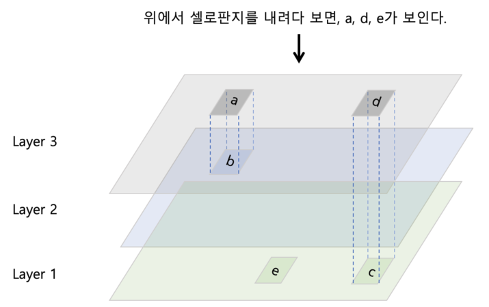

# 유니온 마운트

> https://blog.naver.com/alice_k106/221530340759
>
> https://access.redhat.com/documentation/ko-kr/red_hat_enterprise_linux/7/html/7.2_release_notes/technology-preview-file_systems

- 유니온 마운트 파일 시스템

  - 유니온 마운트
    - 하나의 디렉터리 지점에 여러 개의 디렉터리를 마운트함으로써 마치 하나의 통합된 디렉터리처럼 보이게 하는 것을 의미한다.
  - 셀로판지 여러 개를 겹쳐놓는 것을 생각하면 된다.
    - 아래 그림에서와 같이 여러 개의 셀로판지를 겹쳐 놓으면 가장 위쪽에 있는 셀로판지의 그림만 보일 것이다.

  


- OverlayFS(Overlay File System)

  - 유니온 마운트의 구현체.
    - 기본적으로 유닉스 계열 OS의 커널에 모듈로 내장되어 있어 별도의 설치 없이 사용이 가능하다.

  - 크게 4가지 계층으로 나뉜다.
    - Lower dir: 아래쪽에 있는 1개 이상의 디렉터리(위 그림에서 layer1, layer2가 lower dir에 속한다).
    - Upper dir: 가장 위쪽에 있는 디렉터리(위 그림에서 layer3에 해당한다).
    - Merge dir: 위 그림에서 모든 계층을 겹쳐서 보는 통합 뷰에 해당하는 디렉터리
    - Work dir: 통합 뷰의 원자성을 보장하기 위해 존재하는 중간 계층


- OverlayFS 사용해보기

  - 우선 각 계층별로 directory를 만든다.

  ```bash
  $ mkdir lower1 upper merge work
  ```

  - 그 후 `lower1` directory에 file을 하나 생성한다.

  ```bash
  $ echo 'Hello World' > lower1/test.txt
  ```

  - Overlayfs로 각 디렉터리를 마운트한다.

  ```bash
  $ mount -t overlay overlay -o lowerdir=lower1/,upperdir=upper/,workdir=work/ merge/
  ```

  - 이후 merge directory를 확인해보면 lower1애서 생성한 test.txt file이 있는 것을 볼 수 있다.

  ```bash
  $ ls merge
  test.txt
  ```

  - merge directory에 file을 추가할 경우 upper에 같은 파일이 추가된다.

  ```bash
  $ echo 'Hello World!' > merge/test2.txt
  $ ls upper
  test2.txt
  ```

  - lower directory에 있는 파일을 수정할 경우 lower directory에 있는 파일은 수정되지 않고, upper directory에 수정 된 내용의 파일이 생성된다.
    - lower 디렉터리는 항상 읽기전용으로 실행되어 변경할 수 없다.
    - 만약 lower 디렉터리 파일에 변경 사항이 발생할 경우, 가장 윗쪽의 계층인 upper에 그 변경 사항을 기록한다.

  ```bash
  $ echo 'Bye!' >> lower/test.txt
  
  $ cat lower/test.txt
  # Hello World
  
  $ ls upper
  # test.txt test2.txt
  $ cat test.txt
  # Hello World
  # Bye!
  ```

  - merge directory에서 lower directory에서 생성한 파일을 삭제할 경우.
    - lower 계층에 있는 파일들은 읽기 전용이므로 삭제도 되어선 안된다.
    - 그런데 아래 와 같이 실행하면 삭제가 되는 것을 볼 수 있는데, 이는 실제로 삭제가 된 것은 아니다.
    - OverlayFS에서는 whiteout이라 불리는 별도의 파일을 upper 디렉터리에 자동으로 생성한다(아래에서 test.txt가 whiteout file로 크기를 확인해보면 0이다).
    - 즉 삭제되었다는 표시를 하기 위해 이 같이 빈 파일을 만들어두는 것이다. 

  ```bash
  $ rm merge/test.txt
  $ ls merge
  # test2.txt
  
  $ ls upper
  # test.txt test2.txt
  ```

  

  