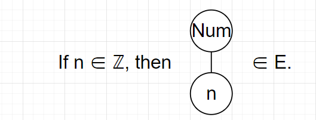
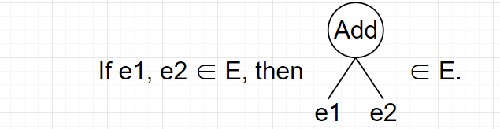
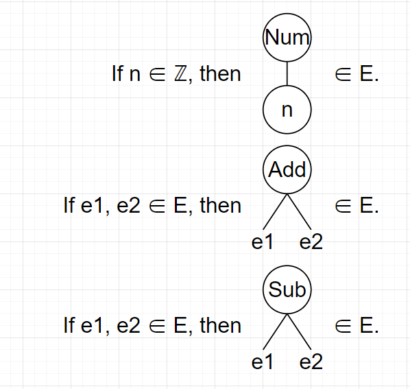

# Syntax and Semantic

- 프로그래밍 언어의 구성

  - 프로그래밍 언어는 아래의 4가지로 구성된다.

    - Syntax
    - Semantic
    - Standard library
    - Ecosystem
  - Syntax와 semantic

    - Syntax는 개별 프로그래밍 언어가 가지고 있는 문법을 의미한다.
    - Semantic은 프로그래밍 언어의 모든 statement들의 의미를 나타낸다.
    - 사람으로 비유하자면 syntax는 사람의 몸, semantic은 사람의 생각이라고 할 수 있다.
    - Syntax는 프로그래밍 언어마다 차이가 존재하지만, semantic은 대부분의 언어가 동일하다.
    - Syntax에 문제가 있을 경우 compile time에 error가 발생하는 데 반해, semantic에 문제가 있어도 error가 발생하지는 않는다. 그러나 프로그램이 의도한대로 동작하지 않게 된다. 즉, runtime에 문제가 생긴다.

    - 예를 들어 3의 제곱을 구하기 위해 (Python 기준으로) `3*2`과 같은 문을 작성했다고 가정해보자.
    - `*`는 Python에서 곱셈을 위해 존재하는 operator로, syntax상으로 존재는 하기에 syntax에는 문제가 없다.
    - 그러나 위 문은 제곱을 구하겠다는 의도에는 어긋난다. 즉 semantic에는 문제가 있다.
  - Standard library와 Ecosystem

    - 좁은 의미에서 보면, syntax와 semantic만 있어도 프로그래밍 언어라고 볼 수 있다.
    - 그러나, 실제로 언어를 사용해야하는 개발자의 관점에서 보면, 언어가 제공하는 standard library와 해당 언어와 관련된 ecosystem도 언어의 일부라고 볼 수 있다.
    - Standard library는 파일의 입출력, 네트워크 입출력, 자료구조 등 프로그래밍에 필요한 다양한 기능을 제공한다.
    - 사람에 비유하자면 옷과 같은 것이라고 볼 수 있다.
    - Ecosystem은 개발자 커뮤니티, third-party library 등 프로그래밍 언어와 관련된 모든 것을 의미한다.
    - 사람에 비유하자면 사회와 같은 것이라고 볼 수 있다.


## Concrete Syntax

- Concrete Syntax
  - Concrete syntax는 개발자가 문자열로 작성한 코드의 문법 자체를 의미한다.
  - Concrete syntax는 어떤 문자열이 program인지 아닌지를 결정한다.
    - 예를 들어 Python에서 `print()`는 program이지만 `print(`는 닫는 괄호가 있어야 한다는 문법에 어긋나기에 program이 아니다.


- Concrete syntax를 정의하기 위한 사전 작업

  - program은 string으로 작성되기에 program을 정의하기 위해서는 string을 정의해야고, string은 character들의 끝이 있는 연속이므로, character를 정의해야한다.
    - Character의 정의는 언어마다 다르지만(어떤 언어는 ASCII code만을 character로 보기도 하고, 어떤 언어는 Unicode로 표현되는 모든 문자를 character로 보기도 한다) 여기서는 정확히 어떤 문자까지를 character로 볼 것인지 확정하지는 않고 그냥 임의의 character 집합이 있다고 가정하고, 해당 집합의 원소를 character로 정의한다.
  - Character를 아래와 같이 정의한다.

  $$
  C = the\ set\ of\ every\ character= \{c\ |\ c\ is\ a\ character\}
  $$

  - String은 아래와 같이 정의한다.

  $$
  S = the\ set\ of\ every\ string= \{''c_{1}...c_{n}''\ |\ c_{1}...c_{n} \in C\}
  $$

  - Program을 아래와 같이 정의한다.
    - Program에는 `P ⊆ S`라는 오직 한 가지의 제약이 존재한다.

  $$
  P = the\ set\ of\ every\ program= \{p\ |\ p\ is\ a\ program\}
  $$

  - Concrete syntax를 정의하기 위해서는 집합 P를 정의해야하는데, 문제는 P가 무한 집합이라는 것이다.
    - Concrete syntax를 정의하는 가장 유명한 방법은 **Backus-Naur form(BNF)**이다.


- Backus-Naur form(BNF)
  - BNF는 구조적인 정의를 제공함으로써 보다 직관적인 방식으로 문자열의 집합을 정의할 수 있도록 해준다.
  - BNF는 terminals, nonterminals, expressions 라는 세 가지 개념을 가지고 있다.
  - termina
    -  문자열에 해당한다.
    -  예를 들어 `"0"`은 terminal이다.
  - nonterminal
    - 꺽쇠 괄호 사이의 이름에 해당하며, string의 집합을 나타낸다.
    - 예를 들어 `<digit>`은 nonterminal이며 {"0", "1", "2", "3", "4", "5", "6", "7", "8", "9"}라는 집합을 가리킨다.
  - expression
    - 하나 이상의 terminal 혹은 nonterminal을 나열한 것이다.
    - `"0"`, `"0" "1"`, `<digit>`, `"-" <number>` 등이 모두 expression이다.
  - expression 역시 string의 집합을 가리킨다.
    - 예를 들어 `"0" "1"`이라는 두 개의 terminal로 이루어진 expression에서 `"0"`은 `"0"`을 가리키고, `"1"`은 `"1"`을 가리킨다. 따라서 `"0" "1"`이라는 expression은 {"01"}이라는 집합을 카리킨다.
    - 또 다른 예로 `"0" <digit>`이라는 expression에서 `<digit>`이 {"0", "1", "2", "3", "4", "5", "6", "7", "8", "9"}라는 집합을 가리킨다고 할 때, expression `"0" <digit>`는 {"00", "01", "02", "03", "04", "05", "06", "07", "08", "09"}라는 집합을 가리킨다.
  - BNF는 nonterminal이 가리키는 집합을 아래와 같은 형태로 정의할 수 있게 해준다.
    - `[nonterminal] ::= [expression] | [expression] | ...`
    - expression들은 nonterminal이 가리키는 집합을 정의한다.
    - expression들이 가리키는 집합들의 합집합은 nonterminal이 가리키는 집합과 같다.
    - 예를 들어 `<digit>`이 {"0", "1", "2", "3", "4", "5", "6", "7", "8", "9"}라는 집합을 가리킨다고 할 때, `<digit> ::= "0" | "1" | "2" | ... | "9"`


- BNF 예시
  - AE라는 language의 concrete syntax를 정의한다고 가정해보자.
    - AE는 10진수의 덧셈과 뺄셈이라는 단순한 기능을 가지고 있다.
    - 10진수가 될 수 있는 모든 문자열과 덧셈, 뺄셈 기호를 일일이 열거한 후 정의하는 것은 시간 낭비일 뿐더러 가능하지도 않다.
    - 따라서 BNF를 사용하여 정의하기로 한다.
  - 정의해야 할 것들
    - AE는 10진수를 표현해야하므로 "0", "-10"등의 문자열은 AE의 program이 되야한다.
    - 또한 덧셈과 뺄셈이 가능해야 하므로, "0+1", "-1-3+2" 등도 AE의 program이 되야한다. 
  - 먼저 10진수를 표현하기 위한 집합을 정의한다.
    - `<digit> ::= "0" | "1" | "2" | ... | "9"`
    - `<nat> ::= <digit> | <digit> <nat>`(재귀적으로 두 자리 이상의 숫자를 나타내기 위해 표현식`<digit> <nat>`을 사용)
    - `<number> ::= <nat> | "-" <nat>`(`"-" <nat>` 표현식으로 음수를 표현)
  - 다음으로, 덧셈과 뺄셈을 위한 집합을 정의한다.
    - `<expr> ::= <number> | <expr> "+" <expr> | <expr> "-" <expr>`
  - 결국 `<expr>`이 가리키는 집합에는 10진수의 덧셈과 뺄셈을 위한 모든 문자열(즉 program, concrete syntax)이 포함되게 된다.
  - 위와 같은 방식을 통해, 모든 문자열을 전부 고려하는 것 보다 훨씬 간편하게 concrete syntax가 될 문자열을 정의할 수 있게 된다.


## Abstract Syntax

- Concrete syntax와의 차이
  - Concrete syntax의 경우 언어마다 다양한 차이가 존재한다.
    - 예를 들어 Python은 함수를 선언할 때 `def` keyword를 사용하는 반면에, Javascript는 `function` keyword를 사용하고, Kotlin은 `fun` keyword를 사용한다.
    - 그러나 언어들의 구조적인 형태(abstract syntax)는 거의 유사하다.
    - 예를 들어 모든 언어에서 함수의 선언은 함수명, parameter, body expression을 필요로한다.
    - 그러므로, 다양한 언어를 보다 쉽게 배우기 위해서 프로그래머는 program의 구조에 집중해야한다.
  - 또한 Concrete Syntax는 사소한 것들에도 주의를 기울여야한다.
    - 예를 들어 `2+1`과 `02+001`은 string은 다르지만 완전히 동일한 산술식이다.
    - 그러나 `2+1`과 `2-1`을 구분하는 것은 중요하지만, `2+1`과 `02+001`을 구분하는 것은 전혀 중요하지 않다.
  - Concrete syntax가 필수적이기는 하지만, string의 (언어별)차이와 무관하게 program의 구조를 묘사할 수 있는 방법도 필요하다.
    - 그리고 이를 Abstract syntax라 부른다.
    - Concrete syntax와 abstract syntax는 상호 보완적인 관계이다.


- Absract syntax
  - Abstract syntax는 program의 구조를 tree 형태로 표현한다.
    - Program은 여러 components들로 구성된다.
    - 각 component들은 다시 여러 개의 subcomponent들로 구성돈다.
    - Tree는 이러한 재귀 구조를 표현한다.
  - 예시
    - `add`라는 함수가 있다고 가정하자.
    - `function definition`라는 함수 이름인 `add`, 첫 번째 parameter `n`, 두 번째 parameter `m`, 그리고 `body expression`이라는 4가지 component를 지닌다.
    - 이 중 `body expression`은 다시 덧셈의 피연산자 두 개를 subcomponent로 갖는다.
    - 이와 같은 구조는 언어와 무관하게 거의 유사하다.


- Abstract syntax가 program을 tree로 다루기 때문에, abstract syntax를 정의하는 것은 결국 program을 표현하는 모든 tree의 집합을 정의하는 것이다.

  - Abstract syntax tree(AST)
    - Abstract syntax로 정의된 집합에 포함된 tree를 abstract syntax tree라 부른다.
  - 예를 들어 concrete syntax를 설명할 때 만들었던 AE 언어에서 모든 10진수는 program이다.
    - 이를 tree로 표현하면, 10진수는 오직 자기 자신만을 component로 가진다.
    - 그러므로 아래와 같은 사실은 참이다(E는 모든 program의 집합).

  

  - AE에서 두 산술식의 합 역시 program이다.
    - 이 프로그램은 피연산자1(표현식1, e<sub>1</sub>)과 피연산자2(표현식2, e<sub>2</sub>)라는 두 개의 component를 가진다.
    - 각각의 피연산자는 산술식이므로 program이다.
    - 따라서 아래와 같은 사실은 참이다.

  

  - 위와 같은 사실들을 종합하면, E의 가장 작은 집합으로 아래의 조건을 만족하는 AE의 abstract syntax를 정의할 수 있다.

  


- Tree가 아닌 notation으로 표현하기
  - 매번 program을 표현해야 할 때마다 tree를 그리는 것은 비효율적일 수 있다.
    - 따라서 그림을 그리지 않고 tree를 표현하기 위해서 code 처럼 보이는 notiation을 사용한다.
    - 예를 들어 Num이라는 root와 n이라는 child를 가지는 tree를 그리는 대신 n으로 tree를 표현하는 것이 더 간단하다.
    - 마찬가지로, 두 개의 피연산자를 child로 가지고, root로 Add, Sub를 가지는 tree를 그리는 것 보다 `e1 + e2`, `e1 - e2`와 같이 표현하는 것이 훨씬 간편하다.
  - 위에서 그림으로 표현한 AE의 abstract syntax를 notation으로 표현하면 다음과 같다.
    - `If n ∈ ℤ, then n ∈ E.`
    - `If e1, e2 ∈ E, then e1 + e2 ∈ E.`
    - `If e1, e2 ∈ E, then e1 - e2 ∈ E.`
    - 위 notation들이 tree처럼 생기진 않았지만, 그럼에도 AST를 표현한 것이다.
  - Notation은 notation일 뿐이다.
    - `e1 + e2`에서 사용된 `+`는 수학적 덧셈을 의미하는 것이 아니라 notation의 일부이며, 아무런 뜻도 없다(`-`도 마찬가지).
    - 이를 제대로 이해하지 못하면 abstract syntax와 concrete syntax가 개념적으로 뒤섞이게 된다.
    - 예를 들어 누군가는 두 피연산자의 덧셈을 표현하기 위해서 `e1 + e2` 대신 `Add e1 e2`라는 notation을 택할수도 있다.
    - Notation은 자유롭게 선택하면 된다.
    - 그러나 일단 notation을 정의했다면, 일관성있게 사용해야한다.


- BNF 적용하기
  - BNF를 적용하여 AE의 abstract syntax를 정의하면 다음과 같다.
    - `e ::= n | e + e | e - e`
  - Metavariable
    - 위에서 사용한 각각의 symbol들은 metavariable이다.
    - 규정된 programming language level에 있는 variable이 아니라, meta level의 variable이기에 metavariable이라 부른다.
    - e는 프로그램에 대한 metavariable이며, n은 integer에 대한 metavariable이다.


- Parsing

  - Concrete syntax는 program을 string으로 여기고, abstract syntax는 program을 tree로 여긴다.

    - Parsing은 이 둘 사이에 놓여져 있는 다리와 같다.

  - Parsing은 concrete syntax에 따른 string을 AST로 변환시켜주는 작업이다.

    - Parser는 input을 parse하는 program이다.
    - Parser는 S(모든 string의 집합)에서 E(모든 AST의 집합)로의 partial function이라고도 생각할 수 있다.

    $$
    parser: S \nrightarrow E
    $$

    - 집합 A에서 집합 B로의 함수라는 것은 A의 원소 a가 있을 때 `f(a)`는 항상 B의 원소라는 의미이다.
    - 집합 A에서 집합 B로의 partitail function이라는 것은, A의 subset인 S에서 B로의 함수라는 것을 의미한다.
    - 간단하게 말해서 partianl function이란 일부 A에 대해서만 B인 함수를 말한다.
    - 여기서 S는 partial function의 domain of definition(혹은 그냥 domain)이라 불린다.
    - 집합 A에서 집합 B로의 partial function `f`가 있다고 가정해보자.
    - `a ∈ A`이지만 `f(a)`는 `B`의 원소가 아닌, undefined인 a가 있을 수 있다. 
    - 다시 말해서, 함수 `f`가 모든 A에 대해 정의된 것이 아니라 부분집합 S에 대해서만 정의된 것일 수 있다.
    - 결국 S(모든 string의 집합)에서 E(모든 AST의 집합)로의 partial function라는 말은 모든 string이 AST인 것은 아니지만 일부 string은 AST라는 것을 의미한다.
    - 따라서, 만일 parse의 input 값이 P(모든 program의 집합)에 속하지 않는다면, parse의 결과 값은 undefined가 되고, input값이 P에 속한다면, 결과값은 그에 대응하는 AST가 된다.
    - 예를 들어 `1+`, `2*4` 등은 AE의 P에 속하지 않기에 parse의 결과값은 undefined가 된다.


## Semantic

- Semantic

  - Program의 행위를 정의하는 것이다.

  - Syntax와의 관계

    - Syntax는 어떤 string이 program이고, program이 어떤 구조를 가지고 있는지를 알려준다.

    - 그러나, syntax로는 program이 어떻게 실행되는지를 알 수는 없다.
    - Programmer는 program이 어떻게 실행되는지 알아야 하므로, syntax뿐 아니라 semantic도 programming language에서 매우 중요한 요소이다.

  - Abstract syntax와의 관계

    - Program의 구조(abstract syntax)가 그 행위를 결정한다.
    - 따라서 program의 행위인 semantic은 abstract syntax를 기반으로 정의된다.
    - 세상에는 무수히 많은 progmam이 존재하므로, 모든 개별 program의 semantic을 각각 정의하는 것은 불가능하다.
    - Abstract syntax에 따라 program을 일정 그룹으로 분리하고, 각 group에 sematic을 한 번 정의하면, 수 없이 많은 program을 한정된 method로 semantic을 정의할 수 있다.


- AE의 semantic을 정의해보기
  - AE의 semantic이 AE의 각 program의 semantic을 정의한다.
    - Program의 semantic이란 program이 실행될 때 발생하는 일들을 말한다.
    - AE program이 실행될 때 일어나는 일은 산술식의 평가 결과가 생성되는 것 뿐이다.
    - 예를 들어 semantic이 제대로 정의되었다면, `0 + 1`의 결과는 1이어야한다.
    - 주의할 점은 `0 + 1`에서 `+`는 semantic이 정의되기 전까지는 아무 의미도 없고, 따라서 `0 + 1`의 결과에 대해서도 알 수 없다는 점이다.
  - Abstract syntax에 따라 program을 그룹으로 나누면 나누면 다음과 같다.
    - n
    - e1 + e2
    - e1 - e2
  - n 그룹의 semantic을 정의한다.
    - 규칙: n은 n으로 평가된다(evaluate). 
    - 예를 들어 1은 1로 평가되고, 5는 5로 평가된다.
  - e1+e2 그룹의 semantic을 정의한다.
    - e1은 산술식이므로, interger를 결과값으로 가진다. 이를 n1이라 하자.
    - e2역시 산술식이므로, integer를 결과값으로 가진다. 이를 n2라 하자.
    - 수학적으로 덧셈과 syntax로서의 +를 구분하기 위해, 수학적 덧셈은 +<sub>ℤ</sub>로 표기한다.
    - 규칙: 만일 e1이 n1으로 평가되고(interger로 평가되고), e2가 n2로 평가되면, e1 + e2는 n1 +<sub>ℤ</sub> n2로 평가된다.
  - e1-e2 그룹의 semantic을 정의한다.
    - e1+e2 그룹과 유사하다.
    - 규칙: 만일 e1이 n1으로 평가되고(interger로 평가되고), e2가 n2로 평가되면, e1 - e2는 n1 -<sub>ℤ</sub> n2로 평가된다.
  - Semantic 적용
    - 위에서 정의한 3가지 규칙에 따라 `(3 - 1) + 2`는 다음 절차를 거쳐 4로 평가된다.
    - (n 그룹의 규칙에 따라) 3은 3으로 평가된다.
    - (n 그룹의 규칙에 따라) 1은 1로 평가된다.
    - (e1-e2 그룹의 규칙에 따라) 3이 3으로 평가되고, 1이 1로 평가된다면, 3-1은 3 -<sub>ℤ</sub> 1로 평가된다.
    - 위에 따라 `3 - 1`은 2로 평가된다.
    - (n 그룹의 규칙에 따라) 2는 2로 평가된다.
    - (e1+e2 그룹의 규칙에 따라) 3-1이 2로 평가되고, 2가 2로 평가되면, (3 - 1) + 2는 (3 − 1) +<sub>ℤ</sub> 2로 평가된다.
    - 위 규칙에 따라 (3 - 1) + 2는 4로 평가된다.


- 수학적 방식으로 정의하기

  - Semantic을 함수로 정의하기

    - Semantic은 프로그램의 실행 결과를 정의한다.
    - AE program의 경우 interger를 반환한다.
    - 따라서 AE program이 실행되면, semantic은 interger를 결과값으로 산출한다고 할 수 있다.

    - 그러므로, semantic은 아래와 같은 함수로 정의 될 수 있다(E는 모든 AST의 집합).

    $$
    eval:E → ℤ
    $$

    - 각각의 e ∈ E에 대해서 고유한 interger `eval(e)`가 존재한다.
    - 즉, AE의 모든 산술식은 고유한 interger로 평가된다.

  - 그러나 semantic을 함수로 정의하는 것은 다른 언어에는 적절하지 않다.

    - 어떤 program은 어떤 결과도 산출하지 않는다(종료되지 않는 program, run-time에 error가 발생하는 프로그램 등).
    - 또한 어떤 prorgram은 고유한 값을 산출하지 않는 경우도 있는데, 이런 프로그램을 비결정적(deterministic) program이라 부른다.

  - 따라서 semantic을 함수로 정의하기 보다 관계(relation)로 정의하는 것이 적절하다.

    - AE의 semantic은 아래와 같이 E와 Z 사이의 이항관계 `⇒`로 정의할 수 있다.

    $$
    \Rightarrow \subseteq E \times Z
    $$

    - 집합 A, B의 이항관계 R은 A × B(`{(a, b) | a ∈ A ∧ b ∈ B}`)의 부분집합이다. 
    - 만일 R이 A와 B의 이항관계라면, `R ⊆ A × B`와 같이 표현한다. 
    - `a ∈ A`이고 `b ∈ B`인 경우에 `(a, b) ∈ R`를  `a R b`와 같이 표현할 수 있다.
    - 따라서 `⇒`가 집합 ℤ와 ℤ 사이의 이항관계를 가리킨다면, `(1, 2) ∈ ⇒`대신  `1 ⇒ 2`와 같이 쓸 수 있다.

  - 추론 규칙(inference rule)

    - 주어진 명제들로부터 새로운 명제를 증명하는 방식이다.
    - 주어진 명제들을 전제, 새로운 명제를 결론이라 하며, 모든 전제가 참이면, 결과도 참이라고 할 수 있다.

    $$
    {premise_1\ \ \ \ \ \ \ \ premise_2 \ \ \ \ \ \ \ \ \cdots \ \ \ \ \ \ \ \  premise_n \over conclusion}
    $$

    - 하나의 추론 규칙한 0개 이상의 전제를 가질 수 있으며, 전제가 없다면, 결론은 항상 참이라는 것을 의미한다.
    - 추론 규칙으로 명제를 증명할 때 proof tree를 사용하기도 한다.
    - Proof tree는 root로 증명할 명제를 가지고, 하위 node로 상위 node가 참이라는 것을 뒷받침하는 증거들을 가진다.
    - 일반적인 tree와는 달리, root를 바닥에 두는 형태로, 모든 node들은 자식 node의 아래에 위치한다.

  - n 그룹의 semantic을 수학적으로 정의하기

    - 전제가 없으므로 항상 참이다.

    $$
    n ⇒ n
    $$

    

  - e1+e2 그룹의 semantic을 수학적으로 정의하기

    - 만일 e1 ⇒ n1이고 e2 ⇒ n2라면, e1 + e2 ⇒ n1 +<sub>ℤ</sub> n2

    $$
    e_1 ⇒ n_1 \ \ \ \ \ \ \ \ \ e_2 ⇒ n_2 \over e_1 + e_2 ⇒ n_1 +_ℤ n_2
    $$

    

  - e2-e2 그룹의 semantic을 수학적으로 정의하기

    - 만일 e1 ⇒ n1이고 e2 ⇒ n2라면, e1 - e2 ⇒ n1 -<sub>ℤ</sub> n2

    $$
    e_1 ⇒ n_1 \ \ \ \ \ \ \ \ \ e_2 ⇒ n_2 \over e_1 - e_2 ⇒ n_1 -_ℤ n_2
    $$

  - Semantic 적용

    - 위에서 정의한 규칙에 따라 proof tree를 사용하여 `(3 − 1) + 2 ⇒ 4`를 증명하는 과정은 다음과 같다.
    - 참임을 증명하고자 하는 명제를 root에 둔다.

    $$
    \ \ \ \ \ \ \ \ \ \ \ \ \ \ \ \ \ \ \ \ \ \ \ \ \ \ \ \ \ \ \ \ \ \ \over (3-1)+2 ⇒
    $$

    - 명제를 증명하기 위해 참이어야 하는 전제를 자식 node에 둔다.

    $$
    {\over 3 - 1 ⇒}\ \ \ \ \ 2 ⇒\over (3-1)+2 ⇒
    $$

    - `3 − 1`을 평가하기 위해서 참이어야 하는 전제를 자식 node에 둔다.

    $$
    {3 ⇒ \ \ \ \ 1 ⇒\over 3 - 1 ⇒}\ \ \ \ \ \ \ 2 ⇒\over (3-1)+2 ⇒
    $$

    - n 그룹의 규칙을 적용하여 `3⇒3`, `1⇒1`로 평가 가능하다(둘은 전제가 없으므로 항상 참이다).

    $$
    {3 ⇒3 \ \ \ \ 1 ⇒1\over 3 - 1 ⇒}\ \ \ \ \ \ \ 2 ⇒\over (3-1)+2 ⇒
    $$

    - e2-e2 그룹의 규칙을 적용하여 `3 - 1 ⇒ 2`라는 것을 추론 가능하다.

    $$
    {3 ⇒3 \ \ \ \ 1 ⇒1\over 3 - 1 ⇒ 2}\ \ \ \ \ \ 2 ⇒\over (3-1)+2 ⇒
    $$

    - n 그룹의 규칙을 적용하여 `2⇒2`로 평가 가능하다.

    $$
    {3 ⇒3 \ \ \ \ 1 ⇒1\over 3 - 1 ⇒ 2}\ \ \ \ \ \ 2 ⇒2\over (3-1)+2 ⇒
    $$

    - 마지막으로, e1+e2 그룹의 규칙을 적용하여 `(3-1)+2 ⇒ 4` 추론하고, 전제가 모두 참이므로 결론도 참이라는 것을 증명한다.

    $$
    {3 ⇒3 \ \ \ \ 1 ⇒1\over 3 - 1 ⇒ 2}\ \ \ \ \ \ 2 ⇒2\over (3-1)+2 ⇒ 4
    $$


- Big-step operational semantics
  - 지금까지 살펴본 방식으로 semantic을 정의하는 방식이 big-step operational semantics이다.
    - operational이라 부르는 이유는 program 실행 중에 어떤 operation이 일어나는지에 집중하기 때문이다.
    - big-step이라 부르는 이유는 program의 결과를 single big step을 내딛음으로서 얻기 때문이다.
  - Semantic을 정의하는 다른 방식들도 있다.
    - Denotational semantics
    - Small-step operational semantics


- Syntatic Sugar

  - semantic을 변경하는 대신 문법적 변형을 정의하여 programming language에 새로운 기능을 추가하는 것이다.

  - 새로운 기능을 추가하는 데는 많은 양의 작업이 필요하다.

    - 예를 들어, AE에 음수로 변환하는 기능을 넣으려 한다고 가정해보자.
    - 우선은 concrete syntax를 `<expr> ::= <number> | <expr> "+" <expr> | <expr> "+" <expr> | "-" "(" <expr> ")"`로 변경해야한다.
    - 다음으로 abstract syntax도 `e ::= n | e + e | e - e | -e `와 같이 변경해야한다.
    - 마지막으로 smantic을 정의하고 검증해야한다.
    - 만일 e가 n으로 평가되면, -e는 -<sub>ℤ</sub>n 으로 평가된다(-<sub>ℤ</sub>는 수학적 음수를 의미한다).

    $$
    e ⇒ n \over -e ⇒ -_zn
    $$

  - 그러나 syntatic sugar를 사용하면 큰 부담 없이 새로운 기능을 추가할  수 있기에 많은 언어에서 널리 사용한다.

    - 위와는 달리 concrete syntax와 parser만 수정하면 된다.
    - concrete syntax는 위와 동일하게 수정한다.
    - 이제 parser가 `"-" "(" expr ")"`를 `0 - e`로 parsing하도록 수정하면 완료된다.

  - Desugaring

    - Syntatic sugar를 제거하는 절차를 의미한다.


# Immutability

- Immutability
  - 변하지 않는 것을 의미한다.
    - Immutable한 변수는 한 번 초기화 된 이후에는 절대 변경되지 않는다.
    - Immutable한 data structure는 한 번 생성된 이후에는 절대 element가 변경되지 않는다.
  - 함수형 프로그래밍에서 특히 중요한 개념이다.


- 장점

  > [Programming in Scala]라는 책에서는 Immutability의 장점으로 4가지를 꼽는다.
  >
  > 다만, 그렇다고 Immutability가 silver bullet은 아니다. 상황에 따라, 목적에 따라 immutable한 값을 사용할지, mutable한 값을 사용할지 선택해야 한다.

  - 변경되지 않기에 code를 쉽게 이해할 수 있게 해준다.
    - 아래와 같은 code가 있을 때, x는 immutable한 값이므로 `f(x)`를 거쳐도 처음 값인 1을 담고있을 것이라는 것을 바로 알 수 있다.
    - 반면에, 만일 mutable한 값이었다면, x가 사용되는 code를 모두 찾아 값의 변경 여부를 확인해야 할 것이다.

  ```scala
  val x = 1
  ...
  f(x)
  ```

  - mutable object를 사용할 때 필요한 defensive copy가 불필요해진다.
    - 아래 예시와 같은 code가 있을 때, ListBuffer는 mutable한 type이므로, `f(x)` 를 거쳤을 때, x가 변경되지 않았으리라 보장할 수 없다.
    - 따라서 x가 변경되지 않는다는 것을 보장하기 위해서, x의 복제본을 만들고, 그 복제본을 `f()`의 인자로 넘기는 과정이 필요한데, 이를 defensive copy라 한다.
    - 그러나, immutable한 값이라면 애초에 변경이 불가능하므로, 이런 과정이 필요 없다.

  ```scala
  // 아래 code에서는 x가 바뀔 위험이 있다.
  val x = ListBuffer(1, 2)
  ...
  f(x)
  ...
  x
  
  // defensive copy
  val x = ListBuffer(1, 2)
  val y = x.clone
  ...
  // 복제된 값인 y를 넘긴다.
  f(y)
  ...
  x
  ```

  - 애초에 변경이 불가능하므로, 여러 스레드에서 동시에 변경할 위험이 없다.
  - 변경이 불가능하므로, 식별자의 역할을 할 수 있다.
    - 예를 들어 Python의 dictionary에서 key는 immutable한 값만 가능하다.


- 재귀

  - Immutability와 반복
    - 동일한 계산을 여러 번 반복하는 것은 프로그래밍에서 흔히 볼 수 있는 패턴이다.
    - 그러나, 만일 계산 대상이 되는 값이 immutable하다면, 아무리 반복해도 의미가 없다.
    - 따라서, immutable한 값을 여러 번 반복해서 계산하기 위하여 재귀를 사용한다.

  - Mutable한 값을 반복하려 할 경우
    - Factorial을 계산하는 예시이다.
    - mutable한 값인 i, res를 사용하여 factorial을 계산한다.
    - 선언형으로 반복문을 통해 factorial을 계산한다.

  ```scala
  def factorial(n: Int) = {
      var i = 1, res = 1
      while (i <= n) {
          res *= i
          i += 1
      }
      res
  }
  ```

  - Immutable한 값을 반복하려 할 경우
    - 마찬가지로 factorial을 구하지만, 반복이 아닌 재귀로 구한다.
    - immutable한 값의 변경 없이, 함수에 넘기는 인자를 변경하는 방식을 사용한다.

  ```scala
  def factorial(n: Int): Int =
      if (n <= 0)
        1
      else
        n * factorial(n - 1)
  ```

  - 선언형의 경우, 위 code가 타당하다는 것을 증명하기 위해 다음 과정을 거쳐야한다.
    - 위 code의 loop invariant는 `((i-1)! = res) && (i <= n+1)`이다.
    - 결국 반복문의 마지막에 `i = n+1`이 되고, 따라서  `res=(i-1)!=n!`이 된다.
    - 이렇게, 위 code는 타당하다는 것이 증명된다.

  - 반면 재귀의 경우 보다 분명하게 타당성을 증명할 수 있다.
    - 아래와 같은 factorial의 수학적 정의와  factorial을 구하는 함수의 형태를 비교했을때, 형태가 동일한 것을 확인 가능하다.
    - 즉, 재귀를 사용하여 반복을 실행하는 것이 보다 분명하게 검증이 가능하다.

  $$
  n!=
  \begin{cases}
  1\ \ \ \ \ \ \ \ \ \ \ \ \ \ \ \ \ \ \ \ \ \ if\;n=0\\
  n * (n-1)!\ \ \ \ otherwise\end{cases}
  $$


- Tail Call 최적화

  - Tail call
    - 한 함수의 마지막 행동이 함수를 호출하는 것일 때, 이를 tail call이라 한다.
    - 이 중 함수 자신을 호출할 때를 tail-recursive라 한다.
  - Tail call optimization
    - Tail call이 발생하면 모든 작업이 callee에서 수행되므로 caller에서 사용하던 지역 변수들은 남아있을 필요가 없다(caller의 마지막 행동이 callee의 호출이므로, 더 이상 사용하지 않는다는 것이 보장된다).
    - 따라서 caller의 stack frame은 비워도 상관 없게 된다.
    - 이러한 특성을 이용하는 tail call을 최적화하는데, 이를 tail call optimization이라 부른다.
    - 모든 함수 호출이 tail call이라면 stack은 절대 쌓이지 않을 것이고, stack overflow가 발생할 걱정을 하지 않아도 된다.
  - 최적화 과정
    - Compile time에 compiler는 함수 호출이 tail call인지를 확인한다.
    - 만일 tail call이라면 compiler는 caller의 stack frame을 제거하기위한 코드를 생성한다.
    - Tail call이 실행되기 직전에 stack frame에서 caller의 data를 제거한다.
    - Non-tail call이라면 최적화하지 않는다.
  - 예시
    - tail-recursive optimization을 지원하는 언어인 Scala로 작성했다(단순 tail call을 최적화하는 기능은 제공하지 않는다).
    - 위의 함수는 마지막 행동이 함수 호출이 아니라 n을 곱하는 것(`n * factorial(n - 1)`)이므로, tail call을 사용하지 않는다.
    - 아래 함수는 마지막 행동이 함수 호출이므로 tail call(자기 자신을 호출하므로 tail-recursive)을 사용한다.

  ```scala
  // non-tail call
  def factorial(n: Int): Int =
      if (n <= 0)
        1
      else
        n * factorial(n - 1)
  
  // tail call
  def factorial(n: Int, inter: Int): Int =
      if ( n<=0 )
          inter
      else
          factorial(n-1, inter*n)
  ```


# 출처

- https://hjaem.info/pdfs/itpl-2022-09-16.pdf
