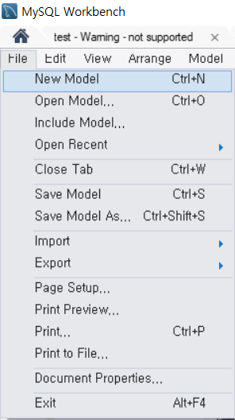
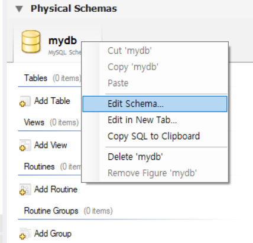
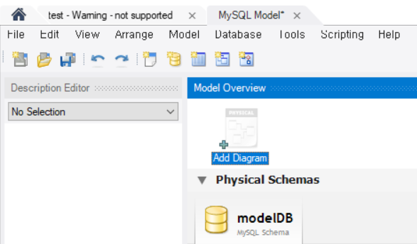
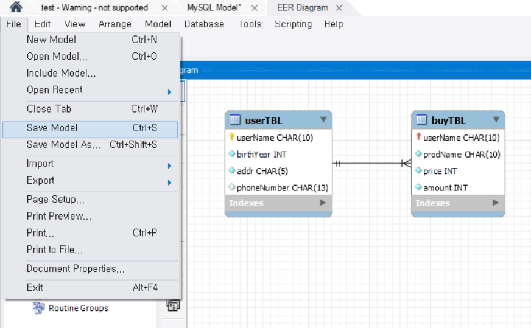
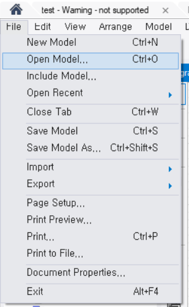
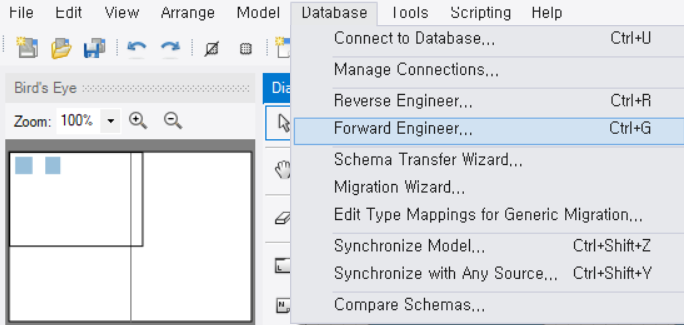
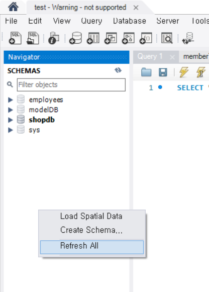
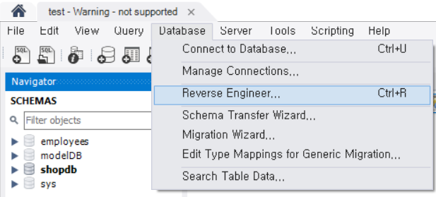

# DBMS 개요

- DBMS(DataBase Management System)

  - Database를 데이터의 집합이라고 정의한다면 DBMS는 database를 관리, 운영하는 역할을 한다.
    - Database는 여러 사용자나 응용 프로그램이 공유하고 동시에 접근이 가능해야한다.
    - Excel과 같은 프로그램은 data의 집합으로 사용할 수 있으나 여러 명의 사용자가 공유하지는 않으므로 DBMS라 부르지 않는다.

  - Database는 data의 저장 공간 자체를 의미하기도 한다.


- Database의 특징
  - 데이터의 무결성(Integrity)
    - DB 안의 data는 어떤 경로를 통해 들어왔던지 data에 오류가 있어서는 안 된다.
    - 무결성을 위해서 DB는 제약 조건(constraint)이라는 특성을 가진다.
  - 데이터의 독립성
    - DB의 크기를 변경하거나 data file의 저장소를 변경하더라도 기존에 작성된 응용 프로그램은 전혀 영향을 받지 않아야한다.
    - 서로 의존적인 관계가 아닌 독립적인 관계여야 한다.
    - 예를 들어 DB가 저장된 disk가 새 것으로 교체되어도 기존에 사용하던 응용 프로그램은 아무 변경 없이 계속 사용되어야한다.
  - 보안
    - DB안의 data에 아무나 접근할 수 있는 것이 아니라 data를 소유한 사람이나 data에 접근이 허가된 사람만 접근할 수 있어야한다.
    - 접근할 때도 사용자의 계정에 따라 다른 권한을 가져야한다.
  - 데이터 중복의 최소화
    - 동일한 data가 여러 개 중복되어 저장되는 것을 방지해야한다.


- DBMS의 분류
  - Hierarchical DBMS
    - 처음으로 나온 DBMS 개념으로 각 계층은 tree 형태를 가지며 1:N 관계를 갖는다.
    - 처음 구축한 이후에는 구조를 변경하는 것이 까다롭다 점과, 주어진 상태에서의 검색은 상당히 빠르지만, 접근의 유연성이 부족해 임의의 검색에는 어려움이 따른다는 단점이 있다.
  - Network DBMS
    - 계층형 DBMS의 문제점을 개선하기 위해 등장했다.
    - 1:1, 1:N, N:M 관계가 지원되어 효과적이고 빠른 data 추출이 가능하다.
    - 하지만 매우 복잡한 내부 포인터를 사용하므로 프로그래머가 이를 이해해야 프로그래밍이 가능하다는 단점이 있다.
  - Relational DBMS
    - Data를 table이라 불리는 최소 단위로 구성하고, 하나의 table을 하나 이상의 column으로 구성한다.
    - 모든 data는 table에 저장되므로, table이라는 구조가 RDBMS의 가장 중요하고 기본적인 구성이 된다.
    - 다른 DBMS에 비해서 업무가 변화될 경우 쉽게 변화에 순응할 수 있는 구조이며, 유지보수 측면에서도 편리하다는 장점이 있다.
    - 또한 대용량의 data 관리와 데이터의 무결성을 잘 보장해준다.
    - 단점은 시스템 자원을 많이 사용해서 시스템이 전반적으로 느려질 수 있다는 점이지만, 하드웨어의 발달로 이러한 단점은 많이 보완되고 있다.


- SQL(Structured Query Language) 개요

  - DB를 조작하기 위한 언어이다.

  - DBMS 제작 회사와 독립적이다.

    - SQL은 모든 DBMS 제작사에서 공통적으로 공개되고, 각 제작회사는 이 표준 sQL에 맞춰서 DBMS를 개발한다.

    - 따라서 표준 SQL은 대부분의 DBMS 제품에서 공통적으로 호환된다.
    - 그렇다고 모든 DBMS의 SQL문이 완벽하게 동일한 것은 아니다.

  - 다른 시스템으로 이식성이 좋다.

    - SQL 표준은 서버용, 개인용, 휴대용 장비에서 운영되는 DBMS마다 상호 호환성이 뛰어나다.

  - 표준이 계속 발전한다.

    - 지속적으로 개선된 표준안이 발표되고 있다.

  - 대화식 언어이다.

    - 컴파일 및 디버깅 없이 질의 후 바로 결과를 얻는 대화식 언어로 구성되어 있다.

  - 분산형 클라이언트-서버 구조이다.

    - 클라이언트-서버 구조를 지원한다.
    - 따라서 클라이언트에서 질의하면 서버에서 그 질의를 받아서 처리한 후 다시 클라이언트에 전달하는 구조를 가진다.


- MySQL
  - 마이클 위데니우스와 데이빗 액스마크가 1994년 개발을 시작하여 1995년 공개한 DBMS이다.
  - 현재는 Oracle이 인수하여 개발하고 있으며, 오픈 소스로 제공된다.
    - 비상업용이나 교육용으로는 제한 없이 사용이 가능하지만, Oracle에서 2010년에 인수하면서 상용으로 사용하기 위해서는 라이선스를 취득해야한다.
    - MariaDB는 초창기 MySQL 개발자들이 독립해서 만든 DBMS로 완전히 무료이다.


- MySQL을 설치하고 sample database를 설치한다.

  - MySQL은 전통적으로 `employees`라는 이름의 sample database를 제공한다.

  ```bash
  $ git clone https://github.com/datacharmer/test_db.git
  ```

  - 아래와 같이 MySQL Docker image를 pull 받는다.

  ```bash
  $ docker pull mysql
  ```

  - 아래 명령어를 통해 mysql을 실행시킨다.

  ```bash
  $ docker run -d --name test-mysql -v <sample database repository를 clone 받은 경로>:/data/test_db -e MYSQL_ROOT_PASSWORD=1234 -p 3306:3306 mysql
  ```

  - Container 내부에서 `/data/test_db`로 이동해 아래 명령어를 실행하고 위에서 설정한 비밀번호를 입력한다.

  ```bash
  $ mysql -u root -p < employees.sql
  ```

  - 완료되면 아래 명령어를 통해 mysql client를 실행한다.

  ```bash
  $ mysql -u root -p
  ```

  - Table들을 확인한다.

  ```sql
  use employees;
  show tables;
  
  # 아래와 같이 출력되면 성공 한 것이다.
  +----------------------+
  | Tables_in_employees  |
  +----------------------+
  | current_dept_emp     |
  | departments          |
  | dept_emp             |
  | dept_emp_latest_date |
  | dept_manager         |
  | employees            |
  | salaries             |
  | titles               |
  +----------------------+
  ```


# 데이터베이스 모델링

- 데이터 베이스 모델링 개념
  - 현 세계에서 사용되는 작업이나 사물들을 DBMS의 데이터베이스 개체로 옮기는 과정이다.
    - 데이터 베이스 모델링에 정답은 없다.
    - 그러나 좋은 모델링은 분명히 존재한다.
  - 데이터 베이스 모델링은 아래와 같은 이유로 상당히 어려운 작업이다.
    - 구현하고자 하는 업무에 대한 폭 넓고 정확한 지식이 필요하다.
    - 데이터 베이스 시스템에 대한 깊은 지식과 경험이 필요하다.


- 데이터 베이스 모델링 실습

  - 쇼핑몰의 고객 명단과 고객들의 구매 내역을 기록하는 데이터 베이스를 모델링한다.
  - 먼저 아래와 같은 raw data가 있다고 가정해보자.
    - 여러 번 방문할 수도 있고, 아무 것도 구매하지 않을 수도 있다.

  | 고객명   | 출생년도 | 주소 | 연락처        | 구매한 물건 | 단가(천 원) | 수량 |
  | -------- | -------- | ---- | ------------- | ----------- | ----------- | ---- |
  | 피카츄   | 1994     | 서울 | 010-1111-1111 |             |             |      |
  | 파이리   | 1978     | 대전 | 010-2222-2222 | 모자        | 20          | 2    |
  | 꼬부기   | 1982     | 대구 | 010-3333-3333 | 양말        | 5           | 5    |
  | 이상해씨 | 1975     | 부산 | 010-4444-4444 | 장갑        | 5           | 1    |
  | 버터플   | 2001     | 인천 | 010-5555-5555 |             |             |      |
  | 야도란   | 1989     | 울산 | 010-6666-6666 | 부채        | 10          | 3    |
  | 꼬부기   | 1982     | 대구 | 010-3333-3333 |             |             |      |
  | 파이리   | 1978     | 대전 | 010-2222-2222 |             |             |      |
  | 피카츄   | 1994     | 서울 |               | 외투        | 80          | 2    |
  | 버터플   | 2001     | 인천 | 010-5555-5555 | 셔츠        | 30          | 1    |
  | 피카츄   | 1994     | 서울 |               |             |             |      |
  | 파이리   | 1978     | 대전 |               |             |             |      |
  | 꼬부기   | 1982     | 대구 | 010-3333-3333 | 바지        | 40          | 1    |

  - 물건을 구매한 적 없는 고객을 위쪽으로 다시 정렬하면 아래와 같다.
    - 표에서 데이터가 있는 영역만 보면 L자가 처럼 보이는 것을 확인할 수 있다.
    - 이러한 것을 L자형 테이블이라 부른다.
    - L자형 테이블은 공간이 낭비된다는 문제가 있다.

  | 고객명   | 출생년도 | 주소 | 연락처        | 구매한 물건 | 단가(천 원) | 수량 |
  | -------- | -------- | ---- | ------------- | ----------- | ----------- | ---- |
  | 피카츄   | 1994     | 서울 | 010-1111-1111 |             |             |      |
  | 버터플   | 2001     | 인천 | 010-5555-5555 |             |             |      |
  | 꼬부기   | 1982     | 대구 | 010-3333-3333 |             |             |      |
  | 파이리   | 1978     | 대전 | 010-2222-2222 |             |             |      |
  | 피카츄   | 1994     | 서울 |               |             |             |      |
  | 파이리   | 1978     | 대전 |               |             |             |      |
  | 파이리   | 1978     | 대전 | 010-2222-2222 | 모자        | 20          | 2    |
  | 꼬부기   | 1982     | 대구 | 010-3333-3333 | 양말        | 5           | 5    |
  | 이상해씨 | 1975     | 부산 | 010-4444-4444 | 장갑        | 5           | 1    |
  | 야도란   | 1989     | 울산 | 010-6666-6666 | 부채        | 10          | 3    |
  | 피카츄   | 1994     | 서울 |               | 외투        | 80          | 2    |
  | 버터플   | 2001     | 인천 | 010-5555-5555 | 셔츠        | 30          | 1    |
  | 꼬부기   | 1982     | 대구 | 010-3333-3333 | 바지        | 40          | 1    |

  - L자형 테이블을 빈 칸이 있는 곳과 없는 곳으로 분리하여 아래와 같은 고객 테이블과

  | 고객명   | 출생년도 | 주소 | 연락처        |
  | -------- | -------- | ---- | ------------- |
  | 피카츄   | 1994     | 서울 | 010-1111-1111 |
  | 버터플   | 2001     | 인천 | 010-5555-5555 |
  | 꼬부기   | 1982     | 대구 | 010-3333-3333 |
  | 파이리   | 1978     | 대전 | 010-2222-2222 |
  | 피카츄   | 1994     | 서울 |               |
  | 파이리   | 1978     | 대전 |               |
  | 파이리   | 1978     | 대전 | 010-2222-2222 |
  | 꼬부기   | 1982     | 대구 | 010-3333-3333 |
  | 이상해씨 | 1975     | 부산 | 010-4444-4444 |
  | 야도란   | 1989     | 울산 | 010-6666-6666 |
  | 피카츄   | 1994     | 서울 |               |
  | 버터플   | 2001     | 인천 | 010-5555-5555 |
  | 꼬부기   | 1982     | 대구 | 010-3333-3333 |

  - 아래와 같은 구매 테이블로 나눈다.

  | 구매한 물건 | 단가(천 원) | 수량 |
  | ----------- | ----------- | ---- |
  | 모자        | 20          | 2    |
  | 양말        | 5           | 5    |
  | 장갑        | 5           | 1    |
  | 부채        | 10          | 3    |
  | 외투        | 80          | 2    |
  | 셔츠        | 30          | 1    |
  | 바지        | 40          | 1    |

  - 이를 통해 빈 부분을 줄여 공간을 절약할 수 있게 됐으나 정보의 중복이 있다는 문제가 남아있다.
    - 따라서 아래와 같이 고객 테이블에서 중복을 제거한다.
    - 고객명에 중복이 없어져 고객 이름으로 고객을 구분할 수 있게 되었으므로 고객 명을 PK로 사용한다.

  | 고객명   | 출생년도 | 주소 | 연락처        |
  | -------- | -------- | ---- | ------------- |
  | 피카츄   | 1994     | 서울 | 010-1111-1111 |
  | 파이리   | 1978     | 대전 | 010-2222-2222 |
  | 꼬부기   | 1982     | 대구 | 010-3333-3333 |
  | 이상해씨 | 1975     | 부산 | 010-4444-4444 |
  | 버터플   | 2001     | 인천 | 010-5555-5555 |
  | 야도란   | 1989     | 울산 | 010-6666-6666 |

  - 구매 테이블에서는 누가 구매한 것인지를 알 수 없다는 문제가 있다.
    - 따라서 고객 테이블의 PK 값을 구매 테이블에 넣어 어떤 고객이 어떤 구매 행위를 했는지를 표시한다.
    - 고객명은 고객 테이블에서는 PK 값이지만 구매 테이블에서는 FK로 사용된다.
    - 고객 테이블과 구매 테이블의 관계를 부모 테이블과 자식 테이블의 관계라고 부른다.

  | 고객명   | 구매한 물건 | 단가(천 원) | 수량 |
  | -------- | ----------- | ----------- | ---- |
  | 파이리   | 모자        | 20          | 2    |
  | 꼬부기   | 양말        | 5           | 5    |
  | 이상해씨 | 장갑        | 5           | 1    |
  | 버터플   | 부채        | 10          | 3    |
  | 피카츄   | 외투        | 80          | 2    |
  | 버터플   | 셔츠        | 30          | 1    |
  | 꼬부기   | 바지        | 40          | 1    |

  - 위에서 정리한 데이터를 기반으로 고객 테이블을 정의하면 아래와 같다.

  | 열 이름  | 데이터 형식       | Null 허용 | 기타 |
  | -------- | ----------------- | --------- | ---- |
  | 고객명   | 문자(최대 10글자) | X         | PK   |
  | 출생년도 | 숫자(정수)        | X         |      |
  | 주소     | 문자(최대 5글자)  | X         |      |
  | 연락처   | 문자(최대 13글자) | O         |      |

  - 구매 테이블은 아래와 같다.

  | 열 이름     | 데이터 형식       | Null 허용 | 기타 |
  | ----------- | ----------------- | --------- | ---- |
  | 고객명      | 문자(최대 10글자) | X         | FK   |
  | 구매한 물건 | 문자(최대 10글자) | X         |      |
  | 단가        | 숫자(정수)        | X         |      |
  | 수량        | 숫자(정수)        | X         |      |


- Workbench를 통해 다이어그램을 작성하고 이를 DB로 변환하기

  - 상단 네비게이션 바에서 `File` - `New Model`을 클릭한다.

  

  - 기본 데이터 베이스 이름이 mydb로 되어 있는데 이를 우클릭하여 `Edit Schema`를 클릭한다.
    - 적절한 이름으로 변경한 후 창을 닫으면 적용된다.

  

  - `Add Diagram`을 클릭하여 `ERR Diagram` 탭을 연다.

   

  - 아래와 같이 작성 후 `File` - `Save Model`을 클릭하여 저장한다.
    -  `.mwb` 형식으로 저장된다.

  

  - 위에서 저장한 `.mwb` file을 실제 DB에 적용하기 위해서 `File` - `Open Model`을 클릭하여 위에서 생성한 `.mwb` file을 클릭한다.

  

  - 상단의 `Database` - `Forward Engineer`를 클릭한다.

  

  - 창이 뜨면 모두 그대로 두고 계속 `Next`를 클릭한 후 `Navigator`에서 `Refresh All`을 누르면 위에서 생성한 DB와 table들이 생성된 것을 볼 수 있다.

  


- Workbench를 통해 DB로 diagram 생성하기

  - 이번에는 위와 반대로 DB를 diagram으로 만들어 볼 것이다.
    - `Database` - `Reverse Engineer`를 클릭한다.

  

  - 설정 변경 없이 `Next`를 누르면서 비밀번호를 입력하면 DB를 선택하는 화면이 나온다.

    - 여기서 diagram으로 만들 DB와 DB의 요소들을 선택할 수 있다.

    - 끝까지 완료하면 diagram이 나오게 된다.

  - 위와 마찬가지로 완성된 diagram을 `File` - `Save Model`을 통해 저장이 가능하다.

