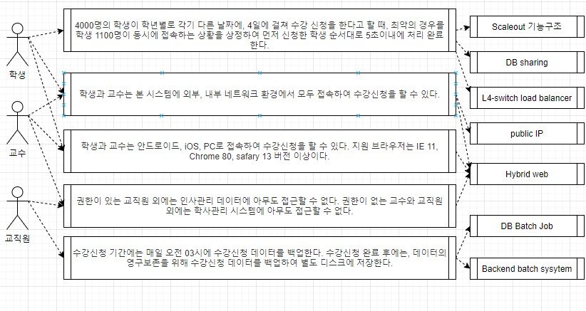
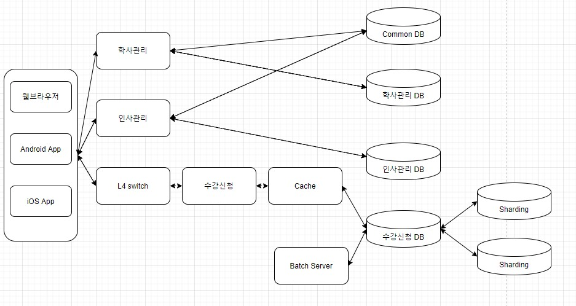

# 프레임워크와 라이브러리

- 프레임 워크와 라이브러리
  - 프레임워크가 내가 작성한 코드를 제어하고, 대신 실행하면 그것은 프레임 워크가 맞다.
  - 내가 작성한 코드가 직접 제어의 흐름을 담당한다면 그것은 프레임 워크가 아니라 라이브러리다.


# 아키텍처 그리기(설계하기)

- 아키텍처를 요구하는 대상들
  - 명세서
  - 프로젝트 매니저
  - 고객


- 사전적 정의
  - 아키텍처: 건물이나 다른 구조물을 계획, 설계, 건설하는 과정과 그 결과물
  - SW아키텍처
    - wiki: 소프트웨어 구성요소들 사이에서 유기적 관계를 표현하고, 소프트웨어 설계와 업그레이드를 통제하는 지침과 원칙
    - Software Architecture in Practic(3판): 시스템을 추론하는데 필요한 구조의 집합으로, 시스템은 소프트웨어 요소와 이들 사이의 관계, 그리고 이들 요소와 관계의 속성으로 구성된다.


- 아키텍처가 중요한 이유
  - 초기 설계 과정의 **결정사항**: 구현에 대한 제약사항 검토 및 시스템에 대한 구조 결정
  - 커뮤니케이션의 **기준점**: 서비스나 시스템 이해 당사자들 간의 공통분모
  - 재사용 가능한 **레퍼런스**: 아키텍처를 결정 짓게 한, 유사한 요구사항 및 설계 경험의 재사용


- 학사관리시스템을 예시로 보는 아키텍처 설계 방법

  - 결정요인 도출

    - 이해관계자 선별(시스템에 연관되는 사람이나, 다른 시스템): 학생, 교수, 교직원, 외부 시스템(인사 관리 시스템)
    - 기능요구사항: 학사 관리 기능, 수업 관리 기능, 수강 관리 기능, 사용자 관리 기능
    - 비기능요구사항(품질속성): 강의신청 기간에 원활한 진행, 언제 어디서나 접근 가능, 모바일에서도 접속 가능, 데이터 손실 방지 등.
    - 비기능요구사항(품질속성) 때문에 아키텍처를 그린다고 봐도 될 정도로 비기능요구사항은 매우 중요한 사항이다.
  - 결정요인들의 연관관계를 도식화(유스 케이스 다이어그램 사용)

  > 아래 다이어 그램을 그린 사이트 : https://app.diagrams.net/

  

  - 비기능 요구사항 기반으로 품질 속성 시나리오 작성

    - 스파이크 성 트래픽에 대한 처리(수강 신청 기간에 몰리는 접속량), public 환경(언제 어디서나 접근 가능),  하이브리드 웹(모바일에서 접속 가능), 권한을 통한 정보 보안, 주기적 데이터 백업(데이터 손실 방지) 등
    - 실제 서비스를 위해서는 기능 구현만을 목적으로 해선 안되며 위와 같은 품질 속성을 고려해야 한다.
    - 스파이크 성 트래픽에 대한 처리: 4000명의 학생이 학년별로 각기 다른 날짜에, 4일에 걸쳐 수강 신청을 한다고 할 때, 최악의 경우를 학생 1100명이 동시에 접속하는 상황을 상정(해당 일자에 수강신청하는 1000명+다른 용무로 접속하는 학생 100명)하여 먼저 신청한 학생 순서대로 5초이내에 처리 완료한다.
    - public환경: 학생과 교수는 본 시스템에 외부, 내부 네트워크 환경에서 모두 접속하여 수강신청을 할 수 있다.
    - 하이브리드 웹: 학생과 교수는 안드로이드, iOS, PC로 접속하여 수강신청을 할 수 있다. 지원 브라우저는 IE 11, Chrome 80, safary 13 버전 이상이다.
    - 권한을 통한 정보 보안: 권한이 있는 교직원 외에는 인사관리 데이터에 아무도 접근할 수 없다. 권한이 없는 교수와 교직원 외에는 학사관리 시스템에 아무도 접근할 수 없다.
    - 주기적 데이터 백업: 수강신청 기간에는 매일 오전 03시에 수강신청 데이터를 백업한다. 수강신청 완료 후에는, 데이터의 영구보존을 위해 수강신청 데이터를 백업하여 별도 디스크에 저장한다.

  - 품질 속성 시나리오에 따른 아키텍처 전략 수립

    

  - 아키텍처 도식화

    

  - 아키텍처 검증(평가)하기


# Server & Client Architecture

- DNS(Domain Name Server)
  - 클라이언트가 서버에 요청을 보낼 때 DNS를 통해 보내게 된다.
  - ISP(Internet Service Provider, 인터넷 서비스 제공) 업체(SKT, KT, LG)별로 DNS의 주소가 다르다.
  - DNS Cache: 매번 DNS에 요청을 보내는 대신 최초로 DNS에 요청을 보냈을 때 그 응답으로 받은 IP를 저장해둔다.
    - 저장 위치: 브라우저, 운영체제, 라우터, ISP 등에 저장한다.
  - TCP(Transmission Control Protocol) 3 Way HandShake
    - SYN(Synch): IP 주소에 해당하는 서버에 요청을 보낸다.
    - ACK(acknowledge)+SYN: 싱크가 맞으면 서버는 요청을 받았다는 확인을 클라이언트에 보낸다.
    - ACK: 클라이언트 역시 서버에 확인 응답을 보낸다.
  - DNS는 반의 모든 사람의 전화번호를 알고 있는 반장과 같고, DNS IP는 반장 직통 번호로 비유했을 때 번호를 모르는 같은 반 친구에게 연락하고자 한다면 아래의 과정을 거치게 된다.
    - 반장에게 연락한다
    - 반장에게 친구의 이름을 알려주고 전화번호를 물어본다.
    - 반장이 해당 학생의 번호를 찾아본다.
    - 전화번호를 전달 받는다.
    - 받은 번호를 저장한다(따라서 이후에는 이 친구의 번호를 얻기 위해서는 굳이 반장에게 연락할 필요가 없다).
    - 받은 번호로 전화한다.
  - 이를 Server & Client의 관계에 대입하여, 주소창에 www.google.com을 입력한 이후의 과정은 다음과 같다.
    - Client는 DNS Resolver에게  www.google.com라는 도메인과 함께 요청을 보낸다.
    - DNS Resolver는 Root Name Server로 www.google.com라는 도메인과 함께 요청을 보내는데,  Root Name Server는 도메인 중 마지막에 달린 `.com`, `.co.kr` 등을 분석하여 이들에 대한 정보를 가진 Server의 IP(TLD Name Server IP)를 DNS Resolver로 반환한다.
    - DNS Resolver는 이 응답을 가지고 www.google.com라는 도메인과 함께 TLD(Top Level Domain) Name Server로 다시 요청을 보낸다.  TLD Name Server는 `google.com`까지 분석하여 이 주소에 대한 정보를 가진 Server의 IP(Authoritative Name Server IP)를 DNS Resolver로 반환한다.
    - DNS Resolver는 이 정보를 가지고 Authoritative Name Server에 www.google.com라는 도메인과 함께 요청을 보내는데 Authoritative Name Server는 이를 분석하여 해당 도메인의 IP 주소를 반환한다.
    - DNS Resolver는 반환 받은  IP 주소를 Client에 반환한다.
    - DNS Cache를 통해 이를 저장한다.
    - TCP 3 Way HandShake를 통해 서버에 요청을 보낸다.


- HTTP request, response
  - 이는 TCP 연결이 이루어진 뒤의 과정이다.
  - HTTP(HyperText Transfer Protocol): HTML을 요청하고 전달 받기 위한 규약
  - Client는 Server에 Request Method(GET, POST 등)와 함께 요청을 보낸다.
  - 일반적으로 최초의 요청은 GET 메서드로 index.html을 요청한다. 서버는 이에 대한 요청으로 index.html과 함께 status code(성공했을 경우 200)를 반환한다.


- 위 내용을 정리하여, 구글 홈페이지가 브라우저에 보여지기까지의 과정은 다음과 같다.
  - 브라우저에 www.google.com을 입력한다.
  - DNS를 통해 IP 주소를 획득한다.
  - 획득한 IP 주소에 있는 서버와 TCP 3 Way Handshake를 진행한다.
  - 통신을 맺은 서버에 HTTP Request를 한다.
  - 서버에 보낸 HTTP Request를 통해 html 파일을 받는다.
  - 브라우저가 html을 분석하여 화면으로 그린다.


# 개발자는 항상 의심해야 한다

- 서버는 클라이언트를 무작정 믿어선 안된다.

  - 악의적인 의도를 가진 클라이언트의 요청을 막을 수 있어야 한다.

  - 서버는 클라이언트에 따라 능동적인 대처가 필요하다.

  - 서버는 클라이언트에서 어떤 사용자가 요청를 보낸 것인지 사용자에 대한 인증이 필요하다(토큰 사용).

  - 서버는 사용자가 보낸 요청이 유효한 것인지 유효성을 검증해야한다.

    - 예시1.회원가입시 비밀번호 검증 같은 경우 백과 프론트 모두에서 검증해야 한다.
    - 예시2.파일 업로드 기능 구현시 파일 유형을 엄격히 제한해야 한다. 현대카드의 경우 게시판에 업로드 기능이 있었는데 `.jsp` 확장자의 업로드도 허용하였다. 이 때문에 서버의 DB를 조회하여 사용자 정보가 유출된 적이 있었다.

  - Sql injection에 주의해야 한다.

  - XSS

    - Cross-Site Scripting

    ```html
    <script>악의적인 해커의 url로 사용자의 주요 정보 전송</script>
    ```

  - 클라이언트에서는 최소한의 처리만 해야하며 중요한 로직은 모두 서버에서 처리해야 한다.
    - 예를 들어 할인 로직의 경우 이를 프론트 단에서 처리할 경우, 악의적으로 이를 조작한다면 서버는 할인된 가격을 적용시킬 수 밖에 없다.
    - 클라이언트는 이러한 악의적인 조작에 서버보다 취약하므로 중요한 로직은 서버에서 처리해야 한다.


- 서버는 항상 자기 자신도 의심해야 한다.
  - 개발자는 개발을 진행하면서 자신이 보낸 요청에 대한 응답만을 확인하지만 실제 서비스는 N명의 요청이 동시에 들어온다는 것을 인식하고 있어야 한다.
    - JMeter와 같은 도구를 사용하요 부하 테스트를 수행한다.
  - 적절한 응답 시간과 데이터의 신뢰성을 확보해야 한다.
    - 응답 시간을 줄이기 위해 캐시를 고려해야 한다.
    - 캐시를 쓴다는 것은 메모리를 사용하겠다는 말이고 이는 결국 코드로 보면 변수 혹은 객체에 저장한다는 말이다.
    - 데이터 신뢰성의 경우 최대한 다양한 상황을 가정하고 테스트를 해봐야 한다. 예를 들어 한 사람만 사용할 때에는 포인트가 정상적으로 쌓이는 것 처럼 보이겠지만 여러 명이 사용할 경우 사실 포인트가 한 사람에게만 쌓이도록 코드가 짜여져 있을 수도 있다. 따라서 테스트를 보다 다양하고 정밀하게 진행해야 한다.
  - 서비스 및 컨텐츠 별로 사용 권한을 명확히 해야 한다.
  - 주요 데이터를 암호화 해야 한다.
  - 트랜잭션
    - 하나의 과정을 잘게 분할하여 분할 된 과정 중 하나만 실패하더라도 전체 과정을 취소시켜야 한다.
    - 여를 들어 상품 구매시 상품권 적용+신용카드 선택+쇼핑몰 포인트 적용의 과정을 거칠 때 쇼핑몰 포인트 적용이 실패했다면 이전의 상품권, 신용카드 선택도 모두 취소되어야 한다.
  - Logging
    - 서버가 작동하면서 발생하는 주요 이슈들을 기록해야 한다.
    - 단순 콘솔 출력 보다는 주요 logger(library)를 사용해야 한다.
    - 이는 서버 운영 시 발생하는 다양한 이슈들을 추적하는 시작점이 된다.
  - 서버 테스트 시나리오
    - 복수개의 요청을 반드시 수행해봐야 한다.
    - 눈에 보이지 않는 비 기능 요소에 대한 테스트 시나리오를 작성해야 한다.
    - 테스트 할 내용을 안다는 것 자체가 SW역량을 인증하는 것이다.


- HTTP(Hyper Text Transfer Protocol)
  - Stateless: HTTP는 stateless하다. 서버는 클라이언트의 상태에 관심이 없고, 클라이언트 역시 서버의 상태에 관심이 없다. 요청과 그에 따른 응답이 끝나면 둘 사이의 연결은 끊어지게 된다.
  - HTTP 서버는 불특정 다수의 요청을 전제(HTTP 서버만의 특성이라기 보다 서버의 특성에 가깝다)
  - Stateless의 단점은 무엇이며 이를 해결하기 위한 방법은 무엇인가
    - 단점: 클라이언트는 서버에 요청을 보낼때 마다 클라이언트에 대한 정보도 담아서 보내야 한다.
    - 해결법: 클라이언트는 상태를 유지하기 위해서 쿠키를, 서버는 상태를 유지하기 위해서 세션을 사용한다.


# 개발자의 나쁜 습관

- 코드관리
  - 무분별한 복붙
    - 무엇인지 모르고 복붙해서 사용하기만 한다면 유지보수에 문제가 발생한다.
    - 사용하는 측에서 문제를 발견하여 수정하더라도 원래의 소스코드에는 해당 내용이 반영되지 않는다.
  - 디버깅 미루기
    - 사소한 버그라도 디버깅을 미루면 후일 큰 문제가 발생할 수 있다.
    - 사소한 버그라도 놓치지 않도록 할 일 목록을 만들어 두어야 한다.
  - 지나치게 축약된 코드
    - 간결한 코드가 좋은것은 사실이다.
    - 그러나 간결성 보다는 가독성, 접근성이 먼저다.
    - 남이 보고 한 번에 파악할 수 있는 코드를 짜야 한다.
  - 이른 최적화
    - 최적화는 가장 마지막 단계에서 해야 한다.
    - 최적화를 마친 후 요구사항이 바뀌면 어차피 최적화도 다시 해야 한다.
  - 남이 알아볼 수 있는 코드를 짜라
    - 코드 스타일을 지켜서 짜야 한다.
    - 변수명, 함수명은 이름만 보고도 무슨 역할을 하는지 알아볼 수 있게 짜야 한다.


- 팀워크
  - 잦은 계획 변경
    - 무분별한 계획 변경은 일정 지연 및 개발 기간 부족으로 이어진다.
    - 계획 변경은 개발기간을 고려하여 신중하게 해야 한다.
  - 실현 가능성이 낮은 계획
  - 아이디어를 공유하지 않고 아이디어에 대한 피드백을 받지 않음
  - 혼자 일하는 개발자
  - 나쁜 코드를 짜는 것을 거부한다.
    - 프로젝트 마감일에 쫒겨 작동만 가능하도록 급조하여 만든 코드를 짜는 것을 무작정 거부하는 개발자
    - 나쁜 코드는 분명 지양해야 하지만 일정에 맞추는 것이 중요하다.
    - 나쁜 코드라도 빠르게 짤 수 있는 능력도 필요하다.
  - 거만한 태도
    - 자신의 실수를 인정하지 않는 태도
    - 다른 팀원에게 자신의 지식을 공유하지 않음
    - 자신의 코드에 집착하고 다른 사람의 의견을 수용하지 않음


- 코드 작성
  - 에러 메세지 무시
    - 에러 메세지를 제대로 읽지 않고 에러의 원인을 다 이해했다고 착각
    - 에러 메세지 분석에 시간을 들이는 것이 길게 보면 시간을 단축하는 일이다.
  - 하나의 개발자 툴 킷만 사용
    - 개발 스타일에 따라 잘 맞는 IDE가 있다.
    - 특정 언어, 특정 조직에 특화된 IDE가 있다.
  - 무분별한 라이브러리 사용
    - 예제 몇 가지를 보고 라이브러리를 마스터 했다고 생각
    - 프로젝트에 맞지 않는 라이브러리의 사용


- 테스트 및 유지보수
  - 통과할 정도의 테스트 만들기
    - 통과하지 못할 테스트도 만들어야 한다.
    - 테스트는 에러를 잡기 위해서 하는 것임을 기억해라.
  - 기능구현에만 집중하기
    - 기능 구현에만 몰두하면 성능, 보안 문제를 소홀히 하기 쉽다.
    - 기능 구현을 하면서도 끊임 없이 해당 기능과 관련하여 어떤 문제들이 있을지 생각하고 리스트화 해야 한다.

