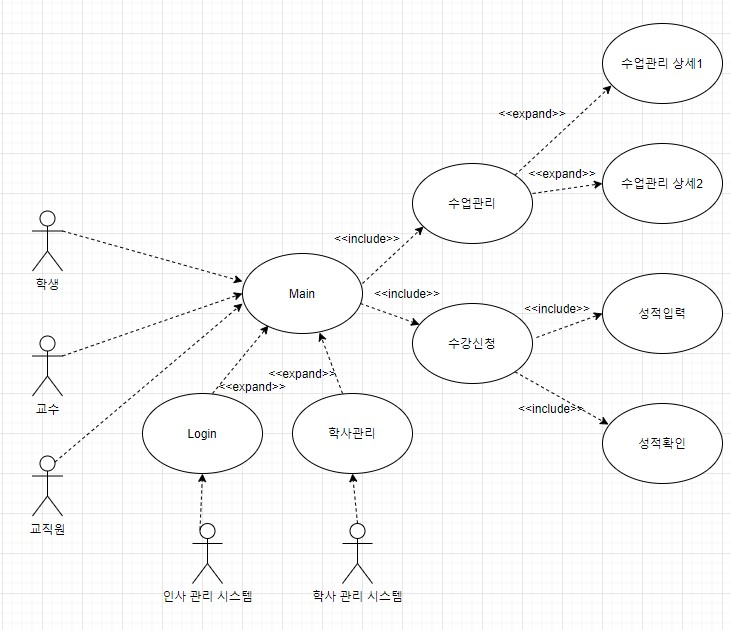

# 프레임워크와 라이브러리

- 프레임 워크와 라이브러리
  - 프레임워크가 내가 작성한 코드를 제어하고, 대신 실행하면 그것은 프레임 워크가 맞다.
  - 내가 작성한 코드가 직접 제어의 흐름을 담당한다면 그것은 프레임 워크가 아니라 라이브러리다.

# 아키텍처 그리기(설계하기)

- 아키텍처를 요구하는 대상들
  - 명세서
  - 프로젝트 매니저
  - 고객

- 사전적 정의
  - 아키텍처: 건물이나 다른 구조물을 계획, 설계, 건설하는 과정과 그 결과물
  - SW아키텍처
    - wiki: 소프트웨어 구성요소들 사이에서 유기적 관계를 표현하고, 소프트웨어 설계와 업그레이드를 통제하는 지침과 원칙
    - Software Architecture in Practic(3판): 시스템을 추론하는데 필요한 구조의 집합으로, 시스템은 소프트웨어 요소와 이들 사이의 관계, 그리고 이들 요소와 관계의 속성으로 구성된다.

- 아키텍처가 중요한 이유
  - 초기 설계 과정의 **결정사항**: 구현에 대한 제약사항 검토 및 시스템에 대한 구조 결정
  - 커뮤니케이션의 **기준점**: 서비스나 시스템 이해 당사자들 간의 공통분모
  - 재사용 가능한 **레퍼런스**: 아키텍처를 결정 짓게 한, 유사한 요구사항 및 설계 경험의 재사용

- 학사관리시스템을 예시로 보는 아키텍처 설계 방법

  - 결정요인 도출

    - 이해관계자 선별(시스템에 연관되는 사람이나, 다른 시스템): 학생, 교수, 교직원, 외부 시스템(인사 관리 시스템)
    - 기능요구사항: 학사 관리 기능, 수업 관리 기능, 수강 관리 기능, 사용자 관리 기능
    - 비기능요구사항(품질속성): 강의신청 기간에 원활한 진행, 언제 어디서나 접근 가능, 모바일에서도 접속 가능, 데이터 손실 방지 등.
    - 비기능요구사항(품질속성) 때문에 아키텍처를 그린다고 봐도 될 정도로 비기능요구사항은 매우 중요한 사항이다.
  - 결정요인들의 연관관계를 도식화(유스 케이스 다이어그램 사용)

  > 아래 다이어 그램을 그린 사이트 : https://app.diagrams.net/

  

  - 비기능 요구사항 기반으로 품질 속성 시나리오 작성

    - 스파이크 성 트래픽에 대한 처리(수강 신청 기간에 몰리는 접속량), public 환경(언제 어디서나 접근 가능),  하이브리드 웹(모바일에서 접속 가능), 권한을 통한 정보 보안, 주기적 데이터 백업(데이터 손실 방지) 등
    - 실제 서비스를 위해서는 기능 구현만을 목적으로 해선 안되며 위와 같은 품질 속성을 고려해야 한다.
    - 스파이크 성 트래픽에 대한 처리: 4000명의 학생이 학년별로 각기 다른 날짜에, 4일에 걸쳐 수강 신청을 한다고 할 때, 최악의 경우를 학생 1100명이 동시에 접속하는 상황을 상정(해당 일자에 수강신청하는 1000명+다른 용무로 접속하는 학생 100명)하여 먼저 신청한 학생 순서대로 5초이내에 처리 완료한다.
    - public환경: 학생과 교수는 본 시스템에 외부, 내부 네트워크 환경에서 모두 접속하여 수강신청을 할 수 있다.
    - 하이브리드 웹: 학생과 교수는 안드로이드, iOS, PC로 접속하여 수강신청을 할 수 있다. 지원 브라우저는 IE 11, Chrome 80, safary 13 버전 이상이다.
    - 권한을 통한 정보 보안: 권한이 있는 교직원 외에는 인사관리 데이터에 아무도 접근할 수 없다. 권한이 없는 교수와 교직원 외에는 학사관리 시스템에 아무도 접근할 수 없다.
    - 주기적 데이터 백업: 수강신청 기간에는 매일 오전 03시에 수강신청 데이터를 백업한다. 수강신청 완료 후에는, 데이터의 영구보존을 위해 수강신청 데이터를 백업하여 별도 디스크에 저장한다.

  - 품질 속성 시나리오에 따른 아키텍처 전략 수립

    

  - 아키텍처 도식화

    

  - 아키텍처 검증(평가)하기

