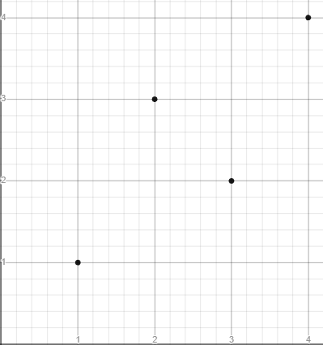
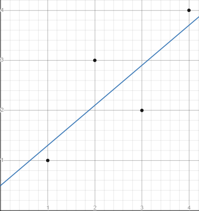
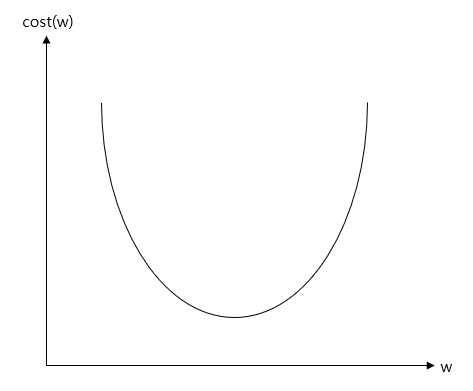
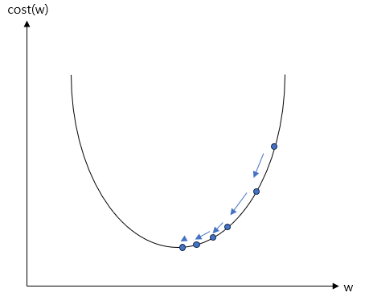
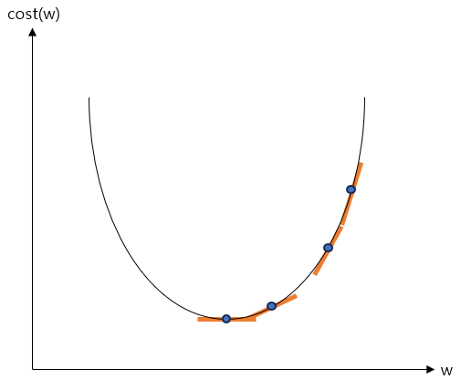

## Vector의 유사도

- Vector의 유사도

  - 두 문서 사이의 유사도를 판단하기 위해 각 문서를 vector로 변환한 후 vector 값 들의 유사도를 사용하는 방법이다.
  - 사람들은 서로 다른 두 문서의 유사도를 주로 문서들 간에 동일한 단어 또는 비슷한 단어가 얼마나 공통적으로 많이 사용되었는지에 의존한다.
    - 기계도 크게 다르지 않다.

  - 기계의 유사도 계산 성능은 아래와 같은 요인들에 달렸다.
    - 각 문서의 단어들을 어떤 방법으로 수치화했는지(DTM. Word2Vec 등).
    - 문서 간의 단어들의 유사성을 어떤 방법으로 계산했는지(cosine similarity, Euclidean distance 등).


- Cosine Similarity

  - 두 vector들 사이의 cosine 각도를 이용하여 구할 수 있는 두 vector의 유사도를 의미한다.
    - 두 vector의 방향이 완전히 동일하면 1, 90도의 각을 이루면 0, 180로 반대 방향이면 -1의 값을 갖는다.
    - 즉 -1 이상 1 이하의 값을 가지며 1에 가까울수록 유사도가 높다고 볼 수 있다.
    - 두 벡터 A, B에 대해 cosine similarity는 아래와 같이 구한다.
    - DTM이나 TF-IDF 행렬을 통해 문서의 유사도를 구하는 경우에는 DTM이나 TF-IDF 행렬이 각각의 특징 vector A, B가 된다.

  $$
  similarity=cos(\Theta) = {A \cdot B\over||A||\ ||B||} = {\sum_{i=1}^nA_i \times B_i \over \sqrt{\sum_{i=1}^n(A_i)^2} \times \sqrt{\sum_{i=1}^n(B_i)^2}}
  $$

  - 아래 세 개의 문서를 가지고 cosine similarity를 구해볼 것이다.
    - 토마토 맛 토
    - 토 맛 토마토
    - 토마토 맛 토마토 사탕

  - 위 세 개의 문서를 띄어쓰기를 기준으로 tokenizing하고 세 문서에 대해서 DTM을 만든다.

  ```python
  import pandas as pd
  
  def tf(t, d):
    	return d.count(t)
  
  def build_dtm(vocabulary):
      result = []
      for i in range(N):
          result.append([])
          d = docs[i]
          for j in range(len(vocabulary)):
              t = vocabulary[j]
              # tf 함수를 사용하여 DTM에 값을 채워 넣는다.
              result[-1].append(tf(t, d))
      return pd.DataFrame(result, columns = vocabulary)
  
  
  docs = [
      "토마토 맛 토",
      "토 맛 토마토 토마토 맛 토",
      "토마토 맛 토마토 사탕"
  ]
  N = len(docs)
  # 공백을 기준으로 tokenizing
  vocabulary = list(set(word for doc in docs for word in doc.split()))
  
  # DTM을 구한다.
  dtm = build_dtm(vocabulary)
  print(dtm)
  """
     사탕  맛  토마토  토
  0   0  1    1  1
  1   0  2    2  2
  2   1  1    2  0
  """
  ```

  - Numpy를 사용하여 cosine similarity를 구할 수 있다.
    - 문서1과 문서3의 cosine similarity와 문서2와 문서3의 cosine similarity가 같으며, 문서1과 문서2의 cosine similarity가 1이 나왔다.
    - 문서 2는 문서1에서 모든 단어의 빈도수가 1 증가한 문서이다.
    - 즉 문서 내의 모든 단어의 빈도수가 동일하게 증가하는 경우에는 기존의 문서와 코사인 유사도의 값이 1이다.
    - 이를 통해 알 수 있는 것은 cosine similarity는 vector의 방향(패턴)에 초점을 두기에 문서의 길이가 다른 상황에서도 비교적 문서 길이의 영향을 덜 받는다는 점이다.


  ```python
  from numpy import dot
  from numpy.linalg import norm
  
  
  def cos_sim(A, B):
    return dot(A, B)/(norm(A)*norm(B))
  
  print('문서 1과 문서2의 유사도 :',cos_sim(dtm.iloc[0].to_list(), dtm.iloc[1].to_list()))		# 1.0000000000000002
  print('문서 1과 문서3의 유사도 :',cos_sim(dtm.iloc[0].to_list(), dtm.iloc[2].to_list()))		# 0.7071067811865476
  print('문서 2와 문서3의 유사도 :',cos_sim(dtm.iloc[1].to_list(), dtm.iloc[2].to_list()))		# 0.7071067811865476
  ```


- Euclidean distance

  - 다차원 공간에서 두 개의 점 사이의 거리를 통해 유사도를 판단하는 방법이다.
    - 거리가 가까울 수록 유사도가 높다고 본다.
  - 다차원 공간에서 두 개의 점 p와 q가 각각 $p=(p_1,...,p_n)$과 $q=(q_1,...,q_n)$의 좌표를 가질 때 두 점 사이의 거리를 계산하는 Euclidean distance를 구하는 공식은 아래와 같다.

  $$
  \sqrt{(q_1-p_1)^2 + (q_2-p_2)^2 + \dots + (q_n - p_n)^2} = \sqrt{\sum_{i=1}^n(q_i-p_i)^2}
  $$

  - Numpy를 사용하여 간단하게 구할 수 있다.
    - 위에서 cosine similarity를 구할 때 사용한 것과 동일한 문서로 동일한 DTM을 생성했다고 가정한다.
    - 문서1과 문서2가 문서1과 문서3보다 가까우므로 문서1은 문서3보다 문서2와 더 유사하다고 할 수 있다.

  ```python
  def dist(x,y):
      x = np.array(x) 
      y = np.array(y) 
      return np.sqrt(np.sum((x-y)**2))
  
  
  print('문서1과 문서2의 거리 :',dist(dtm.iloc[0].to_list(), dtm.iloc[1].to_list()))		# 1.7320508075688772
  print('문서1과 문서3의 거리 :',dist(dtm.iloc[0].to_list(), dtm.iloc[2].to_list()))		# 1.7320508075688772
  print('문서2와 문서3의 거리 :',dist(dtm.iloc[1].to_list(), dtm.iloc[2].to_list()))		# 2.449489742783178
  ```


- Jaccard similarity

  - 두 집합의 합집합에서 두 집합 교집합의 비율을 구하여 두 집합의 유사도를 구하는 방식이다.
    - 0에서 1사이의 값을 가지며, 두 집합이 유사할 수록 1에 가까와진다.
    - 자카드 유사도를 구하는 함수를 $J$라 할 때, $J$는 아래와 같다.

  $$
  J(A,B) = {|A \cap B|\over |A \cup B|} = {|A \cap B|\over |A|+|B|-|A \cap B|}
  $$

  - Python의 `set`을 사용하여 구현이 가능하다.

  ```python
  docs = [
      "토마토 맛 토",
      "토 맛 토마토 토마토 맛 토",
      "토마토 맛 토마토 사탕"
  ]
  
  tokenized_docs = list(map(set, [doc.split() for doc in docs]))
  union = tokenized_docs[0].union(tokenized_docs[1])
  intersection = tokenized_docs[0].intersection(tokenized_docs[1])
  
  for i in range(len(docs)):
      for j in range(i, len(docs)):
          if i == j:
              continue
          union = tokenized_docs[i].union(tokenized_docs[j])
          intersection = tokenized_docs[i].intersection(tokenized_docs[j])
          print("문서{} & 문서{}의 유사도:".format(i+1, j+1), len(intersection)/len(union))
          
  """
  문서1 & 문서2의 유사도: 1.0
  문서1 & 문서3의 유사도: 0.5
  문서2 & 문서3의 유사도: 0.5
  """
  ```


## Machine Learning

- Machine learning model의 평가

  - 일반적으로 data를 훈련용(machine learning model을 학습), 검증용, 테스트용으로 나눈다.

  - 학습용 데이터

    - Model을 학습시키기 위해 사용하는 데이터이다.

  - 검증용 데이터

    - 모델의 성능을 평가하기 위한 용도가 아니라 모델이 훈련 데이터에 과적합(overfitting) 되고 있는지 판단하거나 하이퍼파라미터의 조정을 위해 사용한다.
    - 하이퍼 파라미터(초 매개 변수)는 모델의 성능에 영향을 주는 사람이 값을 지정하는 변수를 의미하며, 학습을 하는 동안 모델이 학습하는 과정에서 얻어지는 가중치나 편향과 같은 매개 변수와는 다르다.

    - 훈련용 데이터로 훈련을 모두 시킨 모델은 검증용 데이터를 사용하여 검증용 데이터에 대해서 높은 정확도를 얻도록 하이퍼 파라미터의 값을 변경해보는데, 이를 tuning이라 한다.

  - 테스트용 데이터

    - Tuning과정까지 끝내고 model의 최종 평가에는 테스트 데이터를 사용한다.
    - 최종 평가에 검증용 데이터를 사용하지 않는 이유는, tuning과정에서 model이 검증용 데이터의 정확도를 높이는 방향으로 수정되기 때문이다.
    - 따라서 한 번도 보지 못 한 테스트 데이터로 평가를 해야 한다.


- 분류(Classification)와 회귀(Regression)

  - Machine learning의 많은 문제들은 분류 또는 회귀 문제에 속한다.
  - 이진 분류(Binary Classification)
    - 주어진 입력에 대해서 두 개의 선택지 중 하나의 답을 택해야 하는 경우를 말한다.
    - 예를 들어 사진을 보고 강아지 사진인지 아닌지를 판단하는 문제 등이 이에 해당한다.
  - 다중 클래스 분류(Multi-class Classification)
    - 주어진 입력에 대해서 세 개 이상의 선택지 중에 답을 선택해야 하는 경우를 마한다.
    - 예를 들어 동물의 사진이 입력되었을 때 어떤 동물의 사진인지를 판단하는 문제 등이 이에 해당한다.

  - 회귀 문제(Regression)
    - 몇 개의 정해진 선택지 중에서 정답을 선택하는 문제가 아니라 연속적인 값의 범위 내에서 예측값이 나오는 경우를 말한다.
    - 예를 들어 쌀의 가격을 예측하는 model이 있다고 가정할 때 쌀의 가격은 특정 범위 내의 어떤 숫자도 나올 수 있다.
    - 분류 문제가 분리된(비연속적인) 선택지들 중 답을 선택하는 문제라면, 회귀 문제는 연속된 값을 결과로 가진다.
    - 시계열 데이터를 사용한 주가 예측 등이 이에 해당한다.


- 지도 학습과 비지도 학습
  - 지도 학습(Supervised Learning)
    - Label이라 불리는 정답과 함께 학습하는 것을 의미한다.
    - Label은 $y$, 실제값 등으로 부르기도 하며, 예측값은 $\hat y$와 같이 표현한다.
    - 자연어 처리는 대부분 지도 학습에 속한다.
  - 비지도 학습(Unsupervised Learning)
    - 별도의 label 없이 학습하는 것을 의미한다.
  - 자기 지도 학습(Self-Supervised Learning, SSL)
    - Label 없는 데이터가 주어지면, model이 학습을 위해서 스스로 data로부터 label을 만들어사 학습하는 것을 의미한다.
    - Word2Vec과 같은 word embedding algorithm이나 BERT와 같은 언어 모델의 학습 방식이다.


- 샘플(Sample)과 특성(Feature)

  - 많은 machine learning 문제가 1개 이상의 독립 변수 $x$를 가지고 종속 변수 $y$를 예측하는 문제이다.

    - 특히 인공 신경망은 독립 변수, 종속 변수, 가중치, 편향 등을 행렬 연산을 통해 연산하는 경우가 많다.

    - 독립 변수 $x$의 행렬을 X라고 했을 때, 독립 변수의 개수가 n개이고 데이터의 개수가 m인 행렬 X는 아래와 같다.

  |          | Feature-1 | Feature-2 | ...  | Feature-n |
  | -------- | --------- | --------- | ---- | --------- |
  | Sample-1 | x_1       | x_2       | ...  | x_n       |
  | Sample-2 | x_1       | x_2       | ...  | x_n       |
  | ...      | ...       | ...       | ...  | ...       |
  | Sample-n | x_1       | x_2       | ...  | x_n       |

  - 위와 같은 행렬에서 하나의 행을 sample이라 부르고, 종속 변수 $y$를 예측하기 위한 독립 변수 $x$를 feature라 부른다.


- 혼동 행렬(Confusion Matrix)

  - 정확도는 맞춘 문제수를 전체 문제수로 나눈 값을 의미한다.
    - 정확도는 맞춘 결과와 틀린 결과에 대한 세부적인 내용을 알려주지는 않는다.
  - 혼동 행렬을 사용하면 맞출 결과와 틀린 결과에 대한 세부적인 내용을 알 수 있다.
    - 그리고 이를 통해 정밀도와 재현율을 구할 수 있다.

  |           | 예측 참            | 예측 거짓          |
  | --------- | ------------------ | ------------------ |
  | 실제 참   | TP(True Positivie) | FN(False Negative) |
  | 실제 거짓 | FP(False Positive) | TN(True Negative)  |

  - 정밀도(Precision)

    - Model이 true라고 분류한 것 중에서 실제 true인 것의 비율.
    - $TP/(TP+FP)$

  - 재현율(Recall)

    - 실제 true인 것 중에서 model이 true라고 예측한 것의 비율

    - $TP/(TP+FN)$

  - 정확도(Accuracy)

    - 전체 예측한 데이터 중에서 정답을 맞춘 비율.
    - $(TP+TN)/(TP+FN+FP+TN)$

  - 정확도로 성능을 예측하는 것이 적절하지 않은 경우도 있다.

    - 예를 들어 비가 오는 날을 예측하는 model이 있다고 가정해보자.
    - 이 model은 200일 중 200일이 비가 오지 않을 것이라 예측했고, 실제로는 200일 중 6일 동안 비가 왔다.
    - 이 모델은 총 200번 중 6번만 틀린 것이 되므로 정확도는 97%가 나오지만, 정작 이 model은 비가 온 날은 하나도 맞추지 못 했다.
    - 이와 같이 실질적으로 더 중요한 데이터가 전체 데이터에서 너무 적은 비율을 차지하는 경우 정확도는 좋은 측정 지표가 될 수 없다.


- 과적합과 과소 적합
  - 적합(fitting)
    - Machine learning에서 학습 또는 훈련 과정을 적합이라고 부른다.
    - 학습 또는 훈련은 결국 model이 주어진 data에 적합해져 가는 과정이기 때문에 이렇게 부른다.
  - 과적합(Overfitting)
    - 훈련 데이터를 과하게 학습하면 테스트 데이터나 실제 서비스에서는 정확도가 낮은 현상이 발생할 수 있다.
    - 이와 같이 훈련 데이터를 지나치게 많이 학습하여 훈련 데이터에만 적합한 model이 되는 것을 과적합이라 부른다.
  - 과소 적합(Underfitting)
    - 테스트 데이터의 성능이 올라갈 여지가 있음에도 훈련을 덜 한 상태를 의미한다.
    - 과소 적합은 훈련 자체가 부족한 상태이므로 훈련 횟수가 지나치게 적으면 발생할 수 있다.
    - 과적합과 달리 훈련 데이터에 대해서도 정확도가 낮다는 특징이 있다.
  - 과적합 방지를 위한 일반적인 deep learning model의 학습 과정은 아래와 같다.
    - 주어진 데이터를 훈련 데이터, 검증 데이터, 테스트 데이터로 나눈다.
    - 훈련 데이터로 모델을 학습한다.
    - 검증 데이터로 모델을 평가하여 검증 데이터에 대한 정확도와 오차를 계산한다.
    - 검증 데이터의 오차가 증가하였다면 과적합 징후이므로 학습 종료 후 다음 단계로 이동하고 , 아니라면 두 번째 단계로 재이동한다.
    - 학습이 종료되었으므로 테스트 데이터로 모델을 평가한다.


### 선형 회귀

- 선형 회귀(Linear Regression)

  - 한 개 이상의 독립 변수와 종속 변수의 선형 관계를 modeling하는 것을 의미한다.
    - 독립적으로 변할 수 있는 변수 $x$와 $x$의 값에 의해서 종속적으로 결정되는 $y$가 있을 때, 이 둘의 관계를 modeling하는 것이다.
    - 이 때 독립적으로 변할 수 있는 변수를 독립 변수, 독립 변수에 의해 종속적으로 변하는 변수를 종속 변수라고 부른다.

  - 단순 선형 회귀(Simple Linear Regression Analysis)

    - 선형 회귀는 한 개 이상의 독립 변수와 종속 변수의 선형 관계를 modeling하는데, 이 때 독립 변수가 1개라면 단순 선형 회귀라 부른다.

    - $y=wx+b$
    - 위의 수식은 단순 선형 회귀를 표현한 것으로, 독립 변수 $x$에 곱해지는 값 $w$를 machine learning에서는 가중치(weight), 별도로 더해지는 값 $b$를 편향(bias)라 부른다.

  - 다중 선형 회귀 분석(Multiple Linear Regression Analysis)

    - 독립 변수의 개수가 2개 이상인 선형 회귀를 다중 선형 회귀라 부른다.
    - $y=w_1x_1 + w_2x_2 + ... + w_nx_n + b$

  - 가중치와 편향
    - 가중치와 편향은 직선의 방정식에서는 각각 기울기와 절편을 의미한다.
    - 결국 선형 회귀는 주어진 데이터로 독립 변수와 종속 변수의 관계를 가장 잘 나타내는 직선을 그리는 일이다.
    - 그리고 어떤 직선인지를 결정하는 것은 가중치와 편향이므로 선형 회귀에서 해야할 일은 결국 적절한 가중치와 편향을 찾는 일이다.


- 가설(Hypothesis)
  - 독립 변수와 종속 변수의 관계를 유추하기 위해 수학적으로 식을 세우는데, machine learning에서는 이러한 식을 가설이라 부른다.
  - 단순 선형 회귀에서 가설은 $H(x)=wx+b$와 같이 표현할 수 있으며 $H$는 가설을 의미한다.


- 비용 함수(Cost Function)

  - 문제에 대한 규칙을 가장 잘 표현하는 가중치와 편향을 찾기 위해 가설로 부터 얻은 예측값과 실제값의 오차를 계산하는 식을 세워야 한다.

    - 이 식의 값을 최소화하는 최적의 $w$와 $b$를 찾아야한다.
    - 예측값과 실제값에 대한 오차에 대한 식을 목적 함수(objective function)또는 비용 함수(cost function)또는 손실 함수(loss function)라고 한다.
    - 함수의 값을 최소화하거나 최대화하거나 하는 목적을 가진 함수를 목적 함수라 하고, 값을 최소화하려는 함수를 비용 함수 또는 손실 함수라고 한다.
    - 즉 비용 함수와 손실 함수는 목적 함수에 포함된다.

  - 비용 함수의 역할

    - 비용 함수는 실제값과 예측값에 대한 오차만 표현하면 되는 것이 아니다.
    - 예측값의 오차를 줄일 수 있도록 최적화 된 식이어야한다.
    - Machine learning의 다양한 문제들은 각자 적합한 비용 함수들이 있으며, 회귀 문제의 경우 주로 평균 제곱 오차가 사용된다.

  - 평균 제곱 오차(Mean Squared Error, MSE)

    - 오차를 제곱한 값의 평균을 의미한다.
    - 예를 들어 아래와 같은 data가 있다고 가정해보자.

    | x    | y    |
    | ---- | ---- |
    | 1    | 1    |
    | 2    | 3    |
    | 3    | 2    |
    | 4    | 4    |

    - 위 data를 좌표 평면에 그리면 아래와 같다.

    

    - 독립 변수와 종속 변수의 관계를 가장 잘 나타내는 직선을 그린다는 것은 모든 점들과 위치적으로 가장 가까운 직선을 그린다는 것과 같다(아래 직선은 임의의 직선으로 보든 점들과 가장 가까운 직선을 나타내지는 않는다).

    

    - 오차(error)란 주어진 data에서 각 $x$에서의 실제값 $y$와 예측하고 있는 값 $H(x)$의 차이를 의미하며, 위 그림에서는 직선과 점 사이의 거리를 의미한다.
    - 오차를 줄이면서 가중치와 편향을 구하기 위해서는 전체 오차의 크기를 구해야한다.
    - 위에서 그린 임의의 직선은 $y=0.8x+0.5$로 예측값을 실제값으로부터 오차를 계산하면 아래와 같다.

    | x      | 1    | 2    | 3    | 4    |
    | ------ | ---- | ---- | ---- | ---- |
    | 실제값 | 1    | 3    | 2    | 4    |
    | 예측값 | 1.3  | 2.1  | 2.9  | 3.7  |
    | 오차   | -0.3 | 0.9  | -0.9 | 0.3  |

    - 모든 오차를 단순히 더할 경우 오차 중에는 음수인 값도 있으므로 오차의 절대적인 크기를 구할 수 없으므로 모든 오차를 제곱하여 더하는 방법을 사용하며, 결국 오차의 합을 구하는 식은 아래와 같다.

    $$
    \sum_{i=1}^n[y^{(i)}-H(x^{(i)})]^2
    $$

    - 위 식을 기반으로 오차의 총 합을 구하면 $(-0.3)^2+0.9^2+(-0.9)^2+0.3^2 = 1.8$이 된다.
    - 이를 데이터의 개수인 n으로 나누면 평균 제곱 오차를 구할 수 있다.

    $$
    {1 \over n}\sum_{i=1}^n[y^{(i)}-H(x^{(i)})]^2
    $$

    

    - 결국  $y=0.8x+0.5$의 평균 제곱 오차는 $1.8/4=0.45$가 된다.

  - 평균 제곱 오차의 값을 최소값으로 만드는 $w$와 $b$를 찾아내는 것이 정답인 직선을 찾아내는 일이다.

    - 평균 제곱 오차를 $w$와 $b$에 의한 비용 함수로 재정의하면 아래와 같다.

    $$
    cost(w,b) = {1 \over n}\sum_{i=1}^n[y^{(i)}-H(x^{(i)})]^2
    $$

    - 모든 점들과 오차가 작아질 수록 평균 제곱 오차가 작아지므로 평균 최소 오차 즉 $cost(w,b)$를 최소가 되게 만드는 $w$와 $b$를 구하면 결과적으로 $x$와 $y$의 관계를 가장 잘 나타내는 직선을 그릴 수 있다.

    $$
    w,b→minimize\ cost(w,b)
    $$


- Optimizer

  - 비용 함수를 최소화하는 매개 변수인 $w$와 $b$를 찾기 위한 작업을 수행할 때 사용되는 알고리즘을 optimizer 또는 최적화 알고리즘이라 부른다.

    - Optimizer를 통해 적절한 $w$와 $b$를 찾아내는 과정을 훈련(training) 또는 학습(learning)이라 부른다.

  - 경사 하강법(Gradient Descent)

    - 가장 기본적인 optimizer algorithm이다.
    - 함수의 값이 낮아지는 방향으로 각 독립변수들의 값을 변형시키면서 함수가 최소값을 갖도록 하는 독립변수의 값을 탐색 방법이다.
    - $w$또는 $b$가 지나치게 크거나 지나치게 작으면 오차가 커진다.

  - 경사 하강법 예시

    - 편의상 $b$값은 무시하고 $y=wx$라는 가설 $H(x)$를 가지고 경사 하강법의 방식을 살펴볼 것이다.
    - 여기서는 편의상 $w$값과 cost의 관계만을 살펴보지만, $b$와 cost의 관계도 마찬가지며, 실제로는 $w$, $b$ 모두에 대해 동시에 경사 하강법을 수행해야한다.
    - 가중치 $w$가 지나치게 크거나 지나치게 작을 경우 오차가 증가하므로 $w$와 $cost(w)$의 관계는 아래와 같이 표현할 수 있다.

    

    - $cost(w)$가 최소값을 가지게 하는 $w$를 찾아야 하므로 볼록한 부분의 맨 아래 부분의 $w$의 값을 찾아야하며, 이는 무선적으로 $w$의 값을 정한 뒤에 맨 아래의 볼록한 부분을 향해 점차 $w$의 값을 수정하는 식으로 찾는다,

    

    - 이를 가능하게 하는 것이 경사 하강법으로 미분의 개념인 한 점에서의 순간 변화율 또는 접선에서의 기울기 개념을 사용한다. 아래 그림에서는 맨 아래 볼록한 부분으로 갈 수록 접선의 기울기가 점차 작아지다가 맨 아래에서는 기울기가 0이 되는 것을 볼 수 있다(기울기를 나타낸 주황색 선이 x축과 수평이 된 부분).

    

  - 경사 하강법 원리

    - 위에서 그림을 통해 봤듯이 $cost(w)$가 최소화되는 지점은 접선의 기울기가 0이 되는 지점이다.
    - 이는 결국 미분값이 0이 되는 지점이다. 
    - 경사 하강법은 비용 함수를 미분하여 현재 $w$에서의 접선의 기울기를 구하고, 접선의 기울기가 낮은 방향으로 $w$의 값을 변경한다. 
    - 이 과정을 미분값이 0이 될 때 까지 반복하여 $cost(w)$가 최소값이 되는 $w$를 구한다.

  - $w$ 조정을 위한 식

    - 임의의 $w$에서의 접선의 기울기는 아래와 같이 구할 수 있다.

    $$
    \frac{∂}{∂w}cost(w)
    $$

    

    - 비용을 최소화하기 위해 $w$를 조정하는 식은 아래와 같으며, 이 식에 따라 접선의 기울기가 0이 될 때 까지 반복한다.

    $$
    w := w - α\frac{∂}{∂w}cost(w)
    $$

    - 위 식은 현재 $w$에서 접선의 기울기와 학습률(learning rate) α를 곱한 값을 현재 $w$에서 빼서 새로운 $w$의 값으로 사용한다는 의미이다.
    - 학습률은 0과 1 사이의 값을 가진다.

  - 현재 $w$에서 현재 $w$에서의 접선의 기울기를 빼는 것의 의미

    - 우선은 학습률 α는 고려하지 않고, 현재 $w$에서 현재 $w$에서의 접선의 기울기를 빼는 것이 어떤 의미가 있는지 살펴볼 것이다.
    - 접선의 기울기($\frac{∂}{∂w}cost(w)$)가 음수면 $w-α\frac{∂}{∂w}cost(w)$는 $w$에 음수를 빼는 것이 되어 다음 $w$의 값이 증가하게 된다.
    - 접선의 기울기가 양수면 다음 $w$의 값은 감소하게 된다.
    - 즉 접선의 기울기가 음수던 양수던 모두 접선의 기울기가 0에 가까워지는 방향으로 $w$의 값을 조정하게 된다.

  - 학습률

    - 학습률 α는 $w$의 값을 변경할 때 얼마나 크게 변경할지를 결정하며 0과 1 사이의 값을 가지도록 한다.
    - α의 값을 무작정 크게 한다고 $w$를 빠르게 찾을 수 있는 것이 아니다.
    - 오히려 α의 값이 지나치게 높을 경우 접선의 기울기가 0이 되는 $w$를 찾는 것이 아니라 $cost(w)$의 값이 발산하게 된다.
    - 반대로 α의 값이 지나치게 낮을 경우 학습 속도가 느려지므로 적당한 α 값을 찾는 것이 중요하다.


- 자동 미분(Auto Differentiation)을 이용한 선형 회귀 구현

  - 자동 미분
    - Tensorflow를 통해 아래와 같이 자동 미분을 할 수 있다.
    - 아래는 $3w^2 + 7$이라는 임의의 식을 세우고 $w$에 대해서 미분하는 code이다.

  ```python
  import tensorflow as tf
  
  w = tf.Variable(2.0)
  
  with tf.GradientTape() as tape:
      z = 3*w**2 + 7
  
  gradients = tape.gradient(z, [w])
  print(gradients)	# [<tf.Tensor: shape=(), dtype=float32, numpy=12.0>]
  ```

  - 자동 미분을 이용한 선형 회귀 구현

  ```python
  import tensorflow as tf
  
  
  # 함수로 가설을 정의한다.
  @tf.function
  def hypothesis(x):
      return w*x + b
  
  # 평균 제곱 오차를 손실 함수로 정의한다.
  @tf.function
  def cost_mse(y, y_pred):
      # 오차인 y_pred-y의 값을 제곱해서 평균을 취한다.
      return tf.reduce_mean(tf.square(y_pred-y))
  
  
  # 가중치와 편향을 정의한다.
  w = tf.Variable(0.8)
  b = tf.Variable(0.5)
  
  # 독립 변수 값을 정의한다.
  x_values = [1, 2, 3, 4]
  
  # 독립변수를 통해 예측 값을 구한다
  print(hypothesis(x_values).numpy())
  
  # optimizer로는 경사 하강법을 사용하며, 학습률은 0.01로 설정한다.
  optimizer = tf.optimizers.SGD(0.01)
  
  # 학습에 사용할 data를 정의한다.
  x = [1,2,3,4,5,6,7,8,9]
  y = [2,3,4,5,4,2,5,6,7]
  
  # 1000번에 걸쳐 경사 하강법을 수행한다.
  # 반복적으로 수행될수록 cost의 값이 작아지는 것을 볼 수 있다.
  for i in range(1, 1001):
      with tf.GradientTape() as tape:
  
          # 평균 제곱 오차를 계산
          # hypothesis(x)는 입력 x에 대한 예측값이다.
          cost = cost_mse(y, hypothesis(x))
  
      # 손실 함수에 대한 파라미터의 미분값을 계산한다.
      gradients = tape.gradient(cost, [w, b])
  
      # parameter를 조정한다.
      optimizer.apply_gradients(zip(gradients, [w, b]))
  
      if i % 100 == 0:
          print("epoch : {:3} | w의 값 : {:5.4f} | b의 값 : {:5.4} | cost : {:5.6f}".format(i, w.numpy(), b.numpy(), cost))
  
  # 학습 후에 조정된 w, b 값에 의해서 변경된 예측값을 확인
  print(hypothesis(x_values).numpy())
  ```

  - Keras를 사용하여 선형 회귀 구현
    - `keras`는 `Sequential`을 사용하여 model을 생성하고 `add()` method를 통해 학습에 필요한 정보들을 추가하는 방식으로 동작한다.

  ```python
  import numpy as np
  from tensorflow.keras.models import Sequential
  from tensorflow.keras.layers import Dense
  from tensorflow.keras import optimizers
  
  
  # 학습 data
  x = [1,2,3,4,5,6,7,8,9]
  y = [2,3,4,5,4,2,5,6,7]
  
  # model을 생성한다.
  model = Sequential()
  
  # Dense의 첫 번째 인자로 들어간 1은 출력의 차원을 정의한다.
  # input_dim은 입력의 차원을 정의한다.
  # activation에는 어떤 함수를 사용할 것인지를 정의하며, 선형 회귀를 사용하므로 linear를 입력한다.
  model.add(Dense(1, input_dim=1, activation='linear'))
  
  # optimizer를 정의한다.
  # SGD는 경사 하강법을 의미한다.
  # 학습률(learning rate, lr)은 0.01로 설정한다.
  optimizer = optimizers.SGD(lr=0.01)
  
  # 손실 함수(Loss function)는 평균 제곱 오차를 사용한다.
  model.compile(optimizer=optimizer, loss='mse', metrics=['mse'])
  
  # 주어진 x와 y데이터에 대해서 오차를 최소화하는 작업을 1000번 시도한다.
  model.fit(x, y, epochs=1000)
  ```

  - 만약 최종적으로 선택된 오차를 최소화하는 직선 그래프를 시각화해야한다면 `matplotlib`을 사용하면 된다.

  ```python
  import matplotlib.pyplot as plt
  
  plt.plot(x, model.predict(x), 'b', x, y, 'k.')
  ```

  - 마지막으로 학습된 model로 임의의 x에 대한 $\hat{y}$값은 아래와 같이 구할 수 있다.

  ```python
  print(model.predict([10]))
  ```


