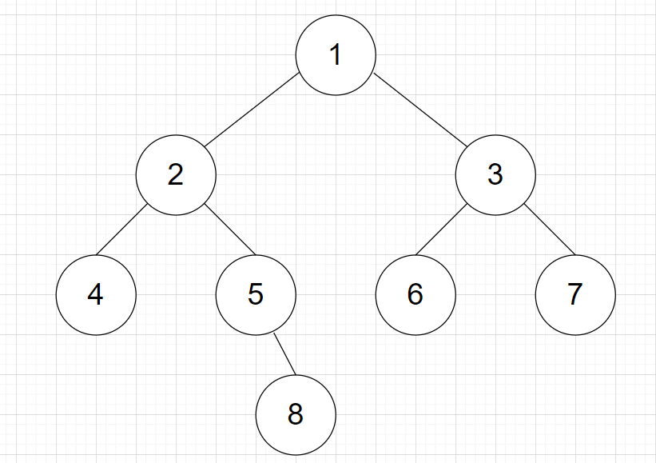
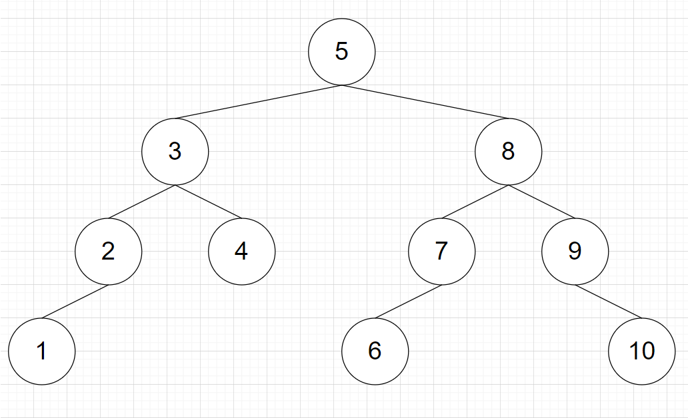
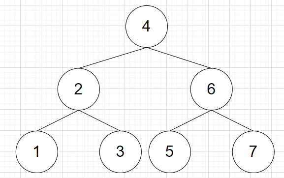
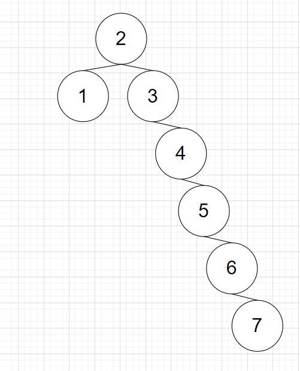

# Tree

- Tree
  - 계층형 트리 구조를 시뮬레이션하는 추상 자료형(ADT)으로, 루트 값과 부모-자식 관계의 서브트리로 구성되며, 서로 연결된 노드의 집합이다.
  - 하나의 뿌리에서 뻗어나가는 형상처럼 생겨 트리라는 명칭이 붙었다.
    - 트리 구조를 표현할 때는 일반적인 나무의 형상과는 반대 방향으로 표현한다.
    - 즉, 최상단에 루트가 있다.
  - 트리의 특징
    - 재귀로 정의된(Recursively Defined) 자기 참조(Self-Referential) 자료구조이다. 즉, 트리는 자식도 트리고 그 자식토 트리이며, 여러 개의 트리가 모여 큰 트리가 된다.
    - 트리는 항상 단방향이기 때문에 간선의 화살표는 생략 가능하다.
    - 일반적으로 방향은 위에서 아래로 향하며 루트를 level 0로 둔다.
    - V개의 정점을 가진 트리는 V-1개의 간선을 가진다.
    - 임의의 두 정점을 연결하는 simple path(정점이 중복해서 나오지 않는 경로)가 유일하다.
  - 명칭
    - Root: 트리의 시작을 의미한다.
    - Leaf: 자식이 없는 정점을 의미한다.
    - Parent: 직접 연결된 두 노드에서 상위에 위치한 노드
    - Child: 직접 연결된 두 노드에서 하위에 위치한 노드
    - Degree: 자식 노드의 개수를 의미한다.
    - Size: 자신을 포함한 모든 자식 노드의 개수를 의미한다.
    - Height: 현재 위치에서부터 Leaf까지의 거리
    - Depth: 루트에서부터 현재 노드까지의 거리
  - 그래프와 트리
    - 트리는 그래프의 일종이다.
    - 트리는 그래프와 달리 순환 구조를 갖지 않는다.
    - 트리는 그래프와 달리 항상 단방향이다.
    - 트리에서 자식 노드는 항상 하나의 부모 노드만을 갖는다.
    - 트리에서 루트는 반드시 하나만 존재한다.


- 트리의 종류
  - m-ary 트리(다항 트리, 다진 트리)
    - 각 노드가 m개 이하의 자식을 갖고 있는 트리
  - 이진 트리
    - m-ary 트리에서 m=2일 경우, 즉 모든 노드의 차수가 2 이하인 트리.
    - 이진 트리는 왼쪽과 오른쪽 최대 2개의 자식을 갖는 매우 단순한 형태이다.
    - 대부분 트리라고 하면 이진 트리를 일컫는다.
  - 이진 트리 유형(Types of Binary Trees)
    - Full Binary Tree(정 이진 트리): 모든 노드가 0개 또는 2개의 자식 노드를 갖는다.
    - Complete Binary Tree(완전 이진 트리): 마지막 레벨을 제외하고 모든 레벨이 완전히 채워져 있으며, 마지막 레벨의 모든 노드는 가장 왼쪽에서부터 채워져 있는 트리
    - Perfect Binary Tree: 모든 노드가 2개의 자식 노드를 갖고 있으며, 모든 리프 노드가 동일한 깊이 또는 레벨을 갖는 트리.


- 트리 순회
  - BFS
    - 인접한 정점 중 부모만 제외하고 전부 queue에 넣은 후 방문하는 방식을 사용한다.
    - 부모를 제외하는 이유는 부모는 이미 탐색을 완료 했을 것이기 때문이다.
    - BFS를 사용하여 트리를 순회하면 각 정점을 높이 순으로 방문하게 된다.
  - DFS
    - DFS를 사용하여 트리를 순회하면 각 정점을 leaf에 도달할 때 까지 방문한 뒤 다시 돌아와 다른 노드를 방문한다.


- 이진 트리 순회

  

  - 이진 트리의 표현
    - 이진 트리의 경우 왼쪽 자식과 오른쪽 자식을 구별해야 할 때가 종종 있어 아래와 같은 방식으로 표현하면 편리하다.
    - `lc`이 왼쪽 자식의 번호를 저장할 배열, `rc`는 오른쪽 자식의 번호를 저장할 배열이다.
    - 인덱스가 정점의 번호를 나타내며, 값이 0일 경우 해당하는 자식이 없다는 뜻이다.

  ```python
  lc = [0, 2, 4, 6, 0, 0, 0, 0, 0]
  rc = [0, 3, 5, 7, 0, 8, 0, 0, 0]
  ```

  - 전위 순회(Preorder Traversal)
    - 현재 정점 방문 - 왼쪽 서브 트리 전위 순회, 오른쪽 서브 트리 전위 순회 순서로 탐색한다.
    - DFS와 순회 순서가 동일하여, DFS를 통해 구현할 수 있다.

  ```python
  def preorder_traversal(root):
      if root == 0:
          return
      visited.append(root)
      preorder_traversal(lc[root])
      preorder_traversal(rc[root])
  
  lc = [0, 2, 4, 6, 0, 0, 0, 0, 0]
  rc = [0, 3, 5, 7, 0, 8, 0, 0, 0]
  visited = []
  preorder_traversal(1)
  print(visited)			# [1, 2, 4, 5, 8, 3, 6, 7]
  ```

  - 전위 순회 예시
    - 위 그래프를 예로 들자면, 먼저 1번 정점을 방문한다.
    - 그 후 왼쪽 전위 순회를 해야 하므로 2번 정점을 루트로 하는 서브 트리를 방문한다.
    - 또 다시 왼쪽 전위 순회를 해야 하므로 4번 정점을 방문한다.
    - 다시 왼쪽 전위 순회를 해야 하는데, 4번 정점에는 왼쪽 서브 트리가 없다.
    - 다음 순서인 오른쪽 전위 순회를 해야 하는데, 4번 정점에는 오른쪽 서브 트리도 없다.
    - 2로 돌아가 오른쪽 전위 순회를 진행하여 5번 정점을 방문한다.
    - 5번 정점에는 왼쪽 서브 트리가 없으므로 오른쪽 서브 트리로 진행한다.
    - 8은 왼쪽, 오른쪽 서브트리가 없으므로 이제 1로 돌아간다.
    - 1의 오른쪽 서브 트리의 루트인 3을 방문한다.
    - 3의 왼쪽 서브 트리의 루트인 6을 방문한다.
    - 6은 리프이므로 서브 트리가 없다.
    - 3으로 돌아가고 오른쪽 서브 트리의 루트인 7을 방문한다.
    - 7은 리프이므로 서브 트리가 없다.
    - 모든 정점을 순회했으므로 순회를 종료한다.
    - 방문 순서는 `[1, 2, 4, 5, 8, 3, 6, 7]`이 된다.

  - 중위 순회(Inorder Traversal)
    - 왼쪽 서브 트리 중위 순회 - 현재 정점 방문 - 오른쪽 서브트리 중위 순회순서로 탐색한다.
    - 중위 순회 역시 재귀를 통해 구현 가능하다.

  ```python
  def inorder_traversal(root):
      if root == 0:
          return
      inorder_traversal(lc[root])
      visited.append(root)
      inorder_traversal(rc[root])
  
  lc = [0, 2, 4, 6, 0, 0, 0, 0, 0]
  rc = [0, 3, 5, 7, 0, 8, 0, 0, 0]
  visited = []
  inorder_traversal(1)
  print(visited)			# [4, 2, 5, 8, 1, 6, 3, 7]
  ```

  - 후위 순회(Postorder Traversal)
    - 왼쪽 서브 트리 후위 순회 - 오른쪽 서브 트리 후위 순회 - 현재 정점 방문 순서로 탐색한다.
    - 마찬가지로 재귀로 구현이 가능하다.

  ```python
  def postorder_traversal(root):
      if root == 0:
          return
      postorder_traversal(lc[root])
      postorder_traversal(rc[root])
      visited.append(root)
      
  lc = [0, 2, 4, 6, 0, 0, 0, 0, 0]
  rc = [0, 3, 5, 7, 0, 8, 0, 0, 0]
  visited = []
  postorder_traversal(1)
  print(visited)          # [4, 8, 5, 2, 6, 7, 3, 1]
  ```


## Binary Search Tree

- 이진 탐색 트리

  - 왼쪽 서브 트리의 모든 값은 부모의 값 보다 작고, 오른쪽 서브 트리의 모든 값은 부모의 값 보다 큰 이진 트리를 의미한다.
  - 예시
    - 아래 트리는 모든 노드의 차수가 2 이하이므로 이진 트리이다.
    - 아래 트리에서 왼쪽 서브 트리의 모든 값은 부모의 값 보다 작고, 오른쪽 서브 트리의 모든 값은 부모의 값 보다 크다.
    - 따라서 아래 트리는 이진 탐색 트리이다.

  


- 이진 탐색 트리의 시간복잡도

  - 삽입, 조회, 수정, 삭제가 모두 O(lg N)에 가능하다(N은 tree의 높이이다).

    - 배열의 경우 삽입은 맨 마지막에 추가하면 되니 O(1)이지만, 조회, 수정, 삭제는 모두 O(N)이다.
    - 모든 연산이 O(1)에 가능한 hash의 하위호환이라 생각할 수도 있지만 그렇지 않다.
    - 이진 탐색 트리는 hash와 달리 원소가 크기 순으로 정렬된다는 특징을 가지고 있어 N보다 크거나 작인 최초의 원소를 O(lg N)에 찾을 수 있다.
    - 즉, 원소의 조회, 수정, 삭제가 빈번하면서 원소의 대소와 관련된 연산을 해야 할 경우 이진 탐색 트리를 사용하는 것이 좋다.

  - 삽입

    - 이진 탐색 트리에서의 삽입 과정

    - 값이 50인 root node가 있을 때, 15를 삽입한다면, 15는 50보다 작으므로 root node의 왼쪽에 삽입한다.
    - 다음으로 20을 삽입하려 하는데, 20 역시 50보다 작으므로 왼쪽에 삽입하려 한다.
    - 그런데 이미 왼 쪽에는 15가 있으므로 바로 삽입할 수는 없고 20과 15의 대소를 비교한다.
    - 20은 15보다는 크므로 20의 오른쪽에 삽입한다.
    - 이러한 과정을 거쳐 삽입이 이루어진다.

  - 조회

    - 위 예시에서 값이 4인 노드를 찾으려고 한다고 가정해보자.
    - 4는 root node인 5보다 작으므로 왼쪽 서브트리에 있을 것이다.
    - 4는 왼쪽 서브 트리의 root인 3보다는 크므로 오른쪽에 있을 것이다.
    - 찾으려는 노드를 찾았으므로 탐색을 종료한다.

  - 삭제

    - 그냥 삭제할 경우 트리 구조가 깨지므로 주의해야한다.
    - 자식이 없는 정점의 경우 그냥 지워도 문제가 되지 않는다.
    - 자식이 1개인 정점을 지우는 것도 상대적으로 간단한데, 지우려는 정점을 지운 후 자식 정점을 지워진 정점의 위치에 놓으면 끝이다.
    - 반면에 자식이 2개인 정점을 지우기 위해서는 적절한 정점을 선택하여 지워진 정점의 위치에 놓는 것이다.
    - 이 때, 지워진 정점 보다 크면서  가장 작은 값을 가지는 정점을 선택하거나, 지워진 정점 보다 작으면서 가장 큰 값을 가지는 정점을 선택하면 된다.
    - 예를 들어 위 예시에서 3번 정점을 삭제하려 한다면, 3보다 작으면서 가장 큰 2를 3번 정점 위치로 올리거나, 3보자 크면서 가장 작은 4를 3번 정점 위치로 올리면 이진 탐색 트리의 구조가 유지된다.
    - 그런데, 만약 2 또는 4가 2개의 자식을 가지고 있다면 어떻게 되는가?
    - 사실 그런 상황 자체가 만들어질 수 없다.
    - 만약 2에게 1 이외에 오른쪽 자식이 있었다면, 2보다 크면서 3보다는 작은 값일 텐데, 그렇다면 대체 정점으로 2가 선택되지 못한다.
    - 마찬가지로 4에게 자식 둘이 있었다면 왼쪽 자식은 3보다 크고 4보다 작은 값이 들어가게 될 텐데, 이 경우 역시 대체 정점으로 4가 선택되지 못한다.


- 자가 균형 트리(Self-Balancing Tree)

  - 이진 탐색 트리의 시간 복잡도는 각 정점의 자식의 수에 따라 정해진다.
    - 만약 각 정점이 대부분 2개씩 가지고 있다면 높이가 하나 증가할 때 마다 정점의 개수는 2배씩 늘어나기 때문에 시간 복잡도가 O(lg N)에 가까워진다.
    - 반면에 각 정점이 대부분 1개씩 가지고 있다면 시간복잡도는 O(N)에 가까워진다.
    - 즉, 아래와 같이 같은 개수의 정점이라도, 자식을 몇 개씩 가지고 있는가에 따라 높이가 달라지게 된다.
    - 아래 두 이진 탐색 트리는 같은 정점의 개수를 가지고 있지만, 위는 높이가 3, 아래는 높이가 6이다.
    - 따라서 트리가 편향되었다면, 연결 리스트를 사용하는 것과 별반 차이가 없어지게 된다.

  

  

  - 그러므로 이진 검색 트리가 편향 될 경우 이를 해결해줘야하는데, 이를 해결한 트리를 자가 균형 트리라 부른다.
    - AVL Tree, Red Black Tree 등이 자가 균형 트리이다.
    - 구현은 AVL Tree가 약간 더 쉽고, 성능은 Red Black Tree가 더 좋아서 Red Black Tree를 주로 사용한다.


# 에라스토테네스의 체

- 에라스토테네스의 체

  - 소수(prime number)를 판별하는데 사용하는 알고리즘이다.
    - 고대 그리스의 수학자 에라스토테네스가 발견하였다.
    - 체 처럼 소수가 아닌 수 들을 걸러낸다.
  - 알고리즘
    - 2부터 소수를 구하고자 하는 구간의 모든 수를 나열한다.
    - 나열한 수를 앞에서부터 탐색해 나간다.
    - 첫 수인 2는 소수이므로 소수라는 표시를 한다.
    - 나열 된 숫자들에서 2의 배수인 것들은 모두 소수가 아니라는 표시를 한다.
    - 3은 표시가 되어 있지 않고, 소수이므로 소수라는 표시를 한다.
    - 나열 된 숫자들에서 3의 배수인 것들은 모두 소수가 아니라는 표시를 한다.
    - 4는 소수가 아니라는 표시가 되어 있으므로 넘어간다.
    - 5는 표시가 되어 있지 않고, 소수이므로 소수라는 표시를 한다.
    - 나열 된 숫자들에서 5의 배수인 것들은 모두 소수가 아니라는 표시를 한다.
    - 이를 모든 수에 대해 반복한다.
  - 구현

  ```python
  def prime_list(n):
      # 에라토스테네스의 체 초기화: n개 요소에 True 설정(소수로 간주)
      sieve = [True] * n
  
      # n의 최대 약수가 sqrt(n) 이하이므로 i=sqrt(n)까지 검사
      m = int(n ** 0.5)
      for i in range(2, m + 1):
          if sieve[i] == True:           # i가 소수인 경우
              for j in range(i+i, n, i): # i이후 i의 배수들을 False 판정
                  sieve[j] = False
  
      # 소수 목록 산출
      return [i for i in range(2, n) if sieve[i] == True]
  ```

  - 주의사항

    > [참고](https://nahwasa.com/entry/%EC%97%90%EB%9D%BC%ED%86%A0%EC%8A%A4%ED%85%8C%EB%84%A4%EC%8A%A4%EC%9D%98-%EC%B2%B4-%ED%98%B9%EC%9D%80-%EC%86%8C%EC%88%98%ED%8C%90%EC%A0%95-%EC%8B%9C-%EC%A0%9C%EA%B3%B1%EA%B7%BC-%EA%B9%8C%EC%A7%80%EB%A7%8C-%ED%99%95%EC%9D%B8%ED%95%98%EB%A9%B4-%EB%90%98%EB%8A%94-%EC%9D%B4%EC%9C%A0)

    - n까지의 소수 판별시에 n의 제곱근까지만 확인하면 된다(위 코드에서도 `n ** 0.5`까지만 확인했다).
    - n은 자연수 a, b에 대해 `n = a * b`라고 표현할 수 있다.
    - 또 n의 제곱근 m에 대해 `n = m * m`라고 표현할 수 있다.
    - 따라서, `a * b = m * m`이라 할 수 있다.
    - 이 때, a, b는 자연수여야하므로, a, b가 자연수임을 만족하는 경우는 아래의 세 가지 경우 뿐이다.
    - `a=m & b=m`, `a<m & b>m`, `a>m & b<m`
    - 즉, `min(a, b)<=m`이라고 할 수 있다.
    - N의 약수에 해당하는 a와 b 중 하나는 무조건 m 이하이므로, m까지만 조사하면 n이 소수인지 알 수 있게 된다.


# 연결리스트

- Array와 list

  > 자료구조로서의 array, list와 프로그래밍 언어에서의 array, list를 분리해서 생각해야한다.
  >
  > 예를 들어 C의 영향으로 array는 길이를 변경할 수 없다고 생각하지만, 자료구조로서의 array는 단순히 메모리상에 원소를 연속하여 배치한 구조로, 길이를 변경하지 못할 이유가 없다.

  - array
    - 일반적으로 배열이라 번역되는 array는 메모리상에 원소를 연속하게 배치한 자료구조이다.
    - 메모리상에 연속적으로 배치하므로, index를 사용하여 k번째 원소를 상수 시간에 찾는 것이 가능하다.
    - 추가적으로 소모되는 메모리의 양(overhead)가 거의 없다.
    - 메모리상에 연속된 구간에 할당해야하므로 할당에 제약이 존재한다(C는 이러한 제약을 극복하기 위해 array의 길이를 변경하지 못하게 설계됐다).
    - Cache hit rate가 높다.
  - array의 시간복잡도
    - index를 알고 있을 경우 해당 index에 해당하는 값에 접근하는 것과 변경하는 것의 시간복잡도는 O(1)이다.
    - 임의의 위치에 자료를 추가하거나 삭제하는 연산의 시간복잡도는 O(n)이다. 추가, 삭제 이후 element들을 한 칸씩 당기거나 밀어야 하기 때문이다.
    - array의 마지막에 원소를 추가, 삭제하는 경우의 시간복잡도는 O(1)이다.

  - list
    - 메모리상에 원소를 불연속적으로 배치한 자료구조이다.
    - 메모리상에 원소를 불연속적으로 배치하므로 index를 통한 접근이 불가능하다.
    - 배열과 유사한 역할을 하지만 차이가 있다면 빈 element를 허용하지 않는다는 것이다.
    - 빈틈없는 데이터의 적재가 가능해 낭비되는 메모리가 거의 없다.
    - 배열과 마찬가지로 원소들 사이의 순서가 존재하며, 또한 배열과 마찬가지로 중복을 허용한다.
    - 연속되어 배치되지 않으므로 Cache hit rate가 낮다.


- 연결리스트
  - 데이터 요소의 선형 집합으로, 데이터의 순서가 물리적인 순서대로 저장되지 않는다.
    - 컴퓨터과학에서 배열과 함께 가장 기본이 되는 대표적인 선형 자료구조 중 하나로 다양한 추상 자료형(Abstract Data Type, ADT) 구현의 기반이 된다.
    - 동적으로 새로운 노드를 삽입하거나 삭제하기가 간편하며, 연결 구조를 통해 물리 메모리를 연속적으로 사용하지 않아도 되기 때문에 관리도 쉽다.
  - 랜드 연구소에서 근무하던 앨런 뉴얼이 동료들과 함께 만든 언어인 IPL의 기본 자료구조로 처음 사용됐다.
  - 연결 리스트의 성질
    - 배열과는 달리 특정 인덱스에 접근하기 위해서는 전체를 순서대로 읽어야하므로 상수 시간에 접근할 수 없다.
    - 메모리상에 연속되어 배치되지 않으므로 cache hit rate가 낮다.
    - 각 원소가 다음 원소, 혹은 이전과 다음 원소의 주소값을 가지고 있어야하므로, 추가적인 메모리 공간(overhead)이 요구된다. 
    - 예를들어 32비트 컴퓨터면 주소값이 32비트(=4바이트) 단위이니 4N 바이트가 추가로 필요하고, 64비트 컴퓨터라면 주소값이 64비트(=8바이트) 단위이니 8N 바이트가 추가로 필요하게 된다. 즉 N에 비례하는 만큼의 메모리를 추가로 쓰게 된다.'
  - 시간 복잡도
    - 탐색과 변경에는 O(n)이 소요된다.
    - 반면, 시작 또는 끝 지점에 아이템을 추가, 삭제, 추출하는 작업은 상수 시간에 가능하다.
    - 시작 또는 끝 지점이 아닌 임의의 공간에 추가와 삭제를 하는 경우 추가 또는 삭제 할 곳의 주소를 알고 있을 때에만 O(1)이다.
    - 예를 들어 1->34->17->22와 같은 연결 리스트가 있을 때, 세 번째 원소 뒤에 61을 추가하려 한다면 이는 상수 시간 내에는 불가능하다.
    - 세 번째 원소가 어디인지를 찾는데 시간이 소요되기 때문이다.
    - 단, 주소를 알고 있을 경우에는 단순히 추가하려는 원소 앞의 원소가 가리키는 주소를 추가한 원소의 주소로 바꾸고, 추가한 원소가 가리키는 주소를 뒤의 원소로 바꿔주기만 하면 된다.


- 연결 리스트의 종류
  - 단일 연결 리스트(Singly linked list)
    - 각 원소가 다음 원소의 주소를 가지고 있는 연결 리스트
  - 이중 연결 리스트(Doubly linked list)
    - 각 원소가 자신의 다음 원소의 주소와 이전 원소의 주소를 가지고 있는 연결 리스트
    - 이전 원소의 정보를 알 수 있다는 장점이 있지만, 단일 연결 리스트에 비해 추가적인 메모리가 필요하다는 단점이 있다.
  - 원형 연결 리스트(Circular linked list)
    - 처음 원소와 마지막 원소가 연결되어 있는 연결 리스트
    - 단일 연결 리스트이면서 원형 연결 리스트일 수도, 이중 연결 리스트이면서 원형 연결 리스트일 수도 있다.


- Floyd's cycle finding algorithm(Hare-Tortoise algorithm)

  - 단일 연결 리스트에 cycle이 존재하는지를 판별하는 알고리즘이다.

    - 거치는 모든 노드를 저장 할 필요 없이, 포인터 두 개만 있으면 되므로 공간복잡도 O(1)에 해결이 가능하다.
    - 시간 복잡도는 O(n)이다.

  - 방식

    - 한 칸씩 전진하는 포인터(slow pointer, tortoise)와 두 칸씩 전진하는 포인터(fast pointer, hare)를 동일한 시작점에서 출발시킨다.
    - 만일 연결 리스트에 순환이 존재할 경우 두 포인터는 반드시 만나게 된다.
    - 만약 순환이 존재하지 않을 경우 fast pointer가 연결리스트의 끝에 도달하게 된다.

  - 이를 사용하여 cycle의 시작점을 찾을 수도 있다.

    - 한 칸씩 전진하는 포인터(slow pointer, tortoise)와 두 칸씩 전진하는 포인터(fast pointer, hare)를 동일한 시작점에서 출발시킨다.
    - 두 포인터가 만나게 되면 둘 중 한 포인터를 시작점으로 돌려보낸다.
    - 이제 두 포인터 모두 한 칸씩 전진시키면, 두 포인터가 만나는 지점이 순환의 시작점이다.

  - cycle의 시작점을 찾는 원리

    - y는 두 포인터의 시작점부터 순환의 시작점까지의 거리이다.
    - z는 순환의 시작점부터 두 포인터가 만나는 지점까지의 거리이다.
    - l는 순환의 길이이다.
    - f는 fast pointer가 순환을 돈 횟수, s는 slow pointer가 순환을 돈 횟수이다.
    - $x_n$은 연결 리스트의 n번째 노드이다.
    - $x_i$는 두 포인터가 만나는 노드이다.
    - $x_j$는 순환 내부에 있는 노드이며, 순환 내부에 있는 노드 $x_j$에 대해 아래의 공식이 성립한다. 즉, node가 순환 내에 존재한다면 몇 순환을 몇 번 돌아도 같은 지점에 도착하게 된다.

    $$
    x_{j+kl} = x_j\ \ (j \geλ\ and \ k\ge0)
    $$

    

    - 이 때 두 포인터가 만날 때 까지 slow pointer가 이동한 거리 i는 아래와 같다.

    $$
    i = y+(s*l)+z
    $$

    - fast pointer는 slow pointer의 두 배씩 이동하므로, 두 포인터가 만날 때 까지 fast pointer가 이동한 거리 2i는 아래와 같다.

    $$
    2i = y+(f*l)+z
    $$

    - 2i에서 i를 빼면 아래와 같다.

    $$
    i = (f-s)l
    $$

    - 이제 첫 번째 식에서 j에 y를 대입한다.
    - y는 연결 리스트의 시작점부터 순환의 시작점까지의 거리이므로, $x_y$가 가리키는 node는 순환이 시작되는 node이고, 따라서 순환 내부에 있는 node라 할 수 있다.
    - 그 다음 k값에는 fast pointer가 순환을 돈 횟수에서 slow pointer가 순환을 돈 횟수를 뺀 f-s를 대입하면 식은 아래와 같다.

    $$
    x_{y+(f-s)l} = x_y
    $$

    - 여기서 우리는 `(f-s)l`의 값이 i라는 것을 알고 있으므로, 식은 아래와 같이 변경될 수 있다.

    $$
    x_{y+i}=x_y
    $$

    - 즉 두 포인터가 만나는 지점($x_i$)에서 y만큼 이동하면 사이클이 시작되는 지점($x_{y+i}$)로 돌아갈 수 있다.

  - Runner technique

    - 두 개의 pointer를 동일한 시작점에서 서로 다른 속도로 출발시킨다는 아이디어로 다양한 문제 해결이 가능하다.
    - 예를 들어 cycle이 없는 연결 리스트에서 fast pointer가 끝에 도달하면, slow list는 중간 지점에 도달하게 되는데, 이를 사용하여 회문 판별등을 할 수 있다.