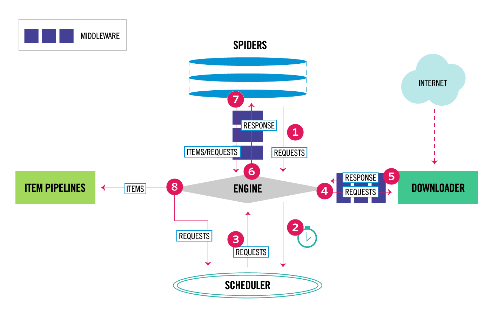

# scrapy

- scrapy

  - 웹 크롤링을 위한 python 패키지
    - python으로 작성되었다.
    - spider를 작성해서 크롤링을 한다.
    - 프레임워크에 가깝다.
    - 오픈소스로 개발되었다.

  - 장점
    - 각 기능들을 spider, item, pipeline, selector 등으로 모듈화하여 유지 보수가 쉽다.
    - 비동기 요청으로 크롤링을 하기 때문에 하나의 요청에 에러가 발생하더라도 나머지 요청은 계속해서 처리 된다. 

  - beautiful soup과 비교
    - beautiful soup은 자체적으로 웹 사이트를 크롤링 할 수 없다.
    - `urlib2`와 `requests`를 사용하여 HTML 소스를 가져와야만 한다.

  |          | Beautiful Soup                          | Scrapy                               |
  | -------- | --------------------------------------- | ------------------------------------ |
  | 진입장벽 | 쉽다                                    | 비교적 어렵다                        |
  | 자료량   | 부족하다                                | 많다                                 |
  | 확장성   | 확장성이 낮다.                          | middlware를 커스터마이징 할 수 있다. |
  | 성능     | multiprocessing을 사용하면 매우 빠르다. | 빠른 편이다.                         |


- scrapy의 아키텍처

  

  - 모든 동작은 Engine에  의해 통제된다.
  - 동작 과정
    - Engine은 Spider로부터 크롤링을 위한 최초의 요청을 받는다.
    - Engine은 Scheduler에서 요청을 스케줄링하며, 다음으로 크롤링할 요청에 대한 정보를 Scheduler에게 받는다.
    - Scheduler는 다음 요청에 대한 정보를 Engine에 넘겨준다.
    - Engine은 받은 요청 정보를 Downloader Middlewares를 통해Downloader에게 넘겨준다.
    - 한 페이지에 대한 다운로드가 종료되면 Downloader는 해당 페이지를 응답에 넣어서 Downloader Middlewares를 통해 Engine에 전송한다.
    - Engine은 Downloader로부터 받은 응답을 Spider Middlewares를 통해 Spider에게 전송한다.
    - Spider는 해당 응답을 처리하고 스크랩된 내용과 새로운 요청을 Spider Middlewares를 통해 Engine에 전송한다.
    - Engine은 Spider로 부터 받은 스크랩된 내용을 Item Pipelines에 전송하고, 요청은 Scheduler에 보내 다음 요청을 처리할 수 있는지 물어본다.
    - Scheduler에 더 이상 요청이 존재하지 않을 때 까지 위 과정이 반복된다.


- scrapy 프로젝트 생성하기

  -  scrapy 설치

  ```bash
  $ pip install scrapy