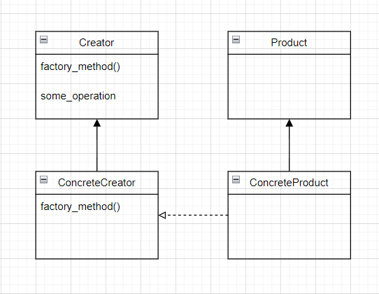
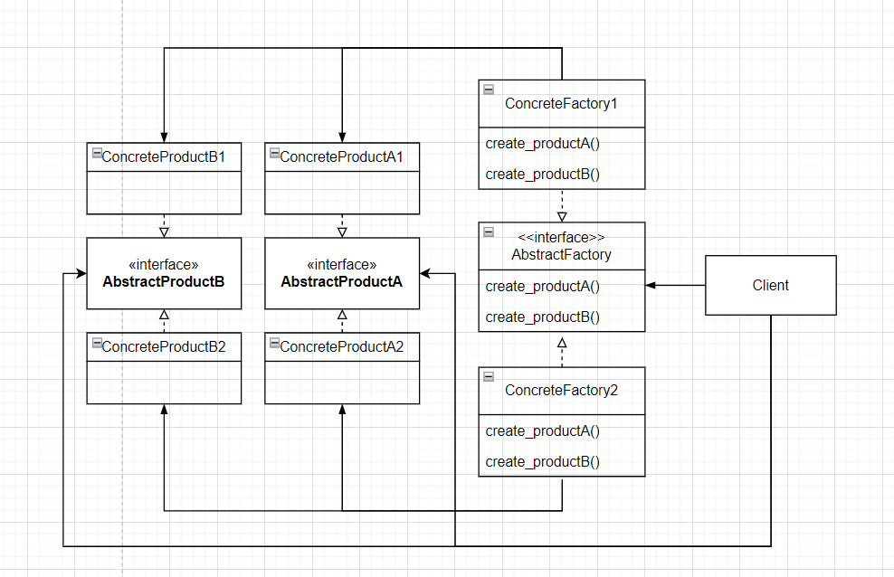

# 팩토리 패턴

- 최첨단 피자 코드 만들기

  - 피자 생성 코드
    - 여기서의 `Pizza`는 인터페이스가 아닌 구상 클래스이다.

  ```python
  def order_pizza():
      pizza = Pizza()
      
      pizza.prepare()
      pizza.bake()
      pizza.cut()
      pizza.box()
      return pizza
  ```

  - Pizza의 종류가 하나만 있는 것은 아니므로, 피자의 종류마다 다른 처리를 해줘야 한다.
    - `type_` parameter로 피자의 종류를 받는다.
    - 이제 `Pizza`를 추상 클래스를 생성하고, 이를 구현하는 `CheesePizza`등의 여러 구상 클래스를 생성한다.
    - `type_`을 바탕으로 어떤 구상 클래스의 인스턴스를 생성할지를 결정한다.

  ```python
  def order_pizza(type_):
      pizza = None
      if type_ == "cheese":
          pizza = CheesePizza()
      elif type_ == "greek":
          pizza = GreekPizza()
      elif type_ == "Pepperoni":
          pizza = PepperoniPizza()
      
      pizza.prepare()
      pizza.bake()
      pizza.cut()
      pizza.box()
      return pizza
  ```
  
  - 신메뉴를 추가해야 한다.
    - `GreekPizzar`를 제외하고 `VeggiePizza`와 `ClamPizza`가 추가되어야 한다.
  
  ```py
  def order_pizza(type_):
      if type_ == "cheese":
          pizza = CheesePizza()
      # elif type_ == "greek":
      #     pizza = GreekPizza()
      elif type_ == "pepperoni":
          pizza = PepperoniPizza()
      elif type_ == "veggie":
          pizza = VeggiePizza()
      elif type_ == "clam":
          pizza = ClamPizza()
      
      pizza.prepare()
      pizza.bake()
      pizza.cut()
      pizza.box()
      return pizza
  ```
  
  - 문제점
    - `type_`을 가지고 분기를 줘서 인스턴스를 생성할 구상 클래스를 바꾸는 부분은 변화에 닫혀 있지 않다.
    - 피자가 추가, 삭제 될 때 마다 지속적으로 변경이 필요하다.
    - 또한 "구현에 의존하지 말고 인터페이스에 의존해야한다"는 디자인 원칙에 위반된다.
  
  - 바뀌는 부분(`type_`을 가지고 인스턴스를 생성할 구상 클래스를 분기하는 부분)을 확인했으니, 캡슐화를 할 차례다.
    - 즉, 이 코드의 경우 인스턴스를 생성하는 부분을 캡슐화해야 한다.


- 팩토리(Factory)

  - 객체 생성을 처리하는 클래스를 팩토리라 부른다.
    - 클라이언트로부터 요청을 받아 새로운 객체를 생성하고 반환하는 역할을 한다.
    - 위 예시를 기반으로 설명하면 다음과 같다.
    - Factory를 생성하고, 클라이언트인 `order_pizza()` 메서드가 실행될 때 마다 `Pizza` 인터페이스를 구현한 구상 클래스를 생성하고, 이를 반환해준다.
    - 클라이언트인 `order_pizza()`는 factory로부터 구상 클래스를 전달받아 `Pizza` 인터페이스에 구현된 `prepare()`, `bake()` 등의 메서드만 실행시킨다.
  - 결국 문제를 다른 객체에 떠넘기는 것 아닌가?
    - 위 예시에서는 `order_pizza()`만 살펴봤지만, `show_ingredients()` 등 pizza 인스턴스가 필요한 수 많은 메서드가 있을 수 있다.
    - 만일 팩토리 한 곳에 위임해서 처리하지 않고, 모든 메서드에서 객체의 생성을 위와 같이 관리한다면, 수정사항이 있을 때 마다 모든 코드를 다 변경해줘야한다.
  - 객체 생성 팩토리 만들기

  ```python
  class SimplePizzaFactory:
      def create_pizza(type_):
          pizza = None
          if type_ == "cheese":
              pizza = CheesePizza()
          elif type_ == "pepperoni":
              pizza = PepperoniPizza()
          elif type_ == "veggie":
              pizza = VeggiePizza()
          elif type_ == "clam":
              pizza = ClamPizza()
          return pizza
  ```

  - 클라이언트 코드 수정하기

  ```python
  class PizzaStore:    
      def __init__(self, factory):
          factory = factory
      
      def order_pizza(self, type_):
          pizza = factory.create_pizza(type_)
          
          pizza.prepare()
          pizza.bake()
          pizza.cut()
          pizza.box()
          return pizza
      
  pizza_store = PizzaStore(SimplePizzaFactory())
  pizza = pizza_store.order_pizza()
  ```

  - 이점
    - `order_pizza()`는 더 이상 구상 클래스에 의존하지 않는다.
    - 새로운 피자의 추가, 삭제가 일어날 때에도 factory의 코드만 변경하면 된다.

  - Simple factory란 디자인 패턴이라기 보다는 프로그래밍에서 자주 쓰이는 관용구에 가깝다.
    - 워낙 자주 쓰이다 보니 simple factory를 factory pattern이라 부르는 사람들도 있다.
    - 그럼에도 simple factory는 정확히는 패턴은 아니다.
  - Static factory란
    - 정적 메서드를 사용하여 객체를 생성하는 factory를 의미한다.
    - Java에서 static 메서드는 해당 메서드가 포함된 클래스의 인스턴스를 생성하지 않아도 실행시킬 수 있는 메서드를 의미한다.
    - 정적 메서드를 사용하는 이유는 객체 생성을 위해 factory 클래스의 인스턴스를 만들지 않아도 돼서 보다 간편하게 객체를 생성할 수 있기 때문이다.
    - 다만, 서브클래스를 만들어 객체 생성 메서드의 행동을 변경할 수 없다는 단점이 있다.


- 다양한 팩토리 만들기

  - 피자 가게가 성장하면서 각 지역마다 지점을 내기로 했다.
    - 각 지역의 특성을 반영한 다양한 스타일의 피자를 출시하려 한다.
  - 각 피자 스타일별로 팩토리를 하나씩 생성하기로 한다.
    - 본사에서는 각 지역 스타일에 맞는 피자를 생성해주는 factory만 구현해준다.
    - 그리고 모든 지점에서 동일한 과정을 거쳐 피자를 만들게 하기 위해서 `PizzaStore`를 참고하여 각 지점마다 `PizzaStore` 클래스를 만들도록했다.  
  
  ```python
  class NYPizzaFactory:
      def create_pizza(type_):
          pizza = None
          if type_ == "cheese":
              pizza = NYStyleCheesePizza()
          elif type_ == "pepperoni":
              pizza = NYStylePepperoniPizza()
          elif type_ == "veggie":
              pizza = NYStyleVeggiePizza()
          elif type_ == "clam":
              pizza = NYStyleClamPizza()
          return pizza
  
  class ChicagoPizzaFactory:
      def create_pizza(type_):
          pizza = None
          if type_ == "cheese":
              pizza = ChicagoStyleCheesePizza()
          elif type_ == "pepperoni":
              pizza = ChicagoStylePepperoniPizza()
          elif type_ == "veggie":
              pizza = ChicagoStyleVeggiePizza()
          elif type_ == "clam":
              pizza = ChicagoStyleClamPizza()
          return pizza
  
  
  ny_store = PizzaStore(NYPizzaFactory())
  pizza = ny_store.order_pizza()
  
  chicago_store = PizzaStore(ChicagoPizzaFactory())
  pizza = chicago_store.order_pizza()
  ```
  
  - 위 방식의 문제
    - 각 지점마다 Pizza를 생성하는 팩토리를 제대로 쓰긴 하는데, 정작 그 factory가 생성하는 instance로 피자를 생성하는 로직이 담긴 `PizzaStore`를 지점마다 구현하다보니 지점 사이에 차이가 생기게 된다.
    - 즉 지점마다 다른 조리법, 다른 포장 상자 등을 사용하기 시작한다.
    - 이는 `PizzaStore`와 피자 제작 코드가 서로 분리되어 있기 때문에 발생한다.
    - 따라서 유연성을 잃지 않으면서 이 둘을 하나로 묶어줄 방법이 필요하다.
  
  -  `create_pizza` 코드를 factory가 아닌 `PizzaStore` 클래스로 다시 넣는다.
    - 다만, 단순히 넣기만 하는 것이 아니라, 이를 추상 메서드로 선언하고, `PizzaStore`도 추상 클래스로 변경한다.
    - 아래와 같이 하위 클래스에 객체 생성을 위임하도록 하는 메서드를 팩토리 메서드라 한다.
  
  ```python
  from abc import *
  
  
  class PizzaStore(metaclass=ABCMeta):
      
      def order_pizza(self, type_):
          pizza = self.create_pizza(type_)
          
          pizza.prepare()
          pizza.bake()
          pizza.cut()
          pizza.box()
          
          return pizza
      
      @abstractmethod
      def create_pizza(self, type_):
          pass
  ```
  
  - 각 스타일별 서브 클래스를 생성한다.
    - `create_pizza()` 메서드는 추상 메서드로 선언했으므로, 서브 클래스들은 반드시 이 메서드를 구현해야한다. 
  
  ```python
  class NYStylePizzaStore(PizzaStore):
      def create_pizza(type_):
          pizza = None
          if type_ == "cheese":
              pizza = NYStyleCheesePizza()
          elif type_ == "pepperoni":
              pizza = NYStylePepperoniPizza()
          elif type_ == "veggie":
              pizza = NYStyleVeggiePizza()
          elif type_ == "clam":
              pizza = NYStyleClamPizza()
          return pizza
      
  
  class ChicagotylePizzaStore(PizzaStore):
      def create_pizza(type_):
          pizza = None
          if type_ == "cheese":
              pizza = ChicagoStyleCheesePizza()
          elif type_ == "pepperoni":
              pizza = ChicagoStylePepperoniPizza()
          elif type_ == "veggie":
              pizza = ChicagoStyleVeggiePizza()
          elif type_ == "clam":
              pizza = ChicagoStyleClamPizza()
          return pizza
  ```
  
  - 이제 피자의 종류는 어떤 서브클래스를 선택했느냐에 따라 결정된다.
    - 이제 `PizzaStore` 클래스의 `order_pizza()`메서드에서는 `Pizza` 객체를 가지고 피자를 준비하고, 굽고, 자르고, 포장하는 작업을 하지만, `Pizza`는 추상 클래스이므로 `order_pizza()` 메서드는 실제로 어떤 구상 클래스에서 작업이 처리되고 있는지 전혀 알 수 없다.
    - 즉, `PizzaStore`와 `Pizza`는 완전히 분리되어 있다.
    - `order_pizza()`에서 `create_pizza()`를 호출하면 `Pizza`의 서브클래스가 그 호출을 받아서 피자를 만들기에, `NYStylePizzaStore`에서 `order_pizza()`가 호출되면 뉴욕 스타일 피자가 만들어지고, `ChicagoStylePizzaStore`에서 `order_pizza()`가 호출되면 시카고 스타일 피자가 만들어진다.
    - 즉 서브 클래스에서 피자의 종류를 실시간으로 결정하는 것이 아니라, 어떤 서브클래스를 선택했느냐에 따라 피자의 종류가 결정되게 된다.
  
  - 결국 구상 클래스 인스턴스를 생성하는 일은 하나의 객체(simple factory)가 전부 처리하는 방식에서 일련의 서브 클래스가 처리하는 방식으로 바뀌었다.
  
  - Pizza class 만들기
    - 마지막으로 Pizza class와 그 서브 클래스를 만든다.
  
  ```python
  from abc import *
  
  
  class Pizza(metaclass=ABCMeta):
      def __init__(self):
          self.name = None
          self.dough = None
          self.sauce = None
          self.toppings = []
  
      def prepare(self):
          print("{} 피자 준비 중".format(self.name))
          print("도우를 돌리는 중")
          print("소스를 뿌리는 중")
          print("토핑을 올리는 중")
          for topping in self.toppings:
              print(topping)
  
      def bake(self):
          print("175도에서 25분 굽기")
  
      def cut(self):
          print("8등분으로 자르기")
  
      def box(self):
          print("상자에 피자 담기")
          
      def get_name(self, name):
          self.name = name
  
      def get_name(self):
          return self.name
  ```

  - Pizza의 구상 서브 클래스 만들기
  
  ```python
  class NYStyleCheesePizza(Pizza):
      def __init__(self):
          self.name = "뉴욕 스타일 소스와 치즈 피자"
          self.dough = "얇은 크러스트 도우"
          self.sauce = "마리나라 소스"
          self.toppings = ["잘게 썬 레지아노 치즈"]
      
      
  class ChicagoStyleCheesePizza(Pizza):
      def __init__(self):
          self.name = "시카고 스타일 딥 디쉬 치즈 피자"
          self.dough = "두꺼운 크러스트 도우"
          self.sauce = "플럼 토마토 소스"
          self.toppings = ["모짜렐라 치즈"]
      
      def cut(self):
          print("네모난 모양으로 자르기")
  ```


- 팩토리 메서드 패턴
  
  - 지금까지 살펴본 패턴이 팩토리 메서드 패턴이다.
    - 모든 팩터리 패턴은 객체 생성을 캡슐화한다.
    - 팩토리 메서드 패턴은 서브클래스에서 어떤 클래스를 만들지를 결정함으로써 객체 생성을 캡슐화한다.
  
  - 정의
    - 객체를 생성할 때 필요한 인터페이스를 만들고, 어떤 클래스의 인스턴스를 만들지는 서브클래스에서 결정하는 패턴이다.
    - 더 정확히 말하면 서브 클래스에서 결정되는 것이 아니라, 사용하는 서브클래스에 따라 생산되는 객체 인스턴스가 결정된다.
  
  
  
  - Creator 추상 클래스
    - 객체를 만드는 메서드(위 UML에서는 `factory_method()`), 즉 팩토리 매소드용 인터페이스를 제공한다.
    - 팩토리 메소드에 의해 생성된 구상 클래스의 인스턴스(예시의 경우 `ConcreteProduct`의 인스턴스)로 필요한 작업을 처리한다.
    - 그러나 실제 팩토리 메서드를 구현하고 구상 클래스의 인스턴스를 생성하는 일은 서브클래스에서만 할 수 있다.
  - 구상 생산자 클래스가 하나 뿐이라도 팩토리 메서드 패턴을 사용하는 것이 의미가 있는지?
    - 구상 생산자 클래스가 하나 뿐이더라도 팩토리 메서드 패턴은 유용하다.
    - 다른 `ConcreteCreator`가 추가되거나 변경되더라도, `Creator` 클래스가 `ConcreteProduct`와 느슨하게 결합되어 있으므로 `Creator`는 건드릴 필요가 없다.
  - `Creator` 클래스의 `factory_method()`는 꼭 추상 메서드로 선언해야 하는지, 혹은 `Creator` 클래스는 꼭 추상 클래스여야 하는지
    - 꼭 그럴 필요는 없다. 
    - 몇몇 간단한 `ConcreteProduct` 생성을 위해 일반 메서드로 정의해서 `ConcreteCreator`를 설정하지 않았을 때 실행될 기본 팩토리 메서드로 사용해도 된다.
    - 즉, 위 예시에서는 `factory_method()`가 추상 메서드이므로 서브 클래스에서 반드시 구현을 해야 한다.
    - 반면이 일반 메서드로 구현하면, 서브 클래스에서 반드시 구현을 하지 않아도 되고, 구현하지 않았을 경우(오버라이딩 하지 않았을 경우) `Creator`에 정의된 `factory_method()`가 실행된다.
    - 즉, `Creator` 클래스에서 `factory_method()`를 추상 메서드로 선언하지 않으면, 이를 기본 팩토리 메서드로 사용할 수 있다.
  - Simple Factory와의 차이
    - 팩토리 메서드 패턴은 얼핏 보기에는 simple factory와 거의 유사해보인다.
    - 그러나 팩토리 메서드 패턴은 simple factory와는 달리 생성할 `CreateProduct`를 보다 유연하게 변경할 수 있다.


- 의존성 역전 원칙(Dependency Inversion Principle)

  - 객체 인스턴스를 직접 만들면 구상 클래스에 의존해야한다.
    - 예를 들어 아래와 같이 초기의 `PizzaStore`코드의 경우 Pizza 구상 클래스가 변경되면 `PizzaStore`까지도 변경되어야한다.
    - 따라서 `PizzaStore`는 피자 클래스(`CheesePizza`, `GreekPizza` 등)에 의존한다고 할 수 있다.

  ```python
  class PizzaStore:
      def order_pizza(self, type_):
          pizza = None
          if type_ == "cheese":
              pizza = CheesePizza()
          elif type_ == "greek":
              pizza = GreekPizza()
          elif type_ == "Pepperoni":
              pizza = PepperoniPizza()
  ```

  - 의존성 역전 원칙이란 "구상 클래스에 의존하지 않게 하고 추상화된 것에 의존하게 한다"는 원칙이다.
    - "구현보다는 인터페이스에 맞춰 프로그래밍한다"는 원칙과 유사하지만, 이 원칙이 추상화를 더욱 강조한다.
    - 고수준 구성 요소가 저수준 구성 요소에 의존하면 안 되며, 항상 추상화에 의존하게 만들어야 한다는 뜻이 담겨 있다.
    - 고수준 구성 요소란 다른 저수준 구성 요소에 의해 정의되는 행동들이 들어있는 구성 요소를 뜻한다.
    - 예를 들어 `PizzaStore`의 행동은 피자에 정의된`bake()`, `cut()` 등을 사용하므로 `PizzaStore`는 고수준 구성 요소라고 할 수 있다.
  - 의존성 역전 원칙 적용하기
    - 위에서 살펴본 `PizzaStore`의 가장 큰 문제는 `PizzaStore`가 모든 종류의 피자에 의존한다는 점이다.
    - 이는 `order_pizza()` 메서드에서 구상 형식의 인스턴스를 직접 만들기 때문이다.
    - `Pizza`라는 추상 클래스를 만들긴 했지만, 구상 피자 객체를 생성하는 것은 아니기에, `Pizza`를 추상 클래스로 만들어 얻는 것이 별로 없다.
    - 따라서 `order_pizza()`에서 피자를 만드는 팩토리 메서드 패턴으로 뽑아내면, `PizzaStore`는 오직 `Pizza`라는 추상 클래스에만 의존하게 된다(꼭 팩토리 메서드를 사용해야지 의존성 역전을 할 수 있는 것은 안다).
    - 이렇게 되면 고수준 구성 요소인 `PizzaStore`가 더 이상 저수준 구성 요소인 구성 피자 클래스가 아닌 추상 클래스인 `Pizza`에 의존하게 된다.
  - 왜 "역전(inversion)"이라는 단어를 사용하는 것인가
    - 객체 지향 디자인을 할 때 일반적으로 생각하는 방법과는 반대로 뒤집어서 생각해야 하기에 역전이라는 단어를 사용한다.
    - 일반적으로 디자인할 때는 `PizzaStore → [CheesPizza, GreekPizza, PeperoniPizza]`와 같은 의존관계가 형성된다.
    - 반면에 의존성 역전 원칙을 적용한 뒤의 의존성은 다음과 같다.
    - `PizzaStore → Pizza ← [CheesPizza, GreekPizza, PeperoniPizza]`
    - 화살표의 방향도 바뀐 것을 확인할 수 있다.
  - 의존성 역전 원칙을 지키는 방법
    - 변수에 구상 클래스의 레퍼런스를 저장하지 말자.
    - 구상 클래스에서 유도된 클래스를 만들지 말자.
    - 베이스 클래스에 이미 구현되어 있는 메서드를 오버라이드하지 말자(베이스 클래스가 제대로 추상화되지 않는다. 베이스 클래스에서는 모든 서브클래스에서 공유할 수 있는 것만 정의해야 한다).
    - 이는 가이드라인일 뿐 모두 지켜서 개발하는 것은 사실상 불가능하므로, 지향점 정도로 생각하자.


- 지점에서 발생한 또 다른 문제

  - 이제 지점들이 본사가 정한 절차(굽고, 자르고, 포장하고 등)는 잘 따르는데, 피자에 들어가는 재료를 더 싼 재료로 바꾸는 일이 발생했다.
    - 따라서 재료도 본사에서 관리하려 하는데 문제는 각 스타일마다 들어가는 재료가 다르다는 것이다.
    - 예를 들어 뉴욕은 레지아노 치즈를, 시카고는 모짜렐라 치즈를 사용한다.
    - 즉 동일한 구성 요소(치즈, 야채, 소스)로 만들더라도 각 구성 요소별 세부 재료(레지아노 치즈, 모짜렐라 치즈, 양파, 마리나라 소스, 플럼토마토 소스)들이 다르다.
    - 따라서 이러한 재료군(family)을 관리할 방법이 필요하다.
  - 원재료 팩토리 만들기
    - 모든 원재료를 생산하는 팩토리요 인터페이스를 정의한다.
    - 각 메서드는 재료 클래스를 반환한다.

  ```py
  from abc import *
  
  
  class PizzaIngredientFactory(metaclass=ABCMeta):
  
      def create_dough(self):
          pass
  
      def create_sauce(self):
          pass
  
      def create_cheese(self):
          pass
  
      def create_veggies(self):
          pass
  
      def create_pepperoni(self):
          pass
  ```

  - 뉴욕 원재료 팩토리 만들기

  ```python
  from abc import *
  
  
  class NYPizzaIngredientFactory(metaclass=ABCMeta):
  
      def create_dough(self):
          return ThinCrustDough()
  
      def create_sauce(self):
          return MarinaraSauce()
  
      def create_cheese(self):
          return ReggianoChees()
  
      def create_veggies(self):
          return Veggies(veggies=[Garlic(), Onion(), Mushroom()])
  
      def create_pepperoni(self):
          return SlicedPepperoni()
  ```

  - Pizza 클래스 변경하기
    - Pizza 클래스가 원재료 팩토리에서 생산한 원재료만 사용하도록 코드를 변경한다.
    - `prepare()`를 추상 메서드로 변경한다.

  ```python
  from abc import *
  
  
  class Pizza(metaclass=ABCMeta):
      def __init__(self):
          self.name = None
          self.dough = None
          self.sauce = None
          self.veggies = []
          self.cheese = None
          self.pepperoni = None
          self.toppings = []
  
      # prepare를 추상 메서드로 변경한다.
      @abstractmethod
      def prepare(self):
          pass
  
      # ...
  ```

  - 더 이상 `Pizza`의 구상 클래스를 스타일 별로 만들 필요가 없다.
    - 기존에는 `Pizza`의 구상 클래스를 스타일별로 따로 만들었다(`NYCheesePizza`, `ChicagoCheesPiza` 등).
    - 이들은 다른 재료를 사용한다는 것만 빼면 다른 점이 없었다.
    - 따라서 더 이상 `Pizza`의 구상 클래스를 스타일 별로 생성하지 않고, 메뉴별로 생성한 뒤, 달라지는 부분은 원재료 팩터리에서 처리한다.
    - `Pizza`의 구상 클래스는 아래와 같이 원재료 팩토리를 사용하여 피자 재료를 만들며, 재료는 어떤 팩토리를 쓰느냐에 따라 달라지게 된다.
    - `Pizza`의 구상 클래스는 어떤 재료를 쓰는지 전혀 신경쓰지 않고, 피자를 만드는 방법만 알고 있으면 된다.

  ```python
  class CheesePizza(Pizza):
      def __init__(self, ingredient_factory):
          self.ingredient_factory = ingredient_factory
      
      def prepare(self):
          print("준비 중:" + name)
          dough = self.ingredient_factory.create_dough()
          sauce = self.ingredient_factory.create_sauce()
          cheese = self.ingredient_factory.create_cheese()
  ```

  - 지점 코드 변경하기
    - 피자 구상 클래스의 인스턴스를 생성할 때 지점별 원재료 팩토리 인스턴스를 인자로 넘긴다.

  ```python
  class NYStylePizzaStore(PizzaStore):
      def create_pizza(type_):
          pizza = None
          ingredient_factory = NYPizzaIngredientFactory()
          if type_ == "cheese":
              pizza = CheesePizza(ingredient_factory)
              pizza.set_name("NY style cheese pizza")
          elif type_ == "pepperoni":
              pizza = PepperoniPizza(ingredient_factory)
              pizza.set_name("NY style pepperoni pizza")
          elif type_ == "veggie":
              pizza = VeggiePizza(ingredient_factory)
              pizza.set_name("NY style veggie pizza")
          elif type_ == "clam":
              pizza = ClamPizza(ingredient_factory)
              pizza.set_name("NY style clam pizza")
          return pizza
  ```


- 추상 팩토리 패턴(Abstract Factory Pattern)

  - 위에서 발생한 문제를 해결한 방식을 추상 팩토리 패턴이라 부른다.
  - 정의
    - 구상 클래스에 의존하지 않고도 서로 연관되거나 의존적인 객체로 이루어진 제품군을 생산하는 인터페이스를 제공한다.
    - 구상 클래스는 서브 클래스에서 만든다.

  

  - 추상 팩토리 패턴을 사용하면 클라이언트에서 추상 인터페이스로 일련의 제품을 공급받을 수 있다.
    - 실제로 어떤 제품이 생산되는지는 전혀 알 필요가 없다.
    - 따라서 클라이언트와 팩토리에서 생산되는 제품을 분리할 수 있다.
  - 추상 팩토리에 들어 있는 각 메서드(`create_dough()`, `create_cheese()` 등)들은 팩토리 메서드 방식으로 구현될 수도 있다.

  - 팩토리 매서드 패턴과 추상 팩토리 패턴의 차이
    - 팩토리 메서드 패턴은 상속으로 객체를 만드는 반면, 추상 팩토리는 구성(composition)으로 객체를 만든다.
    - 또한 새로운 제품군이 추가될 경우 추상 팩토리는 인터페이스 변경이 필요하다는 단점이 있다. 예를 들어 `ProductC`를 추가해야한다면 `AbstractFactory` 인터페이스에 `create_productC` 코드를 추가해야한다.
    - 팩토리 메서드의 경우 단 하나의 Product만 생산할 수 밖에 없다는 단점이 있다.


# 싱글턴 패턴

- Instance를 단 하나만 생성하기 위한 패턴
  - Instance가 2개 이상일 때, 아래와 같은 문제가 발생할 수 있다.
    - 프로그램이 이상하게 돌아간다.
    - 자원을 불필요하게 잡아먹는다.
    - 결과에 일관성이 없어진다.
  - 따라서 단 하나의 instance만 생성하기 위한 pattern이 필요하다.
    - 굳이 싱글턴 패턴을 사용하지 않고 instance를 전역 변수로 선언한 뒤 사용하면 되지 않을까 생각할 수 있지만, 전역 변수를 사용하는 것과 차별점이 있다.
    - 단순히 전역 변수로 선언하면, 해당 인스턴스를 사용하지 않더라도 계속 메모리를 점유하고 있게 된다.
    - 반면에 싱글턴 패턴은 필요할 때만 인스턴스를 생성하여 메모리를 절약할 수 있게 된다.


- 고전적인 싱글턴 패턴 구현 방법

  - Java code는 아래와 같다.
    - `Singleton`도 일반적인 class이므로 다른 인스턴스 변수와 메서드들을 가질 수 있다.

  ```java
  public class Singleton {
      // Singleton class의 하나뿐인 인스턴스를 저장하기 위한 변수
      private static Singleton uniqueInstance;
      
      // 기타 인스턴스 변수
      
      // 생성자를 private으로 선언했으므로, Singleton에서만 class의 instance를 만들 수 있다.
      private Singleton(){}
      
      // class의 인스턴스를 만들어서 반환하는 정적 메서드이다.
      public static Singleton getInstance() {
          if (uniqueInstance == null) {
              uniqueInstance = new Singleton();
          }
          return uniqueInstance;
      }
      
      // 기타 메서드
  }
  ```

  - 방식
    - `Singleton`의 생성자 메서드를 private으로 선언해 class 외부에서 생성자에 접근할 수 없게 한다.
    - `getInstance()` 메서드를 정적 메서드로 선언하여 인스턴스를 생성하지 않고도 class만으로 호출할 수 있게한다.
    - 조건문을 통해 `uniqueInstance`가 null일 때만, 즉 한 번도 생성된 적 없을 때만 인스턴스를 생성하게 한다.


- 초콜릿 보일러 코드

  - 초콜릿 공장에서 초콜릿 끓이는 장치를 컴퓨터로 제어하는데, 이 장치를 초콜릿 보일러라 한다.
    - 초콜릿 보일러는 초콜릿과 우유를 받아서 끓이고 초코바를 만드는 단계로 넘겨준다.

  ```java
  public class ChocolateBoiler {
      private boolean empty;
      private boolean boiled;
      
      private ChocolateBoiler() {
          empty = true;
          boiled = true;
      }
      
      // 보일러가 비어 있을 때만 재료를 넣는다.
      public void fill() {
          if (isEmpty()) {
              empty = false;
              boiled = false;
          }
      }
      
      public void drain() {
          if (!isEmpty() && isBoiled()) {
              empty = true;
          }
      }
      
      public void boil() {
          if (!isEmpty() && !isBoiled()) {
              boiled = true;
          }
      }
      
      public boolean isEmpty() {
          return empty;
      }
      
      public boolean isBoiled() {
          return boiled;
      }
  }
  ```

  - 위 코드에는 싱글턴 패턴이 적용되지 않았다.
    - 따라서 둘 이상의 `ChocolateBoiler` 인스턴스가 생성되어 따로 작동할 경우 문제가 발생할 수 있다.


- 싱글턴 패턴(Singleton Pattern)

  - 정의
    - 클래스 인스턴스를 하나만 만들고, 그 인스턴스로의 전역 접근을 제공하는 패턴이다.
  - 클래스 인스턴스를 하나만 만든다.
    - 싱글턴 패턴을 실제로 적용할 때는 클래스에서 하나뿐인 인스턴스를 관리하도록 만들어야한다.
    - 어떤 클래스에서도 자신의 인스턴스를 추가로 만들지 못하게 해야한다.
  - 어디서든 인스턴스에 접근할 수 있도록 전역 접근 지점을 제공한다.
    - 언제든 이 인스턴스가 필요하면 클래스에 요청할 수 있게 만들어 놓고, 요청이 들어오면 그 하나뿐인 인스턴스를 건네주도록 만들어야 한다.
  - 즉, 단일 인스턴스를 저장할 변수와 단일 인스턴스를 생성 및 생성된 단일 인스턴스에 접근할 수 있게 해주는 메서드를 반드시 구현해야한다.
  - `ChocolateBoiler`에 고전적 싱글턴을 적용하기

  ```java
  public class ChocolateBoiler {
      private boolean empty;
      private boolean boiled;
      // 유일한 인스턴스를 담을 변수를 추가한다.
      private static ChocolateBoiler uniqueInstance;
  
      private ChocolateBoiler() {
          empty = true;
          boiled = true;
      }
  	
      // getInstanace 메서드를 추가한다.
      private static ChocolateBoiler getInstance() {
          if (uniqueInstance == null) {
              uniqueInstance = new ChocolateBoiler();
          }
          return uniqueInstance;
      }
      
      // 기타 메서드
  }
  ```


- 멀티스레딩 문제

  - 고전적 싱글턴 패턴을 적용했음에도, 멀티스레딩을 적용했을 때 문제가 발생했다.
    - 두 개의 스레드가 다른 보일러 객체를 사용하게 되어 이 같은 문제가 발생하게 됐다.
    - `fill()`메서드에서 아직 초콜릿이 끓고 있는데 새로운 재료를 넣어 우유와 초콜릿이 넘치고 말았다.
  - 원인
    - 두 개의 스레드가 거의 동시에 `getInstance()` 메서드를 실행한다.
    - `(uniqueInstance == null)` 를 체크 할 때 어떤 스레드도 아직 인스턴스를 생성하지 않았으므로, `(uniqueInstance == null)`의 값이 true가 되고, 두 스레드 모두 새로운 인스턴스를 생성한다.

  ```java
  private static ChocolateBoiler getInstance() {
      if (uniqueInstance == null) {
          uniqueInstance = new ChocolateBoiler();
      }
      return uniqueInstance;
  }
  ```

  - 해결
    - `synchronized` 키워드를 추가하여 한 스레드가 메서드 사용을 끝내기 전 까지 다른 스레드가 대기하도록 한다.

  ```java
  private static synchronized ChocolateBoiler getInstance() {
      if (uniqueInstance == null) {
          uniqueInstance = new ChocolateBoiler();
      }
      return uniqueInstance;
  }
  ```

  - 또 다른 문제
    - 한 스레드가 대기해야 하므로 속도가 문제가 될 수 있다.
    - 사실 위 메서드에서 동기화가 필요한 시점(즉, 한 스레드가 다른 스레드를 기다려야 하는 시점)은 `(uniqueInstance == null)`를 판단할 때 뿐이다.
    - 따라서 메서드 전체를 동기화시키는 것은 불필요한 오버헤드를 증가시킬 수 있다.


- 더 효율적인 해결 방법

  - `getInstance()` 메서드의 속도가 그리 중요하지 않다면 그냥 둔다.
  - 인스턴스가 필요할 때는 생성하지 말고 처음부터 만든다.

  ```java
  public class Singleton {
      private static Singleton uniqueInstance = new Singleton();
      
      private Singleton() {}
      
      public static Singleton getInstance() {
          return uniqueInstance;
      }
  }
  ```

  - DCL을 써서 `getInstance()`에서 동기화되는 부분을 줄인다.
    - DCL(Double-Checked Locking)을 사용하면 인스턴스가 생성되어 있는지 확인한 다음 생성되어 있지 않았을 때만 동기화할 수 있다.
    - `volatile` 키워드를 사용하면 멀티 스레딩을 사용하더라도 `uniqueInstance` 변수가 `Singleton` 인스턴스로 초기화되는 과정이 올바르게 진행된다.

  ```java
  public class Singleton {
      private volatile static Singleton uniqueInstance;
      
      private Singleton() {}
      
      public static Singleton getInstance() {
          if (uniqueInstance == null) {
              synchronized (Singleton.class) {
                  if (uniqueInstance == null) {
                      uniqueInstance = new Singleton();
                  }
              }
          }
      }
  }
  ```


- 싱글턴 패턴의 문제점들

  - 느슨한 결합 원칙에 위배된다.
    - 싱글턴을 사용하다보면 느슨한 결합 원칙을 위배하기 쉽다.
    - 싱글턴을 바꾸면 연결된 모든 객체를 바꿔야할 가능성이 높아진다.

  - 한 클래스가 한 가지만 책임지기 원칙에 위배된다.
    - 싱글턴 클래스는 자신의 인스턴스를 관리하는 일 외에 그 인스턴스를 사용하고자 하는 목적에 부합하는 작업(위의 경우 초콜릿을 끓이는 것)을 책임져야한다.
    - 따라서 2가지를 책임지고 있다고 할 수 있다.
  - 리플렉션, 직렬화, 역직렬화가 문제가 될 수 있다.

  - 싱글턴의 서브 클래스 만들기가 까다롭다.
    - 생성자가 private으로 선언되어 있어 확장할 수 없기에 생성자를 public, protected로 선언해야 한다.
    - 그러나 이 경우 다른 클래스에서 인스턴스를 만들 수 있기에 싱글턴이라 할 수 없다.
    - 어찌 저찌 위 문제를 해결한다 하더라도, 싱글턴은 정적 변수를 바탕으로 구현한다는 문제가 있다.
    - 정적 변수를 바탕으로 구현하기에 모든 서브클래스가 같은 인스턴스 변수를 공유하게 된다.
  - 클래스 로더마다 서로 다른 네임스페이스를 정의하기에 클래스 로더가 2개 이상이라면 같은 클래스를 여러 번(각 클래스 로더마다 한 번씩)로딩할 수도 있다.
    - 싱글턴을 이런 식으로 로딩하면 인스턴스가 여러 개 만들어지는 문제가 발생할 수 있다.
    - 클래스 로더를 직접 지정하면 이 문제를 피할 수 있다.


- Enum을 활용한 보다 간편한 구현

  - Enum을 사용하면 위에서 언급한 문제들 중 동기화 문제, 클래스 로딩 문제, 리플렉션, 직렬화, 역직렬화 문제 등을 해결할 수 있다.

  - Enum으로 구현하기

  ```java
  public enum Singleton {
      UNIQUE_INSTANCE;
      // 기타 field 들
  }
  
  
  public class SingletonClient {
      public static void main(String[] args) {
          Singleton singleton = Singleton.UNIQUE_INSTANCE;
          // 여기서 싱글턴 사용
      }
  }
  ```

  - 실제로는 이 방식을 가장 많이 사용한다.
    - 사실 위에서 살펴본 고전적인 싱글턴 구현은 잘 사용하지 않는다. 
    - 그럼에도 살펴본 이유는 싱글턴의 작동 원리를 살펴보기 위해서다.


# 디자인 원칙 모아보기

- 구상 클래스에 의존하지 않게 하고 추상화된 것에 의존하게 한다.


