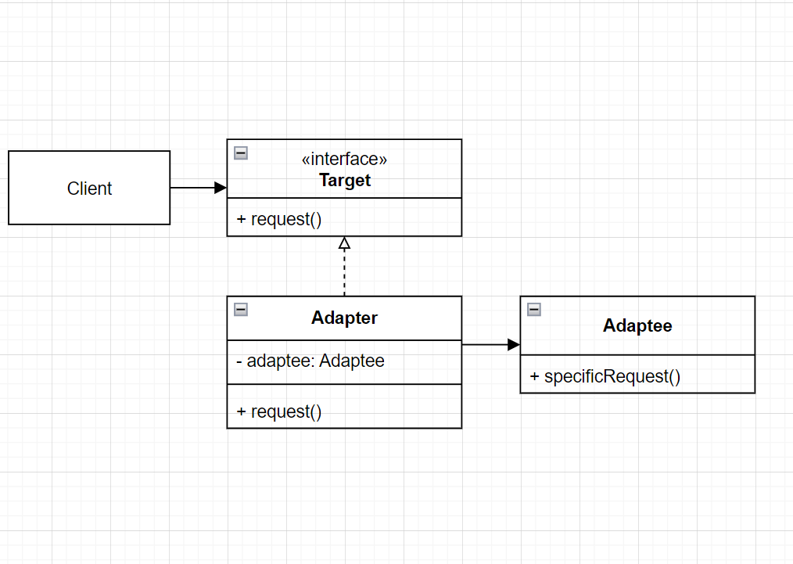
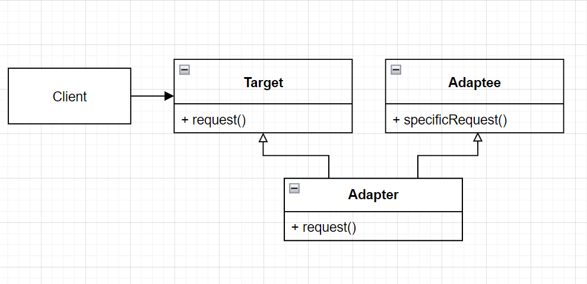
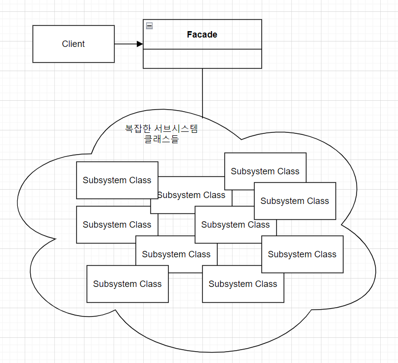

# Adapter Pattern

- 어댑터의 역할
  - 전자제품의 플러그와 소켓이 다를 경우 플러그 모양을 바꿔주는 어댑터를 사용해야한다.
  - 이와 마찬가지로 객체 지향에서의 어댑터도 인터페이스를 다른 인터페이스로 변환해 주는 역할을 한다.
    - 어떤 인터페이스를 클라이언트에서 요구하는 형태로 적응시키는 역할을 한다.
    - 예를 들어 새로운 업체에서 제공한 인터페이스가 기존에 회사에서 사용하던 인터페이스와 다른 경우가 있을 수 있다.
    - 이럴 때는 새로운 업체에서 사용하는 인터페이스를 기존에 회사에서 사용하던 인터페이스에 적응시켜 주는 클래스를 만들면 된다.
  - 클라이언트에서 어댑터를 사용하는 방법
    - 클라이언트에서 타겟 인터페이스로 메서드를 호출해서 어댑터에 요청을 보낸다.
    - 어댑터는 어댑티 인터페이스로 그 요청을 어댑티(adaptee)에 관한 메서드 호출로 변환한다.
    - 클라이언트는 호출 결과를 받긴 하지만 중간에 어댑터가 있다는 사실을 모른다.


- 어댑터의 간단한 예시

  - 아래와 같은 오리 인터페이스가 있다.

  ```python
  from abc import ABCMeta, abstractmethod
  
  
  class Duck(metaclass=ABCMeta):
  
      @abstractmethod
      def quack(self):
          pass
  
      @abstractmethod
      def fly(self):
          pass
  ```

  - 새롭게 칠면조 인터페이스를 만들었다.

  ```python
  class Turkey(metaclass=ABCMeta):
  
      # 칠면조는 quack 소리를 내며 울지 않는다.
      @abstractmethod
      def gobble(self):
          pass
  	
      # 칠면조도 날 수는 있지만 오리만큼 멀리 날지는 못한다.
      @abstractmethod
      def fly(self):
          pass
  ```

  - `Turkey`의 concrete class를 만든다.

  ```python
  class WildTurkey(Turkey):
      def gobble(self):
          print("골골")
  
      def fly(self):
          print("짧은 거리 날기")
  ```

  - `Duck` 객체 대신 `Turkey` 객체를 사용해야하는 상황이라고 가정해보자.
    - 우선 적응시킬 형식의 인터페이스(타겟 인터페이스, 이 경우엔 `Duck` 인터페이스), 즉 클라이언트에서 원하는 인터페이스를 구현해야한다.

  ```python
  class TurkeyAdapter(Duck):
      def __init__(self, turkey):
          self.turkey = turkey
  
      def quack(self):
          self.turkey.gobble()
  
      # 칠면조는 오리만큼 멀리 날지는 못하므로 칠면조의 나는 동작을 5번 수행하여
      # 오리만큼 날 게 구현한다.
      def fly(self):
          for _ in range(5):
              self.turkey.fly()
  ```

  - 테스트
    - 타겟 인터페이스(`Duck`)의 메서드 `quack()`, `fly()`를 호출해서 adapter에 요청을 보낸다.

  ```python
  turkey = WildTurkey()
  turkeyAdapter = TurkeyAdapter(turkey)
  turkeyAdapter.quack()	# 골골
  turkeyAdapter.fly()		# 짧은 거리 날기 5번 출력
  ```

  - Java code는 아래와 같다.
    - `TurkeyAdapter`는 `Duck`을 구현하므로 `Duck` type이다.

  ```java
  Turkey turkey = new WildTurkey();
  // TurkeyAdapter는 Duck 인터페이스를 구현하므로 Duck type이다.
  Duck turkeyAdapter = new TurkeyAdapter(turkey);
  testDuck(turkeyAdapter);
      
  // TurkeyAdapter는 Duck 인터페이스를 구현하므로 Duck type이다.
  static void testDuck(Duck duck) {
      duck.quak();
      duck.fly();
  }
  ```


- 어댑터 패턴

  - 정의
    - 특정 클래스 인터페이스를 클라이언트에서 요구하는 다른 인터페이스로 변환한다.
    - 인터페이스가 호환되지 않아 같이 쓸 수 없었던 클래스를 사용할 수 있게 도와준다.
  - 장점
    - 이 패턴을 사용하면 호환되지 않는 인터페이스를 사용하는 클라이언트를 그대로 활용할 수 있다.
    - 클라이언트와 구현된 인터페이스를 분리할 수 있으며, 변경 내역에서 어댑터에 캡슐화되기에 나중에 인터페이스가 변경되더라도 클라이언트를 바꿀 필요가 없다.
  - 어댑터의 종류
    - 어댑터에는 오브젝트 어댑터와 클래스 어댑터 두 종류가 있다.
    - 클래스 어댑터의 경우 다중 상속이 필요하다.
    - 어댑티를 적응시킬 때 오브젝트 어댑터는 구성을, 클래스 어댑터는 상속을 사용한다.
  - 오브젝트 어댑터의 클래스 다이어그램
    - 클라이언트는 타겟 인터페이스만 볼 수 있다(즉, 클라이언트를 특정 구현이 아닌 인터페이스에 연결한다).
    - 어댑터에서 타깃 인터페이스를 구현한다.
    - 어댑터는 어댑티로 구성(composition)되어 있다(이를 통해 어댑티의 모든 서브클래스에 어댑터를 사용할 수 있다).
    - 모든 요청은 어댑티에 위임된다.

  

  - 클래스 어댑터의 클래스 다이어그램
    - 어댑티를 적응시킬 때 구성을 사용하는 대신 어댑티와 타깃 클래스의 서브 클래스로 만든다.
    - 상속을 사용하므로 어댑티의 모든 서브 클래스에 어댑터를 사용하는 것은 불가능하고, 특정 어댑티 클래스에만 적용할 수 있다는 단점이 있다.
    - 그러나, 어댑티 전체를 다시 구현하지 않아도 되고, 어댑티의 행동을 오버라이드 할 수 있다는 장점이 있다.

  


# Facade Pattern

- 홈시어터 만들기
  - 스트리밍 플레이어, 자동 스크린, 서라운드 음향, 팝콘 기계등을 갖춘 시스템을 구성하려 한다.
    - `Screen`, `PopcornPopper`, `TheaterLights`, `StreamingPlayer`, `Projector`, `Amplifier`, `Tuner` 등의 다양한 클래스를 구현하였다.
  - 영화를 보기 위해 필요한 과정
    - 팝콘 기계를 켠다(`popper.on()`).
    - 팝콘을 튀기기 시작한다(`popper.pop()`).
    - 조명을 어둡게 조절한다(`lights.dim(10)`).
    - 스크린을 내린다(`screen.down()`).
    - 프로젝터를 켠다(`projector.on()`).
    - 프로젝트 입력을 스트리밍 플레이어로 설정한다(`projector.set_input(player)`).
    - 프로젝터를 와이드 스크린 모드로 전환한다(`projector.wide_screen_mode()`).
    - 앰프를 켠다(`amp.on()`).
    - 앰프 입력을 스트리밍 플레이어로 설정한다(`amp.set_dvd(player)`).
    - 앰프를 서라운드 음향 모드로 전환한다(`amp.set_surround_sound()`).
    - 앰프 볼륨을 중간으로 설정한다(`amp.set_volume(5)`).
    - 스트리밍 플레이어를 켠다(`player.on()`).
    - 영화를 재생한다(`player.play(movie)`).
  - 문제점
    - 지나치게 복잡하다. 영화 하나를 보기 위해서 다양한 객체의 다양한 메서드를 실행해야한다.
    - 또한 영화가 끝나면 지금까지 했던 동작을 역순으로 전부 다시 수행해야한다.
    - 시스템을 업그레이드하면 작동 방법을 또 배워야한다.
  - 해결 방법
    - 쓰기 쉬운 인터페이스를 제공하는 퍼사드 클래스를 구현하여 복잡한 시스템을 훨씬 편리하게 사용할 수 있다.


- 홈시어터에 퍼사드 패턴 적용하기

  - `HomeTheaterFacade` 클래스를 만든다.
    - 이 클래스에는 `watch_movie()`와 같은 간단한 몇 가지 메서드만 포함되어 있다.
  - 퍼사드 클래스는 홈시어터의 구성 요소를 하나의 서브 시스템으로 간주하고, `watch_movie()` 메서드는 서브 시스템의 메서드를 호출해서 필요한 작업을 처리한다.
  - 클라이언트 코드는 서브시스템이 아닌 퍼사드에 있는 메서드를 호출한다.
    - `watch_movie()` 메서드만 호출하며너 조명, 스트리밍 플레이어, 프로젝터, 앰프, 스크린, 팝콘 기계등이 알아서 준비된다.
  - 퍼사드를 쓰더라도 서브 시스템에 여전히 직접 접근할 수 있다.
    - 즉, 서브시스템의 상세 기능이 필요하면 언제든 쓸 수 있다.

  - 구현

  ```python
  class HomeTheaterFacade:
      # 서브시스템의 모든 구성 요소가 인스턴스 변수 형태로 저장된다.
      def __init__(self, amp, tuner, player, projector,
                   screen, ligths, popper):
          self.amp = amp
          self.tuner = tuner
          self.player = player
          self.projector = projector
          self.screen = screen
          self.ligths = ligths
          self.popper = popper
  
      def watch_movie(self, movie):
          self.popper.on()
          self.popper.pop()
          self.ligths.dim(10)
          self.screen.down()
          self.projector.on()
          self.projector.wide_screen_mode()
          self.amp.on()
          self.amp.set_streaming_player(self.player)
          self.amp.set_surrond_sound()
          self.amp.set_volume(5)
          self.player.on()
          self.player.play(movie)
  
      def end_movie(self):
          self.popper.off()
          self.ligths.on()
          self.screen.up()
          self.projector.off()
          self.amp.off()
          self.player.stop()
          self.player.off()
  ```

  - 테스트

  ```python
  # 구성 요소들(amp, tuner, 등)을 초기화하는 코드는 이미 짜여져 있다고 가정
  
  home_theater = HomeTheaterFacade(amp, tuner, player, projector, screen, lights, popper)
  home_theater.watch_movie("Love Letter")
  home_theater.end_movie()
  ```


- 퍼사드 패턴

  - 정의
    - 서브시스템에 있는 일련의 인터페이스를 통합 인터페이스로 묶어준다.
    - 또한 고수준 인터페이스도 정의하므로 서브시스템을 더 편리하게 사용할 수 있게 된다.
  - 용도
    - 단순화된 인터페이스로 서브시스템을 더 편리하게 사용하기 위해 사용한다.
    - 또한 클라이언트 구현과 서브시스템을 분리할 수 있다(서브시스템의 변경이 있어도 클라이언트가 아닌 퍼사드만 수정하면 된다).
    - 서브시스템이 복잡하여 하나의 Facade로 해결할 수 없다면 여러 개의 Facade class를 만들 수 있고, 이렇게 만든 Facade class를 client 혹은 다른 facade class에서 사용하는 것도 가능하다.
  - 클래스 다이어그램
  
  


- 데코레이터, 어댑터, 퍼사드의 비교
  - 데코레이터는 인터페이스는 바꾸지 않고 기능만 추가하기 위한 용도로 사용한다.
  - 어댑터는 하나의 인터페이스를 다른 인터페이스로 변환하기 위해 사용한다.
  - 퍼사드는 서브시스템에 대한 간단한 인터페이스를 제공하기 위해 사용한다.


- 최소 지식 원칙(Principle of Least Knowledge)

  - 디미터의 법칙(Law of Demeter)이라고도 불린다.
  
  - 객체 사이의 상호작용은 될 수 있으면 최소화해야한다.
    - 완전히 없애야 한다는 것이 아니라 객체 사이의 결합을 최소화 해야 한다는 것이다.
    - 즉, 시스템을 디자인할 때 어떤 객체든 그 객체와 상호작용을 하는 클래스의 개수와 상호작용 방식에 주의를 기울여야한다.
  
  - 이 원칙을 잘 따르면 클래스가 복잡하게 엃히지 않게 된다.
    - 이를 통해 시스템의 부분을 변경했을 때 다른 부분까지 줄줄이 고쳐야 하는 상황을 미리 방지할 수 있다.
  - 최소 지식 원칙을 지키는 방법.
    - 객체 자체를 사용한다.
    - 메서드에 매개변수로 전달된 객체를 사용한다.
    - 메서드를 생성하거나 인스턴스를 만든 객체를 사용한다.
    - 객체에 속하는 구성 요소(구성 요소는 인스턴스 변수에 의해 참조되는 객체를 의미한다)인 객체를 사용한다.
  - 메서드를 호출한 결과로 반환 된 객체에 들어있는 메서드를 호출하는 것은 바람직하지 않다.
    - 최소 지식 원칙을 따르려면 객체가 대신 요청하도록 만들어야한다.
  
  ```python
  # 원칙을 따르지 않은 코드
  def get_temp(self):
      # get_thermometer() 메서드를 호출한 결과로 반환된 thermometer 객체에서
      thermometer = self.station.get_thermometer()
      # 아래와 같이 메서드를 호출하는 것은 바람직하지 않다.
      return thermometer.get_temperature()
  
  
  # 원칙을 따르는 코드
  def get_temp(self):
      # 최소 지식의 원칙을 적용해서 thermometer에게 요청을 전달하는 메서드를 Station 클래스에 추가한다.
      # 이를 통해 의존하는 클래스의 개수를 줄일 수 있게 된다.
      return self.station.get_temperature()
  ```
  
  - 절친에게만 메서드 호출하기
    - 아래 예시를 통해 최소 지식 원칙을 따르면서 메서드를 호출하는 방법을 어느 정도 파악할 수 있다.
  
  ```python
  class Car:
      def __init__(self):
          # engine은 Car에 속하는 구성 요소이므로 사용해도 된다.
          self.engine = Engine()
          
      def start(self, key):
          # doors라는 새로운 객체를 생성할 것이므로 doors의 메서드는 호출해도 된다.
          doors = Doors()
          # key는 매개변수로 전달된 객체이므로 사용해도 된다.
          authorized = key.turns()
          if authorized:
          	self.engine.start()
              # update_dashboard_display 메서드는 객체 내에 있는 메서드이므로 사용해도 된다.
              self.update_dashboard_display()
              doors.lock()
      
      def update_dashboard_display(self):
          # display 갱신하는 코드
  ```
  
  - 퍼사드 패터과 최소 지식 원칙
    - 퍼사드 패턴을 적용하기 전의 client는 `Screen`, `PopcornPopper`, `TheaterLights`, `StreamingPlayer`, `Projector`, `Amplifier`, `Tuner` 등의 다양한 클래스와 결합되어 있었다.
    - 따라서 이 중 하나만 변경되더라도 클라이언트의 코드를 변경해야 했다.
    - 그러나, 퍼사드 패턴을 적용하면 오직 퍼사드 클래스와만 결합되게 되고, 위의 다양한 서브시스템 클래스들의 변경사항이 있어도 클라이언트에는 영향을 미치지 않게 된다.
    - 즉 내부의 구현은 숨기고 외형(퍼사드)만 보여주는 퍼사드 패턴과 최소 지식 원칙은 서로 관련성이 있다.


# 디자인 원칙 모아보기

- 최소 지식 원칙(Principle of Least Knowledge)


