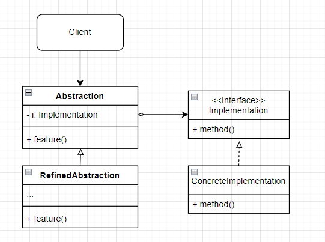
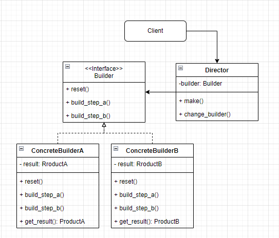

# Compound pattern

- 복합 패턴
  - 여러 패턴을 함께 사용해서 다양한 디자인 문제을 해결하는 방법을 복합 패턴이라 부른다.
  - 패턴 몇 개를 결합한다고 해서 무조건 복합 패턴이 되는 것은 아니다.
    - 복합 패턴이라고 불리려면 여러 가지 문제의 일반적인 해결법을 제시해야 한다.


- 오리 시뮬레이션 게임에 다양한 패턴 적용하기

  - 오리 시뮬레이션 게임을 처음부터 다시 만들면서 몇 가지 기능을 추가 할 것이다.
  - Quackable 인터페이스와 이를 구현하는 구상 클래스를 만든다.

  ```python
  from abc import ABCMeta, abstractmethod
  
  
  class Quackable(metaclass=ABCMeta):
  
      @abstractmethod
      def quack(self):
          pass
  
  
  class MallardDuck(Quackable):
      def quack(self):
          print("Quack")
  
  
  class RedHeadDuck(Quackable):
      def quack(self):
          print("Quack")
  
  # 고무 오리는 일반 오리와 다른 소리를 낸다.
  class RubberDuck(Quackable):
      def quack(self):
          print("Squeak")
  
  # 사냥꾼이 사용하는 오리 호출기도 오리와 다른 소리를 낸다.
  class DuckCall(Quackable):
      def quack(self):
          print("Quck")
  ```

  - 오리 시뮬레이터 생성하기

  ```python
  class Simulator:
      def simulate(self):
          mallard_duck: Quackable = MallardDuck()
          red_head_duck: Quackable = RedHeadDuck()
          rubber_duck: Quackable = RubberDuck()
          duck_call: Quackable = DuckCall()
  
          self._simulate(mallard_duck)
          self._simulate(red_head_duck)
          self._simulate(rubber_duck)
          self._simulate(duck_call)
  
      # 다형성을 활용하여 어떤 Quackable이 전달되든 quack() 메서드를 호출할 수 있게 한다.
      def _simulate(self, duck: Quackable):
          duck.quack()
  
  
  simulator = Simulator()
  simulator.simulate()
  ```


- Adapter Pattern 적용하기

  - 거위 클래스 추가하기

  ```python
  class Goose:
      def honk(self):
          print("honk")
  ```

  - 거위용 adapter 생성하기

  ```python
  from quackable import Quackable
  from goose import Goose
  
  
  class GooseAdapter(Quackable):
      def __init__(self, goose: Goose):
          self.goose = goose
  
      
      def quack(self):
          self.goose.honk()
  ```

  - 시뮬레이터에 거위 추가하기

  ```python
  from goose import Goose
  from goose_adapter import GooseAdapter
  
  
  class Simulator:
      def simulate(self):
          # ... 기존 코드
          goose: Quackable = GooseAdapter(Goose())
  
          # ... 기존 코드
          self._simulate(goose)
  
      # 기존 코드
  ```


- Decorator Pattern 적용하기

  - 오리가 운 횟수를 세기 위해 decorator class를 생성한다.
    - 모든 오리 객체가 운 횟수를 구해야 하므로 `num_of_quack`은 class 변수로 생성한다.
    - `get_quacks()` 메서드는 class method로 선언한다.

  ```python
  from quackable import Quackable
  
  
  class QuackCounter(Quackable):
      num_of_quack = 0
  
      def __init__(self, duck: Quackable):
          self.duck = duck
  
      def quack(self):
          self.duck.quack()
          QuackCounter.num_of_quack += 1
  
      @classmethod
      def get_quacks(cls):
          return cls.num_of_quack
  ```

  - 모든 객체를 decorator로 감싸준다.
    - 오리가 운 횟수만 셀 것이므로 거위는 제외한다.

  ```python
  from quackable import Quackable, MallardDuck, RedHeadDuck, RubberDuck, DuckCall
  from goose import Goose
  from goose_adapter import GooseAdapter
  from quack_counter import QuackCounter
  
  
  class Simulator:
      def simulate(self):
          mallard_duck: Quackable = QuackCounter(MallardDuck())
          red_head_duck: Quackable = QuackCounter(RedHeadDuck())
          rubber_duck: Quackable = QuackCounter(RubberDuck())
          duck_call: Quackable = QuackCounter(DuckCall())
          goose: Quackable = GooseAdapter(Goose())	# 거위는 제외한다.
  
          # ...(기존 코드와 동일)
  
          print("number of quack: ", QuackCounter.get_quacks())
  
      # ...
  ```


- Abstract Factory Pattern 적용하기

  - 지금까지는 simualtor 안에서 각 오리 구상 class를 직접 생성했으나, 이 생성을 하나의 class에서 처리하고자 한다.
  - 이를 위해 추상 팩토리를 생성한다.

  ```python
  from abc import ABCMeta, abstractmethod
  
  from quackable import Quackable
  
  
  class AbstractDuckFactory(metaclass=ABCMeta):
      @abstractmethod
      def create_mallard_duck(self) -> Quackable:
          pass
  
      @abstractmethod
      def create_red_head_duck(self) -> Quackable:
          pass
  
      @abstractmethod
      def create_rubber_duck(self) -> Quackable:
          pass
  
      @abstractmethod
      def create_duck_call(self) -> Quackable:
          pass
  ```

  - 실제 사용할 factory class를 생성한다.
    - `AbstractDuckFactory`를 상속 받는다.

  ```python
  from quackable import Quackable, MallardDuck, RedHeadDuck, RubberDuck, DuckCall
  from quack_counter import QuackCounter
  
  
  class CountingDuckFactory(AbstractDuckFactory):
      def create_mallard_duck(self) -> Quackable:
          return QuackCounter(MallardDuck())
      
      def create_red_head_duck(self) -> Quackable:
          return QuackCounter(RedHeadDuck())
      
      def create_rubber_duck(self) -> Quackable:
          return QuackCounter(RubberDuck())
      
      def create_duck_call(self) -> Quackable:
          return QuackCounter(DuckCall())
  ```

  - 시뮬레이터를 수정한다.
    - `simulate()` 메서드는 이제 factory를 매개 변수로 받는다.

  ```python
  from quackable import Quackable, MallardDuck, RedHeadDuck, RubberDuck, DuckCall
  from goose import Goose
  from goose_adapter import GooseAdapter
  from quack_counter import QuackCounter
  from duck_factory import CountingDuckFactory
  
  
  class Simulator:
      def simulate(self, duck_factory):
          mallard_duck: Quackable = duck_factory.create_mallard_duck()
          red_head_duck: Quackable = duck_factory.create_red_head_duck()
          rubber_duck: Quackable = duck_factory.create_rubber_duck()
          duck_call: Quackable = duck_factory.create_duck_call()
          goose: Quackable = GooseAdapter(Goose())
  
          # ... 기존과 동일
  
      # ... 기존과 동일
  
  
  if __name__ == "__main__":
      simulator = Simulator()
      # factory를 생성하고
      duck_factory = CountingDuckFactory()
      # 인자로 넘긴다.
      simulator.simulate(duck_factory)
  ```


- Composite Pattern 적용하기

  - 지금까지는 오리를 개별적으로 관리했지만, 통합해서 관리하려 한다.
    - 이를 위해 객체들로 구성된 컬렉션을 개별 객체와 같은 방식으로 다룰 수 있게 해 주는 composite pattern을 적용한다.
    - Iterator Pattern도 추가로 적용한다.

  ```python
  from typing import List
  
  from quackable import Quackable
  
  
  class Flock(Quackable):
      # composite 객체와 leaf 원소에서 같은 인터페이스를 구현해야 한다.
      def __init__(self):
          self.quackers: List[Quackable] = []
  
      def add(self, qucker:Quackable):
          self.quackers.append(qucker)
      
      def quack(self):
          for quacker in self.quackers:
              quacker.quack()
  ```

  - 시뮬레이터를 수정한다.

  ```python
  from quackable import Quackable
  from goose import Goose
  from goose_adapter import GooseAdapter
  from quack_counter import QuackCounter
  from duck_factory import CountingDuckFactory
  from flock import Flock
  
  
  class Simulator:
      def simulate(self, duck_factory):
          red_head_duck: Quackable = duck_factory.create_red_head_duck()
          rubber_duck: Quackable = duck_factory.create_rubber_duck()
          duck_call: Quackable = duck_factory.create_duck_call()
          goose: Quackable = GooseAdapter(Goose())
  
          flock_of_ducks = Flock()
  
          flock_of_ducks.add(red_head_duck)        
          flock_of_ducks.add(rubber_duck)        
          flock_of_ducks.add(duck_call)        
          flock_of_ducks.add(goose)        
  
          flock_of_mallards = Flock()
  
          mallard_duck_one: Quackable = duck_factory.create_mallard_duck()
          mallard_duck_two: Quackable = duck_factory.create_mallard_duck()
          mallard_duck_three: Quackable = duck_factory.create_mallard_duck()
          mallard_duck_four: Quackable = duck_factory.create_mallard_duck()
          flock_of_mallards.add(mallard_duck_one)
          flock_of_mallards.add(mallard_duck_two)
          flock_of_mallards.add(mallard_duck_three)
          flock_of_mallards.add(mallard_duck_four)
          
          # flock_of_mallards을 flock_of_ducks에 추가한다.
          flock_of_ducks.add(flock_of_mallards)
  
          print("전체 오리 시뮬레이션")
          self._simulate(flock_of_ducks)
  
          print("물오리 시뮬레이션")
          self._simulate(flock_of_mallards)
  
          print("number of quack: ", QuackCounter.get_quacks())
  
      # 기존과 동일
  
  
  if __name__ == "__main__":
      simulator = Simulator()
      duck_factory = CountingDuckFactory()
      simulator.simulate(duck_factory)
  ```


- Observer Pattern 적용하기

  - 오리가 꽥꽥 소리를 낼 때마다 추적하는 기능을 넣고자 한다.
  - Observer를 위한 인터페이스 생성하기
    - 옵저버를 삭제하는 기능은 편의상 생략한다.
    - `Observer` interface는 추후에 정의한다.

  ```python
  from abc import ABCMeta, abstractmethod
  
  
  class QuackObervable(metaclass=ABCMeta):
      @abstractmethod
      def register_observer(self, observer: Observer):
          pass
  
      @ abstractmethod
      def notify_observer(self):
          pass
  ```

  - Quackable이 Obserer를 구현하도록 수정하기

  ```python
  from abc import abstractmethod
  
  from quack_observer import QuackObervable
  
  class Quackable(QuackObervable):
  
      @abstractmethod
      def quack(self):
          pass
  ```

  - Quackable을 구현하는 모든 구상 클래스에서 QuackObservable에 있는 메서드를 구현하도록 한다.
    - 등록 및 연락용 코드를 Observable 클래스에 캡슐화하고, 구성으로 QuackObservable에 포함시킨다.
    - 이를 통해 실제 코드는 한 군데만 작성하고, QuackObservalbe이 필요한 적업을 Observable 보조 클래스에 전부 위임하게 만들 수 있다.

  ```py
  class Observable(QuackObervable):
      def __init__(self, duck):
          self.observers: List[Observer] = []
          self.duck = duck
      
      def register(self, observer: Observer):
          self.observers.append(observer)
      
      def notify_observer(self):
          for observer in self.observers:
              observer.update(self.duck)
  ```

  - Observer 보조 객체를 모든 Quackable class에 넘겨준다.
    - 예시로 MallardDuck에만 추가하지만 모든 Quackable class(`Goose`, `QuackCOunter` 등)에 추가해야한다.

  ```python
  from quackable import Quackable
  from observer import Observable
  
  
  class MallardDuck(Quackable):
      def __init__(self):
          self.observable = Observable(self)
      
      def quack(self):
          print("Quack")
          # quack이 호출되면 Observer에게 신호를 보낸다.
          self.notify_observer()
  
      def register_observer(self, observer: Observer):
          self.observable.register_observer(observer)
      
      def notify_observer(self):
          self.observable.notify_observer()
  ```

  - `QuackCounter`를 아래와 같이 수정한다.

  ```python
  class QuackCounter(Quackable):
      # .. 기존 코드와 동일
      
      def register_observer(self, observer: Observer):
          self.duck.register_observer(observer)
      
      def notify_observer(self):
          self.duck.notify_observer()
  ```

  - `Flock`은 아래와 같이 변경한다.
    - 옵저버에 등록할 때 오리 무리 안에 있는 모든 Quakable 객체들을 일일이 옵저버에 등록해줘야한다.
    - Quackable 객체에서 알아서 옵저버에게 연락을 돌리므로 Flock은 아무 일도 하지 않아도 된다(Flock에서 개별 Quackable 객체의 `quack()` 메서드를 호출하면 자동으로 처리된다).

  ```python
  from typing import List
  
  from quackable import Quackable
  from observer import Observer
  
  
  class Flock(Quackable):
      def __init__(self):
          self.quackers: List[Quackable] = []
  
      def add(self, qucker:Quackable):
          self.quackers.append(qucker)
      
      def quack(self):
          for quacker in self.quackers:
              quacker.quack()
      
      def register_observer(self, observer: Observer):
          # quackers를 순회하면서 일일이 등록한다.
          # 만일 quacker가 또 다른 Flock 객체라면 재귀적으로 호출이 반복된다.
          for quacker in self.quackers:
              quacker.register_observer(observer)
      
      def notify_observer(self):
          pass
  ```

  - Observer class 만들기

  ```python
  class Observer(metaclass=ABCMeta):
      def update(self, duck: QuackObervable):
          pass
  
  
  class QuackLogist(Observer):
      def update(self, duck: QuackObervable):
          print("{}가 방금 소리 냈다.".format(duck.__class__.__name__))
  ```

  - 시뮬레이터 수정하기

  ```python
  from quackable import Quackable
  from goose import Goose
  from goose_adapter import GooseAdapter
  from quack_counter import QuackCounter
  from duck_factory import CountingDuckFactory
  from flock import Flock
  from observer import QuackLogist
  
  
  class Simulator:
      def simulate(self, duck_factory):
          # 기존 코드와 동일
  
          quack_logist = QuackLogist()
          flock_of_ducks.register_observer(quack_logist)
          self._simulate(flock_of_ducks)
  
          print("number of quack: ", QuackCounter.get_quacks())
  
      # 다형성을 활용하여 어떤 Quackable이 전달되든 quack() 메서드를 호출할 수 있게 한다.
      def _simulate(self, duck: Quackable):
          duck.quack()
  
  
  if __name__ == "__main__":
      simulator = Simulator()
      duck_factory = CountingDuckFactory()
      simulator.simulate(duck_factory)
  ```


## Model-View-Controller Pattern

- MVC Pattern
  - Model
    - 모든 데이터, 상태와 애플리케이션 로직이 들어있다.
    - 뷰와 컨트롤러에서 모델의 상태를 조작하거나 가져올 때 필요한 인터페이스를 제공하고, 모델이 자신의 상태 변화를 옵저버들에게 연락해주지만, 기본적으로 모델은 뷰와 컨트롤러에 별 관심이 없다.
  - View
    - 모델을 표현하는 방법을 제공한다.
    - 일반적으로 화면에 표시할 때 필요한 상태와 데이터는 모델에서 직접 가져온다.
    - 다만, 꼭 모델에게 요청해서 가져올 필요는 없고, 모델이 갱신 될 때, view도 함께 갱신시키는 방식을 사용해도 된다.
  - Controller
    - 사용자로부터 입력을 받는다.
    - 입력받은 내용이 모델에게 어떤 의미가 있는지 파악한다.
    - 컨트롤러에는 비즈니스 로직을 작성하지 않는다.


- 동작 과정

  - 사용자가 뷰에 접촉한다.
    - 사용자는 뷰에만 접촉할 수 있다.
    - 사용자가 뷰에서 뭔가를 하면 뷰는 무슨 일이 일어났는지 컨트롤러에게 알려준다.
    - 컨트롤러가 상황에 맞게 작업을 처리한다.

  - 컨트롤러가 모델에게 상태를 변경하라고 요청한다.
    - 컨트롤러는 사용자의 행동을 받아서 해석한다.
    - 사용자가 버튼을 클릭하면 컨트롤러는 그것이 무엇을 의미하는지 해석하고, 모델을 어떤 식으로 조작해야 하는지 결정한다.
  - 컨트롤러가 뷰를 변경해 달라고 요청할 수도 있다.
    - 컨트롤러는 뷰로부터 어떤 행동을 받았을 때, 그 행동의 결과로 뷰에게 뭔가를 바꿔 달라고 할 수도 있다.
    - 예를 들어 컨트롤러는 화면에 있는 어떤 버튼이나 메뉴를 활성화하거나 비활성화 할 수 있다.
  - 상태가 변경되면 모델이 뷰에게 그 사실을 알린다.
    - 사용자가 한 행동이나 내부적인 변화 등으로 모델에서 변경이 생길경우 모델은 뷰에게 상태가 변경되었다고 알린다.
  - 뷰가 모델에게 상태를 요청한다.
    - 뷰는 화면에 표시할 상태를 모델로부터 직접 가져온다.
    - 컨트롤러가 뷰에게 뭔가를 바꾸라고 요청할 때, 뷰는 모델에게 상태를 알려달라고 요청할 수도 있다.


- MVC에 사용되는 패턴들
  - Observer Pattern
    - 모델은 옵저버 패턴을 사용하여 상태가 바뀔 때 마다 뷰와 컨트롤러에게 연락한다.
    - 옵저버 패턴을 사용함으로써 모델을 뷰와 컨트롤러로부터 완전히 독립시킬 수 있다.
    - 한 모델에서 서로 다른 뷰를 사용할 수도 있고, 여러 개의 뷰를 동시에 사용할 수도 있게 된다.
  - Strategy Pattern
    - 뷰와 컨트롤러는 전략 패턴을 사용하여 부 객체를 여러 전략을 사용하여 설정할 수 있다.
    - 컨트롤러가 전략을 제공하고, 뷰는 애플리케이션의 겉모습에만 신경 쓰고, 인터페이스의 행동을 결정하는 일은 모두 컨트롤러에게 맡긴다.
    - 사용자가 요청한 내역을 처리하려고 모델과 얘기하는 일을 컨트롤러가 맡고 있으므로, 전략 패턴을 사용함으로써 뷰를 모델로부터 분리할 수 있다.
  - Composite Pattern
    - 뷰는 컴포지트 패턴을 사용하여 여러 단계로 겹쳐 있는 화면을 표현한다.
    - 컨트롤러가 뷰에게 화면을 갱신해달라고 요청하면 최상위 뷰 구성 요소에게만 화면을 갱신하라고 얘기하면 된다.
    - 나머지는 컴포지트 패턴이 알아서 처리해준다.


- MVC 패턴 적용해보기

  > Streamlit을 사용하여 타이머를 만드려고 했으나 변경 사항이 생길 때 마다 렌더링이 이루어지는 streamlit 특성 상 MVC 패턴 적용이 불가능하다.
  >
  > 추후 PyQt5를 사용하여 다시 해볼 것


# 다양한 디자인 패턴들

- 디자인 패턴의 정의
  - 특정 컨텍스트 내에서 주어진 문제의 해결책을 패턴이라 부른다.
    - 컨텍스트란 패턴이 적용되어야 하는 상황을 의미하며, 반복적으로 일어날 수 있는 상황이어야 한다.
    - 문제란 컨텍스트 내에서 이뤄야하는 목표를 의미한다.
    - 해결책은 제약조건 속에서 누가 적용해도 목표를 이룰 수 있는 일반적인 디자인을 의미한다.
  - 특정 디자인이 컨텍스트 내에서 주어진 문제를 해결하는 해결책이라 하더라도, 해당 컨텍스트가 반복적으로 발생하지 않는다면, 패턴이라 부를 수 없다.


- 디자인 패턴 분류

  > 모든 디자인 패턴들이 각 범주에 딱 떨어지게 분류되는 것은 아니다.
  >
  > 관점에 따라, 상황에 따라 다른 범주에 속할 수도 있다.

  - 생성(Creational) 패턴
    - 객체 인스턴스를 생성하는 패턴이다.
    - 클라이언트와 클라이언트가 생성해야 하는 객체 인스턴스 사이의 연결을 끊어준다.
    - 싱글톤, 팩토리 패턴 등이 이에 속한다.
  - 행동(Behavioral) 패턴
    - 클래스와 객체들이 상호작용하는 방법과 역할을 분담하는 방법을 다루는 패턴이다.
    - 옵저버, 상태, 전략 패턴등이 이에 속한다.
  - 구조(Structural)
    - 클래스와 객체를 더 큰 구조로 만들 수 있게 구상을 사용하는 패턴이다.
    - 어댑터, 데코레이터, 컴포지트 패턴 등이 이에 속한다.
  - 혹은 클래스를 다루는 패턴인지, 객체를 다루는 패턴인지에 따라 구분하기도 한다.
    - 클래스 패턴은 클래스 사이의 관계가 상속으로 어떻게 정의되는지를 다루는 패턴들로, 어댑터, 템플릿 메서드 등이 이에 속한다.
    - 객체 패턴은 객체 사이의 관계를 다루며, 객체 사이의 관계는 일반적으로 구성으로 정의 되는 패턴들로, 대부분의 패턴이 이에 속한다.


## Bridge Pattern

> https://refactoring.guru/design-patterns/bridge

- 문제

  - 상황
    - `Circle`과 `Square` class를 subclass로 가지는 `Shape` class가 있다.
    - `Shape` class에 모양 뿐 아니라 `Blue`, `Red`라는 색도 추가하려고 한다.
    - 이를 위해 `RedCircle`, `RedSquare`, `BlueCircle`, `BlueSqure`라는 4개의 subclass를 생성했다.
    - 그러나 이 방식을 계속 사용한다면, 새로운 모양 혹은 색을 추가할 때 마다 모양과 색의 모든 조합에 해당하는 class를 만들어줘야한다.

  ```python
  class Shape:
      pass
  
  class RedCircle(Shape):
      pass
  
  class BlueCircle(Shape):
      pass
  
  class RedSquare(Shape):
      pass
  
  class BlueSquare(Shape):
      pass
  ```

  - 원인
    - 문제는 `Shape` class를 모양과 색이라는 서로 독립적인 차원으로 확장하려 해서 발생한다.
    - 이는 class 상속에서 매우 빈번하게 발생하는 문제이기도 하다.


- 해결

  - Bridge pattern은 상속 대신 구성을 사용하는 방식으로 이러한 문제를 해결한다.
    - 모양과 색 중 하나를 분리하여 원래 class(이 경우 `Shape` class)와 같은 계층의 class로 생성한다.
    - 원래 class는 분리된 class의 object를 참조하도록한다.
    - 이를 통해 `Shape` class는 분리된 object에 관련 작업을 위임할 수 있게 된다.
  - 예시

  ```python
  # Color관련 로직을 Shape에서 분리하여 Shape와 같은 계층으로 생성한다.
  class Color:
      pass
  
  class Red(Color):
      pass
  
  class Blue(Color)
  
  
  class Shape:
      # 구성을 통해 color를 활용한다.
      def __init__(self, color: Color):
          self.color = color
  
  class Circle(Shape):
      pass
  
  class Square(Shape):
      pass
  
  
  red_circle = Circle(Red())
  ```


- Bridge Pattern

  - 추상과 구현을 분리하여 추상과 구현을 독립적으로 확장시킬 수 있게 해주는 패턴이다.
    - OOP에서 일반적으로 말하는 추상과 구현 개념과는 약간 다르다.
    - 구현을 캡슐화하여 추상에 포함시키는 방식을 사용한다.
    - 구성을 통해 두 클래스가 연결되며, 구성을 통해 참조되는 object(위의 경우 Color의 object)가 두 클래스 사이의 다리 역할을 한다 하여 bridge design pattern이라는 이름이 붙었다.
  - 추상과 구현(abstraction and implementation)
    - 추상(혹은 interface(OOP에서 일반적으로 쓰이는 interface와는 다르다))이란 어떤 entity의 높은 수준의 계층을 말한다.
    - 추상 계층은 애플리케이션에 필요한 business logic의 틀만 잡는다.
    - 실제 business logic은 abstraction과 분리되어 구현 계층에 작성한다.
    - 즉, 추상 계층은 그 자체로는 어떠한 작업도 하지 않으며, 구현 계층에게 모든 일을 위임한다.
    - 구현(혹은 platform)이란 추상 계층에게 실제 작업을 위임 받아 처리하는 계층을 의미한다.
  - 예시
    - 여러 개의 application을 개발하려 하는데, 각 애플리케이션마다 GUI도 제각각이고 API도 제각각이다.
    - 만일 이들을 모두 개별적으로 개발하려 한다면 `GUI 개수 * API 개수 ` 만큼의 class를 생성해야 할 것이다.
    - 따라서 bridge pattern을 적용하기로 한다.
    - GUI는 실제로는 어떠한 작업도 하지 않고 모든 작업을 API에 위임하므로 인터페이스라 볼 수 있다.
    - API 서버는 GUI로부터 작업을 위임 받아 처리하므로 플랫폼이라 볼 수 있다.
    - GUI에 구성을 통해 API 서버에 대한 참조를 설정함으로써 위와 같은 문제를 해결할 수 있다.
    - 서로 다른 플랫폼들은 같은 인터페이스를 공유하기만 한다면  언제든 교체될 수 있다.
  - 클래스 다이어그램
    - Abstraction을 실제 작업의 처리를 Implementation에 위임한다(Abstraction은 추상 클래스나 인터페이스로 선언한다).
    - RefinedAbstraction은 Absraction의 다양한 변형이며, Abstraction과 마찬가지로 구성을 통해 Implementation에 작업의 처리를 위임한다(패턴에서 필수 요소는 아니다).
    - Implementation은 모든 ConcreteImplementation이 공유하는 공통 로직을 정의한다.
    - Abstraction은 오직 Implementation에 호출된 메서드를 통해서만 Implementation object와 소통한다.
    - ConcreteImplementation에는 platform에 특화된 코드들이 들어간다.
    - Client는 일반적으로 Abstraction에게만 관심을 가진다.

  
  
  - 동작 과정
    - Client가 Abstraction object의 `feature()`를 호출한다.
    - Abstraction은 `feature()`가 호출되면 Implementation의 `method()`를 호출하여 실제 작업을 처리하도록 한다.
  


- 예시

  ```python
  from abc import ABCMeta, abstractmethod
  
  
  # implementation
  class MoveLogic(metaclass=ABCMeta):
      @abstractmethod
      def move(self):
          pass
  
  
  class Walk(MoveLogic):
      def move(self):
          print("Walking")
  
  
  class Fly(MoveLogic):
      def move(self):
          print("Flying")
  
  
  class Swim(MoveLogic):
      def move(self):
          print("Swimming")
  
  
  # abstcation
  class Animal(metaclass=ABCMeta):
      def __init__(self, move_logic: MoveLogic):
          self.move_logic = move_logic
      
      @abstractmethod
      def how_do_i_move(self):
          self.move_logic.move()
  
  
  class Person(Animal):
      def how_do_i_move(self):
          self.move_logic.move()
  
  
  class Bird(Animal):
      def how_do_i_move(self):
          self.move_logic.move()
  
  
  class Fish(Animal):
      def how_do_i_move(self):
          self.move_logic.move()
  
  
  if __name__ == "__main__":
      person = Person(Walk())
      person.how_do_i_move()
      bird = Bird(Fly())
      bird.how_do_i_move()
      fish = Fish(Walk())
      fish.how_do_i_move()
  ```


## Builder

- 문제

  - 상황
    - House 클래스를 통해 인스턴스를 생성해야 한다고 가정해보자.
    - 간단한 객체를 생성하려 한다면 wall, door, window, roof, floor 등의 arguments만 받으면 될 것이다.
    - 그러나, House class를 통해 보다 다양한 유형의 인스턴스를 생성하고자 한다면, has_garden, has_heating_system, has_swimming_pool 등 보다 많은 arguments를 받아야 할 것이다.
  - 이를 House class에서 모두 관리를 하는 것은 비효율 적이다.
    - 예를 들어 굉장히 소수의 인스턴스만 has_swimming_pool의 값이 true로 들어올텐데, 이들을 생성시마다 넘겨주는 것은 비효율 적이다.
    - 또한 만약 요구사항 변경에 의해 새로운 arguments가 추가된다면, 예를 들어 has_garage argument가 추가된다면, 기존 House 인스턴스를 생성하는 모든 코드에 has_garage parameter를 추가해줘야 한다.
    - 또한 객체 생성 부분만 보고, 각 parameter가 무엇을 의미하는지 알기도 쉽지 않다.

  ```python
  class House:
  	def __init__(self, num_window, wall, roof, floor, 
  				has_garden, has_heating_system, has_swimming_pool):
  		pass
  
  simple_house = House(2, "stone", "wood", 1, False, False, False)
  fancy_house = House(8, "brick", "glass", 2, True, True, True)
  
  # 만일 새로운 argument가 추가된다면 simple_house, fancy_house의 생성 부분에 모두 parameter를 추가해야한다.
  # 또한 House(8, "brick", "glass", 2, True, True, True)만 보고는 어떤 집을 만드려는 것인지 파악이 쉽지 않다.
  ```

  - 해결
    - 모든 Builder에 공통으로 들어가는 로직을 선언할 Builder interface를 생성한다.
    - 이 interface를 Builder라 부르고, 이를 구체화 한 class를 Concrete Builder라 부르기도 한다.
    - Builder interface를 구체화 한 Concrete Builder class를 생성한다.
    - Builder interface를 생성하지 않았다면 그냥 Builder class를 생성한다.
    - Director를 생성하고, director에게 객체의 생성을 맡긴다.
    - Director에는 builder 내에 정의되어 있는 객체 생성 메서드들을 어느 순서로 실행할지를 정의한다.
    - Director를 사용할 경우 client는 director를 통해서만 객체를 생성한다.
    - 따라서 객체의 생성을 client code로부터 완전히 감출 수 있다.


- Builder Pattern

  - 복합 객체의 생성과 표현을 분리한다.
    - 이를 통해 동일한 생성 절차로 다른 표현을 생성할 수 있다.
  - 객체의 spec을 실제 표현과 분리해야 할 때 유용하게 사용할 수 있다.
  - 클래스 다이어그램
    - Builder interface는 Product를 생성하는 단계들을 정의한다.
    - ConcreteBuilder는 각 생성 단계에 대한 실제 구현을 정의하는데, ConcreteBuilder마다 실제 구현 방식이 다를 수 있다.
    - Director 클래스는 생성 단계의 순서를 정의한다.
    - Director의 경우 builder를 아래 다이어그램에서와 같이 attribute로 가지고 있으면서 계속 해당 builder만 사용하는 방식이 있고, 실제 객체를 생성할 때 인자로(`make()` 메서드의 인자로) builder 객체를 받아 사용하는 방식이 있다.
    - Client는 Director를 통해 Builder를 조작한다.

  


- 예시

  - 자동차를 생성하는 concrete builder class를 작성한다.
    - 자동차는 다양한 방식으로 생성된다.
    - 자동차를 생성하는 모든 방식을 망라하는 하나의 거대한 class를 만드는 대신 자동차를 조립하는 코드를 개별적인 builder로 분리해서 자동차를 생성한다.
  - 자동차의 메뉴얼을 생성하는 concrete builder class를 생성한다.
    - 자동차의 메뉴얼은 자동차의 종류에 따라 달라지며, 대부분 자동차의 부품에 대한 설명이다.
    - 따라서 자동차와 같은 builder interface를 구현하여 작성이 가능하다.
  - 아래 예시에서 Dicrector는, 위에서 살펴본 다이어그램과는 달리,  builder object를 attribute로 갖는 대신 Car object를 생성할 때 builder를 parameter로 받는 방식을 사용했다.

  ```python
  from abc import abstractmethod
  
  # Product 객체
  class Car:
  	def __init__(self):
  		self.num_seat = 0
  		self.engine = None
  		self.trip_computer = None
  		self.gps = None
  
  # Product 객체
  class Manual:
  	def __init__(self):
  		self.num_seat = ""
  		self.engine_name = ""
  		self.trip_computer_name = ""
  		self.gps_name = ""
  
  # builder (interface) 생성하기
  class Builder:
  
  	@abstractmethod
  	def reset(self):
  		pass
  
  	@abstractmethod
  	def set_seats(self):
  		pass
  
  	@abstractmethod
  	def set_engine(self):
  		pass
  
  	@abstractmethod
  	def set_trip_computer(self):
  		pass
  
  	@abstractmethod
  	def set_gps(self):
  		pass
  
  
  # Car 생성을 위한 (concrete) builder 생성하기
  class CarBuilder(Builder):
  
  	def __init__(self):
  		self.reset()
  	
  	def reset(self):
  		self._car = Car()
  
  	def set_seats(self, num_seat):
  		self._car.num_seat = num_seat
  
  	def set_engine(self, engine):
  		self._car.engine = engine
  
  	def set_trip_computer(self, trip_computer):
  		self._car.trip_computer = trip_computer
  
  	def set_gps(self, gps):
  		self._car.gps = gps
  	
  	@property
  	def car(self):
  		car = self._car
  		self.reset()
  		return car
  
  
  # Car Manual 생성을 위한 (concrete) builder 생성하기
  class ManualBuilder(Builder):
  
  	def __init__(self):
  		self.reset()
  	
  	def reset(self):
  		self._manual = Manual()
  
  	def set_seats(self, num_seat):
  		self._manual.num_seat = "number of seats : {}".format(num_seat)
  
  	def set_engine(self, engine):
  		self._manual.engine_name = "engine : {}".format(engine)
  
  	def set_trip_computer(self, trip_computer):
  		self._manual.trip_computer_name = "trip_computer : {}".format(trip_computer)
  
  	def set_gps(self, gps):
  		self._manual.gps_name = "gps : {}".format(gps)
  
  	@property
  	def manual(self):
  		manual = self._manual
  		self.reset()
  		return manual
  
  
  # Builder를 통한 객체 생성 순서를 정의하기 위한 Director 생성
  class Director:
  
  	def construct_sporst_car(self, builder):
  		builder.reset()
  		builder.set_seats(2)
  		builder.set_engine("sports_car_engine")
  		builder.set_trip_computer("sports_navi")
  		builder.set_gps("sports_gps")
  	
  	def construct_suv(self, builder):
  		builder.reset()
  		builder.set_seats(6)
  		builder.set_engine("suv_engine")
  		builder.set_trip_computer("suv_navi")
  		builder.set_gps("suv_gps")
  
  
  if __name__=="__main__":
  	# client code
  	# director를 사용했으므로, construct_sporst_car 메서드만 호출하면 되며,
  	# 내부적으로 sports car가 어떻게 생성되는지는 감출 수 있다.
  	direcotr = Director()
  	builder = CarBuilder()
  	direcotr.construct_sporst_car(builder)
  	car = builder.car
  
  	builder = ManualBuilder()
  	direcotr.construct_sporst_car(builder)
  	manual = builder.manual
  ```


- 한계
  - 결국 생성하려는 객체에 맞춰 builder를 계속 늘어나게 된다.
  - Python에서도 유용한 패턴인지 의문
    - Python의 경우 parameter에 기본값을 설정 가능하다.
    - Keyword argument를 통해 어떤 값을 넘기는지 명시적으로 표현이 가능하다.

