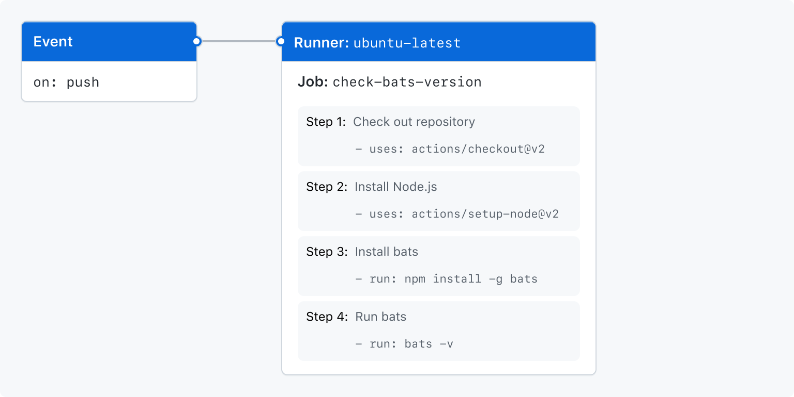

# 개요

- Github Actions
  - CI(Continuous Intergration)과 CD(Continuous Delivery)를 위한 platform이다.
    - build, test, deployment pipeline을 자동화해준다.
    - Workflow를 생성하여 build, test, deply 등을 할 수 있다.
  - Workflow를 실행시킬 수 있도록 Linux, macOS, Windows의 가상 머신을 제공한다.
    - github에서 제공하는 가상 머신을 사용하지 않고 self-hosted runner를 사용하는 것도 가능하다.


- Github Action의 구성 요소들
  - Workflows
    - 하나 이상의 job을 실행시킬 수 있는 자동화 프로세스이다.
    - YAML 파일에 정의되며, 각 workflow는 개별적인 YAML 파일에 정의되어야 한다.
    - repository에 특정 event가 발생했을 때 trigger되어 실행된다.
    - 수동으로 trigger 시킬 수도 있고, 일정 주기로 trigger시킬 수도 있다.
    - repository의 `.github/workflows` 폴더에 정의된다.
    - 하나의 repository는 복수의 workflow를 가질 수 있다.
  - Events
    - Workflow가 실행되도록 trigger 시키는 repository 내의 특정한 행동이다.
  - Jobs
    - Workflow 내에서 같은 runner 상에서 실행되는 여러 step들의 집합이다.
    - 각 step은 shell script나 실행시킬 수 있는 action이다.
    - 각 step은 순차적으로 실행되고, 다른 step들에 의존적이다.
    - 같은 runner에서 각 step은 data를 공유할 수 있다.
    - 기본적으로 job은 다른 job에 독립적이지만, 의존적일수도 있다.
    - job이 다른 job에 독립적일 경우 각 job은 병렬적으로 실행되지만, 하나의 job이 다른 job에 의존적일 경우, 각 job은 순차적으로 실행된다. 예를 들어 A가 B에 의존적이라면, B가 먼저 실행되고, B의 실행이 끝나면 A가 실행된다.
  - Actions
    - Github action에서 반복적으로 수행되는 작업을 처리하기 위한 custom application이다.
    - 직접 작성할 수도 있고 Github Marketplace에서 가져와서 사용할 수도 있다.
  - Runner
    - Workflow를 실행할 server이다.
    - 각 runner는 동시에 하나의 job만을 실행시켜야 한다.
    - Github action에서는 Linux, macOS, Windows 등을 제공(Github-hosted runner)하는데, 제공하는 runner를 사용하지 않고, 직접 runner를 구성(Self-hosted runner)할 수도 있다.


- Workflow 생성해보기

  - `.github/workflows` 폴더 내부에 YAML 파일을 생성한다.

  ```yaml
  # learn-github-actions.yml
  
  name: learn-github-actions
  on: [push]
  jobs:
    check-bats-version:
      runs-on: ubuntu-latest
      steps:
        - uses: actions/checkout@v3
        - uses: actions/setup-node@v3
          with:
            node-version: '14'
        - run: npm install -g bats
        - run: bats -v
  ```

  - 위 파일을 작성한 상태에서 commit하고 push한다.
  - 설정
    - `name`(Optional): Workflow의 이름을 설정한다.
    - `on`: Workflow를 trigger시킬 event를 설정한다.
    - `jobs`: WorkFlow에서 실행시킬 job들을 정의한다.
    - `check-bats-version`: Job의 이름이다.
    - `runs-on`: Job을 실행시킬 runner를 정의한다.
    - `steps`: `check-bats-version` job에서 실행시킬 step들을 정의한다. 이 section 아래에 정의된 모든 설정들은 각각 하나의 action들이다.
    - `uses`: 어떤 action을 실행시킬지를 정의한다.
    - `run`: runner에서 실행시킬 명령어를 정의한다.
  - 위 workflow를 도식화하면 아래와 같다.

  


- Github Actions의 필수적인 기능들

  - Workflow에서 변수 사용하기

  


# Action 사용하기

- 다른 사람이 만든 action 사용하기

  - Github Marketplace

    > https://github.com/marketplace?type=actions

    - 다른 사람이 정의한 action들을 모아 둔 공간이다.
    - 보안을 위해 action을 만든 사람이나 repository가 변경되면, 해당 action을 사용하는 모든 workflow가 실패하도록 설계되어 있다.

  - 위 사이트에 접속해서 사용하고자 하는 action을 선택 후 사용하면 된다.


- Action 추가하기

  - Action은 아래와 같은 곳들에 정의될 수 있다.
    - Workflow file과 같은 repository
    - Public repository
    - Docker hub에 배포된 docker image
  - Workflow file과 같은 repository에 추가하기
    - 이 경우 `<owner>/{repo}@{ref}`와 같이 적어주거나, action이 정의된 폴더의 위치를 적어준다.

  ```yaml
  # 만일 구조가 아래와 같다면
  |-- hello-world (repository)
  |   |__ .github
  |       └── workflows
  |           └── my-first-workflow.yml
  |       └── actions
  |           |__ hello-world-action
  |               └── action.yml		# action.yml에는 해당 action의 metadata가 담겨 있다.
  
  # 아래와 같이 action이 정의된 폴더의 위치를 적어준다.
  jobs:
    build:
      runs-on: ubuntu-latest
      steps:
        - uses: actions/checkout@v3
        - uses: ./.github/actions/hello-world-action
  ```

  - 다른 repository에 추가하기
    - 만일 workflow 파일이 있는 repository와 다른 repository에 action을 정의했다면 `<owner>/{repo}@{ref}`의 형태로 적어준다.

  ```yaml
  jobs:
    my_first_job:
      steps:
        - name: My first step
          uses: actions/setup-node@v3
  ```

  - Docker hub에 있는 action 사용하기
    - `docker://{image}:{tag}` 형태로 적어준다.

  ```yaml
  jobs:
    my_first_job:
      steps:
        - name: My first step
          uses: docker://alpine:3.8
  ```


- Action의 버전 정보 표기법

  - tags

  ```yaml
  steps:
    - uses: actions/javascript-action@v1.0.1
  ```

  - SHAs

  ```yaml
  steps:
    - uses: actions/javascript-action@172239021f7ba04fe7327647b213799853a9eb89
  ```

  - Branch

  ```yaml
  steps:
    - uses: actions/javascript-action@main
  ```


- Github Actions의 필수적인 기능들

  - 환경 변수 사용하기
    - Github Action에는 기본적으로 등록되어 있는 환경변수 들이 있다.
    - 만일 새로운 환경 변수를 등록하고자 한다면 아래와 같이 `env` 필드에 환경변수를 정의하면 된다.
    - 아래와 같이 정의한 환경변수는 `client.js` 파일에서 사용이 가능하다.

  ```yaml
  jobs:
    example-job:
        steps:
          - name: Connect to PostgreSQL
            run: node client.js
            env:
              POSTGRES_HOST: postgres
              POSTGRES_PORT: 5432
  ```

  - Script 추가하기
    - 아래와 같이 script 혹은 실행시킬 명령어를 정의할 수 있다.

  ```yaml
  jobs:
    example-job:
      steps:
        - name: Run build script
          run: ./.github/scripts/build.sh
          shell: bash
  ```

  - Job들 간에 data 공유하기
    - workflow가 실행되는 과정에서 생성한 파일을 artifact라 부르며, 아래와 같이 공유가 가능하다.

  ```yaml
  # 업로드하기
  jobs:
    example-job:
      name: Save output
      steps:
        - shell: bash
          run: |
            expr 1 + 1 > output.log
        - name: Upload output file
          uses: actions/upload-artifact@v3
          with:
            name: output-log-file
            path: output.log
  
  # 다운로드하기
  jobs:
    example-job:
      steps:
        - name: Download a single artifact
          uses: actions/download-artifact@v3
          with:
            name: output-log-file
  ```


## 표현식

- 표현식에 literal을 사용하는 것이 가능하다.

  - boolean, null, number, string
  - number의 경우 JSON에서 유효한 숫자 형식이어야 한다.
  - String의 경우 표현식 없이도 표현 가능하다.
    - 단, 표현식에서 사용할 경우 반드시 작은 따옴표(`'`)로 묶어줘야한다.
    - 만일 작은 따옴표 자체를 사용하고자 한다면 앞에 작은 따옴표 하나를 더 붙여주면 된다(큰 따옴표로 묶으면 error가 발생한다).

  ```yaml
  env:
    myNull: ${{ null }}
    myBoolean: ${{ false }}
    myIntegerNumber: ${{ 711 }}
    myFloatNumber: ${{ -9.2 }}
    myHexNumber: ${{ 0xff }}
    myExponentialNumber: ${{ -2.99e-2 }}
    myString: Mona the Octocat
    myStringInBraces: ${{ 'It''s open source!' }}
  ```


- 연산자
  - JavaScript에서 사용 가능한 연산자의 대부분을 사용할 수 있다.


- 비교

  - Github은 loose equality 비교를 택한다.
    - 만일 두 data의 type이 같지 않으면, 그 둘을 숫자로 변형하여 비교한다.

  | Type    | Result                                                       |
  | ------- | ------------------------------------------------------------ |
  | Null    | 0                                                            |
  | Boolean | true면 1, false면 0                                          |
  | String  | JSON 형식에 맞는 숫자 형식이면 해당 숫자로 변환, 아니면 NaN으로 변환, 빈 string은 0으로 변환 |
  | Array   | NaN                                                          |
  | Object  | NaN                                                          |

  - NaN과 NaN의 동등 비교(==)는 False를 반환한다.
  - Object는 오직 같은 instance일 때만 같은 것으로 간주된다(Array도 마찬가지).
  - 대소문자를 구분하지 않는다.


- 함수

  - Github은 표현식 내부에서 사용할 수 있는 내장 함수들을 제공한다.
    - 일부 내장 함수들은 비교를 위해 값을 string으로 변환한다.

  | Type    | Result                                                |
  | ------- | ----------------------------------------------------- |
  | Null    | ''                                                    |
  | Booelan | 'true', 'false'                                       |
  | Number  | 10진수 형식의 문자열, 큰 수의 경우 지수 형식의 문자열 |
  | Array   | 문자열로 변환하지 않는다.                             |
  | Object  | 문자열로 변환하지 않는다.                             |

  - `contains(search, item)`
    - `search`에 `item`이 있으면 true, 없으면 false를 반환한다.
    - 대소문자를 구분하지 않고 찾는다.
    - `search`에는 array나 string이 올 수 있다.

  ```yaml
  # 특정 evnet와 관련된 github issue 중에 bug라는 라벨이 있는지 확인
  contains(github.event.issue.labels.*.name, 'bug')
  ```

  - `startsWith(searchString, searchValue)`
    - `searchString`이 `searchValue`로 시작하면 true, 아니면 false를 반환한다.
    - `endsWith`도 있다.

  ```yaml
  startsWith('Hello world', 'He')
  ```

  - `format(string, replaceValue0, replaceValue1, ..., replaceValueN)`
    - python의 `format()`메서드와 유사하다.

  ```yaml
  format('Hello {0} {1} {2}', 'Mona', 'the', 'Octocat') 	# Hello Mona the Octocat
  ```

  - `join(array, optionalSeparator)`
    - Array 내부의 모든 값들을 string으로 합한다.
    - `optionalSeparator`는 string으로 합할 때 각 요소를 어떤 것으로 구분하여 합할지를 설정하는 것이다(기본값은 `,`).

  ```yaml
  join(github.event.issue.labels.*.name, '| ')	# bug| help wanted
  ```

  - `toJSON(value)`
    - value를 pretty-print JSON representation으로 변환하여 반환한다.
  - `fromJSON(value)`
    - JSON 형식의 데이터를 읽어서 JSON object로 변환하여 반환한다.
  - `hashFiles(path)`
    - file의 hash를 반환한다.

  ```yaml
  hashFiles('**/package-lock.json', '**/Gemfile.lock')
  ```


- Status check 함수들

  - `success()`
    - 이전의 step들이 fail되거나 cancel되지 않았으면 true를 반환한다.

  ```yaml
  steps:
    ...
    - name: The job has succeeded
      if: ${{ success() }}
  ```

  - `always()`
    - 어떠한 경우에도 step이 실행되도록 하기위해 사용한다.

  ```yaml
  if: ${{ always() }}
  ```

  - `failure()`
    - 이전의 step들 중 하나라도 fail이거나 cancel인 경우 true를 반환한다.
    - 의존하고 있는 작업이 있는 경우, 해당 작업이 fail되면 true를 반환한다.

  ```yaml
  steps:
    ...
    - name: The job has failed
      if: ${{ failure() }}
  ```


- Context

  - 표현식에 context를 사용할 수 있다.
  - 지원하는 context 목록은 다음과 같다.

  > https://docs.github.com/en/actions/learn-github-actions/contexts


## Docker 실행시키기

- 사전 준비

  - Dockerfile 작성하기

  ```dockerfile
  FROM alpine:3.10
  
  COPY entrypoint.sh /entrypoint.sh
  
  ENTRYPOINT ["/entrypoint.sh"]
  ```

  - Action metadata file 작성하기
    - `image`에는 repository 내의 dockerfile의 경로나 dockerhub의 url을 적어야 한다.

  ```yaml
  name: 'Hello World'
  description: 'Greet someone and record the time'
  inputs:
    who-to-greet:  # id of input
      description: 'Who to greet'
      required: true
      default: 'World'
  outputs:
    time: # id of output
      description: 'The time we greeted you'
  runs:
    using: 'docker'
    image: 'Dockerfile'
    args:
      - ${{ inputs.who-to-greet }}
  ```

  - Action code 작성하기

  ```bash
  # entrypoint.sh
  #!/bin/sh -l
  
  echo "Hello $1"
  time=$(date)
  echo "::set-output name=time::$time"
  ```

  - 작성한 파일에 실행 권한 추가하기

  ```bash
  $ chmod +x entrypoint.sh
  ```

  - commit하고 tag달고 push하기

  ```bash
  $ git add action.yml entrypoint.sh Dockerfile README.md
  $ git commit -m "My first action is ready"
  $ git tag -a -m "My first action release" v1
  $ git push --follow-tags
  ```


- Action 테스트 하기

  - `.github/workflows/main.yml`에 아래와 같이 workflow를 정의한다.

  ```yaml
  on: [push]
  
  jobs:
    hello_world_job:
      runs-on: ubuntu-latest
      name: A job to say hello
      steps:
        - name: Hello world action step
          id: hello
          uses: <계정>/<repository명>@v1
          with:
            who-to-greet: 'Mona the Octocat'
        # Use the output from the `hello` step
        - name: Get the output time
          run: echo "The time was ${{ steps.hello.outputs.time }}"
  ```

  - 이제 push가 발생할 때마다 위 workflow가 실행된다.


## Self-hosted runner

- Self-hosted runner

  - github은 기본적으로 테스트를 위한 runner를 제공한다.
  - github이 제공하는 runner가 아닌, 직접 구성한 runner를 self-hosted runner라 한다.
    - Hardware, OS, software 적으로 github-hosted runner보다 자유도가 높다.
  - 물리적 hardware, 가상 hardware, 컨테이너, 클라우드 등으로 구성이 가능하다.

  - Github Actions와 30일 동안 연결된 적이 없으면 자동으로 삭제된다.


- Self-hosted runner의 조건
  - Self-hosted runner application을 설치하고 실행할 수 있어야한다.
  - Github Action과 communication이 가능해야한다.
  - Workflow를 실행할 수 있는 충분한 자원이 있어야한다.
    - Self-hosted runner application 자체는 약간의 자원만 있으면 된다.
    - 그러나 이를 통해 실행시킬 Workflow의 종류에 따라 필요한 자원의 양이 달라지게 된다.
  - Docker를 사용하는 workflow를 실행하고자 한다면 반드시 Linux를 사용해야하며, Docker가 설치되어 있어야 한다.


- 보안
  - Self-hosted runner는 private repository에만 사용하는 것을 권장한다.
  - 만일 누군가가 repository를 fork해서 악의적인 action을 넣은 후 해당 action을 실행하면 self-hosted runner로 사용하는 장치에 문제가 생길 수 있기 때문이다.
  - 항상 독립적인 가상 머신에서 workflow를 실행하고, workflow가 종료된 후에는 가상머신을 삭제하는 github-hosted runner는 이런 문제가 없다.


- Self-hosted runner 추가하기

  - 다양한 계층의 runner가 존재한다.
    - Repository-level runner는 하나의 repository에서 사용되는 runner이다.
    - Organization-level runner는 organization 내부의 모든 repository에서 사용되는 runner이다.
    - Enterprise-level runner는 enterprise account의 여러 organization에서 사용되는 runner이다.

  - 각 계층별 runner를 추가하기 위해 필요한 권한.
    - organization와 enterprise에 runner를 추가하려면 administrator여야 한다.
    - Repository에 runner를 추가하려면 repository owner여야 한다.

  - Repository-level runner 추가하기
    - repository의 메인 페이지에서 Settings를 클릭한다.
    - 왼쪽 sidebar에서 Actions-Runners를 클릭한다.
    - New self-hosted runner를 클릭한다.
    - 운영체제를 선택후 적혀 있는 안내를 따른다.

  ```bash
  # runner application을 설치할 폴더를 생성한다.
  $ mkdir actions-runner && cd actions-runner
  
  # runner application의 installer 다운 받는다.
  $ curl -o actions-runner-linux-x64-2.294.0.tar.gz -L https://github.com/actions/runner/releases/download/v2.294.0/actions-runner-linux-x64-2.294.0.tar.gz
  
  # (선택) hash를 검증한다.
  $ echo "a19a09f4eda5716e5d48ba86b6b78fc014880c5619b9dba4a059eaf65e131780  actions-runner-linux-x64-2.294.0.tar.gz" | shasum -a 256 -c
  
  # 압축을 해제해 installer를 꺼낸다.
  $ tar xzf ./actions-runner-linux-x64-2.294.0.tar.gz
  
  # runner를 생성하고, configuration을 설정한다.
  $ ./config.sh --url <repository_url> --token <안내문에 나와 있는 token>
  
  # 실행한다.
  $ ./run.sh
  
  
  # 아래와 같은 메시지가 나오면 제대로 연결된 것이다.
  √ Connected to GitHub
  
  2019-10-24 05:45:56Z: Listening for Jobs
  ```

  - Workflow YAML 파일에 `runs-on`키워드의 값을 `self-hosted`로 변경한다.

  ```yaml
  jobs:
    hello_world_job:
      runs-on: self-hosted
      # (...)
  ```

  


# 참고

- https://docs.github.com/en/actions


