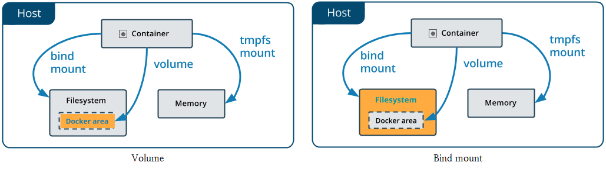

# Dockerfile

- Dockerfile
  - Docker 상에서 작동시킬 컨테이너의 구성 정보를 기술하기 위한 파일.
  - Dockerfile로 Docker 이미지를 생성하면 Dockerfile에 작성된 구성 정보가 담긴 이미지가 생성된다.


- Dockerfile의 기본 구문

  - Dockerfile은 텍스트 형식의 파일로, 에디터 등을 사용하여 작성한다.
  - Dockerfile 이외의 파일명으로도 동작하며, 확장자는 필요 없다.
  - 주석은 `#`을 사용하여 작성한다.
  - 주요 명령어
    - 소문자로 작성해도 동작하지만 관례적으로 대문자로 통일하여 사용한다.

  | 명령       | 설명               |      | 명령       | 설명                       |
  | ---------- | ------------------ | ---- | ---------- | -------------------------- |
  | FROM(필수) | 베이스 이미지 지정 |      | VOLUEM     | 볼륨 마운트                |
  | RUN        | 명령 실행          |      | USER       | 사용자 지정                |
  | CMD        | 컨테이너 실행      |      | WORKDIR    | 작업 디렉토리              |
  | LABEL      | 라벨 설정          |      | ARG        | Dockerfile 내의 변수       |
  | EXPOSE     | 포트 익스포트      |      | ONBUILD    | 빌드 완료 후 실행되는 명령 |
  | ENV        | 환경변수           |      | STOPSIGNAL | 시스템 콜 시그널 설정      |
  | ADD        | 파일/디렉토리 추가 |      | HEATHCHECK | 컨테이너의 헬스 체크       |
  | COPY       | 파일 복사          |      | SHELL      | 기본 쉘 설정               |
  | ENTRYPOINT | 컨테이너 실행 명령 |      |            |                            |


- FROM 명령어

  - Docker 컨테이너를 어떤 이미지로부터 생성할지 정의한다.
  - 다이제스트는 Docker Hub에 업로드하면 이미지에 자동으로 부여되는 식별자를 의미한다.
    - `docker image ls --digests ` 명령어를 통해 확인이 가능하다.

  ```dockerfile
  # 기본형
  FROM 이미지명
  # 태그를 생략할 경우 자동으로 latest 버전이 적용된다.
  FROM 이미지명:태그명
  # 다이제스트 사용
  FROM 이미지명@다이제스트
  ```


- ENV 명령어

  - Dockerfile 안에서 환경변수를 설정하고 싶을 때는 ENV 명령을 사용한다.
  - `key value`형으로 지정
    - 단일 환경변수에 하나의 값을 지정한다.
    - 첫 번째 공백 앞을 key로 설정하면 그 이후는 모두 문자열로 취급한다.
  - `key=value`로 지정
    - 한 번에 여러 개의 값을 설정할 때 사용한다.

  ```dockerfile
  ENV [key] [value]
  ENV [key]=[value]
  ```


- ARG 명령

  - Dockerfile 안에서 사용할 변수를 정의할 때 사용한다.

  - ENV로 생성한 환경변수와 달리  Dockerfile 내에서만 사용이 가능하다.

  ```dockerfile
  ARG <변수명>[=기본값]
  ```


-  ADD 명령

  - 이미지에 호스트 상의 파일 및 디렉토리를 추가할 때 사용한다.

  ```dockerfile
  ADD <호스트의 파일 경로> <Docker 이미지의 파일 경로>
  ```


- COPY 명령

  - 이미지에 호스트상의 파일이나 디렉토리를 복사할 때 사용한다.

  ```dockerfile
  COPY <호스트의 파일 경로> <Docker 이미지의 파일 경로>
  ```


- WORKDIR 명령
  -  dockerfile에서 정의한 명령을 실행하기 위한 작업용 디렉토리를 지정할 때 사용한다.
    -  RUN, CMD, ADD, ENTRYPOINT, COPY 등의 명령을 실행하기 위한 적업용 디렉토리를 지정한다.
    - 지정한 디렉토리가 존재하지 않으면 새로 작성한다.


- RUN 명령어

  - FROM 명령에서 지정한 베이스 이미지에 대해 애플리케이션/미들웨어를 설치 및 설정하거나 환경 구축을 위한 명령을 실행할 떄 사용한다.
  - Shell 형식으로 기술
    - 명령의 지정을 쉘에서 실행하는 방식으로 기술하는 방법.

  ```dockerfile
  # elasticsearch에 노리 형태소 분석기를 설치하는 예시
  RUN bin/elsticsearch-plugin install analysis-nori
  ```

  - Exec 형식으로 기술
    - Shell  형식으로 명령을 기술하면 /bin/sh에서 실행되지만, Exec 형식으로 기술하면 쉘을 경유하지 않고 직접 실행한다.
    - 따라서 명령 인수에 환경변수를 지정할 수 없다.
    - 실행하고 싶은 명령을  JSON  배열로 지정한다.

  ```dockerfile
  # elasticsearch에 노리 형태소 분석기를 설치하는 예시
  RUN ["bin/elasitcsearch-plugin", "-c", "install analysis-nori"]
  ```


- CMD 명령어
  - RUN 명령은 이미지를 작성하기 위해 실행하는 명령을 기술하는 반면 CMD 명령은 이미지를 바탕으로 생성된 컨테이너 안에서 실행할 명령을 기술한다.
  - 하나의  CMD 명령만을 기술할 수 있으며 복수의 명령을 작성하면 마지막 명령만 적용된다.
  - Exec  형식으로 기술
    - RUN 명령의 구문과 동일하다.
  - Shell  형식으로 기술
    - RUN 명령의 구문과 동일하다.
  - ENTRYPOINT 명령의 파라미터로 기술
    - ENTRYPOINT 명령의 인수로 CMD 명령을 사용할 수 있다.


- ENTRYPOINT 명령어
  - 데몬 실행
  - ENTRYPOINT 명령에서 지정한 명령은 `docker run` 명령을 실행했을 때 실행된다.
  - Exec  형식으로 기술
    - RUN 명령의 구문과 동일하다.
  - Shell  형식으로 기술
    - RUN 명령의 구문과 동일하다
  - CMD  명령과의 차이
    - `docker run` 명령 실행 시의 동작에 차이가 있다.
    -  CMD 명령의 경우는 컨테이너 시작 시에 실행하고 싶은 명령을 정의해도 `docker run` 명령 실행 시에 인수로 새로운 명령을 지정한 경우 이것을 우선 실행한다.
    - 반면 ENTRYPOINT 에서 지정한 명령은 반드시 컨테이너에서 실행되는데, 실행 시에 명령 인수를 지정하고 싶을 때는 CMD 명령과 조합하여 사용한다.
    - ENTRYPOINT 명령으로는 실행하고 싶은 명령 자체를 지정하고 CMD 명령으로는 그 명령의 인수를 지정하면, 컨테이너를 실행했을 때의 기본 작동을 결정할 수 있다.


- ONBUILD 명령
  - 빌드 완료 후, 다음 빌드에서 실행할 명령을 이미지 안에 설정하기 위한 명령이다.
    - ONBUILD 명령이 포함된 이미지를 빌드한다.
    - 빌드된 이미지를 베이스 이미지로 하여 다른 이미지를 빌드한다.
    - 이 때 ONBUILD에서 지정한 명령을 실행한다.


- Dockerfile의 빌드와 이미지 레이어 구조

  - Docker 이미지 만들기

  ```bash
  $ docker build -t [생성할 이미지명]:[태그명] [Dockerfile의 위치]
  ```

  - 이미지 레이어 구조
    - Dockerfile을 빌드하여 Docker 이미지를 작성하면 Dockerfile의 명령별로 이미지를 작성한다.
    - 작성된 여러 개의 이미지는 레이어 구조로 되어 있다.
    - 즉 이전 명령으로 생성된 이미지 파일 위에 다음 명령으로 생성된 이미지가 덮이는 형식이다.


- 멀티스테이지 빌드
  - 제품 환경에 필요한 것들만 빌드하기
    - 애플리케이션 개발 시에 개발 환경에서 사용한 라이브러리나 개발 지원 툴 등이 제품 환경에서 모두 사용되는 것은 아니다.
    - 제품 환경에서는 애플리케이션을 실행하기 위한 최소한의 실행 모듈만 배치하는 것이 리소스 관리나 보안 관점에서 볼 때 바람직하다.
  - Docker 파일 작성하기
    - Dockerfile 을 작성할 때 개발용과 제품용 2가지 이미지를 생성하도록 작성한다.
    - 예시는 p.165 참고


# Docker Compose

- Docker Compose
  - 여러 개의 Docker 컨테이너를 모아서 관리하기 위한 툴
  - docker-compose.yml 파일에 컨테이너의 구성 정보를 정의하여 동일 호스트상의 여러 컨테이너를 일괄적으로 관리한다.
    - 애플리케이션의 의존관계를 모아서 설정하는 것이 가낭흐다.
    - 이 정의를 바탕으로  docker-compose 명령을 실행하면 여러 개의 컨테이너를 모아서 시작하거나 정지할 수 있다.
    - 또한 컨테이너의 구성정보를 YAML 형식의 파일로 관리할 수 있으므로 지속적 배포도 용이하다.
    - YAML은 구조화된 데이터를 표현하기 위한 데이터 포맷이다.


## docker-compose.yml 파일의 구성

- 맨 앞에는 docker-compose의 버전을 지정한다.
  - 버전에 따라 기술할 수 있는 항목이 다르므로 주의해야 한다.


- image

  - Docker 컨테이너의 바탕이 되는 베이스 이미지를 지정한다.
  - 이미지명 또는 이미지 ID 중 하나를 지정한다.
  - 베이스 이미지가 로컬 환경에 있으면 그것을 사용하고, 없으면 Docker Hub에서 자동으로 다운로드한다.
    - 태그를 지정하지 않을 경우 자동으로 latest태그가 붙은 이미지를 다운로드한다.

  ```yaml
  elasticsearch:
    image: elasticsearch
  ```


- build

  - 이미지의 작성을 Dockerfile에 기술하고 그것을 자동으로 빌드하여 베이스 이미지로 지정할 때는 build를 지정한다.
  - build에는 docker-compose.yml이 있는 디렉토리를 기준으로 Dockerfile의 경로를 지정한다.
    - Dockerfile은 작성하지 않아도 자동으로 해당 경로의  Dockerfile이라는 이름의 파일을 찾아서 빌드한다.

  ```yaml
  elasticsearch:
    # dockerfile이 현재 디렉토리에 있을 경우
    build: .
  ```

  - Dockerfile의 파일명이 Dockerfile이 아닐 경우에는 context에 경로를. dockerfile에 Dockerfile이름을 넣는다.

  ```yaml
  elasticsearch:
    build: 
      # /data 경로에 있는 my-dockerfile이라는 이름의 Dockerfile로 빌드를 하려는 경우
      context: /data
      dockerfile: my-dockerfile
  ```

  - args로 인수를 지정하는 것도 가능하다.
    - bool 타입을 사용할 경우에는 따옴표로 둘러싸야 한다.
    - Docker Compose를 실행하는 머신 위에서만 유효하다.

  ```yaml
  elasticsearch:
    # dockerfile이 현재 디렉토리에 있을 경우
    build:
      args:
        va1:1
        va2:"true"
        va3:foo
  ```


- command/entrypoint

  - 컨테이너 안에서 작동하는 명령 지정
    - 베이스 이미지에 이미 명령이 지정되어 있을 경우 이미지의 명령을 덮어쓴다.
  - entrypoint는 명령을 나열하는 것도 가능하다.

  ```yaml
  command: 명령어
  
  entrypoint:
    - 명령어1
    - 명령어2
  ```


- links

  - 다른 컨테이너에 대한 링크 기능을 사용하여 연결할 때 사용한다.

  ```yaml
  links:
    - 컨테이너1
    - 컨테이너2
  ```


- ports/expose

  - 컨테이너 간 통신에 사용한다.
  - 컨테이너가 공개하는 포트는 ports로 지정한다.
    - `호스트 머신의 포트 번호 : 컨테이너의 포트 번호` 형식으로 지정하거나 컨테이너의 포트 번호만 지정한다.
    - 컨테이너의 포트 번호만 지정할 경우 호스트 머신의 포트는 랜덤한 값으로 설정된다.

  ``` yaml
  ports:
    - 호스트 머신의 포트 번호 : 컨테이너의 포트 번호
    - 컨테이너의 포트 번호
  ```

  - expose는 호스트 머신에 대한 포트를 공개하지 않고 링크 기능을 사용하여 연결하는 컨테이너에게만 포트를 공개할 때 사용한다.

  ``` yaml
  expose:
    - 컨테이너의 포트 번호1
    - 컨테이너의 포트 번호2
  ```


- depends_on

  - 여러 서비스의 의존관계를 정의할 때 사용한다.
    - 예를 들어 Kibana를 실행하기전에 ES를 먼저 실행시키고자 한다면 Kibana가 ES를 의존하도록 설정할 수 있다.
  - 주의할 점은 컨테이너의 시작 순서만 제어할 뿐 컨테이너상의 애플리케이션이 이용 가능해질 때까지 기다리는 것은 아니라는 것이다.

  ```yaml
  depends_on:
    - 컨테이너1
    - 컨테이너2
  ```


- environment/emv_file

  - 컨테이너 안의 환경변수를 지정할 때 사용한다.
    - `.env` 파일이라고 생각하면 된다.
  - YAML 배열 형식 또는 해시 형식 중 하나로 변수를 지정한다.
  
  ```yaml
  # 배열 형식
  environmnet:
    - FOO = bar
    - VAL
  
  # 해시 형식
  environmnet:
    FOO: bar
    VAL:
  ```
  
  - 설정하고자 하는 환경변수가 많을 때는 env_file을 지정한다.
  
  ```yaml
  env_file: <env 파일 경로>
  ```


- container_name/label

  - 컨테이너의 이름 또는 라벨을 붙일 때 사용한다.

  ```yaml
  container_name: 컨테이너이름
  ```

  - 컨테이너 라벨은 YAML 배열 형식 또는 해시 형식 중 하나로 지정 가능하다.


- volumes/volumes_from

  - 컨테이너에 볼륨을 마운트할 때 사용한다.
    - 호스트 측에서 마운트할 경로를 지정하려면 `호스트의 디렉토리 경로:컨테이너의 디렉토리 경로`

  ```yaml
  volumes:
    - <마운트할 경로>
    - <호스트의 디렉토리 경로>:<컨테이너의 디렉토리 경로>
  ```

  - 볼륨 지정 뒤에 ro를 지정하면 볼륨을 읽기 전용으로 마운트할 수 있다.

  ```yaml
  volumes:
    - <호스트의 디렉토리 경로>:<컨테이너의 디렉토리 경로>/:ro
  ```

  - 다른 컨테이너로부터 모든 볼륨을 마운트할 때는 volumes_from에 컨테이너명을 지정한다.

  ```yaml
  volumes_from:
    - 컨테이너명
  ```


## 명령어

- `docker-compose` 명령
  - `docker-compose` 명령은  docker-compose.yml을 저장한 디렉토리에서 실행된다.
  - 만일 현재 디렉토리 이외의 장소에 docker-compose.yml을 놓아 둔 경우 `-f` 옵션으로 파일 경로를 지정해야 한다.
    - 그 외에도 Docker Compose 파일을 docker-compose.yml 이외의 이름으로 설정한 경우에도 `-f` 옵션으로 Docker Compose  파일을 지정해 줘야 한다.
  - 서브 명령 다음에 컨테이너명을 지정하면 해당 컨테이너만 조작이 가능하다.


- Docker Compose의 버전 확인

  - Docker for Mac, Docker for Windows에 미리 설치되어 있다.

  ```bash
  $ docker-compose -v(--version)
  ```


- docker-compose에 정의된 컨테이너 생성 후 시작하기

  - `-d`: 백그라운드에서 실행한다.
  - `--no-deps`: 링크 서비스를 시작하지 않는다.
  - `--build`: 도커 컨테이너 시작시에 Dockerfile을 빌드한다.
  - `--no-build`: 이미지를 빌드하지 않는다.
  - `-t(--timeout)`: 컨테이너의 타임아웃을 초로 지정(기본 10초)한다.

  ```bash
  $ docker-compose up [옵션] [서비스명 .] 
  
  # 이름이 docker-compose.yml(yaml)이 아닌 파일로 실행
  $ docker-compose -f <파일명> up
  ```


- 여러 컨테이너 확인

  - 컨테이너 상태 확인
    - `-q`: 컨테이너 ID 확인

  ```bash
  $ docker-compose ps 
  ```

  - 컨테이너 로그 확인

  ```bash
  $ docker-compose logs
  ```


- 특정 컨테이너에서 명령 실행

  - 실행 중인 컨테이너에서 임의의 명령 실행

  ```bash
  $ docker-compose run <컨테이너 명> <명령>
  # docker-compose run es1 /bin/bash
  ```


- 여러 컨테이너 시작/정지/재시작

  - 특정 컨테이너만 조작하고 싶을 경우 뒤에 컨테이너명을 지정하면 된다.

  ```bash
  # 시작
  $ docker-compose start
  # 정지
  $ docker-compose stop
  # 재시작
  $ dockcer-compose restart
  ```


- 여러 컨테이너 일시 정지/재개

  ```bash
  # 일시 정지
  $ docker-compose pause
  # 재개
  $ docker-compose unpause
  ```


- 구성 확인

  - 공개용 포트 확인
    - `--protocol=proto`: 프로토콜, tcp 또는 udp
    - `--index=index`: 컨테이너의 인덱스 수

  ```bash
  $ docker-compose port [옵션] <서비스명> <프라이빗 포트 번호>
  ```

  - compose의 구성 확인

  ```bash
  $ docker-compose config
  ```


- 여러 컨테이너 강제 정지/삭제

  - `kill` 명령을 사용하면 컨테이너에 시그널을 송신할 수 있다.
    - 시그널이란 프로세스 간의 연락을 주고 받기 위한 장치로 리눅스 커널에 내장되어 있다.
    - 실행 중인 프로새스의 처리를 멈추고 다른 프로세스를 처리하고 싶은 경우나 프로세스를 강제 종료시키고자 할 때 사용한다.
  - 시그널 목록
    - `SIGHUP`: 프로그램 재시작
    - `SIGINT`: 키보드로 인터럽트, `ctrl+c`로 송신할 수 있다.
    - `SIGQUIT`: 키보드에 의한 중지, `ctrl+\`로 송신할 수 있다.
    - `SIGTERM`: 프로세스 정상 종료
    - `SIGKILL`: 프로세스 강제 종료
    - `SIGSTOP`: 프로세스 일시 정지
    - 지원하는 시그널의 종류는 `kill -l`명령으로 확인 가능하다.

  ```bash
  # 정지
  $ docker-compose kill
  # 예시, 컨테이너에게 SIGINT를 송신
  $ docker-compose kill -s SIGINT 
  # 삭제
  $ docker-compose rm
  ```


- 여러 리소스의 일괄 삭제

  - 실행중인 컨테이너를 중지시키고, Docker 이미지, 네트워크, 데이터 볼륨을 일괄적으로 삭제한다.
  - `--rmi all`: 모든 이미지 삭제(compose에 정의된 이미지가 아니어도 삭제된다)
  - `--rmi local`: 커스텀 태그가 없는 이미지만 삭제
  - `-v, --volumes`: Compose 정의 파일의 데이터 볼륨을 삭제

  ```bash
  $ docker-compose down
  ```


# docker volume

- Docker는 컨테이너의 데이터를 컨테이너 내부뿐 아니라 외부에도 저장한다.

  - bind mount
    - container의 데이터를 임의의 host 경로에 저장
  - volume
    - container의 데이터를 host의 /var/lib/docker/volume이라는 경로에 저장

  - tmpfs
    - host의 메모리에 저장
  - bind mount와 volume의 차이
    - volume은 오직 해당 volume을 사용하는 컨테이너에서만 접근이 가능하지만 bind bount 된 데이터는 다른 컨테이너 또는 호스트에서도 접근이 가능하다.
    - 바인드 마운트를 사용하면 호스트 시스템의 파일 또는 디렉토리가 컨테이너에 마운트 된다.
    - 바인드 마운트는 양방향으로 마운트되지만(즉, 호스트의 변경 사항이 컨테이너에도 반영되고 그 반대도 마찬가지), volume의 경우 호스트의 변화가 컨테이너 내부에는 반영되지 않는다.
    - volume의 경우  host 내부에 docker area 영역 안에서 관리된다.

  

  - 공식문서에서는 volume을 사용하는 것을 추천한다.
    - 백업이나 이동이 쉽다.
    - docker CLI 명령어로 볼륨을 관리할 수 있다.
    - 볼륨은 리눅스, 윈도우 컨테이너에서 모두 동작한다.
    - 컨테이너간에 볼륨을 안전하게 공유할 수 있다.
    - 볼륨드라이버를 사용하면 볼륨의 내용을 암호화하거나 다른 기능을 추가할 수 있다.
    - 새로운 볼륨은 컨테이너로 내용을 미리 채울 수 있다.


- volume

  - 볼륨 생성하기

  ```bash
  $ docker create volume <볼륨 이름>
  ```

  - volume 목록 보기

  ```bash
  $ docker volume ls
  ```

  - 특정  volume 상세 정보 보기

  ```bash
  $ docker volume inspect <볼륨 이름>
  ```

  - volume 마운트하기
    - `-v` 옵션 또는 `--mount` 옵션 사용

  ```bash
  $ docker run -v <볼륨 이름>:<컨테이너 경로> <이미지 이름>
  
  $ docker run --mount type=volume,source=<호스트 경로>,target=<도커 경로>
  ```

  - volume 삭제
    - cp를 통해 볼륨을 다른 디렉터리에 복제해도 rm 명령을 사용하면 **복제 된 volume도 삭제된다.**
  
  ``` bash
  $ docker volume rm <볼륨 이름>
  ```
  
  - 사용하지 않는 볼륨 일괄 삭제
  
  ```bash
  $ docker volume prune
  ```


- bind mount

  - volume과 달리 다른 컨테이너나 호스트도 파일의 내용에 접근이 가능하다.
  - 마운트하기
    - `-v` 옵션 또는 `--mount` 옵션 사용

  ```bash
  $ docker run -v <호스트 경로>:<컨테이너 경로> <이미지이름>
  
  $ docker run --mount type=bind,source=<호스트 경로>,target=<도커 경로>
  ```


- `-v(--volume)`와 `--mount`
  - 원래 독립형 컨테이너에서는 `-v`가 사용되었고, Docker cluster인 Swarm Mode의 Service에서는 `--mount`가 사용되었다.
    - 그러나 docker 17.06부터 독립형 컨테이너에서도 `--mount`의 사용이 가능해졌다.
    - 반면 Service에서는 오직 `--mount`만 사용이 가능하다.
  - `--mount`
    - key=value 쌍으로 설정한다.
    - source, target(혹은 destination, dst), type, readonly 등의 옵션을 지정 가능하다.
    - type에 volume, bind, tmpfs를 사용 가능하다.
    - readonly 옵션을 줄 경우 readonly 상태로 마운트된다.


- docker volume의 기본 경로 변경하기
  - https://stackoverflow.com/questions/36014554/how-to-change-the-default-location-for-docker-create-volume-command
  - https://stackoverflow.com/questions/50998486/change-source-path-of-volume
    - docker create volume 명령어와 동일하게 사용 가능한 듯 하다.
    - https://stackoverflow.com/questions/49950326/how-to-create-docker-volume-device-host-path 참고
    - https://stackoverflow.com/questions/59836742/docker-driver-opts-type-none none의 의미?
  - https://carpfish.tistory.com/entry/Docker-Data-Root-Directory-%EA%B2%BD%EB%A1%9C-%EB%B3%80%EA%B2%BD
  - https://stackoverflow.com/questions/38396139/docker-change-folder-where-to-store-docker-volumes
  - 위 글들 참고해서 추후 정리


# etc

## docker-entrypoint-initdb.d

- `docker-entrypoint-initdb.d`
  - DB 이미지들 중에는 컨테이너를 생성할 때 일련의 작업(DB 생성, table 생성, data 추가 등)이 자동으로 실행되도록 `docker-entrypoint-initdb.d`라는 폴더를 생성해주는 것들이 있다.
  - 컨테이너 내부의 `docker-entrypoint-initdb.d` 폴더에 volume을 설정하면 컨테이너가 최초로 실행될 때 `docker-entrypoint-initdb.d` 폴더 내부의 파일이 실행된다.


- 주의사항
  - 만일 컨테이너에 이미 volume이 존재한다면 `docker-entrypoint-initdb.d`에 실행할 파일을 넣어도 실행이 되지 않는다.
  - 따라서 반드시 volume을 삭제한 후에 실행해야 한다.


# 참고

- https://boying-blog.tistory.com/31

