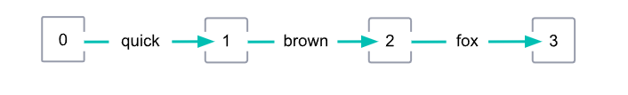
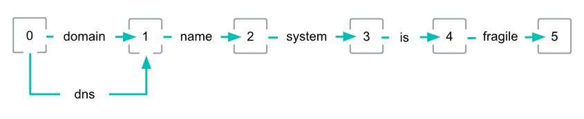

# Token graphs

> 모든 내용 및 그림의 출처는 [Elasticsearch 공식 문서](https://www.elastic.co/guide/en/elasticsearch/reference/current/token-graphs.html)

- Token graph

  - Tokenizer가 text를 token stream으로 변환할 때, 아래의 것들도 token에 함께 기록한다.
    - `position`: stream 내에서 token의 위치
    - `positionLength`: token이 걸쳐 있는 position들의 숫자
  - 이들을 사용하여, 유향 비순환 그래프(directed acyclic graph)를 만들 수 있다.
    - 이 유향 비순환 그래프를 token graph라 부른다.
    - Token graph에서 각 position들이 node가 되고, 각 token은 다음 position을 가리키는 edge가 된다.

  

  - Synonym
    - 어떤 token filter들은 이미 존재하는 token stream에 새로운 token을 추가할 수 있다(즉, position과 position 사이에 새로운 간선을 추가할 수 있다).
    - Synonym filter가 대표적인데, 이를 통해 생성된 synonym들은 종종 이미 존재하는 token들과 같은 position에 걸쳐있게 된다.
    - 아래 그림에서와 같이 quick과 그 synonym인 fast는 같은 position에 걸쳐있다.

  

  - Multi-position tokens
    - 어떤 token filter들은 여러 position에 걸쳐 있는 token들을 추가하기도 한다.
    - 그러나 graph token filters라고 알려진 일부 token filter들(`synonym_graph`, `word_delimiter_graph`) 만이 multi-position token들의 positionLength를 정확히 기록한다.
    - 또한 `nori_tokenizer`와 같은 일부 tokenizer만이 합성어 token을 multi-position token들로 정확히 분해한다.
    - 아래 그래프에서 domain name system과 그 synonym인 dns는 둘 다 position은 0이지만, dns의 positionLength는 3이다.
    - 그래프 내의 다른 token들의 positionLength는 기본 값인 1이다.

  

  - Token graph를 검색에 활용하기
    - 색인시에는 `postionLength`가 무시되고, multi-position token을 포함하는 multi-position tokens를 사용할 수 없다.
    - 그러나 match나 match_phrase 등의 query들은 단일 query string으로부터 여러 개의 sub query들을 만들기위해 token graph를 사용할 수 있다.
    - 예를 들어 "domain name system is fragile"을 검색어로 match_phrase query를 활용하여 검색하려한다고 가정해보자.
    - 검색시에 analyzer는 "domain name system"을 유의어로 등록된 dns로 변경하고, dns를 query string의 token stream에 아래 그림과 같이 추가한다.
    - dns token은 3의 `positionLength`를 가지므로, match_phrase query는 dns is fragile이라는 phrase를 가지는 sub query를 생성한다.

  

  - Invalid token graph

    - `synonym`, `word_delimiter`와 같은 token filter들은 multiple positions에 걸친 token을 추가 할 수는 있지만, `positionLength`는 정확히 기록하지 못하고, 기본 값인 1로만 저장한다.

    - 이는 위 두 개의 filter들은 위 두 filter로 추가된 token을 포함하는 token stream의 경우, 유효하지 않은 token graph를 생성한다는 의미이다.
    - 아래 그래프에서, dns는 multi-postiion synonym이지만, dns는 기본 positionLength인 1을 가지게 되고, 그 결과 유효하지 않은 token graph가 생성된다.

  

