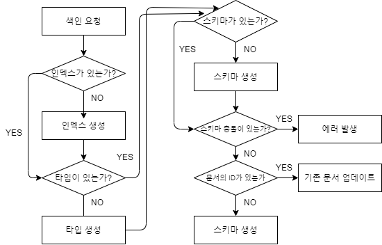

# 기본적인 데이터 처리

## 새로운 데이터 색인

- curl 명령의 기본 형식

  ```bash
  curl -X 메소드 'http://연결할 일레스틱 서치 노드의 호스트명:연결할 포트/색인명/_doc/문서id'
  ```

  - `-X` 
    - request시 사용할 메소드의 종류를 기술한다. 메소드와 띄어 써도 되지만 붙여 써도 된다.
    - 새로운 문서 입력은 PUT, 기존 문서의 수정은 POST, 삭제는 DELETE, 조회는 GET을 사용한다.
    - `-XGET`의 경우 생략이 가능하다.

  - _doc
    - ES5 버전 이하에서는 멀티 타입을 지원해서 하나의 인덱스 안에 다양한 타입의 데이터를 저장할 수 있었다.
    - ES6  버전부터는 하나의 인덱스에 하나의 타입만 저장할 수 있게 되었기에 본래 타입이 올 자리에 _doc을 입력한다.


- 삽입

  - curl을 활용하여 삽입
    - 파라미터로 들어간 `pretty` 또는 `pretty-true`는 JSON  응답을 더 보기 좋게 해준다.
    - `-H` 옵션은 header를 지정한다.
    - `-d` 옵션은 body를 지정한다.

  ```bash
  $ curl -XPUT 'localhost:9200/company/_doc/1?pretty' -H 'Content-Type: application/json' -d '{
  "name":"Theo",
  "age":"28"
  }'
  ```

  - 응답
    - 응답은 색인, 타입, 색인한 문서의 ID를 포함한다.

  ```json
  {
    "_index" : "company",
    "_type" : "colleague",
    "_id" : "1",
    "_version" : 1,
    "result" : "created",  // 새로 생성한 것이므로 created로 뜨지만, 수정할 경우 updated라고 뜬다.
    "_shards" : {
      "total" : 2,
      "successful" : 1,
      "failed" : 0
    },
    "_seq_no" : 0,
    "_primary_term" : 1
  }
  ```

  - POST 메서드로도 추가가 가능하다.
    - 둘의 차이는 POST의 경우 도큐먼트id를 입력하지 않아도 자동으로 생성하지만 PUT은 자동으로 생성하지 않는다는 것이다.

  - 실수로 기존 도큐먼트가 덮어씌워지는 것을 방지하기 위해 입력 명령어에 `_doc` 대신 `_create`를 사용해서 새로운 도큐먼트의 입력만 허용하는 것이 가능하다.
    - 이 경우 이미 있는 도큐먼트id를 추가하려 할 경우 오류가 발생한다.
    - 이미 위에서 도큐먼트id가 1인 도큐먼트를 추가했으므로 아래 예시는 오류가 발생한다. 

  ```json
  PUT company/_create/1
  
  {
      "nickname":"Theo",
      "message":"안녕하세요!"
  }
  ```


- 색인 과정

  


- 색인 생성과 매핑 이해하기(ES6부터는 하나의 인덱스에 하나의 타입만 저장할 수 있도록 변경)

  - curl 명령은 색인과 매핑타입을 자동으로 생성한다.
    - 위 예시에서 company라는 색인과 colleague라는 매핑 타입을 생성한 적이 없음에도 자동으로 생성되었다.
    - 수동으로 생성하는 것도 가능하다.
  - 색인을 수동으로 생성하기

  ```bash
  $ curl -XPUT 'localhost:9200/new-index'
  ```

  - 수동 생성의 응답

  ```json
  {
    "acknowledged" : true,
    "shards_acknowledged" : true,
    "index" : "test-index"
  }
  ```

  - 스키마 확인
    - 스키마를 보기 위해 url에 `_mapping`을 추가한다.
    - ES 6.x 이상의 경우 _doc타입이 아닌 타입을 따로 지정했을 경우 아래와 같이 `include_type_name=true` 또는 `include_type_name`을 파라미터로 넣어야 한다.

  ```bash
  $ curl 'localhost:9200/company/_mapping/colleague?include_type_name&pretty'
  ```

  - 응답
    - 색인 명, 타입, 프로퍼티 목록, 프로퍼티 옵션 등의 데이터가 응답으로 넘어 온다.

  ```json
  {
    "company" : {
      "mappings" : {
        "colleague" : {
          "properties" : {
            "age" : {
              "type" : "text",
              "fields" : {
                "keyword" : {
                  "type" : "keyword",
                  "ignore_above" : 256
                }
              }
            },
            "name" : {
              "type" : "text",
              "fields" : {
                "keyword" : {
                  "type" : "keyword",
                  "ignore_above" : 256
                }
              }
            }
          }
        }
      }
    }
  }
  ```


## 데이터 검색

- 검색하기

  - 검색을 위해 데이터를 더 추가

  ```bash
  $ curl -XPUT 'localhost:9200/company/colleague/2?pretty' -H 'Content-Type: application/json' -d '{
  "name":"Kim",
  "age":"26"
  }'
  $ curl -XPUT 'localhost:9200/company/colleague/3?pretty' -H 'Content-Type: application/json' -d '{
  "name":"Lee",
  "age":"27"
  }'
  $ curl -XPUT 'localhost:9200/company/colleague/4?pretty' -H 'Content-Type: application/json' -d '{
  "name":"An",
  "age":"27"
  }'
  ```

  - 데이터 검색하기
    - `q`파라미터는 검색할 내용이 들어간다.
    - 특정 필드에서만 찾고자 할 때는 `q=name:Kim`과 같이 작성하면 된다.
    - 아래와 같이 필드를 지정해주지 않을 경우 `_all`이라는 모든 필드의 내용을 색인하는 필드가 자동으로 들어가게 된다.
    - `_source` 파라미터는 특정 필드만 반환되도록 한다(유사한 파라미터로 `stored_fileds`가 있다).
    - `size` 파라미터는 일치하는 데이터들 중 반환할 데이터의 수를 지정한다(기본값은 10이다).

  ```json
  $ curl "localhost:9200/company/colleague/_search?q=Kim&_source=name&size=1&pretty"
  ```


- 어디를 검색할지 설정하기

  - 다수의 타입에서 검색하기
    - url에서 타입을 콤마로 구분하여 검색하면 된다.
    - ES 6.X 부터 매핑 타입이 사라짐에 따라 쓸 일이 없는 기능이 되었다.

  ```bash
  $ curl "localhost:9200/company/colleague, department/_search?q=Kim&_source=name&size=1&pretty"
  ```

  - 모든 타입에서 검색하기
    - 타입을 지정하지 않고 검색하면 된다.
    - 역시 ES 6.X 부터 매핑 타입이 사라짐에 따라 쓸 일이 없는 기능이 되었다.

  ```bash
  $ curl "localhost:9200/company/_search?q=Kim&_source=name&size=1&pretty"
  ```

  - 다수의 색인을 검색하기
    - url에서 인덱스를 콤마로 구분하여 검색하면 된다.
    - 만일 검색하려는 색인이 없는 경우 에러가 발생하는데 에러를 무시하려면 `ignore_unavailable` 플래그를 주면 된다.

  ```bash
  $ curl "localhost:9200/company,fruits/_search?q=Kim&_source=name&size=1&pretty"
  
  # 없는 인덱스도 포함해서 검색하기
  $ curl "localhost:9200/company,fruits/_search?q=Kim&_source=name&size=1&pretty&ignore_unavailable"
  ```

  - 모든 색인을 검색하기
    - url의 색인이 올 자리에 `_all`을 입력하거나 아예 색인을 빼면 모든 색인에서 검색한다.

  ```bash
  $ curl "localhost:9200/_all/_search?q=Kim&_source=name&size=1&pretty"
  
  $ curl "localhost:9200/_search?q=Kim&_source=name&size=1&pretty"
  ```


- 응답 내용

  - 요청

  ```bash
  $ curl "localhost:9200/company/colleague/_search?q=Kim&_source=name&size=1&pretty"
  ```

  - 응답

  ```json
  {
    // 요청이 얼마나 걸렸으며, 타임아웃이 발생했는가
    "took" : 1,
    "timed_out" : false,
    // 몇 개의 샤드에 질의 했는가
    "_shards" : {
    "total" : 1,
      "successful" : 1,
      "skipped" : 0,
      "failed" : 0
    },
    "hits" : {
      // 일치하는 모든 문서에 대한 통계
      "total" : {
        "value" : 1,
        "relation" : "eq"
      },
      "max_score" : 0.6931471,
      // 결과 배열
      "hits" : [
        {
          "_index" : "company",
          "_type" : "colleague",
          "_id" : "2",
          "_score" : 0.6931471,
          "_source" : {
            "name" : "Kim"
          }
        }
      ]
    }
  }
  ```

  - 시간
    - `took` 필드는 ES가 요청을 처리하는 데 얼마나 걸렸는지 말해준다(단위는 밀리 초).
    - `timed_out` 필드는 검색이 타임아웃 되었는지 보여준다.
    - 기본적으로 검색은 절대로 타임아웃이 되지 않지만, 요청을 보낼 때`timeout` 파라미터를 함께 보내면 한계를 명시할 수 있다.
    - `$ curl "localhost:9200/_search?q=Kim&timeout=3s"`와 같이 작성할 경우 3초가 지나면 타임아웃이 발생하고 `timed_out`필드의 값은 true가 된다.
    - 타임아웃이 발생할 경우 타임아웃될 때까지의 결과만 반환된다.
  - 샤드
    - 총 몇 개의 샤드에 질의 했고 성공한 것과 스킵한 것, 실패한 것에 대한 정보를 반환한다.
    - 만일 특정 노드가 이용 불가 상태라 해당 노드의 샤드를 검색하지 못했다면 질의에 실패한 것이 된다.
  - 히트 통계
    - `total`은 전체 문서 중 일치하는 문서 수를 나타낸다.
    - `total`은 `size`를 몇으로 줬는지와 무관하게 일치하는 모든 문서의 수를 표시해주므로 total과 실제 반환 받은 문서의 수가 다를 수 있다.
    - `max_score`는 일치하는 문서들 중 최고 점수를 볼 수 있다.
  - 결과 문서
    - 히트 배열에 담겨 있다.
    - 일치하는 각 문서의 색인, 타입, ID, 점수 등의 정보를 보여준다.


- 쿼리로 검색하기

  - 지금까지는 URI 요청으로 검색했다.
    - 간단한 검색에는 좋지만 복잡한 검색에는 적절치 못한 방법이다.
  - `query_string` 쿼리 타입으로 검색하기
    - 쿼리스트링 타입의 쿼리를 실행하는 명령문이다.
    - `default_field`는 검색을 실행할 필드를 특정하기 위해 사용한다.
    - `default_operator`는 검색할 단어들이 모두 일치하는 문서를 찾을 지, 하나라도 일치하는 문서를 찾을지를 설정한다(기본값은 OR로 하나라도 일치하는 문서는 모두 찾는다).
    - 위 두 옵션(`default_field`, `default_operator`)을 다음과 같이 쿼리 스트링 자체에 설정하는 것도 가능하다.
    - `"query":"name:Kim AND name:Lee"`

  ```bash
  $ curl 'localhost:9200/company/colleague/_search?pretty' -H 'Content-Type: application/json' -d '{
    "query":{
      "query_string":{
        "query":"Kim",
        "default_field":"name",
        "default_operator":"AND"
      }
    }
  }'
  ```

  - 응답

  ```json
  {
    "took" : 1,
    "timed_out" : false,
    "_shards" : {
      "total" : 1,
      "successful" : 1,
      "skipped" : 0,
      "failed" : 0
    },
    "hits" : {
      "total" : {
        "value" : 1,
        "relation" : "eq"
      },
      "max_score" : 0.6931471,
      "hits" : [
        {
          "_index" : "company",
          "_type" : "colleague",
          "_id" : "2",
          "_score" : 0.6931471,
          "_source" : {
            "name" : "Kim",
            "age" : "26"
          }
        }
      ]
    }
  }
  ```


- 필터 사용(ES 6.X 부터 사용 불가)

  - 필터는 결과에 점수를 반환하지 않는다.
    - 쿼리는 결과와 함께 각 결과의 점수를 반환한다.
    - 필터는 오직 키워드가 일치하는지만 판단하여 일치하는 값들을 반환한다.
  - 필터 검색

  ```bash
  $ curl 'localhost:9200/_search?pretty' -H 'Content-Type: application/json' -d '{
    "query":{
    	"filtered":{
    	  "filter":{
      	"term" :{
            "name":"Kim"
          }
    	  }
    	}    
    }
  }'
  ```


- ID로 문서 가져오기

  - 검색은 준실시간인데 반해 문서 ID로 문서를 찾는 것은 실시간이다.
  - 특정 문서를 가져오려면 문서가 속한 색인과 타입, 그리고 ID를 알아야 한다.
    - 그러나 타입은 현재 사라졌기 때문에 type 자리에 `_doc`을 입력하여 검색한다.
    - 타입을 입력해도 검색은 되지만 경고문이 뜬다.

  ```json
  // _doc 사용
  $ curl 'localhost:9200/company/_doc/1?pretty'
  
  // 타입 사용
  $ curl 'localhost:9200/company/colleague/1?pretty'
  ```

  - 응답
    - 만일 찾는 문서가 존재하지 않으면 아래 `found`는 false가 된다.

  ```json
  {
    "_index" : "company",
    "_type" : "_doc",
    "_id" : "1",
    "_version" : 5,
    "_seq_no" : 5,
    "_primary_term" : 1,
    "found" : true,
    "_source" : {
      "name" : "Theo",
      "age" : "28"
    }
  }
  ```


## 데이터 수정, 삭제

- 삭제

  - 도큐먼트 또는 인덱스 단위의 삭제가 가능하다.
    - 도큐먼트를 삭제하면 `"result":"deleted"`가 반환된다.
    - 도큐먼트는 삭제되었지만 인덱스는 남아있는 경우, 삭제된 도큐먼트를 조회하려하면 `"found":false`가 반환된다.
    - 삭제된 인덱스의 도큐먼트를 조회하려고 할 경우(혹은 애초에 생성된 적 없는 도큐먼트를 조회할 경우) 에러가 반환된다.

  - 도큐먼트를 삭제하는 경우

  ```json
  DELETE office/_doc/1
  ```

  - 도큐먼트 삭제의 응답

  ```json
  {
      "_index": "office",
      "_type": "_doc",
      "_id": "1",
      "_version": 2,
      "result": "deleted",
      "_shards": {
          "total": 2,
          "successful": 1,
          "failed": 0
      },
      "_seq_no": 1,
      "_primary_term": 1
  }
  ```

  - 삭제된 도큐먼트를 조회

  ```json
  GET office/_doc/1
  ```

  - 삭제된 도큐먼트를 조회했을 경우의 응답

  ```json
  {
      "_index": "office",
      "_type": "_doc",
      "_id": "1",
      "found": false
  }
  ```

  - 인덱스를 삭제

  ```json
  DELETE office
  ```

  - 인덱스 삭제의 응답

  ```json
  {
      "acknowledged": true
  }
  ```

  - 삭제된 인덱스의 도큐먼트를 조회

  ```json
  GET office/_doc/1
  ```

  - 응답

  ```json
  {
      "error": {
          "root_cause": [
              {
                  "type": "index_not_found_exception",
                  "reason": "no such index [office]",
                  "resource.type": "index_expression",
                  "resource.id": "office",
                  "index_uuid": "_na_",
                  "index": "office"
              }
          ],
          "type": "index_not_found_exception",
          "reason": "no such index [office]",
          "resource.type": "index_expression",
          "resource.id": "office",
          "index_uuid": "_na_",
          "index": "office"
      },
      "status": 404
  }
  ```

  - 전체 도큐먼트 삭제하기
    - `_delete_by_query`를 이용하여 모든 도큐먼트가 매치되도록해서 삭제한다.

  ```bash
  POST <인덱스명>/_delete_by_query
  {
    "query": {
      "match_all": {}
    }
  }
  ```

  

- 수정

  - 위에서 삭제한 데이터를 다시 생성했다고 가정
  - 수정 요청

  ```json
  POST 인덱스이름/_delete_by_query
  
  {
      "nickname":"Oeht",
      "message":"!요세하녕안"
  }
  ```

  - 응답

  ```json
  {
      "_index": "office",
      "_type": "_doc",
      "_id": "1",
      "_version": 2,
      "result": "updated",
      "_shards": {
          "total": 2,
          "successful": 1,
          "failed": 0
      },
      "_seq_no": 1,
      "_primary_term": 1
  }
  ```

  - 수정할 때 특정 필드를 뺄 경우 해당 필드가 빠진 채로 수정된다.
    - POST 메서드로도 수정이 가능한데 POST 메서드를 사용해도 마찬가지다.

  ```json
  // 요청
  POST office/_doc/1
  
  {
      "nickname":"Theo"
  }
  
  // 응답
  {
      "_index": "office",
      "_type": "_doc",
      "_id": "1",
      "_version": 2,
      "_seq_no": 9,
      "_primary_term": 1,
      "found": true,
      "_source": {
          // message 필드가 사라졌다.
          "nickname": "Theo"
      }
  }
  ```

  - `_update`
    - `_update`를 활용하면 일부 필드만 수정하는 것이 가능하다.
    - 업데이트 할 내용에 `"doc"`이라는 지정자를 사용한다.

  ```json
  // 도큐먼트id가 2인 새로운 도큐먼트를 생성했다고 가정
  POST office/_update/2
  
  {
      "doc":{
          "message":"반갑습니다.!"
      }
  }
  ```

  - 응답

  ```json
  {
      "_index": "office",
      "_type": "_doc",
      "_id": "2",
      "_version": 2,
      "_seq_no": 0,
      "_primary_term": 1,
      "found": true,
      "_source": {
          "nickname": "Oeht",
          "message": "반갑습니다!"
      }
  }
  ```


# 데이터 검색

## Search API

- 엘라스틱서치에서 검색을 실행할 때 어떤 일이 일어나는가?
  - 가장 기본적인 검색 라우팅 기능인 query_then_fetch를 기준으로 설명한다.
    - 라우팅 기능은 변경이 가능하다.
  - 과정
    - 검색 애플리케이션이 하나의 노드를 선택하고 선택한 노드에 검색 요청을 보낸다.
    - 요청을 받은 노드는 모든 노드의 모든 샤드에 검색 요청을 보낸다.
    - 모든 샤드에서 정렬 및 순위를 매긴 결과로부터 충분한 정보를 수집하면, 오직 반환될 도큐먼트 내용을 담고 있는 샤드만 해당 내용을 반환하도록 요청 받는다.


- search API

  - 모든 search API 검색 요청은 _search REST end point를 사용하고 GET이나 POST 요청 중 하나가 된다.
    - end point는 path라고도 불리며 URL에서 호스트와 포트 이후의 주소를 말한다.
  - 간단한 형태의 URI Search 형태를 제공한다.
  
  ```bash
  /인덱스명/_search?q=쿼리
  ```
  
  - RequestBody Search 형태도 제공한다.
  
  ```bash
  /인덱스명/_search
  {
    "query":{
      "term":{
        "field1":"test"
      }
    }
  }
  ```
  
    - 인덱스명에 한 개 이상의 인덱스를 지정해서 다수의 인덱스에 동시에 쿼리를 날릴 수 있다.
    - 아래와 같이 인덱스명이 올 자리에 `_all`을 입력하면 모든 인덱스에 쿼리를 날린다.
  
  ```bash
  curl "localhost:9200/_all/_search?q=쿼리"
  ```


- 검색 요청의 기본 구성 요소

  - 구성 요소는 반환할 도큐먼트 개수를 제어하고, 최적의 도큐먼트를 선택하기 하며, 원치 않는 도큐먼트는 결과에서 걸러내도록 한다.
  - q(query)
    - 검색 요청에 있어 가장 중요한 구성 요소.
    - 점수 기반으로 최적의 도큐먼트를 반환하거나 원치 않는 도큐먼트를 걸러내도록 설정한다.
    - 이 구성 요소는 쿼리와 DSL 필터를 사용해서 구성한다.
  - size
    - 반환할 도큐먼트 개수를 의미한다.
  - from
    - size와 함께 페이지 매김(pagination)에 사용한다.

  - _source
    - _source 필드를 어떻게 반환할 것인가를 명시한다.
    - 기본값은 완전한 _source 필드를 반환하는 것이다.
    - _source 설정으로 반환되는 필드를 걸러낼 수 있다.
    - 색인된 도큐먼트가 크고 결과에서 전체 내용이 필요하지는 않을 때 사용한다.
    - 이 옵션을 사용하려면, 색인 매핑에서 _source 필드를 비활성화하지 않아야 한다.
  - sort
    - 기본 정렬은 도큐먼트 점수에 따른다.
    - 점수 계산이 필요 없거나 동일 점수의 다수 도큐먼트가 예상된다면, sort를 추가해서 원하는 대로 순서를 제어할 수 있다.


- URI Search

  - URL 기반 검색 요청은 curl로 요청할 때 유용하다.
    - 그러나 모든 검색 기능이 URL 기반 검색을 사용할 수 있는 것은 아니다.
  - form과 size를 활용
    - from의 기본 값은 0, size의 기본 값은 10이다.
    - from으로 결과의 시작 위치를 지정하고, size로 각 결과 페이지의 크기를 지정한다.
    - from이 7이고, size가 3인 경우, ES는 8, 9, 10 번째 결과를 반환한다.
  - 이들 두 개의 파라미터가 전달되지 않았다면 ES는 첫 결과의 시작(0번째)을 기본 값으로 사용하고 응답 결과와 함께 10건의 결과를 전송한다.

  ```bash
  $ curl 'localhost:9200/인덱스명/_search?from=7&size=3'
  ```

  - sort를 활용
    - 일치하는 모든 도큐먼트를 날짜 오름차순으로 정렬한 결과 중 최초 10개를 반환한다.

  ``` bash
  $ curl 'localhost:9200/인덱스명/_search?sort=date:asc'
  ```
    - _source를 활용
      - 검색 결과의 일부 필드만 요청하도록 설정
        - title과 date _source 필드에 포함되어 반환된다.

  ```bash
  $ curl 'localhost:9200/인덱스명/_search?_source=title,date'
  ```

    - q를 활용
        - title 필드에 elasticsearch라는 단어를 포함하는 도큐먼트만 검색

  ```bash
  $ curl 'localhost:9200/인덱스명/_search?q=title:elasticsearch'
  ```


- RequestBody Search

  - 본문 기반 검색 요청은 유연하면서 더 많은 옵션을 제공한다.
  - from과 size를 활용

  ```bash
  $ curl 'localhost:9200/인덱스명/_search'-H 'Content-Type: application/json' -d '{
  "query":{
    "match_all":{}
  },
  "from":10,
  "size":10
  }'
  ```

  - _source를 활용
    - _source를 활용하면 개별 도큐먼트에서 반환할 필드 목록을 지정할 수 있다.
    - _source를 지정하지 않는다면, 엘라스틱서치는 기본적으로 도큐먼트의 _source 전체를 반환하거나 저장된 _source가 없다면 일치하는 _id, _type, _index, _socre와 같은 도큐먼트에 관한 메타데이터만 반환한다.
    - 아래 명령어는 검색의 응답으로 name과 date 필드만 반환하라는 것이다.

  ```bash
  $ curl 'localhost:9200/인덱스명/_search'-H 'Content-Type: application/json' -d '{
  "query":{
    "match_all":{}
  },
  "_source":["name","date"]
  }'
  ```

  - _source를 활용하여 원하는 필드만 가져오기
    - 필드 목록을 각각 지정해서 반환하는 것 외에도 와일드카드를 사용할 수도 있다.
    - 예를 들어 name과 nation 필드 둘 다 반환하려면 "na*"와 같이 지정하면 된다.
    - exclude 옵션을 사용하여 반환하지 않을 필드도 지정할 수 있다.
    - 아래 명령은 location 필드(object 타입)를 모두 반환하지만 location의 하위 필드 중 geolocation은 빼고 반환하라는 것이다.

  ```bash
  $ curl 'localhost:9200/인덱스명/_search'-H 'Content-Type: application/json' -d '{
  "query":{
    "match_all":{}
  },
  "_source":{
    "include": ["location.*"],
    "exclude": ["location.geolocation"]
  }
  }'
  ```

  - sort를 통한 정렬
    - 정렬 순서를 지정하지 않으면, ES는 일치한 도큐먼트를 _score 값의 내림차순으로 정렬해서 가장 적합성이 높은(가장 높은 점수를 가진) 도큐먼트 순서로 반환한다.
    - sort 옵션은 keyword나 integer와 같이 not analyzed가 기본인 필드를 기준으로 해야 한다.
  - 아래 예시는 먼저 생성일을 기준으로 오름차순 정렬을 하고, 그 다음 name을 알파벳 역순으로 정렬한 후, 마지막으로 _socre 값으로 정렬을 하라는 명령어다.
  
  ```bash
  $ curl 'localhost:9200/인덱스명/_search'-H 'Content-Type: application/json' -d '{
  "query":{
    "match_all":{}
  },
  "sort":{
    {"created_on":"asc"},
    {"name":"desc"},
    "_score"
  }
  }'
  ```
  
  - highlight 옵션을 활용한 검색
    - 검색 결과 중 어떤 부분이 쿼리문과 일치하여 검색되었는지 궁금할 때 사용한다.
    - 검색 결과 중 어떤 필드에 highlighting 효과를 줄 거것인지 설정할 수 있다.
    - 이 결과는 _source 필드가 아닌 별도의 highlight라는 필드를 통해 제공된다.
    - 별도의 추가 옵션을 통해 다양한 표현식을 연출할 수 있다(공식 도움말 참고)
  
  ```bash
  $ curl 'localhost:9200/인덱스명/_search'-H 'Content-Type: application/json' -d '{
  "query":{
    "term":{"title":"Elasticsearch"}
  },
  "highlight": {
    "fileds":{"title":{}}
  }
  }'
  ```
  
  - boost를 통함 검색
    - 검색 결과로 나온 스코어를 변경할 때 사용한다.
    - 특정 검색 쿼리의 스코어를 높이거나 낮추고 싶을 때 boost 옵션을 활용하면 검색 결과로 나온 스코어를 대상으로 boost 옵션에 설정된 값을 곱한 값이 스코어로 지정된다(따라서 낮게 주고 싶을 경우 소수점을 활용하면 된다).
    - boost 옵션을 사용할 때는 match 쿼리와 term 쿼리 중 어떤 것을 사용하는가에 각기 다른 옵션을 줘야 한다.
  
  ```bash
  # match 쿼리
  $ curl 'localhost:9200/인덱스명/_search'-H 'Content-Type: application/json' -d '{
  "query":{
    "match":{
      "title":{
        "query":"Elasticsearch",
        "boost":4
      }
  },
  }'
  
  # term 쿼리
  $ curl 'localhost:9200/인덱스명/_search'-H 'Content-Type: application/json' -d '{
  "query":{
    "term":{
      "title":{
        "value":"Elasticsearch",
        "boost":4
      }
  },
  }'
  ```
  
  - scroll 옵션을 활용하여 검색
    - 검색 결과를 n개 단위로 나눠서 볼 때 사용한다.
    - from/size와 유사해 보이지만 검색 당시의 스냅샷을 제공해 준다는 점에서 다르다.
    - from/size를 통해 pagination을 하는 동안에 새로운 문서가 추가되면 기존 검색 결과에 영향을 줄 수 있지만, scroll 옵션을 사용하면 새로운 문서가 추가된다고 해도 scroll id가 유지되는 동안에는 검색 결과가 바뀌지 않는다.
    - scroll 옵션은 API 호출 시 인자로 scroll_id를 유지하는 기간을 설정해야 하는데(최초 1회만) 이는 힙 메모리 사용량에 영향을 주기 때문에 반드시 필요한 만큼만 설정해야 한다.
  
  ```bash
  # 최초 1회
  $ curl 'localhost:9200/인덱스명/_search?scroll=1m'-H 'Content-Type: application/json' -d '{
  "query":{
    "match":{
      "title":"Elasticsearch"
    }
  },
  }'
  
  # 이후
  $ curl 'localhost:9200/인덱스명/_search?scroll'-H 'Content-Type: application/json' -d '{
  "query":{
    "match":{
      "title":"Elasticsearch"
    }
  },
  }'
  ```


## Query DSL

- Query DSL(Domain Specific Language)
  - search API에서 가장 중요한 부분을 담당한다.
  - 검색 쿼리라고도 불린다.


- Query Context와 Filter Context로 분류한다.
  - Query Context
    - Full text search를 의미한다.
    - 검색어가 문서와 얼마나 매칭되는지를 표현하는 score라는 값을 가진다.
    - analyzer를 활용하여 검색한다.
  - Filter Context
    - Term Level Query라고도 부른다.
    - 검색어가 문서에 존재하는지 여부를 Yes나 No 형태의 검색 결과로 보여준다. 
    - score 값을 가지지 않는다.
    - analyzer를 활용하지 않는다.


### Query Context

- match 쿼리

  - 검색어로 들어온 문자열을 analyzer를 통해 분석한 후 역색인에서 해당 문자열의 토큰을 가지고 있는 문서를 검색한다.
    - 문서의 해당 필드에 설정해 놓은 analyzer를 기본으로 사용한다.
    - 별도의 analyzer를 사용할 때는 직접 명시해 주면 된다.

  - 토큰이 둘 이상일 경우 꼭 두 토큰을 모두 포함하는 문서만을 반환하는 것은 아니다.
    - score를 계산하여 score 순으로 문서를 반환한다.
  - match 쿼리는 어떤 토큰이 먼저 있는지에 대한 순서는 고려하지 않는다.
    - 즉 python guide가 들어오든 guide python이 들어오든 같은 결과를 보여준다.

  ```bash
  $ curl 'localhost:9200/인덱스명/_doc/_search' -d '{
  "query": {
    "match": {
      "title": "hadoop"
    }
  }
  }'
  ```


- match_phrase 쿼리

  - match_phrase는 match 쿼리와 달리 검색어의 순서도 고려한다.
    - 즉 아래의 경우 title에 guide가 python보다 먼저 나오는 문서는 검색 되지 않는다.

  ```bash
  $ curl 'localhost:9200/인덱스명/_doc/_search' -d '{
  "query": {
    "match_phrase": {
      "title": "python guide"
    }
  }
  }'
  ```


- match_all 쿼리

  - 모든 도큐먼트를 일치하게 한다.
    - 즉 모든 도큐먼트를 반환한다.

  - 사용

  ```bash
  $ curl 'localhost:9200/인덱스명/_search' -H 'Content-Type: application/json' -d '{
  "query": {
    "match_all":{}
  }
  }'
  ```


- mutli_match 쿼리

  - match와 동일하지만 두 개 이상의 필드에 match 쿼리를 날릴 수 있다.

  ```bash
  $ curl 'localhost:9200/인덱스명/_doc/_search' -H 'Content-Type: application/json' -d '{
  "query": {
    "multi_match":{
      "query": "텀",
      "fields": ["필드1", "필드2"] 
    }
  }
  }'
  ```


- query_string 쿼리

  - 모든 필드를 검색하는 것이 가능하다.
    - 기존에는 `"fields":"_all"` 속성을 줘서 모든 필드에서 검색이 가능했지만 6.X 버전부터 막혔다.
    - 이제는 필드에 `copy_to` 속성을 줘서 모든 필드를 검색하는 기능을 구현할 수 있다.
    - 그러나 query_string은 굳이 모든 필드에 `copy_to` 속성을 주지 않아도 모든 필드를 검색하는 것이 가능하다.
  - and나 or 같은 검색어 간 연산이 필요한 경우에 사용한다.
  - 경우에 따라서 match 쿼리나 multi_match와 동일하게 동작할 수도 있고 정규표현식 기반의 쿼리가 될 수도 있다.
    - 와일드카드 검색도 가능하다.
    - 그러나 query_string을 통한 와일드 카드 검색은 스코어링을 하지 않을 뿐더러(모든 score가 1로 계산), 성능도 좋지 않기에 사용을 자제해야 한다. 
  - 요청 URL을 사용하여 검색

  ```bash
  $ curl 'localhost:9200/인덱스명/_search?q=텀'
  ```

  - 본문 기반 검색

  ```bash
  $ curl 'localhost:9200/인덱스명/_search' -H 'Content-Type: application/json' -d '{
  "query":{
    "query_string":{
    "query":"텀"
    }
  }'
  ```

  - 기본적으로 query_string 필드는 _all 필드를 검색한다.
    - 특정 필드를 지정하는 것이 가능하다.

  ```bash
  $ curl 'localhost:9200/인덱스명/_search?q=필드명:텀'
  
  $ curl 'localhost:9200/인덱스명/_search' -H 'Content-Type: application/json' -d '{
  	"query":{
  		"query_string":{
  			"fields":"필드",
  			"query":"텀"
  	}
  }'
  ```


  - 이 밖에 다양한 쿼리 스트링 문법이 존재하는데 자세한 내용은 아래 링크 참조

  > https://www.elastic.co/guide/en/elasticsearch/reference/current/query-dsl-query-string-query.html


### Filter Context

- term 쿼리

  - ES에서 term은 검색어를 말한다.
  - 역색인에 있는 토큰들 중 정확하게 일치하는 값을 찾는다.
    -  match 쿼리와 달리 검색어를 analyze하지 않는다.
    - analyze를 하지 않기 때문에 당연히 대소문자를 구분한다.
  - 필드와 term을 지정해서 도큐먼트 내에서 검색할 수 있다.
    - 검색한 텀이 분석되지 않았기 때문에 완전히 일치하는 도큐먼트 결과만 찾는다.
  - 예제
    - 특정 term이 특정 필드에 있으면 해당 도큐먼트의 name과 tags를 반환한다.
  
  ```bash
  $ curl 'localhost:9200/인덱스명/_doc/_search' -H 'Content-Type: application/json' -d '{
  "query":{
    "term":{
      "필드": "텀"
    }
  },
  "_source":["name","tags"]
  }'
  ```


- terms 쿼리

  - 둘 이상의 term을 검색할 때 사용하는 쿼리.
  - 예제

  ```bash
  $ curl 'localhost:9200/인덱스명/_doc/_search' -H 'Content-Type: application/json' -d '{
  "query":{
    "term":{
      "필드": ["텀1","텀2"]
    }
  },
  "_source":["name","tags"]
  }'
  ```

  - 도큐먼트에서 최소 개수의 텀 일치를 강제하려면 `minimum_should_match` 파라미터를 설정한다.

  ```bash
  $ curl 'localhost:9200/인덱스명/_doc/_search' -H 'Content-Type: application/json' -d '{
  "query":{
    "term":{
      "필드": ["텀1","텀2"],
      "minimum_should_match":2
    }
  },
  "_source":["name","tags"]
  }'
  ```


- range 쿼리

  - 범위를 지정하여 특정 값의 범위 이내에 있는 경우를 검색할 때 사용한다.
    - 아래 예시는 release_date를 기준으로 특정 범위 내의 값들을 검색하는 예시이다.

  ```bash
  $ curl "localhost:9200/인덱스명/_search?pretty" -H 'Content-type:application/json' -d '{
  "query":{
    "range":{
      "release_date":{
        "gte":"2015/01/01",
        "lte":"2015/12/31"
      }
    }  
  }
  }'
  ```


- wildcard 쿼리

  - 와일드카드 특수문자를 이용한 일종의 Full-Scan 검색이 가능한 쿼리이다.
    - 와일드카드 쿼리는 역색인을 하나하나 확인하기 때문에 검색 속도가 매우 느리다.
    - 따라서 꼭 와일드카드 쿼리를 써야 하는 상황이 아니면 사용을 자제하는 것이 좋다.
  - text 필드가 아닌 keyword 타입의 쿼리에 사용해야 한다.
    - keyword 타입에 사용해야 하므로 아래 예시에서도 text 타입인 pushlisher 필드가 아닌 publisher.keyword 필드를 사용하여 키워드 타입에 사용했다.

  ```bash
  $ curl "localhost:9200/_search?pretty" -H 'Content-type:application/json' -d '{
  "query":{
    "wildcard":{
      "publisher.keyword":"*Media*"
    }
  }
  }'
  ```


## bool query

- bool query

  - Query Context와 Filter Context만 가지고는 검색 조건을 맞추기가 불가능하다.
  - 따라서 두 가지 이상의 쿼리를 조합해서 사용해야 하는 경우가 있다.
  - 이를 가능하게 하는 방법 중에서도 가장 대중적이고 많이 사용되는 방법이 bool query이다.
  - bool query에서 사용할 수 있는 항목들
    - 아래 특성들을 기준으로 어디서 실행될지가 결정된다.
    - 스코어링을 하는 must, should는 Query Context에서 실행된다.
    - 스코어링을 하지 않는 filter, must_not은 Filter Context에서 실행된다.

  | 항목     | 항목 내 쿼리에 일치하는 문서를 검색하는가?  | 스코어링 | 캐싱 |
  | -------- | ------------------------------------------- | -------- | ---- |
  | must     | O                                           | O        | X    |
  | filter   | O                                           | X        | O    |
  | should   | O                                           | O        | X    |
  | must_not | X(항목 내 쿼리에 일치하지 않는 문서를 검색) | X        | O    |

  - 예시
    - match 쿼리와 range 쿼리 두 개를 조합.

  ```bash
  $ curl "localhost:9200/_search?pretty" -H 'Content-type:application/json' -d '{
  "query":{
    "bool": {
      "must":[
        {
          "match":{
            "title":"elasticsearch"
          }
        }
      ],
      "filter":[
        {
          "range": {
            "release_date": {
              "gte":"2016/01/01",
              "lte":"2017/12/31"
            }
          }
        }
      ]
    }
  }
  ```


- Filter Context에 포함되는 쿼리들은 filter 절에 넣는 것이 좋다.

  - 아래 예시 코드 보다 위 예시 코드가 더 빠르다.

  ```bash
  $ curl "localhost:9200/_search?pretty" -H 'Content-type:application/json' -d '{
  "query":{
    "bool": {
      "must":[
        {
          "match":{
            "title":"elasticsearch"
          }
        },
        {
          "range": {
            "release_date": {
              "gte":"2016/01/01",
              "lte":"2017/12/31"
            }
          }
        }
      ],
    }
  }
  ```

  - 이유
    - must 절에 포함된 Filter Context들은 score를 계산하는 데 활용되기 때문에 불필요한 연산이 들어가지만, filter절에 포함되면 Filter Context에 맞게 score 계산이 되지 않기 때문이다.
    - 또한 filter절에서 실행된 range 쿼리는 캐싱의 대상이 되기 때문에 결과를 빠르게 응답 받을 가능성이 높다.

  - 결론
    - 검색 조건이 yes/no 만을 포함하는 경우라면 filter절에 넣어 Filter Context에서 실행되게 한다.
    - 매칭의 정도가 중요한 조건이라면 must 혹은 should 절에 포함시켜서 Query Context에서 실행되도록 해야 한다.


- must_not

  - 쿼리에 일치하지 않눈 문서를 검색하는 쿼리
  - 특징
    - filter 절과 마찬가지로 Filter Context에서 실행되어 score 계산을 하지 않는다.
    - 문서 캐싱의 대상이 된다.

  ```bash
  $ curl "localhost:9200/_search?pretty" -H 'Content-type:application/json' -d '{
  "query":{
    "bool": {
      "must":[
        {
          "match":{
            "title":"elasticsearch"
          }
        },
        {
          "range": {
            "release_date": {
              "gte":"2016/01/01",
              "lte":"2017/12/31"
            }
          }
        }
      ],
      "must_not":[
        {
          "match": {
            "descrption": "performance"
          }
        }
      ]
    }
  }
  ```


- should

  - `minimum_should_match` 옵션을 제공한다
    - should 항목에 포함된 쿼리 중 적어도 설정된 수치만큼의 쿼리가 일치할 때 검색 결과를 보여주는 옵션이다.
    - should절을 사용할 때 꼭 써야만 하는 옵션은 아니다.
    - 양수일 경우 그 이상의 쿼리가, 음수일 경우 총 쿼리 개수에서 음수를 뺀 만큼의 쿼리가 일치해야 한다.
    - 퍼센트로 설정하는 것도 가능하다.
    - 설정해 주지 않으면 `must` 혹은 `must_not`과 함께 사용할 경우에는 0, should만 사용할 경우에는 1이 default 값이다.
  - 검색된 결과 중 should절 내에 있는 term과 일치하는 부분이 있는 문서는 스코어가 올라가게 된다.
    - 아래 결과를 should를 사용하지 않은 일반적인 쿼리문과 비교해 보면 같은 문서임에도 score가 다른 것을 확인 가능하다.
  
  ```bash
  $ curl "localhost:9200/_search?pretty" -H 'Content-type:application/json' -d '{
  "query":{
    "bool": {
      "must":[
        {
          "match":{
            "title":"elasticsearch"
          }
        },
        {
          "range": {
            "release_date": {
              "gte":"2016/01/01",
              "lte":"2017/12/31"
            }
          }
        }
      ],
      "should":[
        {
          "match": {
            "description": "performance"
          }
        },
        {
          "match": {
            "description": "search"
          }
        }
      ],
      "minimum_should_match": 1
    }
  }
  ```

