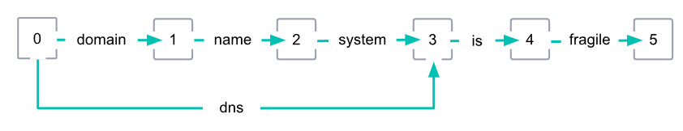

# Analyzer와 inverted index

> 아래의 내용은 모두 text type에 대한 것이다. keyword type은 analyze 과정을 거치지 않는다.

- Inverted index(역색인)

  - "I am a boy", "You are a girl" 이라는 두 문자열이 있다고 가정한다.
    - 위 두 개의 문자열을 공백을 기준으로 나누면 각각의 문자열은 4개의 단어로 나뉜다.
    - I, am, a, boy
    - you, are, a girl
  - 토큰
    - 위와 같이 나뉜 단어들을 **토큰**이라 부른다. 
    - 토큰을 만들어 내는 과정을 **토크나이징**이라고 한다.
  - 특정한 기준에 의해 나뉜 토큰들은 아래와 같은 형태로 저장되는데 이것을 역색인이라 부른다.

  | Tokens | Documents |
  | ------ | --------- |
  | I      | 1         |
  | am     | 1         |
  | a      | 1, 2      |
  | boy    | 1         |
  | girl   | 2         |
  | you    | 2         |
  | are    | 2         |

  - 위와 같은 역색인이 생성된 상태에서 사용자가 "a boy"라는 문자열이 포함된 문서를 찾고 싶다고 가정한다.
    - 검색어로 a boy라는 문자열을 입력하면 이 문자열은 공백을 기준으로 a, boy라는 두 개의 토큰으로 나뉜다.
    - 이렇게 나뉜 토큰을 바탕으로 역색인을 검색한다.
    - 두 단어가 모두 포함되어 있는 문서 1번이 검색 결과로 반환된다.
  - 대소문자 구분
    - 검색 결과를 얻기 위해서는 토큰이 대소문자까지 정확하게 일치해야 한다.
    - 역색인에 대문자 I만 존재할 뿐 소문자 i는 존재하지 않는다.
    - 따라서 소문자 i로 검색하면 아무런 검색 결과를 얻지 못한다.


- ES는 어떻게 토크나이징을 하는가

  - ES는 `_analyze`라는 API를 제공한다.
    - analyzer에는 토크나이징에 사용할 analyzer를 입력한다.
    - text에는 토크나이징 할 문자열을 입력한다.

  ```bash
  $ curl -XPOST "localhost:9200/_analyze?pretty" -H 'Content-type:application/json' -d '{
  "analyzer":"standard",
  "text":"I am a boy"
  }'
  ```

  - 응답
    - 토크나이징의 결과로 토큰의 배열을 반환한다.
    - 아래 토큰을 보면 대문자 I가 아닌 소문자 i로 토크나이징 된 것을 볼 수 있는데, standard analyzer의 동작 중에 모든 문자를 소문자화하는 과정이 포함되어 있기 때문이다.

  ```json
  {
    "tokens" : [
      {
        "token" : "i",
        "start_offset" : 0,
        "end_offset" : 1,
        "type" : "<ALPHANUM>",
        "position" : 0
      },
      {
        "token" : "am",
        "start_offset" : 2,
        "end_offset" : 4,
        "type" : "<ALPHANUM>",
        "position" : 1
      },
      {
        "token" : "a",
        "start_offset" : 5,
        "end_offset" : 6,
        "type" : "<ALPHANUM>",
        "position" : 2
      },
      {
        "token" : "boy",
        "start_offset" : 7,
        "end_offset" : 10,
        "type" : "<ALPHANUM>",
        "position" : 3
      }
    ]
  }
  ```


- Normalizer

  - Normalizer는 analyzer와 유사하지만, 오직 하나의 token만을 반환한다는 점에서는 다르다.
  - 따라서 tokenizer는 받지 않으며, 오직 char filter와 token filter만을 받는다.
    - 모든 filter가 가능한 것은 아니며 character 기반으로 동작하는 filter만 설정 가능하다.
    - 예를 들어 lowercase filter는 개별 character들을 소문자로 변경하므로, normalizer에서 사용이 가능하다.
    - 그러나 stemming filter의 경우 전체 keyword를 대상으로 동작하므로, normalizer에서 사용이 불가능하다.
    - 사용 가능한 filter list는 [공식 문서](https://www.elastic.co/guide/en/elasticsearch/reference/current/analysis-normalizers.html#analysis-normalizers) 참고.
  - 예시

  ```json
  // PUT index
  {
    "settings": {
      "analysis": {
        "normalizer": {
          "my_normalizer": {
            "type": "custom",
            "filter": ["lowercase", "asciifolding"]
          }
        }
      }
    },
    "mappings": {
      "properties": {
        "foo": {
          "type": "keyword",
          "normalizer": "my_normalizer"
        }
      }
    }
  }
  ```


- Analyzer 
  - Analyzer는 역색인을 만들어주는 것이다.
    - Analyzer는 운영 중에 동적으로 변경할 수 없다.
    - 따라서 기존 인덱스에 설정한 analyzer를 바꾸고 싶을 때는 인덱스를 새로 만들어서 재색인(reindex)해야 한다.
    - 단, close 상태인 index에 새로운 analyzer를 추가하는 것은 가능하다.
  - ES의 analyzer는 다음과 같이 구성되며, 아래 순서로 실행된다.
    - character filter
    - tokenizer
    - token filter
  - Character filter
    - Analyzer를 통해 들어온 문자열들은 character filter가 1차로 변형한다.
    - 예를 들어 <, >, ! 등과 같은 의미 없는 특수 문자들을 제거한다거나 HTML 태그들을 제거하는 등 문자열을 구성하고 있는 문자들을 특정한 기준으로 변경한다.
  - Tokenizer
    - Tokenizer는 일정한 기준(공백이나 쉼표)에 의해 문자열은 n개의 토큰으로 나눈다.
    - Analyzer를 구성할 때는 tokenizer를 필수로 명시해야 하며, 하나의 tokenizer만 설정할 수 있다.
    - 반면 character filter와 token filter는 필요하지 않을 경우 기술하지 않거나, 여러 개의 character filter와 token filter를 기술할 수 있다.
  - Token filter
    - Tokenizer에 의해 분리된 각각의 텀들을 지정한 규칙에 따라 처리해주는 필터들이다.
    - `filter` 항목에 배열로 나열해서 지정하며, 나열된 순서대로 처리되기에 순서를 잘 고려해서 입력해야한다.
    - 토큰을 전부 소문자로 바꾸는 lowercase token filter가 대표적인 token filter이다.


- standard analyzer

  - 아무 설정을 하지 않을 경우 디폴트로 적용되는 애널라이저
  - Filter
    - Character filter가 정의되어 있지 않다.
    - Standard tokenizer가 정의되어 있다.
    - Lowercase token filter가 정의되어 있다.
    - Stopwords로 지정한 단어가 토큰들 중에 존재 한다면 해당 토큰을 없애는 stop token filter가 존재하지만 기본값으로 비활성화 되어 있다.
  - Standard tokenizer 요청
    - `analyzer`가 아닌 `tokenizer`를 입력한다.
    - 아직 token filter를 거치지 않았기에 I가 대문자이다.

  ```json
  $ curl -XPOST "localhost:9200/_analyze?pretty" -H 'Content-type:application/json' -d '{
  "tokenizer":"standard",
  "text":"I am a boy"
  }'
  
  
  {
    "tokens" : [
      {
        "token" : "I",
        "start_offset" : 0,
        "end_offset" : 1,
        "type" : "<ALPHANUM>",
        "position" : 0
      },
      {
        "token" : "am",
        "start_offset" : 2,
        "end_offset" : 4,
        "type" : "<ALPHANUM>",
        "position" : 1
      },
      {
        "token" : "a",
        "start_offset" : 5,
        "end_offset" : 6,
        "type" : "<ALPHANUM>",
        "position" : 2
      },
      {
        "token" : "boy",
        "start_offset" : 7,
        "end_offset" : 10,
        "type" : "<ALPHANUM>",
        "position" : 3
      }
    ]
  }
  ```


- Custom analyzer

  > https://esbook.kimjmin.net/06-text-analysis/6.3-analyzer-1/6.4-custom-analyzer
  >
  > https://www.elastic.co/guide/en/elasticsearch/reference/current/analysis-custom-analyzer.html

  - 내장 analyzer로 충분하지 않을 경우 직접 애널라이저를 만들 수 있다.
  - Analyzer 정의 하기
    - `type`: `custom`을 입력하거나 아예  type 자체를 입력하지 않는다.
    - `tokenizer`: 애널라이저에 사용할 토크나이저를 입력한다(필수).
    - `char_filter`: 사용할 character filter들을 입력한다.
    - `filter`: 사용할 token filter들을 입력한다.

  ```bash
  $ curl -XPUT "localhost:9200/my_index" -H 'Content-type:application/json' -d '{
  "settings": {
    "analysis": {
      "analyzer": {
        "my_custom_analyzer": {	# 커스텀 애널라이저의 이름
          "type": "custom",
          "tokenizer": "standard",
          "char_filter": [
            "html_strip"
          ],
          "filter": [
            "lowercase",
            "asciifolding"
          ]
        }
      }
    }
  }
  }'
  ```

  - 위에서 적용한 tokenizer, char_filter, filter도 custom해서 적용하는 것이 가능하다.

  ```bash
  $ curl -XPUT "localhost:9200/my_index" -H 'Content-type:application/json' -d '
  {
    "settings": {
      "analysis": {
        "analyzer": {
          "my_custom_analyzer": { 
            "char_filter": [
              "emoticons"	# 아래에서 custom한 emoticons라는 char_filter를 적용
            ],
            "tokenizer": "punctuation",	# 아래에서 custom한 punctuation이라는 tokenizer 적용
            "filter": [
              "lowercase",
              "english_stop"	# 아래에서 custom한 english_stop이라는 filter 적용
            ]
          }
        },
        "tokenizer": {
          "punctuation": { 
            "type": "pattern",
            "pattern": "[ .,!?]"
          }
        },
        "char_filter": {
          "emoticons": { 
            "type": "mapping",
            "mappings": [
              ":) => _happy_",
              ":( => _sad_"
            ]
          }
        },
        "filter": {
          "english_stop": { 
            "type": "stop",
            "stopwords": "_english_"
          }
        }
      }
    }
  }
  ```


- Analyzer와 검색의 관계

  - Analyze의 중요성
    - Analyzer를 통해 생성한 토큰들이 역색인에 저장되고, 검색할 때는 이 역색인에 저장된 값을 바탕으로 문서를 찾는다.
    - 따라서 검색 니즈를 잘 파악해서 적합한 analyzer를 설정해야 한다.
  - 테스트 인덱스 생성

  ```bash
  $ curl -XPUT "localhost:9200/books?pretty" -H 'Content-type:application/json' -d '{
  	"mappings":{
  		"properties":{
  			"title":{"type":"text"},
  			"content":{"type":"keyword"}
  		}
  	}
  }'
  ```

  - 테스트 문서 색인

  ```bash
  $ curl -XPUT "localhost:9200/books/_doc/1?pretty" -H 'Content-type:application/json' -d '{
  "title":"Elasticsearch Training Book",
  "content":"Elasticsearch is open source search engine"
  }'
  ```

  - title로 검색하기
    - 정상적으로 검색이 된다.

  ```json
  $ curl "localhost:9200/books/_search?pretty&q=title:Elasticsearch"
  
  {
    "took" : 743,
    "timed_out" : false,
    "_shards" : {
      "total" : 1,
      "successful" : 1,
      "skipped" : 0,
      "failed" : 0
    },
    "hits" : {
      "total" : {
        "value" : 1,
        "relation" : "eq"
      },
      "max_score" : 0.6931471,
      "hits" : [
        {
          "_index" : "books",
          "_type" : "_doc",
          "_id" : "1",
          "_score" : 0.6931471,
          "_source" : {
            "title" : "Elasticsearch Training Book",
            "content" : "Elasticsearch is open source search engine"
          }
        }
      ]
    }
  }
  ```

  - content로 검색하기

  ```bash
  $ curl "localhost:9200/books/_search?pretty&q=content:Elasticsearch"
  
  {
    "took" : 2,
    "timed_out" : false,
    "_shards" : {
      "total" : 1,
      "successful" : 1,
      "skipped" : 0,
      "failed" : 0
    },
    "hits" : {
      "total" : {
        "value" : 0,
        "relation" : "eq"
      },
      "max_score" : null,
      "hits" : [ ]
    }
  }
  ```

  - content 필드는 검색이 정상적으로 이루어지지 않았다.
    - title 필드는 text, content 필드는 keyword 타입으로 정의했다.
    - text 타입의 기본 analyzer는 standard analyzer이고, keyword 타입의 기본 analyzer는 keyword analyzer이다.
    - keyword analyzer는 standard analyzer와는 달리 analyze를 하지 않는다.
    - 즉 역색인에는 "Elasticsearch is open source search engine"라는 토큰만 존재한다.


- terms vector 확인하기

  - inverted index를 보여주는 것은 아니지만, token이 어떤 형태로 생성됐는지 확인할 수 있다.
  - `_termvectors ` API를 사용한다.
    - Mapping에서 `terms_vector` 옵션을 `no`로 했어도 API로 요청을 보내면 동적으로 term vectors를 생성한다.
  - `<인덱스명>/_termvectors/<doc_id>?fields=<확인할 필드>`
  
  ```bash
  $ curl "localhost:9200/test-index/_termvectors/1?fields=title"
  ```


## Analyzer

### nori analyzer

- Elasticsearch에서 plugin 형태로 제공하는 한글용 analyzer로, 아래와 같은 기능을 제공한다.

  - nori_tokenizer
    - 한글용 tokenizer이다.
  - nori_part_of_speech token filter
    - Part-of-speech tag에 매치되는 토큰들을 tokenizing 결과에서 제외한다.

  | Tag  | Description                 | Example                                   |
  | ---- | --------------------------- | ----------------------------------------- |
  | E    | 동사 어미                   | 먹다 → ["먹"]                             |
  | IC   | 감탄사                      | 와 정말? → ["정말"]                       |
  | J    | 조사                        | 밥을 → ["밥"]                             |
  | MAG  | 부사                        | 상당히 많은 → ["많", "은"]                |
  | MAJ  | 문장과 문장을 연결하는 부사 | 하지만 내일은 → ["내일", "은"]            |
  | MM   | 관형사                      | 저 사람 → ["사람"]                        |
  | NNG  | 일반명사                    | 귀여운 강아지 → ["귀엽", "ㄴ"]            |
  | NNP  | 고유명사                    | 한국의 수도는 서울 → ["의", "수도", "는"] |
  | NNB  | 의존명사                    | 얼마 만큼→ ["얼마"]                       |
  | NNBC | 단위명사                    | 사과 두 개 → ["사과", "두"]               |
  | NP   | 대명사                      | 그것 → [ ]                                |
  | NR   | 수사                        | 다섯 명 → ["명"]                          |
  | SF   | 마침표, 물음표, 느낌표      | 와! → ["와"]                              |
  | SH   | 한자                        | 漢字 → [ ]                                |
  | SL   | 영어                        | English → [ ]                             |
  | SN   | 숫자                        | 3개  → ["개"]                             |
  | SP   | 공백                        | 나와 너 → ["나", "와", "너"]              |
  | SSC  | 닫는 괄호                   | 밥) → ["밥"]                              |
  | SSO  | 여는 괄호                   | (밥 → ["밥"]                              |
  | SC   | 가운데점, 콜론, 빗금        | 이름:철수 → ["이름", "철수"]              |
  | SE   | 말줄임표                    | 아... → ["아"]                            |
  | VA   | 형용사                      | 예쁜 꽃 → ["ㄴ", "꽃"]                    |
  | VCN  | 부정지정사                  | 아니다 → ["다"]                           |
  | VCP  | 긍정지정사                  | 사람이다 → ["사람", "다"]                 |
  | VV   | 동사                        | 가다 → ["다"]                             |
  | VX   | 보조용언                    | 가고 싶다 → ["갈", "고", "다"]            |
  | XPN  | 체언접두사                  | 불가능 → ["가능"]                         |
  | XR   | 어근                        | 복잡한 → ["하", "ㄴ"]                     |
  | XSA  | 형용사 파생 접미사          | 새삼스러운 → ["새삼", "ㄴ"]               |
  | XSN  | 명사 파생 접미사            | 사람들 → ["사람"]                         |
  | XSV  | 동사 파생 접미사            | 공부하다 → ["공부", "다"]                 |
  


- nori tokenizer에서 `decompound_mode`를 mixed로 줄 경우 아래와 같이 예상과 달리 동작한다.

  - index 생성

  ```json
  PUT mixed_test
  {
    "settings": {
      "analysis": {
        "tokenizer": {
          "mixed_nori_tokenizer": {
            "type": "nori_tokenizer",
            "decompound_mode": "mixed"
          }
        },
        "analyzer": {
          "mixed_nori_analyzer": {
            "type": "custom",
            "tokenizer": "mixed_nori_tokenizer"
          }
        }
      }
    }, 
    "mappings": {
      "properties": {
        "text":{
          "type": "text",
          "analyzer": "mixed_nori_analyzer"
        }
      }
    }
  }
  ```

  - 데이터 색인

  ```json
  PUT mixed_test/_doc/1
  {
    "text":"가곡역"
  }
  ```

  - analyze 결과 확인

  ```json
  GET mixed_test/_termvectors/1?fields=text
  
  // ["가곡", "역", "가곡역"]으로 토큰이 생성된 것을 확인 할 수 있다.
  ```

  - 검색 profile

  ```json
  GET mixed_test/_search
  {
    "profile": true, 
    "query": {
      "match": {
        "text": "가곡역"
      }
    }
  }
  
  // query string이 "text:가곡역 text:\"가곡 역\""와 같이 만들어진다.
  ```

  - 예상하기로는 `text:가곡 text:역 text:가곡역`과 같이 만들어 질 것 같지만 예상과 달리 `text:가곡역 text:\"가곡 역\"`과 같이 query가 생성된다.
    - 더 정확히는 `text:가곡역`은 TermQuery로, `text:\"가곡 역\"`은 PhraseQuery로 생성된다.
  - `elasticsearch.index.search.MatchQueryParser`의 `createFieldQuery()` 메서드에는 아래와 같은 logic이 있다.
    - `posLenAtt`는 token의 positionLength 정보를 담고 있는 object이고, `enableGraphQueries`는 기본값이 true로 설정돼있다(token stream의 생성 결과에 따라 false로 변경되기도 한다).
    - 따라서 아래 조건문은 token의 `positionLength`가 1보다 클 경우(mixed로 분석한 "가곡역" token의 `positionLength`는 2이다), `isGraph` 변수를 true로 변경한다.
    - `isGraph`값이 true이고 `type`이 `Type.PHRASE`이거나 `Type.PHRASE_PREFIX`이면 `analyzeGraphPhrase()` 메서드를 실행시킨다.

  ```java
  while (stream.incrementToken()) {
      // ...
      int positionLength = posLenAtt.getPositionLength();
      if (enableGraphQueries && positionLength > 1) {
          isGraph = true;
      }
  }
  
  if (numTokens == 0) {
      return null;
  // ...
  } else if (isGraph) {
      if (type == Type.PHRASE || type == Type.PHRASE_PREFIX) {
          return analyzeGraphPhrase(stream, field, type, phraseSlop);
      } else {
          return analyzeGraphBoolean(field, stream, operator, type == Type.BOOLEAN_PREFIX);
      }
  }
  ```

  - `elasticsearch.index.query.IntervalBuilder`에도 유사한 코드가 있다.
    - `analyzeText()` 메서드도 유사한 과정을 거친다.


## Token filter

- stopword(불용어)

  - 검색에 불필요한 조사나 전치사 등을 처리하기 위한 token filter
    - `stopwords` 항목에 적용된 단어들은 tokenizing 된 텀에서 제거된다.
    - 예를 들어 "아버지가 방에" 라는 문장을 `nori_tokenizer`로 token화하면 `아버지 / 가 / 방 / 에`로 분리되는데, 만일 "가"와 "에"를 `stopwords`에 추가했다면 `아버지 / 방`만 추출된다.
    - settings에 추가할 수도 있고, 파일로 관리할 수도 있다.
  - settings에 추가하기

  ```json
  {
    "settings": {
      "analysis": {
        "filter": {
          "test_stop_filter": {
            "type": "stop",
            "stopwords": [
              "가",
              "에"
            ]
          }
        }
      }
    }
  }
  ```

  - 일일이 지정하지 않고 언어별로 지정하기

    > https://www.elastic.co/guide/en/elasticsearch/reference/current/analysis-stop-tokenfilter.html

    - 위 페이지에서 지원하는 언어팩을 확인 가능하다(아직까지 한국어는 없다).

  ```json
  {
    "settings": {
      "analysis": {
        "filter": {
          "test_stop_filter": {
            "type": "stop",
            "stopwords": "_french_"
          }
        }
      }
    }
  }
  ```

  - 파일로 관리하기
    - 각각의 stopword는 파일 내에서 줄바꿈으로 구분된다.
    - 사전 파일의 경로는 config 디렉터리를 기준으로 상대 경로를 지정해야 한다.
    - 텍스트 인코딩은 반드시 UTF-8이어야한다.

  ```json
  {
    "settings": {
      "analysis": {
        "filter": {
          "test_stop_filter": {
            "type": "stop",
            "stopwords_path": "user_dict/stopword_dict.txt"
          }
        }
      }
    }
  }
  ```

  - 파일로 관리할 경우 주의사항
    - 파일로 관리할 때, 파일의 내용이 변경되었다면 해당 파일을 사용하는 인덱스를 close/open 해주어야 적용된다.
    - 또한, 파일이 변경되면, 그 이후로 색인되는 문서들에만 적용되고 이미 색인된 문서들에는 적용되지 않는다.
    - 따라서 기존에 색엔된 문서들에도 적용하려면 재색인 해야한다.


- N-gram

  - tokenizing 결과를 정해진 길이만큼 잘라서 다시 token을 생성한다.

  - 옵션

    - `max_ngram`: 각 토큰의 최대 길이를 지정한다(기본값은 2).
    - `min_ngram`: 각 토큰의 최소 길이를 지정한다(기본값은 1).

    - `preserve_original`: ngram filter가 적용되기 전의 토큰을 보존한다.

  - 예시

  ```json
  // ngram-example
  {
    "settings": {
      "index": {
        "max_ngram_diff": 2
      },
      "analysis": {
        "analyzer": {
          "default": {
            "tokenizer": "whitespace",
            "filter": [ "3_5_grams" ]
          }
        },
        "filter": {
          "3_5_grams": {
            "type": "ngram",
            "min_gram": 3,
            "max_gram": 5
          }
        }
      }
    }
  }
  ```


- Edge n-gram

  - 각 토큰의 시작부분만 정해진 길이만큼 잘라서 토큰을 생성한다.

  - 옵션

    - `max_ngram`: 각 토큰의 최대 길이를 지정한다(기본값은 2).
    - `min_ngram`: 각 토큰의 최소 길이를 지정한다(기본값은 1).

    - `preserve_original`: ngram filter가 적용되기 전의 토큰을 보존한다.

  - 예시

  ```json
  // edge-ngram-example
  {
    "settings": {
      "analysis": {
        "analyzer": {
          "default": {
            "tokenizer": "whitespace",
            "filter": [ "3_5_edgegrams" ]
          }
        },
        "filter": {
          "3_5_edgegrams": {
            "type": "edge_ngram",
            "min_gram": 3,
            "max_gram": 5
          }
        }
      }
    }
  }
  ```


### synonym

> https://www.elastic.co/blog/boosting-the-power-of-elasticsearch-with-synonyms

- synonym(유의어)

  - 분석 과정에서 유의어들을 보다 쉽게 처리할 수 있도록 도와주는 token filter이다.
    - 예를 들어 "Elasticsearch"를 누군가는 "ES"라고 쓰고, 누군가는 "엘라스틱서치"라고 쓴다고 하면, Elasticsearch라는 term으로 검색했을 때, ES나 엘라스틱서치라고 작성된 내용은 검색되지 않을 것이다.
    - synonym token filter를 사용하여 Elasticsearch와 ES, 엘라스틱서치를 유의어로 묶으면, Elasticsearch를 검색했을 때 다른 두 개의 용어도 검색되게 할 수 있다.
    
  - 유의어 명시 규칙
    - `A, B`: A와 B 각 term이 서로를 모두 저장하여, A와 B 모두 서로의 term으로 검색이 된다.
    - `A => B`: A 대신 B의 term을 저장하여 A로는 B의 검색이 가능하지만, B로는 A의 검색이 불가능하다.
    
  - 대부분의 경우 index analyzer가 아닌 search analyzer로 활용한다.
  
    - Index analyzer로 적용할 경우 synonym들도 함께 색인해야 하므로 index의 크기가 커지고, 검색 점수 계산시에 synonym들도 계산에 포함시켜야 하므로 계산이 왜곡될 수 있으며, 무엇보다 synonym을 변경할 경우 재색인을 해야한다.
  
    - Index analyzer만 사용할 때의 유일한 장점은 매 query시마다 유의어를 확장하는 과정을 거치지 않아도 되기에 검색 속도가 향상될 수 있다는 것 뿐인데, 이는 이론상으로만 그렇지 살제로 이를 통해 향상되는 속도는 미미하다.
    - 반면에 search analyzer에 적용하는 것은 index의 크기에 영향를 미치지 않고, 점수 계산에도 영향을 미치지 않으며, synonym을 변경해도 재색인을 하지 않아도 된다.
    - 무엇보다 보다 정교한 `synonym_graph` token filter를 사용하게 해준다.


- synonym token filter 설정 방법

  - settings에 직접 설정하는 방법.
    - synonym token filter 생성시에 `synonyms`에 배열 형태로 유의어를 등록한다.

  ```json
  // PUT synonym-test
  PUT synonym-test
  {
      "settings": {
          "index": {
              "analysis": {
                  "filter": {
                      "my_synonym": {
                          "type": "synonym",
                          "synonyms": [ 
                              "foo, bar => baz",
                              "qux, qux"
                          ]
                      }
                  },
                  "analyzer": {
                      "synonym": {
                          "tokenizer": "whitespace",
                          "filter": [
                              "my_synonym"
                          ]
                      }
                  }
              }
          }
      }
  }
  ```

  - 유의어 사전 파일을 만들어 설정하는 방법.
    - `synonyms_path`에 유의서 사전 파일의 경로를 설정하며, 경로는 `<ES_HOME>/config` 폴더를 기준으로 한다.

  ```json
  // <ES_HOME>/config/dict/my_synonym_dict.txt 유의어 사전 파일을 아래와 같이 작성한다.
  // foo, bar => baz
  // qux, quux
  
  // PUT synonym-test
  {
      "settings": {
          "index": {
              "analysis": {
                  "filter": {
                      "synonym": {
                          "type": "synonym",
                          "synonyms_path": "dict/my_synonym_dict.txt"
                      }
                  },
                  "analyzer": {
                      "synonym": {
                          "tokenizer": "whitespace",
                          "filter": [
                              "synonym"
                          ]
                      }
                  }
              }
          }
      }
  }
  ```
  
  - 아래와 같은 이유로 synonym을 settings에 직접 작성하는 대신 file로 작성하는 것을 권장한다.
    - File로 작성해야 close, open 없이 reload search analyzer API로 변경사항을 적용할 수 있다.
    - File로 작성하는 것이 version 관리가 더 간편한다.
    - Index가 삭제되더라도 synonym file은 남아있으므로 유실될 일이 없다.
    - 다른 여러 filter에서 동일한 synonym file을 공유할 수 있다.
    - Synonym을 settings에 직접 작성할 경우 index의 settings에 대한 meta 정보를 저장하는 cluster state가 더 많은 memory를 사용하게 된다.


- 유의어 사전 파일을 만들어 유의어를 관리하기 위해서는 data node 역할을 하는 모든 node에 유의어 사전 파일이 등록되어 있어야한다.
  - 테스트 결과 data node 역할을 하지 않는 node에는 유의어 사전이 없어도 index가 정상적으로 생성된다.
  - 만일 각 data node에 내용이 다른 유의어 사전이 있을 경우 어떻게 되는지 테스트하기 위해서 아래와 같이 cluster를 구성한다.
    - node1, node2, node3 세 개의 node를 생성한다.
    - node1에는 master 역할만 주어 유의어 사전을 등록하지 않아도 되도록한다.
    - node2, node3에 각기 다른 내용으로 유의어 사전을 작성한다(두 file의 이름은 동일해야한다).
  
  ```yaml
  # node2에 들어갈 사용자사전
  foo, bar => baz
  qux, quux
  
  # node3에 들어갈 사용자사전
  foo, bar => baz
  ```
  
  - Primary shard를 2로 설정하고 synonym token filter를 설정한 뒤 index를 생성한다.
  
  ```json
  PUT test
  {
      "settings": {
          "number_of_shards": 2, 
          "index": {
              "analysis": {
                  "filter": {
                      "synonym": {
                          "type": "synonym",
                          "synonyms_path": "dict/my_synonym_dict.txt"
                      }
                  },
                  "analyzer": {
                      "synonym": {
                          "tokenizer": "whitespace",
                          "filter": [
                              "synonym"
                          ]
                      }
                  }
              }
          }
      },
      "mappings": {
          "properties": {
              "text":{
                  "type": "text",
                  "analyzer": "synonym"
              }
          }
      }
  }
  ```
  
  - node2와 node3에 primary shard가 하나씩 배치되었는지 확인한다. 
  
  ```json
  // GET _cat/shards
  test                                                          0 p STARTED  0   node2
  test                                                          1 p STARTED  0   node3
  ```
  
  - 그 후 유의어 사전에 포함된 term들을 가지고 있는 문서들을 색인한다.
    - 아래와 같이 routing 값을 다르게 줘 각기 다른 shard에 색인되도록한다.
  
  ```json
  PUT test/_doc/1?routing=A
  {
    "text":"foo bar qux"
  }
  
  PUT test/_doc/2?routing=B
  {
    "text":"foo bar qux"
  }
  ```
  
  - 두 문서의 token을 확인해본다.
    - 둘 중 한 문서만 qux와 quux가 유의어로 등록된 것을 확인할 수 있다.
  
  ```json
  // POST test/_termvectors/1?fields=text&routing=A
  "terms": {
      "baz": {
          "term_freq": 2,
          "tokens": [
              {
                  "position": 0,
                  "start_offset": 0,
                  "end_offset": 3
              },
              {
                  "position": 1,
                  "start_offset": 4,
                  "end_offset": 7
              }
          ]
      },
      "qux": {
          "term_freq": 1,
          "tokens": [
              {
                  "position": 2,
                  "start_offset": 8,
                  "end_offset": 11
              }
          ]
      }
  }
  
  // POST test/_termvectors/2?fields=text&routing=B
  "terms": {
      "baz": {
          "term_freq": 2,
          "tokens": [
              {
                  "position": 0,
                  "start_offset": 0,
                  "end_offset": 3
              },
              {
                  "position": 1,
                  "start_offset": 4,
                  "end_offset": 7
              }
          ]
      },
      "quux": {
          "term_freq": 1,
          "tokens": [
              {
                  "position": 2,
                  "start_offset": 8,
                  "end_offset": 11
              }
          ]
      },
      "qux": {
          "term_freq": 1,
          "tokens": [
              {
                  "position": 2,
                  "start_offset": 8,
                  "end_offset": 11
              }
          ]
      }
  }
  ```
  
  - 위에서 확인한 것과 같이 여러 node 사이에 유의어 사전이 불일치할 경우 각 문서들이 같은 내용이라도 다르게 분석되어 검색 결과에 문제가 생길 수 있다.
    - 따라서 유의어 사전이 각 node들 사이에 일치하도록 해야한다.
  
  ```json
  // GET test/_search
  {
      "query": {
          "match": {
              "text": "quux"
          }
      }
  }
  
  // response
  // qux와 quux를 유의어로 등록한 2번 문서만 검색 된다.
  "hits": [
      {
          "_index": "test",
          "_id": "2",
          "_score": 0.42547938,
          "_routing": "B",
          "_source": {
              "text": "foo bar qux"
          }
      }
  ]
  ```


- stopword로 설정된 token이 synonym에 포함될 경우

  - 아래와 같이 stopword에 bar를 넣고, bar를 synonym에도 포함시키면 Index자체가 생성되지 않는다.
    - foo, bar, baz가 유의어로 설정되어 있는데, bar를 stopword 처리할 경우 foo, bar, baz가 모두 stopword로 처리되기 때문이다.

  ```json
  PUT test
  {
      "settings": {
          "index": {
              "analysis": {
                  "filter": {
                      "stop_word":{
                          "type":"stop",
                          "stopwords":[
                              "bar"
                          ]
                      },
                      "synonym": {
                          "type": "synonym",
                          "expand":false,
                          "synonyms": [
                              "foo,bar,baz"
                          ]
                      }
                  },
                  "analyzer": {
                      "synonym": {
                          "tokenizer": "whitespace",
                          "filter": [
                              "stop_word",
                              "synonym"
                          ]
                      }
                  }
              }
          }
      }
  }
  ```

  - 단, 아래의 `lenient` 설정을 true로 주면 생성이 가능하다.


- 설정

  - `expand`(bool, 기본값은 true)
    - 기본적으로 synonym은 아래와 같이 저장된다.
    - `foo, bar`와 같이 설정할 경우 `foo,bar => foo,bar`와 같이 foo로 bar가 검색되고, bar로 foo가 검색된다.
    - 그러나 expand를 false로 주면 `foo, bar`와 같이 설정할 경우 `foo, bar => foo`와 같이 맨 앞에 있는 token하나만 확장한다.
    - 즉 foo와 bar로는 foo가 검색되지만 bar로는 foo가 검색되지 않는다.

  - 예를 들어 아래와 같이 index를 생성하면, `expand`를 false로 줬으므로 `"foo, bar, baz"`는 `foo, bar, baz => foo, bar, baz`로 확장되는 것이 아니라 `foo, bar, baz => foo`와 같이 mapping된다.

  ```json
  // PUT test
  {
      "settings": {
          "index": {
              "analysis": {
                  "filter": {
                      "synonym": {
                          "type": "synonym",
                          "expand":false,
                          "synonyms": [
                              "foo, bar, baz"
                          ]
                      }
                  },
                  "analyzer": {
                      "my_analyzer": {
                          "tokenizer": "standard",
                          "filter": [
                              "synonym"
                          ]
                      }
                  }
              }
          }
      },
      "mappings": {
          "properties": {
              "text":{
                  "type":"text",
                  "analyzer": "my_analyzer"
              }
          }
      }
  }
  ```

  - 따라서 아래와 같은 data를 색인하고

  ```json
  // PUT test/_doc/1
  {
    "text":"foo bar baz"
  }
  ```

  - Token들을 확인해보면 아래와 같다.
    - foo라는 token 하나로만 mapping된 것을 볼 수 있다.

  ```json
  // POST test/_termvectors/1?fields=text
  "terms": {
      "foo": {
          "term_freq": 3,
          "tokens": [
              {
                  "position": 0,
                  "start_offset": 0,
                  "end_offset": 3
              },
              {
                  "position": 1,
                  "start_offset": 4,
                  "end_offset": 7
              },
              {
                  "position": 2,
                  "start_offset": 8,
                  "end_offset": 11
              }
          ]
      }
  }
  ```

  - 그럼에도 검색은 foo, bar, baz라는 keyword로 모두 가능한데, 그 이유는 검색 analyzer를 따로 설정해주지 않을 경우 색인 analyzer와 동일하게 설정되기 때문이다.
    - 즉 foo, bar, baz 중 어떤 것으로 검색을 하더라도, 결국에는 foo라는 검색어로 변환되므로, foo, bar, baz중 어떤 것으로든 검색은 가능하다.
    - 그러나 만일 검색 analyzer를 synonym이 포함되어 있지 않은 다른 analyzer를 쓴다면 검색이 되지 않는다.

  - `lenient`(bool, 기본값은 false)
    - true로 설정할 경우 synonym 설정에 오류가 있어도 오류를 무시하고 실행한다.
  - `updateable`(bool, 기본값은 false)
    - true로 줄 경우 reload search analyzer API를 통해 search analyzer를 reload할 수 있게 해준다.
    - 이를 통해 synonym의 변경사항을 close, open이 아닌 reload API를 호출하여 적용할 수 있게 된다.
    - Search analyzer에만 적용된다.


#### Synonym 추가하기

- Index를 생성한 후에도 synonym을 추가할 수 있다.
  - 일반적으로 synonym token filter는 index analyzer가 아닌 search analyzer로 사용하기에 재색인 없이 적용이 가능하다.
    - 만일 index analyzer로도 사용하고자 한다면, 재색인을 해야한다.
    - 단 search analyzer에 적용하더라도 synonym이 변경된다면, 이를 search analyzer에 적용하기 위해 index를 close 했다 다시 open해야한다.
  - Elasticsearch 7.3 부터는 reload API와 `updateable` 옵션을 제공하여 close, open하지 않아도 적용되도록 변경되었다.


- settings로 index analyzer에 적용된 synonym token filter update하기

  - 이 방식은 불가능하며, 아래는 불가능하다는 것을 보여주기 위한 예시이다.
  - Index 생성
    - `"foo, bar"`만 synonym으로 등록하고, 이를 `text` field의 analyzer에 적용한다.

  ```json
  // PUT test
  {
    "settings": {
      "index": {
        "analysis": {
          "filter": {
            "synonym": {
              "type": "synonym",
              "synonyms": [
                "foo, bar"
              ]
            }
          },
          "analyzer": {
            "my_analyzer": {
              "tokenizer": "standard",
              "filter": [
                "synonym"
              ]
            }
          }
        }
      }
    },
    "mappings": {
      "properties": {
        "text":{
          "type":"text",
          "analyzer": "my_analyzer"
        }
      }
    }
  }
  ```

  - 문서 색인하기

  ```json
  // PUT test/_doc/1
  {
    "text":"foo quz"
  }
  ```

  - Token 확인하기
    - foo와 synonym으로 설정된 bar도 token이 생성된 것을 볼 수 있다.

  ```json
  // GET test/_termvectors/1?fields=text
  {
      // ...
      "terms": {
          "bar": {
            // ...
          },
          "foo": {
            // ...
          },
          "quz": {
            // ...
          }
        }
  }
  ```

  - Index close하기
    - synonym token filter를 update하기 위해 index를 close한다.

  ```http
  POST test/_close
  ```

  - Synonym update하기
    - 기존의 foo, bar에 baz까지 추가하고, quz, qux를 새로운 synonym으로 설정한다.

  ```json
  PUT test/_settings
  {
    "analysis": {
      "filter": {
        "synonym": {
          "type": "synonym",
          "synonyms": [
            "foo, bar, baz",
            "quz, qux"
          ]
        }
      }
    }
  }
  ```

  - Index open하기

  ```http
  POST test/_open
  ```

  - Token 확인
    - 기존에 synonym으로 등록된 bar token마저 사라진 것을 볼 수 있다.

  ```json
  // GET test/_termvectors/1?fields=text
  {
      "terms": {
          "foo": {
            // ...
          },
          "quz": {
            // ...
          }
        }
  }
  ```


- settings로 search analyzer에 적용된 synonym token filter update하기

  - Index 생성
    - 이번에는 search_analyzer에 적용한다.

  ```json
  {
      // settings는 위와 동일
      "mappings": {
          "properties": {
              "text":{
                  "type":"text",
                  "search_analyzer": "my_analyzer"
              }
          }
      }
  }
  ```

  - 문서 색인

  ```json
  // PUT test/_doc/1
  {
    "text":"foo quz"
  }
  ```

  - 검색
    - 아래와 같이 검색하면 synonym으로 등록된 bar로 foo가 포함된 1번 문서가 검색되는 것을 볼 수 있다.

  ```json
  GET test/_search
  {
      "query": {
          "match": {
              "text": "bar"
          }
      }
  }
  ```

  - 그 후, 위에서 했던 것과 같이 close, update, open을 진행한다.

  - 다시 검색하기
    - 기존에 synonym 으로 등록된 bar와 새롭게 추가된 baz와 qux로 1번 문서가 검색 되는 것을 볼 수 있다.

  ```json
  // GET test/_search
  {
      "query": {
          "bool": {
              "filter": [
                  {
                      "match":{
                          "text":"bar"
                      }
                  },
                  {
                      "match":{
                          "text":"baz"
                      }
                  },
                  {
                      "match":{
                          "text":"qux"
                      }
                  }
              ]
          }
      }
  }
  ```


- File로 등록된 synonym token filter update하기

  - Index analyzer에 적용한 경우 위와 마찬가지로 재색인을 하지 않으면 변경 사항이 적용되지 않으므로 따로 test하지 않는다.
  - Synonym 사전 생성하기
    - (Elasticsearch official image로 생성한 Docker container 기준) `/usr/share/elasticsearch/config/dict`에 아래와 같이 `my_synonym_dict.txt` 파일을 작성한다.
    - 모든 node에 작성해야한다.

  ```
  foo, bar
  ```

  - Index를 생성한다.
    - `synonyms_path`에 위에서 synonym 사전을 생성한 경로를 넣는다.

  ```json
  PUT test
  {
      "settings": {
          "index": {
              "analysis": {
                  "filter": {
                      "synonym": {
                          "type": "synonym",
                          "synonyms_path": "dict/my_synonym_dict.txt"
                      }
                  },
                  "analyzer": {
                      "synonym": {
                          "tokenizer": "whitespace",
                          "filter": [
                              "synonym"
                          ]
                      }
                  }
              }
          }
      },
      "mappings": {
          "properties": {
              "text": {
                  "type": "text",
                  "search_analyzer": "synonym"
              }
          }
      }
  }
  ```

  - 문서 색인

  ```json
  PUT test/_doc/1
  {
    "text":"foo quz"
  }
  ```

  - 검색
    - Synonym 사전이 정상적으로 등록 되었다면 아래와 같이 검색했을 때 1번 문서가 검색될 것이다.

  ```json
  GET test/_search
  {
      "query": {
          "match":{
              "text": "bar"
          }
      }
  }
  ```

  - Synonym 사전 수정하기
    - 위에서 작성한 `/usr/share/elasticsearch/config/dict/my_synonym_dict.txt` 파일을 아래와 같이 수정한다.
    - 마찬가지로 모든 node에서 수정해야한다.

  ```
  foo, bar, baz
  quz, qux
  ```

  - 변경된 사전을 적용하기 위해 index를 reopen한다.

  ```http
  POST test/_close
  
  POST test/_open
  ```

  - 다시 검색하기
    - 기존에 synonym 으로 등록된 bar와 새롭게 추가된 baz와 qux로 1번 문서가 검색 되는 것을 볼 수 있다.

  ```json
  // GET test/_search
  {
      "query": {
          "bool": {
              "filter": [
                  {
                      "match":{
                          "text":"bar"
                      }
                  },
                  {
                      "match":{
                          "text":"baz"
                      }
                  },
                  {
                      "match":{
                          "text":"qux"
                      }
                  }
              ]
          }
      }
  }
  ```


- reload search analyzer API 활용하기

  - 위에서 close, open을 했는데, 대신 아래와 같이 reload search analyzer API를 사용해도 된다.
  - Index 생성하기
    - 나머지는 위와 동일하며, `updateable`만 true로 추가해준다.

  ```json
  PUT test
  {
      "settings": {
          "index": {
              "analysis": {
                  "filter": {
                      "synonym": {
                          "type": "synonym",
                          "updateable":true,
                          "synonyms_path": "dict/my_synonym_dict.txt"
                      }
                  },
                  // ...
              }
          }
      },
      // ...
  }
  ```

  - 나머지 과정을 위와 동일하게 거친 후 close, open만 `_reload_search_analyzers` API로 변경한다.
    - Reload한 후에는 request cache를 clear해 이전 버전의 analyzer의 응답이 오지 않도록 해야한다.

  ```http
  POST test/_reload_search_analyzers
  
  POST test/_cache/clear?request=true
  ```

  


## Token graphs

> 모든 내용 및 그림의 출처는 [Elasticsearch 공식 문서](https://www.elastic.co/guide/en/elasticsearch/reference/current/token-graphs.html)

- Token graph

  - Tokenizer가 text를 token stream으로 변환할 때, 아래의 것들도 token에 함께 기록한다.
    - `position`: stream 내에서 token의 위치
    - `positionLength`: token이 걸쳐 있는 position들의 숫자
  - 이들을 사용하여, 유향 비순환 그래프(directed acyclic graph)를 만들 수 있다.
    - 이 유향 비순환 그래프를 token graph라 부른다.
    - Token graph에서 각 position들이 node가 되고, 각 token은 다음 position을 가리키는 edge가 된다.

  

  - Synonym
    - 어떤 token filter들은 이미 존재하는 token stream에 새로운 token을 추가할 수 있다(즉, position과 position 사이에 새로운 간선을 추가할 수 있다).
    - Synonym filter가 대표적인데, 이를 통해 생성된 synonym들은 종종 이미 존재하는 token들과 같은 position에 걸쳐있게 된다.
    - 아래 그림에서와 같이 quick과 그 synonym인 fast는 같은 position에 걸쳐있다.

  

  - Multi-position tokens
    - 어떤 token filter들은 여러 position에 걸쳐 있는 token들을 추가하기도 한다.
    - 그러나 graph token filters라고 알려진 일부 token filter들(`synonym_graph`, `word_delimiter_graph`) 만이 multi-position token들의 positionLength를 정확히 기록한다.
    - 또한 `nori_tokenizer`와 같은 일부 tokenizer만이 합성어 token을 multi-position token들로 정확히 분해한다.
    - 아래 그래프에서 domain name system과 그 synonym인 dns는 둘 다 position은 0이지만, dns의 positionLength는 3이다.
    - 그래프 내의 다른 token들의 positionLength는 기본 값인 1이다.

  

  - Token graph를 검색에 활용하기
    - 색인시에는 `postionLength`가 무시되고, multi-position token을 포함하는 multi-position tokens를 사용할 수 없다.
    - 그러나 match나 match_phrase 등의 query들은 단일 query string으로부터 여러 개의 sub query들을 만들기위해 token graph를 사용할 수 있다.
    - 예를 들어 "domain name system is fragile"을 검색어로 match_phrase query를 활용하여 검색하려한다고 가정해보자.
    - 검색시에 analyzer는 "domain name system"을 유의어로 등록된 dns로 변경하고, dns를 query string의 token stream에 아래 그림과 같이 추가한다.
    - dns token은 3의 `positionLength`를 가지므로, match_phrase query는 dns is fragile이라는 phrase를 가지는 sub query를 생성한다.

  

  - Invalid token graph

    - `synonym`, `word_delimiter`와 같은 token filter들은 multiple positions에 걸친 token을 추가 할 수는 있지만, `positionLength`는 정확히 기록하지 못하고, 기본 값인 1로만 저장한다.

    - 이는 위 두 개의 filter들은 위 두 filter로 추가된 token을 포함하는 token stream의 경우, 유효하지 않은 token graph를 생성한다는 의미이다.
    - 아래 그래프에서, dns는 multi-postiion synonym이지만, dns는 기본 positionLength인 1을 가지게 되고, 그 결과 유효하지 않은 token graph가 생성된다.

  


# auto completion

- java-cafe plugin

  > https://github.com/javacafe-project/elasticsearch-plugin

  - java-cafe plugin은 한글 text를 초성, 자모 단위로 분해해준다.
  - plugin 다운 받기
    - 사용중인 elasticsearch 버전에 맞는 플러그인을 위 사이트에서 찾아서 설치한다.
    - 지원하는현재 사용중인 elasticsearch 버전을 지원하는 plugin이 없을 경우 일단 plugin 내부의 `plugin-descriptor.properties` 파일에서 `elasticsearch.version` 옵션을 현재 사용중인 es 버전으로 변경한다.
    - plugin 자체를 수정하는 것이 아니라 es 버전만 변경해주는 것이므로 불완전할 수 있다.

  - 설치

  ```bash
  $ bin/elasticsearch-plugin install file://<plugin 파일 경로>
  ```


- 자동완성 구현하기

  - 주의사항
    - 아래 방식은 성능상으로 불완전한 방식이다.
    - `match_phrase_prefix` 쿼리의 옵션으로 `max_expansions`을 10000으로 줬는데 이는 기본값인 50보다 훨씬 큰 값으로, 성능상에 문제가 있을 수 있다.
    - 또한 ngram filter역시 min, max를 각각 2, 10으로 설정하여 토큰이 지나치게 많이 생성될 수 있다.
  - 자동완성을 위한 인덱스 생성
    - ngram filter의 min값과 max값은 기본적으로 2 이상으로 차이가 날 수 없으므로, 2 이상 차이가 나도록 설정하려면 `settings.index.max_ngram_diff` 옵션을 변경해야 한다.

  ```json
  {
      "settings": {
          "index": {
              "max_ngram_diff":8
          },
          "analysis": {
              "filter": {
                  "2_5_gram":{
                      "type":"ngram",
                      "min_gram": 2,
                      "max_gram": 10
                  }
              },
              "analyzer": {
                  "jamo-analyzer": {
                      "type": "custom",
                      "tokenizer": "standard",
                      "filter": [
                          "lowercase",
                          "2_5_gram",
                          "javacafe_jamo"
                      ]
                  },
                  "chosung-analyzer": {
                      "type": "custom",
                      "tokenizer": "standard",
                      "filter": [
                          "lowercase",
                          "2_10_edgegram",
                          "javacafe_chosung"
                      ]
                  },
                  "search-analyzer": {
                      "type": "custom",
                      "tokenizer": "standard",
                      "filter": [
                          "lowercase",
                          "javacafe_jamo"
                      ]
                  }
              }
          }
          
      },
      "mappings": {
          "properties": {
              "title": {
                  "type": "text",
                  "analyzer": "jamo-analyzer",
                  "search_analyzer": "search-analyzer",
                  "fields": {
                      "chosung": {
                          "type": "text",
                          "analyzer": "chosung-analyzer",
                          "search_analyzer": "search-analyzer"
                      },
                      "keyword": {
                          "type": "keyword"
                      }
                  }
              }
          }
      }
  }
  ```

  - 자동완성을 위한 쿼리
    - `slop`과 `max_expansions` 옵션은 데이터에 따라 다르게 주면 된다.
  
  
  ```json
  {
      "query": {
          "bool":{
              "should": [
                  {
                      "match_phrase_prefix": {
                          "title": {
                              "query":<search_input>,
                              "slop":6,
                              "max_expansions":10000
                          }
                      }
                  },
                  {
                      "match_phrase_prefix": {
                          "title.chosung": {
                              "query":<search_input>,
                              "slop":6,
                              "max_expansions":10000
                          }
                      }
                  }
              ]
          }
      }
  }
  ```


# completion suggester

- 이름은 completion suggester지만 자동완성보다는 연관 검색에 적합할 듯 하다.


# Security

- 보안 비활성화하기

  - `~/config/elastcsearch.yml`파일에서 아래 두 옵션을  false로 준다.

  ```yaml
  # disable security features
  xpack.security.enabled: false
  
  xpack.security.enrollment.enabled: false
  ```


- Elasticsearch는 크게 아래 3가지 방식으로 보안 기능을 제공한다.
  - 인가되지 않은 접근을 막는다.
    - role-base로 접근을 통제한다.
    - 사용자와 password를 통해 인증을 진행한다.
  - SSL/TLS encryption을 통해 데이터를 온전히 보존한다.
  - 누가 cluster에 어떤 동작을 실행했는지를 기록한다.


- Elasticsearch security의 원칙
  - 절대 security 기능을 비활성화한 상태로 cluster를 운영해선 안된다.
  - 지정된 non-root user로 elasticsearch를 운영해라.
    - 절대 root user로 운영해선 안된다.
  - 절대 elasticsearch를 public internet traffic에 노출시키지 마라.
  - role-base로 접근을 통제해라.


## security 자동으로 적용하기

- Elasticsearch가 실행되면 아래와 같은 보안 작업들이 실행된다.
  - Transport and HTTP layers에 대해 TLS용 certificate와 key가 생성된다.
  - elasticsearh.yml 파일에 TLS 관련 설정이 작성된다.
  - elastic이라는 기본 사용자에 대한 비밀번호가 생성된다.
  - kibana에서 사용되는 enrollment token이 생성된다.
    - enrollment token의 유효기간은 30분이다.
    - node에서도 사용되지만, node를 위한 enrollment token은 자동으로 생성되지 않는다.
    - cluster에 합류시킬 node를 준비하는 데 상당한 시간이 걸릴 수 있고, 그러는 동안 enrollment token의 유효시간이 끝날 수 있기 때문이다.


- 보안 관련 설정이 자동으로 실행되지 않는 경우
  - Elasticsearch가 처음 실행될 때 아래와 같은 사항들을 체크하는데, 하나라도 fail이 된다면 보안 관련 설정이 자동으로 실행되지 않는다.
    - node가 처음 실행되는 것인지(처음 실행되는 것이 아니라면 실행되지 않는다).
    - 보안 관련 설정이 이미 설정되었는지(이미 설정되었다면 실행되지 않는다).
    - startup process가 node의 설정을 수정하는 것이 가능한지.
  - node 내부의 환경에 따라 실행되지 않기도 한다.
    - `/data` 디렉터리가 이미 존재하고, 비어있지 않은 경우.
    - `elasticsearch.yml` 파일이 존재하지 않거나 `elasticsearch.keystore`파일을 읽을 수 없는 경우
    - elasticsearch의 configuration 디렉터리가 writable 하지 않은 경우
  - setting에 따라 실행되지 않기도 한다.
    - `node.roles`에 해당 node가 master node로 선출될 수 없게 설정되었거나, data를 저장할 수 없게 설정된 경우
    - `xpack.security.autoconfiguration.enabled`가 false로 설정된 경우
    - `xpack.security.enabled`을 설정한 경우
    - `elasticsearch.keystore`또는 `elasticsearch.yml`에 `xpack.security.http.ssl.*` 또는 `xpack.security.transport.ssl.*`을 설정한 경우.
    - `discovery.type`, `discovery.seed_hosts`, 또는 `cluster.initial_master_nodes`에 값이 설정된 경우.
    - 단, `discovery.type`이 `single-node`이거나, `cluster.initial_master_nodes`의 값이 현재 노드 하나 뿐인 경우는 예외이다.


- 클러스터에 새로운 node 합류시키기

  > enrollment token은 security가 자동으로 설정되었을 때만 사용할 수 있다.

  - Elasticsearch가 최초로 실행되면 security auto-configuration process는 HTTP layer를 0.0.0.0에 바인드한다.
    - transport layer만 localhost에 바인드한다.
    - 이는 추가적인 설정 없이도 보안 기능을 활성화 한 상태로 single node를 실행할 수 있도록 하기 위함이다.
  - 다른 node를 합류시키기 위한 enrollment token 생성하기

  ```bash
  # 이미 cluster에 합류한 node
  $ bin/elasticsearch-create-enrollment-token -s node
  ```

  - kibana와 달리 node용 enrollment token을 자동으로 생성하지 않는 이유
    - production 환경에 새로운 node를 cluster에 합류시킬 때에는 합류 전에 address를 localhost가 아닌 다른 address에 binding하거나 bootstrap check등의 작업이 필요하다.
    - 만일 enrollment token을 자동으로 발급할 경우 위 작업을 하는 도중에 enrollment token이 만료될 수 있으므로, 자동으로 생성하지 않는다.

  - 합류시킬 node를 실행시킬 때 아래와 같이 enrollment token을 넣어준다.
    - 만일 다른 host에 존재하는 경우 `transport.host` 설정을 해줘야한다.

  ```bash
  # cluster에 합류할 node
  $ bin/elasticsearch --enrollment-token <enrollment-token>
  ```

  - 새로 실행된 노드의 `config/certs` 폴더에 certificate와 key가 자동으로 생성된다.


-  PKCS#12
   - 사용자의 개인 정보 보호를 위한 포맷이다.
   - 바이너리 형식으로 저장되며 pkcs#12 포멧의 파일은 인증서, 개인키에 관한 내용을 하나의 파일에 모두 담고 있다.
   - 보통 `.pfx`, `.p12` 등의 확장자를 사용한다.
     - `.p12` 파일은 하나 이상의 certificate과 그에 대응하는 비공개키를 포함하고 있는 keystore 파일이며, 패스워드로 암호화되어 있다.


- `config/certs`의 파일들

  - `http_ca.crt`: HTTP layer(elasticsearch와 client 사이의 통신)를 위한 인증서를 sign하는 CA certificate파일.
    - 만일 enrollment token을 사용하여 kibana와 elasticsearch를 연결할 경우 HTTP layer의 CA certificate는 kibana의 `/data` 디렉터리에도 저장되어, elasticsearch의 CA와 kibana 사이의 신뢰를 확립하는 데 사용된다.
  - `http.p12`: HTTP layer를 위한 certificate와 key(비공개키)를 담고 있는 파일
  - `transport.p12`: transport layer(cluster 내부의 node들 사이의 통신)를 위한 certificate와 key(비공개키)를 담고 있는 파일.
  - `http.p12`와  `transport.p12` 파일은 password로 보호되고 있는 PKCS#12 keystores 파일이다.
    - elasticsearch는 이 keystore 파일의 password를 [`secure_settings`](https://www.elastic.co/guide/en/elasticsearch/reference/current/secure-settings.html#reloadable-secure-settings)에 저장하고 있다.
    - password 조회를 위해서는 `bin/elasticsearch-keystore`를 사용한다.

  ```bash
  # http.p12
  $ bin/elasticsearch-keystore show xpack.security.http.ssl.keystore.secure_password
  
  # transport.p12
  $ bin/elasticsearch-keystore show xpack.security.transport.ssl.keystore.secure_password
  ```


- SSL certificate API

  - certificate들에 대한 정보를 반환한다.

  ```bash
  GET /_ssl/certificates
  ```

  - 응답

  ```json
  [
    {
      "path" : "<certificate의 경로>",
      "format" : "<jks | PKCS12 | PEM 중 하나가 온다>",
      "alias" : null,
      "subject_dn" : "<certificate의 subject의 Distinguished Name>",
      "serial_number" : "<인증서의 일련번호가 16진수로 온다>",
      "has_private_key" : <elasticsearch가 certificate의 private key에 접근할 수 있는지 여부>,
      "expiry" : "<aksfy기한>"
    }
  ]
  ```


- `elasticsearch-certutil` tool

  - TLS에 사용되는 certificate를 보다 쉽게 생성할 수 있게 도와주는 툴이다.

  ```bash
  $ bin/elasticsearch-certutil
  (
  (ca [--ca-dn <name>] [--days <n>] [--pem])
  
  | (cert ([--ca <file_path>] | [--ca-cert <file_path> --ca-key <file_path>])
  [--ca-dn <name>] [--ca-pass <password>] [--days <n>]
  [--dns <domain_name>] [--in <input_file>] [--ip <ip_addresses>]
  [--multiple] [--name <file_name>] [--pem] [--self-signed])
  
  | (csr [--dns <domain_name>] [--in <input_file>] [--ip <ip_addresses>]
  [--name <file_name>])
  
  [-E <KeyValuePair>] [--keysize <bits>] [--out <file_path>]
  [--pass <password>]
  )
  
  | http
  
  [-h, --help] ([-s, --silent] | [-v, --verbose])
  ```

  - CA mode
    - 새로운 CA를 생성할 때 사용한다.
    - 기본적으로 CA certificate와 private key 정보를 담고 있는 PKCS#12 형식의 하나의 파일을 생성한다.
    - `--pem` 옵션을 함께 줄 경우 PEM 형식의 certificate와 private key를 압축한 파일을 생성한다.
  - CERT mode
    - X.509 certificate와 private key를 생성한다.
    - `--self-signed` 옵션을 주지 않았다면 `--ca` 옵션이나 `--ca-cert`와 `--ca-key` 옵션을 반드시 줘야 한다.
    - `--in` 옵션에 YAML 형식의 파일을 주면, 해당 파일에 작성된대로 복수의 certificate와 private key를 생성한다.
  - CSR mode
    - 신뢰할 수 있는 CA에 sign요청을 보내는 CSR을 생성한다.
    - CERT mode와 마찬가지로 `--in` 옵션을 줄 수 있다.
  - HTTP mode
    - HTTP(REST) interface를 위한 certificate를 생성한다.


### Kibana 연동하기

- enrollment token 기반 연동으로 변경되었다.

  - enrollment token
    - enrollment token은 kibana를 elasticsearch에 **등록**하거나 새로운 node를 cluster에 **등록**할 때 사용한다.
    - enrollment token에는 cluster에 대한 정보가 담겨 있다.

  - 기존에는 `kibana.yml`파일에 kibana와 연결할 elasticsearch의 host를 아래와 같이 적어주었다.

  ```yaml
  elasticsearch.hosts:["http:localhost:9200"]
  ```

  - 그러나 enrollment token 기반 연동에서는 `elasticsearch.hosts`를 설정할 경우 error가 발생한다.
    - elasticsearch가 생성한 enrollment token을 kibana에 입력하면 알아서 elasticsearch url을 찾아 연결된다.

  ```yaml
  version: '3.2'
  
  services:
    single-node:
      image: docker.elastic.co/elasticsearch/elasticsearch:8.1.3
      container_name: single-node
      environment:
        - node.name=single-node
        - cluster.name=my-cluster
        - bootstrap.memory_lock=true
        - discovery.type=single-node
        - "ES_JAVA_OPTS=-Xms512m -Xmx512m"
      ulimits:
        memlock:
          soft: -1
          hard: -1
      restart: always
      ports:
        - 9210:9200
      networks:
        - elasticsearch_elastic
    
    kibana:
      image: docker.elastic.co/kibana/kibana:8.1.3
      container_name: single-kibana
      ports:
        - "5602:5601"
      # elasticsearch.hosts를 설정하지 않는다.
      # environment:
      #   ELASTICSEARCH_HOSTS: https://192.168.112.10:9200
      networks:
        - elasticsearch_elastic
      depends_on:
        - single-node
  
  
  networks:
    elasticsearch_elastic:
      external:
        name: elasticsearch_elastic
  ```

  - enrollment token 생성

    - docker가 아니라면 elasticsearch를 최초로 실행할 때 enrollment token과 username, password가 터미널 창에 출력되지만, docker의 경우 자동으로 생성되지 않으므로 수동으로 초기화해줘야한다.
    - elasticsearch의 home 디렉토리로 이동하여 아래 명령어를 입력한다.
    - 터미널 창에 생성된 enrollment token의 정보가 출력되고, 이를 복사하여 입력하면 된다.
    - enrollment token의 유효기간은 30m이다.

    ```bash
    $ bin/elasticsearch-create-enrollment-token -s kibana
    ```

  - enrollment token 입력하기

    - kibana를 실행하면 터미널 창에 `Go to http://0.0.0.0:5601/?code=<code> to get started.`와 같은 메시지가 뜬다.
    - 위 링크로 접속하면 enrollment token을 입력하는 창이 뜨는데 여기에 enrollment token을 입력하면 된다.
    - 예시로 든 docker-compose.yml 파일의 경우 kibana의 port를 5602와  bind 했으므로 `<서버의 host>:5602/?code=<code>`로 접속해야한다

  - username과 password 입력하기

    - elasticsearch는 실행과 동시에 `elastic`이라는 user를 자동으로 생성한다.
    - enrollment token과 마찬가지로 elasticsearch를 최초로 실행할 때 username과 password를 출력하지만, docker의 경우 password를 자동으로 생성하지 않으므로 password를 초기화해야한다.

  ```bash
  $ bin/elasticsearch-reset-password -u elastic
  ```

  - kibana에 `elastic`이라는 username과, 위 명령어를 통해 초기화한 password를 입력하면 elasticsearch와의 연동이 완료된다.


### Cleint를 elasticsearch에 연결하기

- Elasticsearch와 연결되는 모든 클라이언트는 검증 과정을 거친다.
  - Elasticsearch의 Client에는 대표적으로 아래와 같은 것들이 있다.
    - Kibana
    - Logstash
    - Beats
    - Python client
  - Client들은 모두 Elasticsearch가 HTTPS 를 위해 사용하는 certificate를 신뢰할 수 있는지 검증해야 한다.


- Client와 Elasticsearch를 연동하는 방법은 크게 두 가지가 있다.

  - Certificate를 사용하는 방법.
    - Security를 자동으로 설정할 경우 elasticsearch는 HTTP 계층 용 certificate(`http_ca.crt`)를 생성한다.
    - 해당 파일을 연결하고자 하는 client에 복사하여 사용하면 된다.
  - Fingerprint를 사용하는 방법.
    - 상기했듯 security를 자동으로 설정할 경우 elasticsearch는 HTTP 계층 용 certificate(`http_ca.crt`)를 생성한다.
    - 그와 동시에 해당 certificate의 fingerprint도 터미널에 출력되는데, 해당 fingerprint를 복사하여 client의 confiuration에 추가하면 된다.
    - 만일 terminal에서 fingerprint를 찾기 어렵다면 아래와 같이 얻을 수 있다.

  ```bash
  $ openssl x509 -fingerprint -sha256 -in config/certs/http_ca.crt
  ```


## security 수동으로 적용하기

### Transport layer 보안

- 가장 기본적인 보안은 악의적인 노드가 클러스터에 합류하는 것을 막는 것이다.

  - transport 계층(node들 사이의 통신에 사용되는 계층)은 노드들 사이의 암호화와 인증에 모두 TLS(Transport Layer Secuirty)를 사용한다.
  - 정확히 적용된 TLS는 악의적인 노드가 클러스터에 합류하는 것을 막고, 다른 노드들로부터 데이터를 가져가는 것을 막을 수 있다.

  - username과 password기반 인증이 HTTP 계층에서 local cluster의 보안을 높이는 것에는 도움이 되지만 노드들 사이의 보안을 위해서는 TLS가 필요하다.


- TLS
  - Trasnport Layer Security는 산업 표준 protocol의 이름이다.
    - 이전에는 Secure Socket Layer(SSL)이라 불렸다.
  - 네트워크 통신에 (암호화 같은)보안 제어를 위해 사용된다.
  - Transport Protocol
    - Elasticsearch의 노드들이 cluster 내의 다른 노드들과 통신하기 위해 사용하는 protocol의 이름이다.
    - Elasticsearch에서만 사용하는 이름이며, Elasticsearch에서는 transport port와 HTTP port를 구분한다.
    - Node들은 서로 다른 노드와 transport port를 통해 통신하고, REST client들은 HTTP port를 통해 elasticsearch와 통신한다.
    - transport라는 단어는 TLS와 elasticsearch의 transport protocol에 모두 사용되지만 서로 다른 의미를 가진다.
    - TLS는 transport port와 HTTP port에 모두 적용될 수 있다.
  - TLS를 통해 노드들 사이의 통신이 암호화되고, 검증되도록 할 수 있다.
    - Elasticsearch의 노드들은 다른 노드들과 통신할 때, 자신들의 신원 확인을 위해 certificates를 사용한다.
    - 새로운 노드가 cluster에 추가되려면 반드시 같은 CA로부터 sign 받은 certificate가 필요하다.
    - Transport layer에 대해서는, 기존에 이미 존재하는, 공유 가능한 CA대신에 노드들이 보다 엄격하게 통제될 수 있도록 별도의 CA를 사용하는 것이 추천된다.
  - TLS를 사용하도록 설정된 노드와. 그렇지 않은 노드 사이의 통신은 불가능하다.


- CA 생성하기

  - Elasticsearch를 시작하기 전에 elasticsearch tool 중 하나인 elasticsearch-certutil을 사용하여 CA를 생성한다.
    - prompt에 파일명을 입력할 수 있는데 입력하지 않을 경우 기본값은 `elastic-stack-ca.p12`이다.
    - 그 후 비밀번호를 설정할 수 있는 데, production 환경이 아니라면 공백으로 두는 것도 가능하다.
  - 결과 파일에는 CA를 위한 public certificate과 certificate을 sign하는데 필요한 private key가 포함되어 있다.

  ```bash
  $ bin/elasticsearch-certutil ca
  ```


- certificate과 private key 생성하기

  - prompt가 뜨면 위에서 설정한 password를 입력하고, 생성할 certificate의 비밀번호와 파일경로를 입력한다.
  - 아래 명령어로 생성되는 파일은 keystore 파일로, node certificate과 node key, 그리고 CA certificate를 포함하고 있다.

  ```bash
  $ bin/elasticsearch-certutil cert --ca <위에서 생성한 CA 파일>
  ```

  - output으로 나온 keystore 파일을 모든 노드의 `$ES_PATH_CONF` 디렉터리에 복사한다.


- TLS를 사용하여 노드들 사이의 통신을 암호화하기

  - Elasticsearch는 TLS와 관련된 모든 파일들(certificate, key, keystore, truststore 등)을 모니터링한다.
    - Elasticsearch는 `resource.reload.interval.high`에 설정된 주기로 변경 사항을 폴링한다.
    - 만일 TLS관련 파일을 업데이트 할 경우 Elasticsearch가 파일을 다시 로드한다.
  - 설정 변경하기
    - 하나의 cluster로 묶으려는 모든 node들의 `elasticsearch.yml` 파일을 아래와 같이 변경한다.
    - 같은 certificate file을 사용하기에, `verification_mode`를 `certificate`로 설정한다.

  ```yaml
  cluster.name: my-cluster
  # 각 노드별로 다르게 준다.
  node.name: node-1
  xpack.security.transport.ssl.enabled: true
  xpack.security.transport.ssl.verification_mode: certificate 
  xpack.security.transport.ssl.client_authentication: required
  xpack.security.transport.ssl.keystore.path: elastic-certificates.p12
  xpack.security.transport.ssl.truststore.path: elastic-certificates.p12
  ```

  - 만일 certificate 파일을 생성할 때 password를 설정했다면, 아래 명령어를 통해 password를 elasticsearch keystore에 저장한다.
    - 마찬가지로 모든 노드에서 실행해준다.

  ```bash
  $ bin/elasticsearch-keystore add xpack.security.transport.ssl.keystore.secure_password
  $ bin/elasticsearch-keystore add xpack.security.transport.ssl.truststore.secure_password
  ```


- TLS 관련 설정
  - `xpack.security.transport.ssl.verification_mode`
    - certificate의 검증 방식을 설정한다.
    - `full`: certificate가 믿을 수 있는 CA에 의해 sign 된 것인지와, 서버의 hostname(또는 IP)가 certificate 내부에 있는 값과 일치하는지도 검증한다.
    - `certificate`: certificate가 믿을 수 있는 CA에의해 sign된 것인지만 검사한다.
    - `none`: certificate에 대한 검증을 수행하지 않는다. 절대 production 환경에서 사용해선 안된다. 


### HTTP layer 보안

- CSR
  - `elasticsearch-certutil` tool을 실행하면 어떻게 certificate을 생성할 것인지에 대한 여러 질문을 던진다. 
  - 가장 중요한 질문은 Certificate Signing Reqeust(CSR)을 생성할지 여부이다.
    - CSR은 CA에게 certificate에 sign해줄 것을 요청하는 것이다.
  - 만일 `bin/elasticsearch-certutil ca` 명령어를 통해서 CA를 생성했다면 `n`을 입력한다.
    - 그 후 CA 파일의 경로를 입력한다.
  - 사내에 이미 구축되어 있는 CA로 sign하길 원한다면 `y`를 입력한다.
    - 만일 사내에 security 팀이 있을 경우, 신뢰할만한 CA가 존재할 것이므로 CSR을 사용하고, 해당 요청을 CA를 제어하는 팀에 보내면 된다.


- HTTP 통신을위한 certificate와 key 생성하기

  - `elasticsearch-certutil`에 http 옵션을 줘서 실행한다.

  ```bash
  $ elasticsearch-certutil http
  ```

  - 생성 과정 예시
    - CSR을 생성하지를 물으면 `n`을 입력한다.
    - 기존에 생성한 CA를 사용할지를 물으면 `y`를 입력한다.
    - CA와 key의 경로를 입력한다.
    - CA의 password를 입력한다.
    - certificate의 만료 기한을 설정한다. 년, 월, 일로 설정 가능하며 기본값은 90D이다.
    - 노드별로 certificate를 생성할지 물으면 `y`를 입력한다.
    - node에 연결할 때 사용할 hostname들을 입력한다. 여기서 입력한 hostname들은 DNS name으로 certificate의 Subject Alternative name(SAN) 필드에 추가된다.
    - 각 노드의 IP를 입력한다.
    - certificate를 생성할 때 필요한 설정값들 중 변경할 것이 있는지 물으면 `n`을 입력한다.
    - 마지막으로 certificate의 password를 입력한다.
  - 위 과정을 모두 마치면 `.zip`파일(기본 파일명은 `elasticsearch-ssl-http.zip`)이 생성된다.
    - 파일의 압축을 풀면 `elasticsearch` 폴더와 `kibana` 폴더가 생성된다.
    - `elasticsearch` 폴더의 `http.p12` 파일은 PKCS#12 포맷의 keystore로, certificate의 복사본과 private key가 담겨 있다.
    - `kibana` 폴더의 `elasticsearch-ca.pem`은 HTTP layer에 대해서 elasticsearch CA를 신뢰할 수 있게 해주는데 사용한다.


- Cluster 내의 모든 node에 아래 과정을 실행한다.

  - `http.p12` 파일을 `$ES_PATH_CONF`에 복사한다.
  - `elasticsearch.yml` 파일을 아래와 같이 수정한다.

  ```yaml
  xpack.security.http.ssl.enabled: true
  xpack.security.http.ssl.keystore.path: http.p12
  ```

  - 아래 명령어를 실행한다.

  ```bash
  $ bin/elasticsearch-keystore add xpack.security.http.ssl.keystore.secure_password
  ```

  - 노드를 다시 시작한다.


#### Kibana HTTP client 암호화하기.

- Browser는 kibana로 traffic을 보내고, kibana는 elasticsearch에 trafic을 보낸다.
  - 이 두 개의 채널은 TLS를 사용하기 위해 개별적으로 설정을 해줘야한다.


- Kibana와 Elasticsearch 사이의 traffic 암호화하기

  - `elasticsearch-certutil http` 명령어의 결과로 생성된 압축 파일을 풀면 `kibana` 디렉터리가 생성된다.
    - 이 디렉터리 내부의 `elasticsearch-ca.pem` 파일을 포함하고 있다.
    - 해당 파일을 `$KBN_PATH_CONF` 폴더에 복사한다.

  - `kibana.yml` 파일을 아래와 같이 수정한다.

  ```yaml
  elasticsearch.username: kibana_system
  elasticsearch.password: <kibana_system의 password>
  elasticsearch.ssl.certificateAuthorities: $KBN_PATH_CONF/elasticsearch-ca.pem
  elasticsearch.hosts: https://<elasticsearch_host>:<port>
  ```

  - kibana를 재실행한다.
    - 만일 login을 해도 계속 login 창으로 redirect가 된다면 브라우저를 완전히 종료하고 다시 열면 된다.


- Kibana와 Browser 사이의 traffic을 암호화하기

  - Kibana를 위한 server certificate와 private key를 생성한다.
    - Browser가 kibana로 통신을 보내면, kibana는 이 server certificate와 private key를 사용한다.
    - Server certificate를 얻으면, 브라우저가 신뢰할 수 있도록 subject alternative name(SAN)을 정확히 설정해야한다.
    - 하나 이상의 SAN을 kibana 서버의 FQDN(Fully Quailified Domain Name), hostname, IP로 설정할 수 있다.
    - SAN을 선택할 때, browser와 kibana가 통신하기 위해 사용할 속성(FQDN, hostanme, IP)을 선택한다.
  - Kibana용 CSR
    - CSR은 certificate를 생성하고 sign하는데 사용되는 CA에 대한 정보를 담고 있다.
    - Certificate는 신뢰할 수도(public, trusted CA에 의해 sign된 경우)있고 신뢰할 수 없을 수도(internal CA에 의해 sign된 경우) 있다.
    - self-sign하거나 internally-sign된 certificate는 development 환경에서는 사용 가능하지만 production 환경에서는 사용할 수 없다.
  - 인증되지 않은 server certificate와 암호화되지 않은 private key 생성하기
    - CSR에 사용할 인증되지 않은 server certificate와 암호화되지 않은 private key 생성한다.
    - 아래 명령의 결과로 생성된 certificate는 kibana-server라는 common name(CN)과, `example.com`, `www.example.com`이라는 SAN을 가진다.

  ```bash
  $ bin/elasticsearch-certutil csr -name kibana-server -dns example.com,www.example.com
  ```

  - 위 명령어의 결과 `csr-bundle.zip`이라는 파일이 생성된다.
    - `kibana-server.csr`: sign되지 않은 certificate
    - `kibana-server.key`: 암호화되지 않은 private key
  - internal CA 또는 믿을 수 있는 CA에 CSR 요청을 보낸다.
    - 인증을 받은 후의 certificate는 다른 `.crt` 등의 다른 format으로 format이 변경될 수 있다.
  - `kibana.yml`파일 수정하기

  ```yaml
  server.ssl.enabled: true
  
  server.ssl.certificate: $KBN_PATH_CONF/kibana-server.crt
  server.ssl.key: $KBN_PATH_CONF/kibana-server.key
  ```

  - kibana를 실행한다.


#### Beats 보안

> https://www.elastic.co/guide/en/elasticsearch/reference/current/security-basic-setup-https.html#configure-beats-security 참고


## 비밀번호 설정하기

- Build-in users
  - Elastic Stack은 built-in user를 제공한다.
    - 각 user들은 고정된 권한을 가지고 있으며, password가 설정되기 전에는 인증될 수 없다.
    - `elastic`이라는 build-in user는 build-in user들의 password를 설정하는데 사용할 수 있다.
  - `elastic` user를 사용해선 안된다.
    - Cluster에 대한 모든 접근 권한이 필요한 경우를 제외하고는 `elastic` user를 사용해선 안된다.
    - `elastic` user를 사용하여 최소한의 필수적인 역할과 권한을 지닌 user들을 생성하여 사용하는 것이 좋다.
  - 아래와 같은 built-in user들이 있다.
    - `elastic`: built-in super user.
    - `kibana_system`: Kibana와 Elasticsearch가 통신하기위해 Kibana에서 사용하는 user.
    - `logstash_system`: monitoring한 정보를 elasticsearch에 저장하기 위해 logstash가 사용하는 user.
    - `beats_system`: monitoring한 정보를 elasticsearch에 저장하기 위해 beats가 사용하는 user.
    - `apm_system`: monitoring한 정보를 elasticsearch에 저장하기 위해 APM server가 사용하는 user.
    - `remote_monitoring_user`: monitoring 정보를 수집하고 elasticsearch에 저장하기위해 metricbeat에서 사용하는 user.
  - built-in user들은 `.secuity`라는 index에 저장되어 있다.
    - 만일 built-in user가 비활성화되거나 비밀번호가 변경될 경우, 클러스터 내부의 모든 노드에 변경사항이 자동으로 반영된다.
    - 만일 `.security`가 삭제되거나 snapshot으로부터 재생성되었을 경우, 변경사항은 유실된다.


- Bootstrap password
  - Elasticsearch가 실행될 때, `elastic` user에 password가 설정되어있지 않다면, elasticsearchs는 bootstrap password를 사용한다.
  - Bootstrap password는 모든 built-in user의 password를 설정할 수 있는 tool을 실행하는 데 사용된다.
    - 만일 super user인 `elastic`의 password를 설정했다면, bootsrap password는 더 이상 쓸 곳이 없다.
  - Bootstrap password를 변경하거나 알 필요는 없다.
    - `bootstrap.password` 세팅을 입력하면 해당 값으로 bootstrap password가 설정된다.


- Password 설정하기

  - `elasticsearch-reset-password` tool 사용하기
    - `-u` 옵션으로 사용자명을 입력한다.
    - `-i` 옵션으로 변경할 password를 입력한다.

  ```bash
  $ bin/elasticsearch-reset-password -u <user name>
  ```

  - API로 변경하기

  ```json
  // POST /_security/user/<user name>/_password
  {
      "password":"<변경할 password>"
  }
  ```


