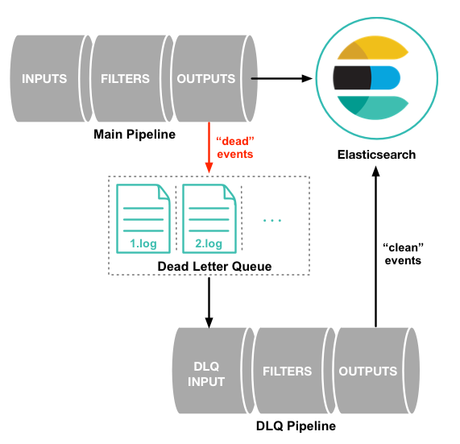

# Docker로 실행하기

> https://www.elastic.co/guide/en/logstash/current/docker.html 참고

- config 파일 작성하기

  - `test.conf` 파일을 작성한다.

  ```yaml
  input {
      elasticsearch {
          hosts => "${ES_HOST}"
          index => "logstash-test"
          query => '{"query":{"match_all":{}}}'
      }
  }
  
  output {
      stdout {}
  }
  ```


- docker compose file 작성하기

  - 이 파일을 실행하면 logstash는 컨테이너 내부의 `/usr/share/logstash/pipeline` 디렉터리에서 `.conf` 파일들을 찾아 해당 config로 실행된다.
  - 따라서 위에서 생성한 `test.conf`파일을 `/usr/share/logstash/pipeline`에 volume을 잡아줘야한다.

  ```yaml
  version: '3.2'
  
  services:
    logstash:
      image: logstash:7.16.2
      container_name: theo_logstash
      ports:
        - 9600:9600
      volumes:
        - ./config:/usr/share/logstash/pipeline
      environment:
        ES_HOST: "<es_host>:<es_port>"
      restart: always
  ```


# Logstash와 DB 연결하기

- JDBC input plugin 설치하기

  - 7.17.0 버전 기준으로 설치 된 상태로 패키징이 된 것 같지만, 이전 버전에서는 따로 설치를 해줘야 하는 것으로 보인다.
  - `/logstash/vendor/bundle/jruby/{version}/gems`에 `logstash-integration-jdbc-{version}`이 있으면 굳이 하지 않아도 된다.
  - 명령어
    - logstash가 설치된 folder에서 실행한다.

  ```bash
  $ bin/logstash-plugin install logstash-input-jdbc
  ```


- hive의 데이터를 logstash를 통해 elasticsearch에 바로 색인할 수 있다.

  - hive를 예로 들었지만 hive의 jdbc driver가 아닌 다른 DB의 jdbc driver를 쓰면 다른 DB도 연결이 가능하다.
    - ES 공식 홈페이지에는 mysql을 연결하는 예시가 나와 있다.
  - 설정 파일
    - 대략적인 설정은 아래와 같다.
    - schedule을 주지 않을 경우 1번만 실행된다.
  
  ```yml
  input {
     jdbc {
         jdbc_driver_library => "./hive-jdbc-2.3.9.jar,./libthrift-0.9.3.jar,./hive-service-rpc-2.3.9.jar,./hive-service-2.3.9.jar,./hive-common-2.3.9.jar,./commons-lang-2.6.jar,./hive-serde-2.3.9.jar"
         jdbc_driver_class => "org.apache.hive.jdbc.HiveDriver"
         jdbc_connection_string => "jdbc:hive2://<Host>:<Port>/<DB명>"
         jdbc_user => "some_user_name"
         jdbc_password => "my_password"
         statement => "select * from product"
         schedule => "* * * * *"
     }
  }
  output 
     elasticsearch {
         hosts => ["10.12.109.101:8379"]
         index => "logstash_test"
     }
  }
  ```
  
  - input
    - `jdbc_driver_library`: 연결에 필요한 라이브러리들을 입력한다.
    - `jdbc_driver_class`: 드라이버 클래스를 설정한다(DB마다 다르므로 다른 DB를 사용하고자 하면 드라이버 클래스를 찾아봐야 한다).
    - `jdbc_connection_string`: DB와 연결 정보를 입력한다.
    - `jdbc_user`, `jdbc_password`: DB에 등록된 사용자명과 비밀번호를 입력한다.
    - `statement`: DB에서 실행할 쿼리를 입력한다.
    - `schedule`: 데이터 수집을 실행할 주기를 입력한다(crontab과 동일하다).
  - output
    - elasticsearch의 host와 index명을 입력한다.


- jdbc_driver_library

  > https://www.apache.org/dyn/closer.cgi/hive/

  - 다른 설정은 크게 문제될 것이 없으나 주로 jdbc_driver_library에서 문제가 발생한다.
  - DB 연결을 위한 라이브러리들을 설치해줘야 하는데 워낙 많다보니 일일이 찾아서 입력해줘야 하는 번거로움이 있다.
  - 필요한 라이브러리 확인
    - 필요한 라이브러리를 설치하지 않은 상태에서 logstash를 실행하면 아래와 같이 `NoClassDefFoundError`가 발생하면서 어떤 class가 없는지를 알려준다.
    - 추후 필요한 라이브러리를 한 번에 확인하는 방법을 찾으면 추가 예정

  - 라이브러리 설치
    - 위 링크로 가서 필요한 버전의 apach-hive를 다운 받는다.
    - 압축을 풀면 다양한 jar 파일이 있을텐데 원래는 `jdbc/hive-jdbc-2.3.9-standalone.jar`  하나만 있으면 실행이 가능하다.
    - 즉 `hive-jdbc-2.3.9-standalone.jar`파일만 logstash 폴더의 적당한 위치에 놓고 `jdbc_driver_library`에 그 경로를 지정해주면 실행이 된다.
    - 그러나 log4j 문제로 이전 버전인 `hive-jdbc-2.3.9-standalone.jar` 파일이 실행되지 않는 문제가 있어 일일이 필요한 라이브러리를 찾아서 옮겨줘야 한다.
    - 위 예시의 경우 `StringUtil`이라는 클래스가 없다고 하므로 `lib/` 폴더 내부의 `commons-lang-2.6.jar` 파일을 logstash 폴더 내부에 옮긴 후, 아래와 같이 추가해준다.
    - 위 예외가 발생하지 않을 때 까지 이 과정을 반복한다.
  
  ```yaml
  input {
     jdbc {
         jdbc_driver_library => "./commons-lang-2.6.jar"
     }
  }
  ```
  


- 실행하기

  - `/bin/logstash` 파일에 logstash 실행 경로 관련 설정이 있어 반드시 아래와 같이 실행해야 한다.

  ```bash
  $ cd <logstash 설치 폴더>
  $ bin/logstash -f <conf 파일 경로>
  ```


- 로그 파일 전송하기

  - logstash가 지원하는 input plugin 중 `file`을 사용하여, 읽어들일 log 파일을 지정한다.
    - path 외에도 다양한 설정이 있으나, path만이 required 값이다.

  ```json
  input {
     file {
         path => "/home/es/theo/logstash/test.log"
     }
  }
  ```

  - filter를 사용하여 로그를 파싱한다.
    - 주로 `grok` plugin을 사용하지만 명확한 구분자가 있을 경우 `disscet`을 사용하는 것이 훨씬 편하다.
    - 둘 이상의 filter를 적용 가능하기에 grok과 disscet을 둘 다 사용할 수도 있다.

  ```json
  filter {
     dissect {
         mapping => {
             "message" => "[%{date}] [%{level}] [%{path}] [%{status_code}] %{req_body}"
         }
     }
  }
  ```

  - 원하는 output을 지정해준다.

  ```bash
  output {
     stdout {}
  }
  ```

  - 예시

  ```bash
  # 아래와 같은 데이터는
  [2022-02-16 17:11:23] [INFO] [/v1/search] [200] {"name":"theo", "age":78}
  
  # 다음과 같이 파싱된다.
  {
  	"date": 2022-02-16 17:11:23
  	"level": INFO
  	"path": /v1/search
  	"status_code": 200
  	"req_body": {"name":"theo", "age":78}
  }
  ```


# Logstash와 Kafka 연동

- docker-compose.yml 파일에 아래와 같이 작성한다.

  - Kafka와 연동에 필요한 설정들을 환경변수로 등록한다.

  ```yaml
  version: '3.2'
  
  services:
    logstash:
      image: logstash:7.16.2
      container_name: theo_logstash
      ports:
        - 9710:9600
      volumes:
        - ./config:/usr/share/logstash/pipeline
      environment:
        KAFKA_HOST: "<kafka host>:<kafka port>"
        KAFKA_GROUP_ID: tmp
        KAFKA_SEARCH_LOG_TOPIC: foo
      restart: always
  ```


- Logstash Configuration 파일을 작성한다.

  - 위에서 등록한 환경변수를 사용하여 input을 작성한다.

  ```json
  input {
      kafka {
              bootstrap_servers => "${KAFKA_HOST}"
              codec => "${KAFKA_SEARCH_CODEC:json}"
              topics => "${KAFKA_SEARCH_LOG_TOPIC}"
              group_id => "${KAFKA_GROUP_ID}"
              consumer_threads => 1
              auto_offset_reset => "${KAFKA_AUTO_OFFSET_RESET:earliest}"
      }
  }
  
  output {
      stdout {
          codec => rubydebug
      }
  }
  ```


# Output Plugin

- elasticsearch output 사용시 template을 미리 정의할 수 있다.

  - 아래와 같이 임의의 템플릿을 생성한다.

  ```json
  // template.json
  {
    "index_patterns": ["test*"],
    "settings": {
      "number_of_shards": 3
    },
    "mappings": {
      "_source": {
        "enabled": false
      },
      "properties": {
        "host_name": {
          "type": "keyword"
        },
        "created_at": {
          "type": "date",
          "format": "EEE MMM dd HH:mm:ss Z yyyy"
        }
      }
    }
  }
  ```

  - output 설정하기

  ```yaml
  input {
      stdin {}
  }
  
  output {
      elasticsearch {
          hosts => "<ES_HOST:PORT>"
          action => "index"
          template => "/usr/share/logstash/template.json"
          template_overwrite => true
          template_name => "bbung"
          index => "test_index"
      }
  }
  ```

  - template 관련 옵션들
    - `manage_template`(default true): 템플릿을 수동으로 관리할지 여부를 설정한다. 이 값이 true여야 나머지 옵션들도 의미가 있다.
    - `template`: template 설정파일의 경로.
    - `template_name`: 생성할 index template의 이름.
    - `template_overwrite`: 동일한 이름의 template이 존재할 때 덮어씌울지 여부를 설정한다. 
  - logstash 7.16 기준으로 legacy template을 생성한다.
    - ES 7.8부터 index template 생성 방식이 변경되었는데, logstash로 생성할 경우 기존의 방식으로 index template을 생성한다.
  - 템플릿은 최초 input이 들어올 때가 아닌, logstash가 실행될 때 생성된다.
    - 만일 logstash가 실행됐음에도 template이 생성되지 않는다면 template 설정을 잘못했을 수 있다.
    - log를 확인 후 `Failed to install template`와 같은 error 메시지가 있다면 template 파일을 확인 후 수정하면 된다.


# Dead letter queues(DLQ)

- DLQ

  - 처리에 실패한 event들(즉 output에 성공적으로 도달하지 못 한 event들)을 pipeline의 blocking이나 event의 유실 없이 처리하기 위한 도구이다.
  - DLQ의 구조
    - DLQ에 작성된 event 들을 처리하기 위해서 추가적인 logstash pipeline이 필요하다.

  > 출처: https://www.elastic.co/guide/en/logstash/7.17/dead-letter-queues.html

  

  - 처리 과정
    - Main pipeline에서 event 처리에 실패한다.
    - 처리에 실패한 각 event는 original event, event가 처리되지 못한 이유를 설명하는 metadata, timestamp 등과 함께 DLQ가 file 형태로 작성된다.
    - DLQ를 처리하기 위한 DLQ pipeline이 처리 후 elasticsearch에 다시 색인한다.
  - DLQ file의 저장 방식
    - 우선 임시 file에 실패한 event들을 작성된다.
    - 마지막 작성으로부터 `flush_interval`에 설정한 시간 만큼이 지나거나 file이 다 찼다고 생각되면 dead letter queue segment file이라 불리는 ingest가 가능해지는 file로 임시 file의 이름을 변경한다.
    - 이름이 변경된 후 새로운 임시 file이 생성된다.
  - 한계
    - DLQ pipeline에서도 실패할 경우, 이를 다시 DLQ pipeline에 넣어 재처리 하는 것은 불가능하다.
    - 현재까지는 elasticsearch output 에서 실패한 event 만을 처리 가능하다.
    - 그 중에서도 response code가 400, 404인 문서들을 대상으로만 사용이 가능한데, 이는 해당 event 자체가 client의 잘못(잘못된 mapping이나 잘못된 양식 등)으로 인해 retry를 하더라도 실패할 것이기 때문이다.
  - 실패 사유별 처리 과정
    - HTTP request 자체가 실패한 경우, 즉 elasticsearch에 문제가 생긴 경우에는 요청에 성공할 때 까지 retry를 무한히 반복하므로 DLQ는 추가적으로 할 일이 없다.
    - HTTP request는 성공했으나, 일부 문서가 색인에 실패한 경우에는, 해당 문서들에 대한 정보만 DLQ에 작성되고 DLQ pipeline에 의해 처리된다.


- 실행해보기

  - 우선 DLQ를 사용하기 위해 `logstash.yml` 설정을 변경한다.
  
  ```yaml
  # DLQ를 활성화하기 위해 true를 준다(기본값은 false).
  dead_letter_queue.enable: true
  
  # DLQ file이 저장될 path를 설정한다.
  path.dead_letter_queue: /usr/share/logstash/data
  
  # 임시 파일이 마지막 작성으로부터 얼마의 시간이 지났을 때 segment file로 이름이 변경될지를 ms 단위로 설정한다.
  # 만일 작성이 빈번히 일어나지 않다면(마지막 작성으로부터의 경과 시간이므로) 이 값이 작을수록 각 segment file의 크기는 더 작아지고, 더 많은 segment file이 생성될 것이다.
  # 1000 미만으로 설정할 수 없다.
  dead_letter_queue.flush_interval: 5000
  
  # DLQ segment 하나의 size를 설정한다.
  # 이 값이 초과되는 event들은 drop된다.
  dead_letter_queue.max_bytes: 1024mb
  
  # max_bytes에 도달했을 때 어떤 data를 drop 시킬지 설정하는 옵션이다.
  # drop_newer는 추가시에 file size가 max_bytes보다 커질 수 있는 새로운 값들을 받지 않는 옵션이다.
  # drop_older는 새로운 data를 위해 기존 data들 중 가장 오래된 것 부터 삭제시키는 옵션이다.
  dead_letter_queue.storage_policy: drop_newer
  ```
  
  


