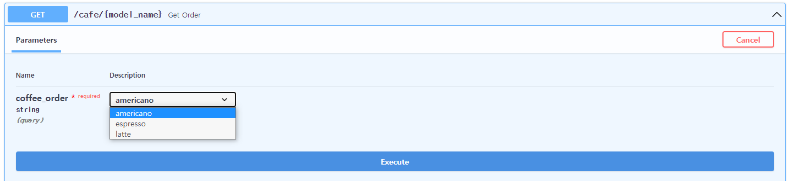

# FastAPI 튜토리얼

- 특징
  - 빠름:  Starlette과 Pydantic 덕분에 NodeJS 및 Go와 대등할 정도로 매우 높은 성능을 지녔다.
  - 빠른 코드 작성: 200~300%까지 개발 속도 증가
  - 적은 버그: 개발자에 의한 에러 40% 감소
  - 직관적: 훌륭한 편집기 지원, 모든 곳에서 자동완성, 적은 디버깅 시간.
  - 쉬움: 쉽게 사용하고 배우도록 설계.
  - 짧음: 코드 중복 최소화, 각 매개변수 선언의 여러 기능.


- 설치하기

  - Python 3.6 이상부터 사용 가능하다.
  - fastapi 설치

  ```bash
  $ pip install fastapi
  ```

  - uvicorn 설치

  ```bash
  $ pip install uvicorn[standard]
  ```


- 만들기

  - main.py 파일 생성
    - required인지 optional인지는 기본값 설정 여부에 달려있다.
  
  ```python
  from typing import Optional
  from fastapi import FastAPI
  
  # application 생성
  app = FastAPI()
  
  @app.get("/")
  def read_root():
      return {"Hello":"World"}
  
  @app.get("/items/{item_id}")
  # int형 이어야 하는 경로 매개변수와 str형 이어야 하는 경로 매개변수 q를 받는다.
  # q의 경우 기본값으로 None을 줬기에 optional이지만, 만일 기본값을 주지 않을 경우 required가 된다.
  def read_item(item_id: int, q: Optional[str]=None):
      return {"item_id": item_id, "q": q}
  ```
  
  - 서버 실행하기
    - 위 코드에서 `app = FastAPI()`로 생성된 app을 명령어로 넣는다.
    - `--reload`는 코드가 변경된 후 서버를 재시작하는 명령어이다.
    - 호스트와 포트를 변경하고자 한다면 `--host`, `--port` 옵션을 준다.
  
  ``` bash
  # uvicorn 파일명:FastAPI()로 생성한 객체 --reload
    
  $ uvicorn main:app --reload
  ```


- 요청 보내기

  ```json
  GET 127.0.0.1:8000/items/5?q=Theo
  
  {
      "item_id": 5,
      "q": "Theo"
  }
  ```


- API 문서
  - 대화형 API 문서
    -  주소 뒤에 `/docs`를 입력하면 대화형 API 문서로 접속이 가능하다.
  - 대안 API 문서
    - 주소 뒤에 `/redoc`을 입력하면 대화형 API 문서로 접속이 가능하다.
  - 코드가 변경되면 문서도 자동으로 업그레이드 된다.


- Request Body를 함께 보내기

  - `pydantic`을 활용한다.

  ```python
  from typing import Optional
  from fastapi import FastAPI
  from pydantic import BaseModel
  
  app = FastAPI()
  
  class Item(BaseModel):
      name: str
      price: float
      # is_offer는 기본값으로 None을 줬기에 optional한 값이 된다.
      is_offer:Optional[bool] = None
  
  # (...중략...)
  
  
  @app.put("/itmes/{item_id}")
  def update_item(item_id: int, item: Item):
      return {"item_name":item.name, "item_id": item_id}
  ```


# 경로 매개변수

- fastapi에서는 매개변수 또는 변수를 경로에 선언할 수 있다.

  - 경로 매개변수의 값은 함수의 파라미터로 전달된다.
  - 예시
    - 경로 매개변수 `item_id`를 받아 함수의 파라미터로 전달.

  ```python
  from fastapi import FastAPI
  
  
  app = FastAPI()
  
  @app.get("/items/{item_id}")
  async def read_item(item_id):
      return {"item_id": item_id}
  ```


- 타입이 있는 매개변수

  - Python 타입 어노테이션(타입 힌트)을 통해 함수에 있는 경로 매개변수의 타입을 선언할 수 있다.
    - 경로 매개변수는 문자열로 들어오지만 함수가 받은 값은 문자열이 아닌 int이다.
    - 즉, FastAPI는 자동으로 요청을 **파싱**한다.
    - 파싱: 여기서의 파싱은 문자열 표현을 해당하는 형으로 변환하는 것을 의미한다.

  ```python
  from fastapi import FastAPI
  
  app = FastAPI()
  
  
  @app.get("/items/{item_id}")
  # type hint로 item_id를 int type으로 설정
  async def read_item(item_id: int):
      return {"item_id": item_id}
  ```

  - 선언한 타입과 다른 타입이 입력으로 들어올 경우
    - `http://127.0.0.1:8002/items/2`와 같이 int로 변환 가능한 값(파싱 가능한 값)이 들어오면 정상적으로 반환값을 반환한다.
    - 그러나 `http://127.0.0.1:8002/items/hello`와 같이 int로 변환 불가능한 값(파싱 불가능한 값)이 들어오면 아래와 같은 에러를 반환한다.
    - `http://127.0.0.1:8002/items/2.2`와 같이 float을 입력해도 동일한 error가 발생한다.

  ```json
  {
      "detail": [
          {
              "loc": [
                  "path",
                  "item_id"
              ],
              "msg": "value is not a valid integer",
              "type": "type_error.integer"
          }
      ]
  }
  ```


- API의 선언 순서

  - 문제 상황
    - 아래 예시와 같이 API를 작성했을 경우 `read_user_me`와 `read_user`는 경로가 겹치는 부분이 있다.
    - 사용자가 `read_user_me`로 요청을 보내려 `/user/me`로 보내면 먼저 선언된 API인 `read_user`가 `me`를 경로 매개변수로 인식하여  `read_user`로 요청이 가게 된다.

  ```python
  from fastapi import FastAPI
  
  
  app = FastAPI()
  
  
  @app.get("/users/{user_name}")
  async def read_user(user_name: str):
      return {"user_name": user_name}
  
  
  @app.get("/users/me")
  async def read_user_me():
      return {"user_id": "the current user"}
  ```

  - 위와 같은 상황에서는 선언 순서를 변경해줘야 한다.

  ```python
  from fastapi import FastAPI
  
  app = FastAPI()
  
  
  @app.get("/users/me")
  async def read_user_me():
      return {"user_id": "the current user"}
  
  
  @app.get("/users/{user_name}")
  async def read_user(user_name: str):
      return {"user_name": user_name}
  ```


- Enum 활용

  - Enum을 활용하면 경로 매개변수의 값을 미리 지정할 수 있다.
  - Enum 클래스 생성
    - 설정하고자 하는 경로 매개변수의 타입과 Enum을 상속받는 서브 클래스를 생성한다.
    - 아래 예시의 경우 Enum과 문자열을 상속받는데, 상속받은 타입(문자열)이 경로 매개변수의 타입이 된다.

  ```python
  from enum import Enum
  
  from fastapi import FastAPI
  
  
  class ModelName(str, Enum):
      americano = "americano"
      espresso = "espresso"
      latte = "latte"
  ```

  - 경로 매개변수 선언
    - 반환할 때는 Enum type인 coffee_order를 문자열로 변환해서 반환한다.

  ```python
  from enum import Enum
  
  from fastapi import FastAPI
  
  
  class CoffeeOrder(str, Enum):
      americano = "americano"
      espresso = "espresso"
      latte = "latte"
  
  
  app = FastAPI()
  
  
  @app.get("/models/{coffee_name}")
  async def get_order(coffee_order: CoffeeOrder):
      if coffee_order == CoffeeOrder.americano:
          return {"coffee_order": coffee_order, "price": 4500}
  
      if coffee_order.value == "espresso":
          return {"coffee_order": coffee_order, "price": 4000}
  
      return {"coffee_order": coffee_order, "price": 5000}
  ```

  - 매개변수의 값을 미리 지정해줬으므로 아래와 같이 선택이 가능하다.

  

  - fastapi에서 제공하는 문서가 아닌 url로 요청을 보내고자 할 경우 아래와 같이 보내면 된다.
    - `http://127.0.0.1:8002/cafe/{coffee_name}?coffee_order=americano`
    - `{coffee_name}`부분은 비워두거나 다른 경로와 겹치지만 않으면 않으면 어떤 값을 넣어도 무관하다.
    - 위에서 선언해준 값 이외의 값을 보내면 error가 발생한다.


- 경로를 포함하는 경로 매개변수

  - `/files/{file_path}`와 같이 파일 경로를 경로 매개변수로 받아야 하는 경우가 있을 수 있다.
  - fastapi는 `/home/theo/workspace/test.txt`와 같이 파일 경로를 포함하는 경로 매개변수를 내부에 선언할 수 없게 해놨다.
  - 그러나 다음과 같은 방법을 사용하면 가능하다.
    - 경로를 선언하는 부분에 `:path`를 추가하면 파일 경로도 경로 매개변수로 사용이 가능하다.
    - 주의할 점은 경로 매개변수로 받은 파일 경로가 반드시 `/`로 시작해야 한다는 것이다.
    - 예컨데 `/files//home/theo/workspace/test.txt`와 같은 경로가 된다(이중 슬레시가 생기는 것이 정상이다).

  ```python
  from fastapi import FastAPI
  
  app = FastAPI()
  
  
  @app.get("/files/{file_path:path}")
  async def read_file(file_path: str):
      return {"file_path": file_path}
  ```

  


