# Open API

## 기본 개념

- OpenAPI Specification(OAS)
  - Restful API를 기술하는 표준
    - 서비스에서 제공하는 API 기능과 End Point를 개발자나 시스템이 자동으로 발견하고 처리하는데 필요한 정보를 제공한다.
    - json이나 yml 형식으로 기술하여야 하며 OAS 파일을 읽어서 디플로이 해주는 도구(e.g. swagger-ui)를 사용하면 브라우저에서 편리하게 API를 볼 수 있다.
    - MS, Google, IBM 등이 명세 작성에 참여하였다.
  - 이전에는 Swagger spec으로 불렸다.
    - 3.0부터 OpenAPI 3.0 Specification이라는 이름으로 표준화 되었다.
    - 기존의 Swagger spec이라는 이름은 Swagger라는 툴의  spec인 것 같은 느낌이 강해 Restful API design의 spec이라는 것을 강조하기 위해 이름을 변경했다.


- Swagger
  - OAS를 수행하기위한 도구
  - Swagger는 OAS에 맞게 디자인하고 빌드하기 위한 도구들의 모음으로 아래와 같은 요소로 이루어져 있다.
    - Swagger Editor: 브라우저 기반 편집기로 OAS를 쉽게 작성할 수 있게 해준다.
    - Swagger UI: OAS 문서를 디플로이하고 브라우저에서 예쁘게 표시할 수 있도록 해준다(redoc으로 대체 가능).
    - Swagger Codegen: OAS에 맞게 서버나 클라이언트의 stub code를 생성해 준다.
    - 그 밖에 여러 도구들이 있다.


- Redoc
  - OAS 파일을 읽어서 디플로이 해주는 도구로 Swagger-UI와 비슷한 역할을 수행한다.
  - 설치와 사용이 간편하다는 장점이 있지만, Swagger-UI와 달리 브라우저에서 API TEST 기능을 해볼수는 없다는 단점이 있다.


- FastAPI는 OpenAPI를 기반으로 한다.

  - 이를 통해 FastAPI에서 작성한 API들을 자동으로 문서화가 가능하다.
  - Swagger UI가 제공하는 문서와 Redoc이 제공하는 문서를 모두 자동으로 만들어 준다.
    - 각기 `/docs`, `/redoc` 으로 접근하면 된다.

  - 문서 생성 과정
    - fastapi 어플리케이션(인스턴스)은 OpenAPI 스키마(title, description, tags 등)를 반환하는 `.openapi()`라는 메서드를 가지고 있다.
    - application 인스턴스가 생성될 때,  `openapi_url`에 등록된 url(기본값은 `/openapi.json`)도 함께 등록된다.
    - 해당 url에 요청을 보내면 openapi 스키마(Json) 정보를 반환한다.
    - `.openapi()`는 등록된 스키마 정보가 있는지 확인해서 있으면 반환해주는 역할만 할 뿐이고, 실제 스키마 생성은 `.get_openapi()`메서드에서 이루어진다.


- 기본 예시

  - 코드 작성하기

  ```python
  from fastapi import FastAPI
  import uvicorn
  
  # fastapi 인스턴스를 생성될 때 openapi_url에 등록된 url(이 경우 /openapi.json)도 함께 등록된다.
  app = FastAPI() 
  
  @app.get("/hello")
  def hello():
      return "Hello!"
  
  @app.get("/world")
  def world():
      return "World!"
  
  if __name__ == '__main__':
      uvicorn.run(app, host='0.0.0.0', port=8000)
  ```

  - `/openapi.json`
    - openapi 스키마 및 각 endpoint에 대한 정보가 반환된다.

  ```json
  // curl "localhost:8000/openapi.json"
  
  {
    "openapi": "3.0.2",
    "info": {
      "title": "FastAPI",
      "version": "0.1.0"
    },
    "paths": {
      "/hello": {
        "get": {
          "summary": "Hello",
          "operationId": "hello_hello_get",
          "responses": {
            "200": {
              "description": "Successful Response",
              "content": {
                "application/json": {
                  "schema": {}
                }
              }
            }
          }
        }
      },
      "/world": {
        "get": {
          "summary": "World",
          "operationId": "world_world_get",
          "responses": {
            "200": {
              "description": "Successful Response",
              "content": {
                "application/json": {
                  "schema": {}
                }
              }
            }
          }
        }
      }
    }
  }
  ```

  - `/docs`

  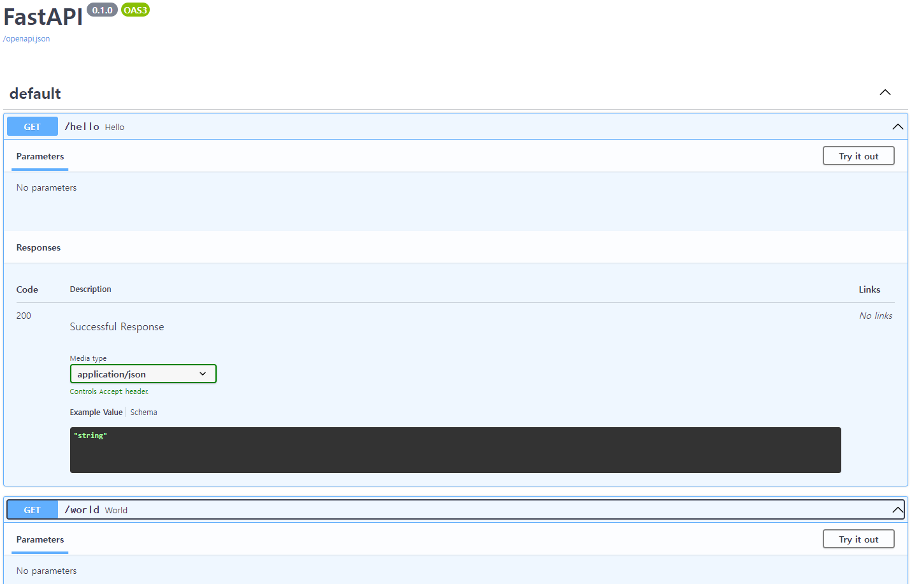

  - `/redoc`

  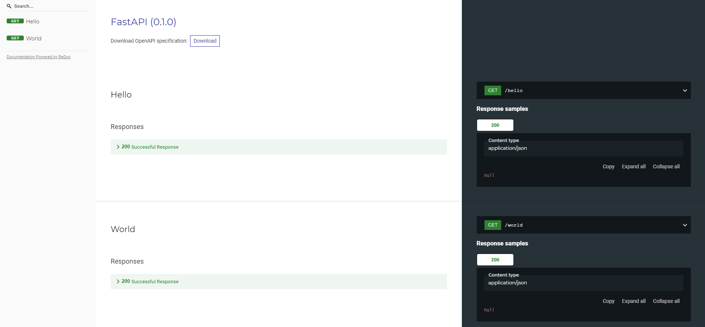


- fastapi에서 문서를 생성하는 과정

  - fastapi가 OAS를 기반으로 json 형식의 스키마를 생성한다.

  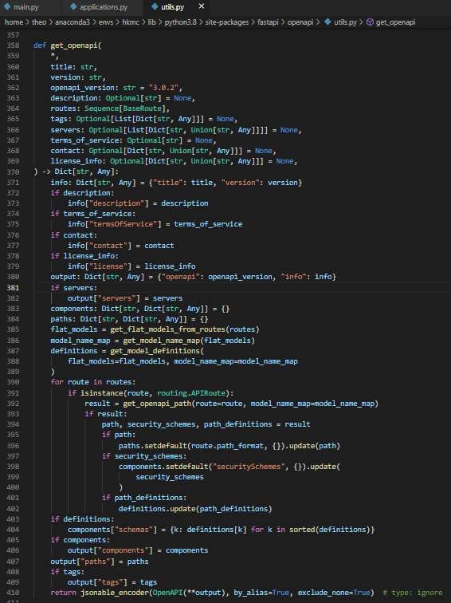

  - `/docs`로 요청이 들어오면 fastapi는 Swagger UI(javascript, css, html의 묶음)를 반환한다.

  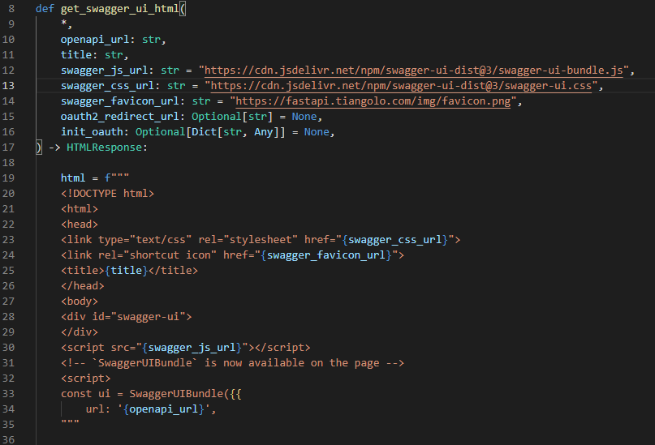

  - Swagger UI가 렌더링을 시작하고 javascript가 실행되면서 fastapi가 작성한 json 파일을 요청한다.
    - 별도로 설정해주지 않을 경우 endpoint는 `/openapi.json`이다.
    - 아래 예시의 경우 설정을 변경해서 `/myopenapi`로 요청을 보낸다.

  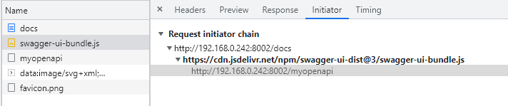

  - 응답으로 받아온 json파일을 파싱하여 화면에 뿌려준다.

  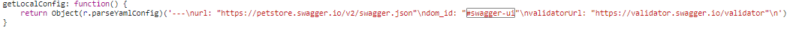


## 상세

### openapi 스키마 변경하기

- fastapi app 인스턴스를 생성할 때, openapi 스키마 정보를 변경할 수 있다.

  - 아래와 같이 인스턴스를 생성할 때 아무 값도 넣지 않으면 전부 기본값으로 설정된다.

  ```python
  from fastapi import FastAPI
  import uvicorn
  
  
  app = FastAPI()
  
  if __name__ == '__main__':
      uvicorn.run(app, host='0.0.0.0', port=8000)
  ```

  - 결과

  ```json
  // /openapi.json
  {"openapi":"3.0.2","info":{"title":"FastAPI","version":"0.1.0"},"paths":{}}
  ```

  - `docs`

  


- 스키마 변경하기

  - 아래와 같이 FastAPI 인스턴스 생성시에 변경하고자 하는 스키마 값들을 설정해준다.

  ```python
  from fastapi import FastAPI
  import uvicorn
  
  
  app = FastAPI(
      title="My OpenAPI Doc",
      version="0.0.1",
      openapi_url="/myopenapi",
      description="My First OpenAPI Doc")
  
  if __name__ == '__main__':
      uvicorn.run(app, host='0.0.0.0', port=8000)
  ```

  - 결과

  ```json
  // /myopenapi
  {"openapi":"3.0.2","info":{"title":"My OpenAPI Doc","description":"My First OpenAPI Doc","version":"0.0.1"},"paths":{}}
  ```

  - `/docs`

  


### 태그 추가하기

- 아무 태그도 주지 않은 경우

  - 코드

  ```python
  from fastapi import FastAPI
  import uvicorn
  
  
  app = FastAPI(
      title="My OpenAPI Doc",
      version="0.0.1",
      openapi_url="/myopenapi",
      description="My First OpenAPI Doc")
  
  @app.get("/user/find-by-id")
  def find_user_by_id():
      return "some_user"
  
  @app.get("/user/find-by-nickname")
  def find_user_by_nickname():
      return "some_user"
  
  @app.get("/pet/find-by-id")
  def find_pet_by_id():
      return "some_pet"
  
  if __name__ == '__main__':
      uvicorn.run(app, host='0.0.0.0', port=8002)
  ```

  - 결과

  ```json
  // /myopenapi
  {
    "openapi": "3.0.2",
    "info": {
      "title": "My OpenAPI Doc",
      "description": "My First OpenAPI Doc",
      "version": "0.0.1"
    },
    "paths": {
      "/user/find-by-id": {
        "get": {
          "summary": "Find User By Id",
          "operationId": "find_user_by_id_user_find_by_id_get",
          "responses": {
            "200": {
              "description": "Successful Response",
              "content": {
                "application/json": {
                  "schema": {}
                }
              }
            }
          }
        }
      },
      "/user/find-by-nickname": {
        "get": {
          "summary": "Find User By Nickname",
          "operationId": "find_user_by_nickname_user_find_by_nickname_get",
          "responses": {
            "200": {
              "description": "Successful Response",
              "content": {
                "application/json": {
                  "schema": {}
                }
              }
            }
          }
        }
      },
      "/pet/find-by-id": {
        "get": {
          "summary": "Find Pet By Id",
          "operationId": "find_pet_by_id_pet_find_by_id_get",
          "responses": {
            "200": {
              "description": "Successful Response",
              "content": {
                "application/json": {
                  "schema": {}
                }
              }
            }
          }
        }
      }
    }
  }
  ```

  - `/docs`
    - 태그를 따로 설정해주지 않았으므로 default로 설정된다.

  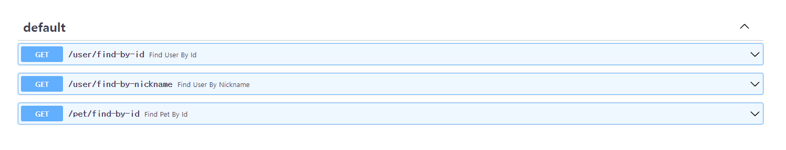


- 태그 추가하기

  - 태그 양식
    - 태그에는 아래와 같은 것들을 추가 가능하다.
    - `title`, `description`, `externalDocs`
  - 태그 추가하기
    - 태그를 선언하고, 선언한 태그를 FastAPI 인스턴스 생성시에 `openapi_tags` 값으로 넣어준다.
    - 이후 각 API마다 tag를 추가해준다.

  ```bash
  from fastapi.openapi.models import ExternalDocumentation
  from fastapi import FastAPI
  import uvicorn
  
  
  # 설정할 tag들을 List[dict] 형태로 선언한다.
  # externalDocs의 경우 ExternalDocumentation의 인스턴스를 입력한다.
  user_tag_external_docs = ExternalDocumentation(
                          description="external documentation", 
                          url="http://localhost:8002/docs#/User")
  tags = [
      {
          "name":"user",
          "description":"Find user by some info",
          "externalDocs":user_tag_external_docs
      },
      {
          "name":"pet",
          "description":"Find pet by some info"
      }
  ]
  
  app = FastAPI(
      title="My OpenAPI Doc",
      version="0.0.1",
      openapi_url="/myopenapi",
      description="My First OpenAPI Doc",
      openapi_tags=tags)
  
  @app.get("/user/find-by-id", tags=["user"])	# 태그 추가
  def find_user_by_id():
      return "some_user"
  
  @app.get("/user/find-by-nickname", tags=["user"])
  def find_user_by_nickname():
      return "some_user"
  
  @app.get("/pet/find-by-id", tags=["pet"])
  def find_pet_by_id():
      return "some_pet"
  
  if __name__ == '__main__':
      uvicorn.run(app, host='0.0.0.0', port=8002)
  ```

  - 결과
    - `tags`가 추가된 것을 확인 가능하다.

  ```json
  // /myopenapi
  {
    "openapi": "3.0.2",
    "info": {
      "title": "My OpenAPI Doc",
      "description": "My First OpenAPI Doc",
      "version": "0.0.1"
    },
    // (...)
    "tags": [
      {
        "name": "user",
        "description": "Find user by some info",
        "externalDocs": {
          "description": "external documentation",
          "url": "http://localhost:8002/docs#/User"
        }
      },
      {
        "name": "pet",
        "description": "Find pet by some info"
      }
    ]
  }
  ```
  
  - `/docs`
  
  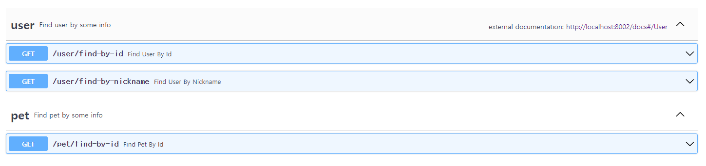


### Request 설정하기

- API와 마찬가지로 Request, Response 역시 설정만 해놓으면 자동으로 openapi에 추가된다.

  - model 작성하기
    - User를 request시에 사용하고, Pet을 Response시에 사용한다.
  
  
  ```python
  from typing import Optional
  from pydantic import BaseModel
  
  
  class User(BaseModel):
      id: int
      name: str
  
  class Pet(BaseModel):
      id: int
      name: str
      breed: str
      owner: User
      age: Optional[int]
  ```
  
  - API에 적용하기
  
  ```python
  from fastapi import FastAPI
  from models.request import User
  from models.response import Pet
  import uvicorn
  
  
  tags = [
      {
          "name":"pet",
          "description":"Find pet by some info"
      }
  ]
  
  app = FastAPI(
      title="My OpenAPI Doc",
      version="0.0.1",
      openapi_url="/myopenapi",
      description="My First OpenAPI Doc",
      openapi_tags=tags)
  
  @app.post("/find-pet-by-user", tags=["pet"], response_model=Pet)	# response model을 지정
  def find_pet_by_user(request:User):	# request Model을 지정
      response = {
          "id": 1,
          "name": "spring",
          "breed": "bichon",
          "owner": request,
          "age": 2
      }
      return response
  
  if __name__ == '__main__':
      uvicorn.run(app, host='0.0.0.0', port=8002)
  ```
  
  - 결과
  
  ```json
  // /myopenapi
  {
    // ...
    "paths": {
      "/find-pet-by-user": {
        "post": {
          "tags": [
            "pet"
          ],
          "summary": "Find Pet By User",
          "operationId": "find_pet_by_user_find_pet_by_user_post",
          "requestBody": {
            "content": {
              "application/json": {
                "schema": {
                  "$ref": "#/components/schemas/User"		// RequestBody에 User가 추가
                }
              }
            },
            "required": true
          },
          "responses": {
            "200": {
              "description": "Successful Response",
              "content": {
                "application/json": {
                  "schema": {
                    "$ref": "#/components/schemas/Pet"	// Response에 Pet이 추가
                  }
                }
              }
            },
            //...
          }
        }
      }
    },
    "components": {
      "schemas": {
        // ...
        "Pet": {
          "title": "Pet",
          "required": [
            "id",
            "name",
            "breed",
            "owner"
          ],
          "type": "object",
          "properties": {
            "id": {
              "title": "Id",
              "type": "integer"
            },
            "name": {
              "title": "Name",
              "type": "string"
            },
            "breed": {
              "title": "Breed",
              "type": "string"
            },
            "owner": {
              "$ref": "#/components/schemas/User"
            },
            "age": {
              "title": "Age",
              "type": "integer"
            }
          }
        },
        "User": {
          "title": "User",
          "required": [
            "id",
            "name"
          ],
          "type": "object",
          "properties": {
            "id": {
              "title": "Id",
              "type": "integer"
            },
            "name": {
              "title": "Name",
              "type": "string"
            }
          }
        },
        // ...
  ```
  
  - `/docs`
    - request와 response가 추가되었다.
  
  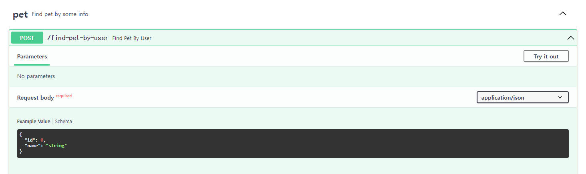
  
  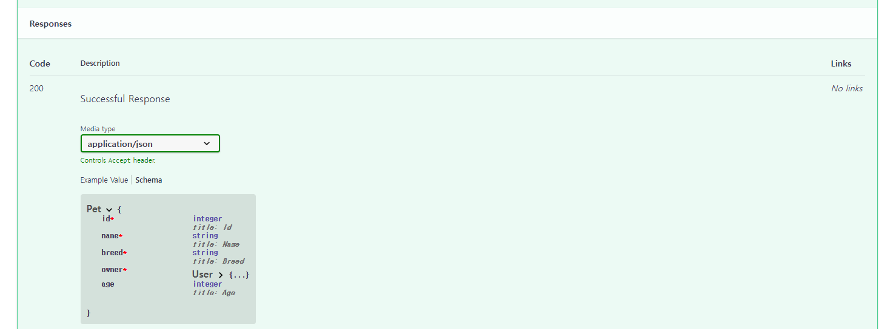
  
  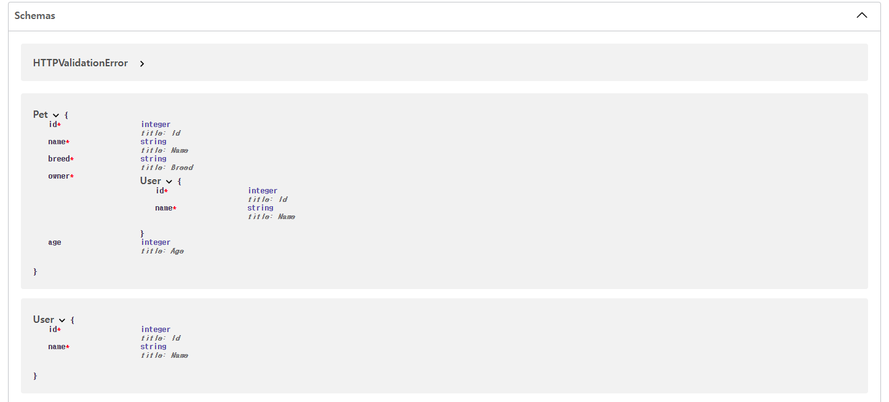


- Request body 예시 추가하기

  - 코드
    - Reuqest의 inner class로 `Config`를 선언한다.
    - `schema_extra`라는 이름으로 딕셔너리를 선언하고 `example`라는 key의 value로 예시로 사용할 값을 넣는다.
    - `schema_extra` attirbute는 JSON 스키마를 확장하거나 변경할 때 사용된다.

  ```python
  from typing import Optional
  from pydantic import BaseModel
  
  
  class User(BaseModel):
      id: int
      name: str
  
      class Config:
          schema_extra = {
              "example":{
                  "id":11,
                  "name":"John"
              }
          }
  ```

  - 결과
    - example이 추가된 것을 확인 가능하다.
    - `components.schema.User.example`에 추가된다.

  ```json
  {	
      // ...
      "User": {
          "title": "User",
          "required": [
              "id",
              "name"
          ],
          "type": "object",
          "properties": {
              "id": {
                  "title": "Id",
                  "type": "integer"
              },
              "name": {
                  "title": "Name",
                  "type": "string"
              }
          },
          "example": {
              "id": 11,
              "name": "John"
          }
      }
      // ...
  }
  ```

  - `/docs`
    - Example Value가 위에서 입력한 값으로 변경되었다.

  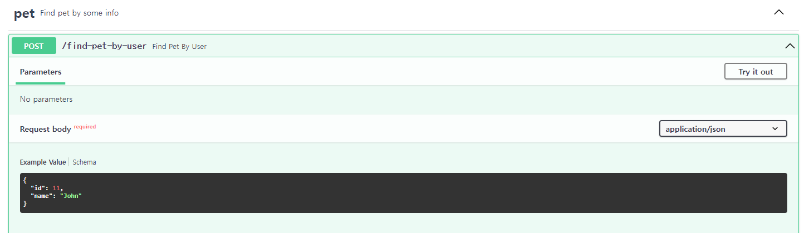


- `Field`를 사용하여 예시 추가

  - pydantic의 `Field`를 사용하여 추가가 가능하다.

  ```python
  from typing import Optional
  from pydantic import BaseModel, Field
  
  
  class User(BaseModel):
      id: int = Field(..., example=11)
      name: str = Field(..., example="John")
  ```

  - 결과
    - `schema_extra` 에 추가하는 것과 비교할 때 `/docs`에서 봤을 때의 결과는 동일하지만, json파일은 다르게 생성된다.
    - `components.schema.User.properties`의 각 필드 별로 `example`이 추가된다.

  ```json
  // ...
  "User": {
      "title": "User",
      "required": [
          "id",
          "name"
      ],
      "type": "object",
      "properties": {
          "id": {
              "title": "Id",
              "type": "integer",
              "example": 11
          },
          "name": {
              "title": "Name",
              "type": "string",
              "example": "John"
          }
      }
  }
  // ...
  ```


- `Body`를 사용하여 추가

  - ` fastapi`의 `Body`를 활용하여 추가가 가능하다.

  ```python
  from fastapi import FastAPI, Body
  from models.request import User
  from models.response import Pet
  import uvicorn
  
  # ...(중략)...
  
  # 예시를 생성
  example = Body(
      ...,
      example={
          "id": 11,
          "name": "John"
      }
  )
  
  @app.post("/find-pet-by-user", tags=["pet"], response_model=Pet, responses=responses)
  def find_pet_by_user(request:User = example):	# 예시를 추가
      response = {
          "id": 1,
          "name": "spring",
          "breed": "bichon",
          "owner": request,
          "age": 2
      }
      return response
  
  if __name__ == '__main__':
      uvicorn.run(app, host='0.0.0.0', port=8002)
  ```

  - 결과
    - 이 경우 위의 두 방식(`schema_extra`, `Field`를 사용해서 추가)과 example이 들어가는 위치가 완전히 다르다.
    - `components.schema`가 아닌 `paths/<endpoint>/<http method>/requestBody/content/<content type>/example`에 추가된다.
    - 문서에서 보여주는 방식은 위의 두 방식과 차이가 없다.

  ```json
  {
      // (...)
      "paths": {
          "/find-pet-by-user": {
              "post": {
                  "tags": [
                      "pet"
                  ],
                  "summary": "Find Pet By User",
                  "operationId": "find_pet_by_user_find_pet_by_user_post",
                  "requestBody": {
                      "content": {
                          "application/json": {
                              "schema": {
                                  "$ref": "#/components/schemas/User"
                              },
                              "example": {
                                  "id": 11,
                                  "name": "John"
                              }
                          }
                      },
                      "required": true
                  },
                  // (...)
          }
      ]
  }
  ```


- Request body에 복수의 예시 추가하기

  - 딕셔너리 형태로 복수의 예시를 추가할 수 있다.
    - key에는 각 예시를 구분할 수 있는 값이 들어간다.
    - value에는 `summary`, `description`, `value`, `externalValue`를 key로 가지는 딕셔너리가 들어간다.
    - `description`에는 markdown 형식으로 작성이 가능하다.
    - `externalValue`는 `value`에 담기 힘들 정도로 긴 예시나, 보다 쉬운 설명을 위해 json, 혹은 image등을 가리키는 url을 값으로 받는다.
    - 그러나 `externalValue`의 경우 Swagger UI에서 지원하지 않아 사용이 불가능하다.
  - `Body()`뿐 아니라 아래와 같은 것들에 모두 example을 선언할 수 있다.
    - `Path()`, `Query()`, `Header()`, `Cookie()`, `Form()`, `File()`

  - 예시

  ```python
  from fastapi import FastAPI, Body
  from models.request import User
  from models.response import Pet
  import uvicorn
  
  
  # (...)
  
  
  examples = Body(
      ...,
      examples={
          "good":{
              "summary":"A normal example",
              "description": "A **normal** user works correctly",
              "value":{
                  "id":11,
                  "name":"John"
              }
          },
          "bad":{
              "summary":"A abnormal example",
              "description":"""This example will return 422 Unprocessable Entity. 
                              Because the id is not a valid integer""",
              "value":{
                  "id":"wrong_value",
                  "name":"John"
              }
          },
          "external_value":{
              "summary":"external value",
              "externalValue":"http://example.com/examples/object-example.json"
          }
      }
  )
  
  @app.post("/find-pet-by-user", tags=["pet"], response_model=Pet, responses=responses)
  def find_pet_by_user(request:User = examples):
      response = {
          "id": 1,
          "name": "spring",
          "breed": "bichon",
          "owner": request,
          "age": 2
      }
      return response
  
  if __name__ == '__main__':
      uvicorn.run(app, host='0.0.0.0', port=8002)
  ```

  - 결과
    - `paths/<endpoint>/<http method>/requestBody/content/<content type>/examples`에 추가된다.

  ```json
  {
      "openapi": "3.0.2",
      "info": {
          "title": "My OpenAPI Doc",
          "description": "My First OpenAPI Doc",
          "version": "0.0.1"
      },
      "paths": {
          "/find-pet-by-user": {
              "post": {
                  "tags": [
                      "pet"
                  ],
                  "summary": "Find Pet By User",
                  "operationId": "find_pet_by_user_find_pet_by_user_post",
                  "requestBody": {
                      "content": {
                          "application/json": {
                              "schema": {
                                  "$ref": "#/components/schemas/User"
                              },
                              "examples": {
                                  "good": {
                                      "summary": "A normal example",
                                      "description": "A **normal** user works correctly",
                                      "value": {
                                          "id": 11,
                                          "name": "John"
                                      }
                                  },
                                  "bad": {
                                      "summary": "A abnormal example",
                                      "description": "This example will return 422 Unprocessable Entity. \n                            											Because the id is not a valid integer",
                                      "value": {
                                          "id": "wrong_value",
                                          "name": "John"
                                      }
                                  }
                              }
                          // (...)
  ```

  - `/docs`

  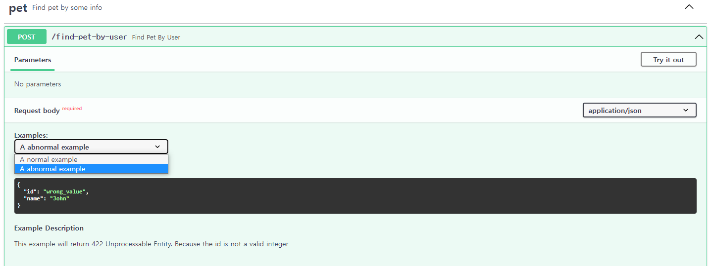


- example이 추가되는 과정
  - `schema_extra`나 `Field`에 예시를 추가하는 경우
    - example을 작성하면 Pydantic Model의 JSON Schema에 example이 포함된다.
    - Pydantic Model의 JSON Schema는  OpenAPI에 포함되므로 결국 docs에 example이 나타나게 된다.
    - JSON Schema에는 example이라는 필드가 원래 존재하지 않는다(최신 버전에는 examples라는 필드가 추가되었다).
    - 따라서 OpenAPI는 자체적으로 JSON Schema를 정의하고, example 필드를 추가해서 사용한다.
    - 따라서 example이라는 필드는 JSON Schema의 필드는 아니지만, OpenAPI가 자체적으로 정의한 JSON Schema의 일부이므로 docs에서 보여줄 수 있게 된다.
  - `Body()`(혹은 `Query()`, `Path()`등)를 활용해서 예시를 추가하는 경우
    - 이 경우  JSON Schema에 포함되지 않으며, OpenAPI가 자체적으로 정의한 JSON Schema에도 포함되지 않는다.
    - OpenAPI의 path operation을 선언하는 부분에 직접 추가된다(즉 JSON Schema를 사용하지 않는 부분에 직접 추가 된다).
    - `Path()`, `Query()`, `Header()`, `Cookie()`의 경우 `example` 혹은 `examples`는 OpenAPI의 [Parameter Object](https://github.com/OAI/OpenAPI-Specification/blob/main/versions/3.0.3.md#parameter-object)에 추가된다.
    - `Body()`, `File()`, `Form()`의 경우 `example` 혹은 `examples`는 OpenAPI의 Request Body 오브젝트의 content 필드 내부의 [Media Type Object](https://github.com/OAI/OpenAPI-Specification/blob/main/versions/3.0.3.md#mediaTypeObject)에 추가된다.
  - OpenAPI:3.1.0부터는 최신 버전의 JSON Schema(즉 examples가 추가된 버전)를 기반으로 하므로 JSON Schema와 OpenAPI가 직접 정의한 JSON Schema 사이의 차이가 거의 사라졌다.
    - 그럼에도 Swagger UI는 아직 OpenAPI:3.1.0을 지원하지 않으므로 위와 같이 사용해야 한다.


### Response 설정하기


## Extending OpenAPI

> https://fastapi.tiangolo.com/advanced/extending-openapi/ 참고


# 참고

- [pydantic-Model Config](https://pydantic-docs.helpmanual.io/usage/model_config/)
- [Swagger-Grouping Operations With Tags](https://swagger.io/docs/specification/2-0/grouping-operations-with-tags/?sbsearch=tags)
- [fastapi-github](https://github.com/tiangolo/fastapi)
- https://swagger.io/blog/api-strategy/difference-between-swagger-and-openapi/
- https://fastapi.tiangolo.com/tutorial/schema-extra-example/
