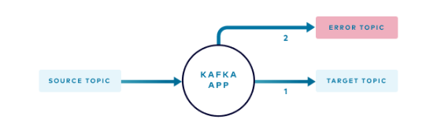

# Kafka를 사용한 application의 error handling

> https://www.confluent.io/blog/error-handling-patterns-in-kafka/

- Kafka를 사용하여 application을 개발하다 보면 종종 문제가 생길 수 있다.
  - Kafka를 주로 사용하는 분산 시스템의 특성 상 언제 어디서 어떤 문제가 발생할지 모두 예측이 어렵고, 문제가 발생하기도 쉽다.
  - 따라서, 문제가 발생했을 때 적절히 처리하는 방법들이 필요하다.

- 처리되지 못 한 message를 위한 topic을 생성한다.

  - error topic에는 아직, 혹은 일시적 문제로 처리되지 못 한 message가 들어가는 것이 아니라, message의 형식이 잘못되어 아예 처리를 할 수 없는 것과 같이 비정상적인 message가 들어가게 된다.
  - 일시적인 문제로 처리되지 못하는 message는 아래에 있는 retry topic에 넣고 재시도한다.

  

- Retry topic과 retry app을 추가한다.

  - Retry topic에는 현재 상황상 일시적으로 처리할 수 없는 message를 넣은 후, retry topic을 구독하는 kafka app에서 재시도한다.
  - 단 이 parttern은 message의 처리 순서가 보장되지 않는다는 문제가 있다.
    - 예를들어 message A, B가 순서대로 처리해야 된다고 가정했을 때
    - A가 일시적 문제로 처리에 실패하여 retry topic으로 들어가게 되고, retry app에서 재처리된다.
    - 만일 A의 재처리가 끝나기 전에 B가 실행된다면, 문제가 생길 수 있다.
  - 따라서 이 방식은 순서대로 처리 되지 않아도 되는 경우에만 사용해야 한다.

  

- Retry topic을 사용하면서도, message 처리 순서를 보장하는 partten.

  - 만일 retry topic에 message를 저장해야 할 경우, 해당 message를 고유하게 식별할 수 있는 정보를 application의 in-memory structure에 저장하고 이를 사용하여 message 처리 순서를 보장한다.

  - 처리 과정은 다음과 같다.

    

    - 일시적인 문제로 처리할 수 없는 message가 발생한다.

    - 해당 message의 unique id 값을 application의  in memory store에 저장한다.
    - 해당 message의 header에 unique id를 담아서 retry topic으로 전송한다.
    - unique id 값을 redirect topic에 전송한다.
    - 다음 message가 들어온다.
    - 이 message와 연계된 message 중 retry topic으로 전송된 message가 있는지 확인하기 위해서 in memory storage 내부의 그룹화된 id를 살펴본다.

    

    - 만일 자신이 속한 그룹이 존재하면, retry topic으로 전송된 message가 있다는 뜻이므로, main app에서 처리하지 않고 첫 message가 retry topic으로 갔던 것과 동일한 과정을 거쳐 retry topic으로 전송된다.

    

    - Retry app은 retry topic에서 message를 가져와 순차적으로 처리하고, 처리가 완료되면 redirect topic에 tombstone format으로 header에 unique id 값을 담아서 message를 보낸다(kafka에서 tumbstone 이란 value가 null 값인 message를 말한다).

    - Main application은 redirect topic에 tombstone message가 들어오는지 지켜보고 있다가 tombstone message가 들어오면 in-memory store에서 그에 해당하는 unique key를 삭제한다.

  - 장애가 발생하면(main application에 문제가 생겨 종료되면) in-memory storage에 저장되어 있단 unique id들도 삭제될텐데 그럴 때는 어떻게 해야 하나?

    - redirect topic에 있는 값들을 읽어 in-memory storage에 저장하면 간단히 해결된다.

# tips

- 언제 topic을 분리하고, 언제 topic을 합쳐야 하는가
  - 기본적으로 RDBMS의 entitiy 개념을 kafka에도 적용하여 서로 다른 entity는 서로 다른 topic에 저장한다.
  - 만일 message를 순서대로 처리해야 한다면 다른 entitiy라 하더라도 같은 topic에서 처리한다.
    - kafka는 오직 같은 토픽의 같은 파티션 내에서만 순서를 모장하기 때문이다.
  - 다른 entity라 하더라도 한 entity가 다른 entity에 의존적이라면, 같은 topic에 저장한다.
    - 혹은 의존적이지는 않더라도 둘이 자주 함께 처리 된다면, 같은 topic에 저장한다.
    - 반면에 서로 관련이 없거나, 서로 다른 팀에서 관리한다면 다른 topic에 저장한다.
    - 만일 한 entity가 다른 entity에 비해 message 양이 압도적으로 많다면, topic을 분리하는 것이 좋다.
    - 그러나 적은 message 양을 갖는 여러 entity는 하나의 topic으로 묶는 것이 좋다.
  - 하나의 event가 여러 entity와 관련된 경우 하나의 topic으로 묶는 것이 좋다.
    - 예를 들어 purchase라는 entity는 product, customer라는 entity와 관련이 있을 수 있는데, 이들은 하나의 topic에 묶어서 저장하는 것이 좋다.
    - 추가적으로, 위와 같은 경우 message 자체를 분리하지 말고 한 message에 넣는 것이 좋다.
    - 여러 entity로 조합된 message를 분리하기는 쉬워도 분리된 여러 message를 하나의 message로 합치는 것은 어렵기 때문이다.
  - 여러 개의 consumer들이 특정한 topic 들의 group을 구독하고 있다면, 이는 topic을 합쳐야 한다는 것을 의미한다.
    - 잘개 쪼개진 topic을 합치게 되면 몇몇 consumer들은 원치 않는 message를 받게 될 수도 있다.
    - 그러나 Kafka에서 message를 받아오는 작업은 비용이 매우 적게 들기 때문에, consumer가 받아오는 message의 절반을 사용하지 않는다고 하더라도, 이는 크게 문제가 되지 않는다.
    - 그러나, 상기했듯 한 entity가 다른 entity에 비해 message 양이 압도적으로 많다면(99.9 대 0.01 정도라면) 그 때는 분리하는 것을 추천한다. 