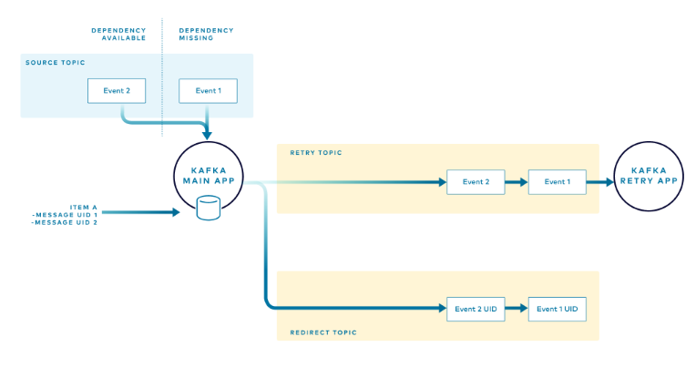
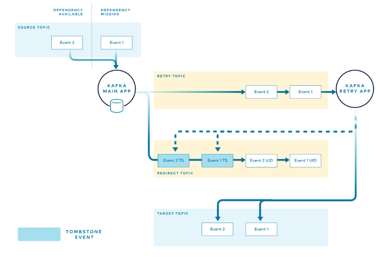

# ksqlDB

- ksqlDB
  - Kafka streams와 유사한 기능을 한다.
    - Kafka streams의 경우 Java나 Rust로 작성해야만 해서 Java나 Rust를 모르는 사람은 쓸 수 없다는 문제가 있었다.
    - SQL만을 사용하여 Kafka Streams와 유사한 작업을 할 수 있도록 하기 위해 ksqlDB가 개발되었다.


- ksqlDB 실행하기

  - Docker compose file을 작성한다.

  ```yaml
  version: '3.2'
  
  
  services:
    kafka1:
      container_name: kafka1
      image: confluentinc/cp-kafka:7.5.3
      ports:
        - "9097:9092"
      environment:
        KAFKA_NODE_ID: 1
        KAFKA_LISTENER_SECURITY_PROTOCOL_MAP: CONTROLLER:PLAINTEXT,INTERNAL:PLAINTEXT,EXTERNAL:PLAINTEXT
        KAFKA_LISTENERS: INTERNAL://:29092,CONTROLLER://:29093,EXTERNAL://0.0.0.0:9092
        KAFKA_ADVERTISED_LISTENERS: INTERNAL://:29092,EXTERNAL://127.0.0.1:9097
        KAFKA_PROCESS_ROLES: 'broker,controller'
        KAFKA_CONTROLLER_QUORUM_VOTERS: 1@kafka1:29093,2@kafka2:29093,3@kafka3:29093
        KAFKA_INTER_BROKER_LISTENER_NAME: INTERNAL
        KAFKA_CONTROLLER_LISTENER_NAMES: CONTROLLER
        CLUSTER_ID: MkU3OEVBNTcwNTJENDM2Qk
      restart: always
  
    kafka2:
      container_name: kafka2
      image: confluentinc/cp-kafka:7.5.3
      ports:
        - "9098:9092"
      environment:
        KAFKA_NODE_ID: 2
        KAFKA_LISTENER_SECURITY_PROTOCOL_MAP: CONTROLLER:PLAINTEXT,INTERNAL:PLAINTEXT,EXTERNAL:PLAINTEXT
        KAFKA_LISTENERS: INTERNAL://:29092,CONTROLLER://kafka2:29093,EXTERNAL://0.0.0.0:9092
        KAFKA_ADVERTISED_LISTENERS: INTERNAL://:29092,EXTERNAL://127.0.0.1:9098
        KAFKA_PROCESS_ROLES: 'broker,controller'
        KAFKA_CONTROLLER_QUORUM_VOTERS: 1@kafka1:29093,2@kafka2:29093,3@kafka3:29093
        KAFKA_INTER_BROKER_LISTENER_NAME: INTERNAL
        KAFKA_CONTROLLER_LISTENER_NAMES: CONTROLLER
        CLUSTER_ID: MkU3OEVBNTcwNTJENDM2Qk
      restart: always
  
    kafka3:
      container_name: kafka3
      image: confluentinc/cp-kafka:7.5.3
      ports:
        - "9099:9092"
      environment:
        KAFKA_NODE_ID: 3
        KAFKA_LISTENER_SECURITY_PROTOCOL_MAP: CONTROLLER:PLAINTEXT,INTERNAL:PLAINTEXT,EXTERNAL:PLAINTEXT
        KAFKA_LISTENERS: INTERNAL://:29092,CONTROLLER://kafka3:29093,EXTERNAL://0.0.0.0:9092
        KAFKA_ADVERTISED_LISTENERS: INTERNAL://:29092,EXTERNAL://127.0.0.1:9099
        KAFKA_PROCESS_ROLES: 'broker,controller'
        KAFKA_CONTROLLER_QUORUM_VOTERS: 1@kafka1:29093,2@kafka2:29093,3@kafka3:29093
        KAFKA_INTER_BROKER_LISTENER_NAME: INTERNAL
        KAFKA_CONTROLLER_LISTENER_NAMES: CONTROLLER
        CLUSTER_ID: MkU3OEVBNTcwNTJENDM2Qk
      restart: always
    
    ksqldb-server:
      image: confluentinc/ksqldb-server:0.29.0
      container_name: ksqldb-server
      ports:
        - "8088:8088"
      environment:
        KSQL_BOOTSTRAP_SERVERS: kafka1:9092,kafka2:9092,kafka3:9092
        KSQL_LISTENERS: http://0.0.0.0:8088
        KSQL_KSQL_LOGGING_PROCESSING_STREAM_AUTO_CREATE: "true"
        KSQL_KSQL_LOGGING_PROCESSING_TOPIC_AUTO_CREATE: "true"
      restart: always
  
    ksqldb-cli:
      image: confluentinc/ksqldb-cli:0.29.0
      container_name: ksqldb-cli
      entrypoint: /bin/sh
      tty: true
      restart: always
  ```

    - Container를 실행한다.

  ```bash
  $ docker compose up
  ```

    - ksqlDB의 CLI를 실행한다.
      - ksqlDB server를 입력한다.

  ```bash
  $ docker exec -it ksqldb-cli ksql http://ksqldb-server:8088
  ```

  - ksqlDB CLI를 사용하지 않고 ksqlDB server로 http 요청을 보내는 방식으로 사용하는 것도 가능하다.


- Stream 생성하기

  - 테스트용 data를 producing한다.

  ```python
  from json import dumps
  
  from faker import Faker
  from kafka import KafkaProducer
  
  
  producer = KafkaProducer(acks=0, compression_type="gzip", bootstrap_servers=['localhost:9097'], \
                          value_serializer=lambda x: dumps(x).encode('utf-8'))
  
  fake = Faker()
  
  user_topic = "ksql-test-user"
  for i in range(1, 6):
      value = {
          "id": i,
          "name": fake.name(),
          "address": fake.address().replace("\n", " ")
      }
      producer.send(user_topic, value=value)
      producer.flush()
  
  job_topic = "ksql-test-job"
  for i in range(1, 6):
      value = {
          "id": i,
          "job": fake.job(),
          "company": fake.company()
      }
      producer.send(job_topic, value=value)
      producer.flush()
  ```

  - `ksql-test-user`에 있는 message를 사용하여 stream을 만든다.
    - `kafka_topic`에 입력한 topic이 없을 경우 topic을 자동으로 생성한다.

  ```sql
  CREATE STREAM user (id INT, name VARCHAR, address VARCHAR) 
  WITH (kafka_topic='ksql-test-user', value_format='json', partitions=1);
  ```

  - Sream에서 data 조회하기

  ```sql
  SELECT * FROM user;
  
  # output
  +--------------------------------------+--------------------------------------+-------------------------------------------+
  |ID                                    |NAME                                  |ADDRESS                                    |
  +--------------------------------------+--------------------------------------+-------------------------------------------+
  |1                                     |Meghan Owens                          |USS Parsons FPO AE 97962                   |
  |2                                     |Larry Graves                          |29253 Orr Unions Matthewschester, VI 27711 |
  |3                                     |Elizabeth Romero                      |PSC 6297, Box 5733 APO AA 23588            |
  |4                                     |Stephanie Jones                       |39821 Wood Cape West Jeffrey, OH 95871     |
  |5                                     |Joshua Johnson                        |331 Trevor Crest South Lorihaven, GU 11857 |
  Query Completed
  Query terminated
  ```


- Collection join하기

  - ksqlDB에서 지원하는 join은 아래와 같다.
    - 여러 stream을 join하여 새로운 stream 생성.
    - 여러 table을 join하여 새로운 table 생성.
    - 여러 stream과 여러 table을 join하여 새로운 stream 생성.
  - `job` stream을 생성한다.

  ```sql
  CREATE STREAM job (id INT, job VARCHAR, company VARCHAR) 
  WITH (kafka_topic='ksql-test-job', value_format='json', partitions=1);
  ```

  - `user` stream과 `job` stream을 join하여 새로운 stream을 생성한다.
    - Stream들을 join할 때는 반드시 `WITHIN` 절을 입력해야한다.
    - 아래는 `user`에 message와 `job` message의 timestamp 차이가 1일 이내인 message를 대상으로 join한다.

  ```sql
  CREATE STREAM user_info AS
    SELECT
      user.id as id, 
      name,
      address,
      job,
      company
    FROM user
      LEFT JOIN job WITHIN 1 DAYS ON user.id = job.id;
  ```

  - 추가로 각 topic에 message를 publishing한다.

  ```python
  from json import dumps
  
  from faker import Faker
  from kafka import KafkaProducer
  
  
  producer = KafkaProducer(acks=0, compression_type="gzip", bootstrap_servers=['localhost:9097'], \
                          value_serializer=lambda x: dumps(x).encode('utf-8'))
  
  fake = Faker()
  
  user_topic = "ksql-test-user"
  for i in range(6, 11):
      value = {
          "id": i,
          "name": fake.name(),
          "address": fake.address().replace("\n", " ")
      }
      producer.send(user_topic, value=value)
      producer.flush()
  
  job_topic = "ksql-test-job"
  for i in range(6, 11):
      value = {
          "id": i,
          "job": fake.job(),
          "company": fake.company()
      }
      producer.send(job_topic, value=value)
      producer.flush()
  ```

  - 위에서 생성한 stream을 확인한다.

  ```sql
  SELECT * FROM user_info;
  
  +-----------------------+-----------------------+-----------------------+-----------------------+-----------------------+
  |ID                     |NAME                   |ADDRESS                |JOB                    |COMPANY                |
  +-----------------------+-----------------------+-----------------------+-----------------------+-----------------------+
  |6                      |Lisa Wilson            |45165 Mays Mountains Lo|Designer, television/fi|Allen PLC              |
  |                       |                       |pezborough, PA 33125   |lm set                 |                       |
  |7                      |Colin Garcia           |235 Walter Keys Geneber|Radio broadcast assista|Gallegos-Wright        |
  |                       |                       |g, NH 16419            |nt                     |                       |
  |8                      |Emily Cooper           |615 Jennifer Stream Sui|Teacher, secondary scho|Bates and Sons         |
  |                       |                       |te 028 South Johnnytown|ol                     |                       |
  |                       |                       |, GU 87560             |                       |                       |
  |9                      |Julie Vaughn           |2534 Chavez Views Wanda|Pathologist            |Henry-Alvarez          |
  |                       |                       |furt, IN 57392         |                       |                       |
  |10                     |Anita Oliver           |168 Mandy Drive Apt. 07|Presenter, broadcasting|Williams, Harrington an|
  |                       |                       |5 West Mike, NJ 86138  |                       |d Webb                 |
  ```


- Join을 위해서는 아래와 같은 조건을 만족해야한다.

  - Join의 대상이 되는 collection(stream, table)들의 parition 설정이 동일해야 한다.

  - Joining column
    - Join을 위해서는 joining column을 기준으로 join 대상 collection들의 record를 비교해야한다.
    - 동일한 joining column을 가진 record가 동일한 stream 작업에 함께 배치되도록 하기 위해서는 joining column이 collection을 paritioning할 때 사용한 column과 일치해야 한다.
    - Table은 primary key에 의해 parition된다(즉, primary key로 사용된 column에 의해 paritioning된다).
    - 따라서 table의 경우 primary key를 joining column으로 사용해야한다.
    - 반면에 stream의 경우에는 primary key는 없지만, key column은 가질 수 있으며, key column이 있을 경우 이를 사용하여 paritioning한다.
    - Stream은 key column이 아닌 표현식을 사용한 join이 가능하며, 만약 key column을 사용하지 않을 경우 ksqlDB는 내부적으로 stream을 repartitioning하여 암시적으로 key와 paritioning을 정의한다.

  - 아래 예시는 `users` table과 `clicks` stream을 join하는 예시이다.
    - `users`는 table이므로 `id`라는 primary key를 가지고 있지만, `clicks`는 key column을 따로 정의하지는 않았다.
    - 따라서 ksqlDB는 key를 할당하기 위해 join을 수행하기 전에 내부적으로 joining column(`userId`)을 사용하여 repartitioning한다.

  ```sql
  CREATE TABLE users (
      id BIGINT PRIMARY KEY, 
      fullName STRING
    ) WITH (
      kafka_topic='users', 
      value_format='json',
      partitions=1
  );
  
  CREATE STREAM clicks (
      userId BIGINT, 
      url STRING
    ) WITH (
      kafka_topic='clickstream', 
      value_format='json',
      partitions=1
    );
  
  SELECT 
    c.userId,
    c.url, 
    u.fullName 
  FROM clicks c
    JOIN users u ON c.userId = u.id
  EMIT CHANGES;
  ```


- ksqlDB server 주요 설정

  > 전체 설정은 [공식문서](https://docs.ksqldb.io/en/latest/reference/server-configuration/) 참조
  >
  > confluentinc/ksqldb-server Docker image 기준 /etc/ksqldb/ksqldb-server.properties 파일에서 설정하면 된다.

  - Docker container 실행시 환경변수로 설정이 가능하다. 
    - 이 경우 맨 앞의 `ksql.<category>`는 제외한다.
    - 모두 대문자로 변환한 뒤, "."을 "_"로 치환한다.
    - e.g. `ksql.streams.bootstrap.servers` - `BOOTSTRAP_SERVERS`

  - `ksql.streams.boostrap.servers`
    - Kafka cluster와 최초의 connection을 위한 host와 port의 쌍을 입력한다.
    - 여러 개를 입력할 경우 `,`로 구분하여 입력한다.
  - `listeners`
    - REST API 요청을 받은 linstener를 설정한다.
    - 기본값은 `http:0.0.0.0:8088`이다.
  - `ksql.connect.url`
    - Kafka Connect cluster의 URL을 입력한다.
    - 여러 개를 입력할 수는 없다.


- SQL

  - ksqlDB server의 현재 설정 확인

  ```sql
  SHOW PROPERTIES;
  ```

  - Stream/Table 조회
    - `SHOW`와 `LIST` 모두 가능하다.
    - `EXTENDED` option을 주면 더 상세한 정보를 확인 가능하다.

  ```sql
  <SHOW | LIST> <STREAMS | TABLES> [EXTENDED];
  ```

  - Stream/Table 삭제
    - `DELETE <TOPIC>`을 줄 경우 topic도 함께 삭제한다.

  ```sql
  DROP <STREAMS | TABLES> [IF EXISTS] <collection> [DELETE <TOPIC>];
  ```

  - Topic 목록 조회

  ```sql
  <SHOW | LIST> [ALL] TOPICS [EXTENDED];
  ```

  - Connector 목록 조회

  ```sql
  <SHOW | LIST> [SOURCE | SINK] CONNECTORS;
  ```

  - Connector 생성

  ```sql
  CREATE SOURCE | SINK CONNECTOR [IF NOT EXISTS] connector_name WITH( property_name = expression [, ...]);
  
  /* 예시
  CREATE SOURCE CONNECTOR `jdbc-connector` WITH(
      "connector.class"='io.confluent.connect.jdbc.JdbcSourceConnector',
      "connection.url"='jdbc:postgresql://localhost:5432/my.db',
      "mode"='bulk',
      "topic.prefix"='jdbc-',
      "table.whitelist"='users',
      "key"='username');
  */
  ```


## Query

- Query의 종류
  - Persistent
    - Server-side에서 실행되는 query로 event들의 row를 무한히 처리하는 query이다.
    - `CREATE STREAM ... AS SELECT`나 `CREATE TABLE ... AS SELECT`를 통해 이미 존재하는 stream 혹은 table로부터 새로운 stream이나 table을 끌어낼 때 실행된다.
  - Push
    - Push query는 실시간으로 변경되는 결과를 client가 구독하는 형태의 query다.
    - 변경 사항이 client에게로 push된다.
    - Push query를 사용하여 client는 stream 또는 materiailzied table을 구독할 수 있게 된다.
    - 변경되는 정보에 실시간으로 반응해야하는 application에 잘 맞는다.
  - Pull
    - RDBMDS의 query처럼 현재의 상태를 client가 요청하는 형태의 query이다.
    - 변경 사항을 client가 pull한다.
    - Materialized view의 현재 상태를 가져올 때 유용하게 사용할 수 있다.
    - Request/response 기반의 application에 잘 맞는다.


- Push Query

  - Stream이나 table에 변경 사항을 지속 적으로 push하는 query이다.
    - Push query는 server에서 영속적으로 실행되지 않으며, client와 연결이 끝나면 종료된다.
  - SQL 문법
    - `from_item`에는 stream, table, `LEFT JOIN`의 결과 중 하나가 들어갈 수 있다.

  ```sql
  SELECT select_expr [, ...]
    FROM from_item
    [[ LEFT | FULL | INNER ]
      JOIN join_item
          [WITHIN [<size> <timeunit> | (<before_size> <timeunit>, <after_size> <timeunit>)] [GRACE PERIOD <grace_size> <timeunit>]]
      ON join_criteria]*
    [ WINDOW window_expression ]
    [ WHERE where_condition ]
    [ GROUP BY grouping_expression ]
    [ HAVING having_expression ]
    EMIT [ output_refinement ]
    [ LIMIT count ];
  ```

  - `EMIT`
    - Output refinement를 설정하는 절이다.
    - Output refinement란 결과를 emit하는 방식을 의미하며, 아래 값들 중 하나로 설정이 가능하다.
    - `CHANGES`: 결과가 변경될 때 마다 실시간으로 결과를 emit한다.
    - `FINAL`: 중간 결과를 무시하고 최정 결과만 emit한다. 오직 windowed aggregation에서만 사용이 가능하다.

  - `WINDOW`
    - `WINDOW` 절은 `FROM` 뒤에 오는 `from_item`이 stream일 때만 사용할 수 있다.
    - Aggregation이나 join과 같은 operation을 수행할 때, 같은 key를 가진 record들을 어떻게 window라 불리는 group으로 묶을지를 설정한다.
    - `TUMBLING `, `HOPPING`, `SESSION ` 중 하나의 값을 설정할 수 있다.
  - REST API로 push query 실행하기
    - `/query-stream` endpoint로 요청을 전송한다.
    - Streaming 형식으로 값이 반환된다.
    - `sql`에 실행할 push query를 입력하고, `properties`에 key:value 형태로 설정값들을 입력한다.

  ```python
  import requests
  
  
  body=  {
      "sql": "SELECT * FROM user EMIT CHANGES;",
      "properties": {
          "ksql.streams.auto.offset.reset": "earliest"
      }
  }
  
  session = requests.Session()
  
  with session.post("http://localhost:8088/query-stream", json=body, stream=True) as resp:
      for line in resp.iter_lines():
          if line:
              print(line)
  ```


- Pull Query

  - Stream이나 table의 현재 상태를 pull한 뒤 종료되는 query이다.
    - Push query와 마찬가지로 server에서 영속적으로 실행되지 않으며, client에 결과를 반환하면 종료된다.
  - SQL 문법
    - `from_item`에는 materialized view, table, stream 중 하나가 들어갈 수 있다.

  ```sql
  SELECT select_expr [, ...]
    FROM from_item
    [ WHERE where_condition ]
    [ AND window_bounds ]
    [ LIMIT count ];
  ```

  - REST API로 pull query 실행하기
    - Push query와는 달리 응답이 한 번만 온다.

  ```python
  import requests
  
  
  body=  {
      "sql": "SELECT * FROM user;",
      "properties": {
          "ksql.streams.auto.offset.reset": "earliest"
      }
  }
  
  res = requests.post("http://localhost:8088/query-stream", headers={"Content-type":"application/json"}, json=body)
  print(res.text)
  ```


# Kafka를 사용한 application의 error handling

> https://www.confluent.io/blog/error-handling-patterns-in-kafka/

- Kafka를 사용하여 application을 개발하다 보면 종종 문제가 생길 수 있다.
  - Kafka를 주로 사용하는 분산 시스템의 특성 상 언제 어디서 어떤 문제가 발생할지 모두 예측이 어렵고, 문제가 발생하기도 쉽다.
  - 따라서, 문제가 발생했을 때 적절히 처리하는 방법들이 필요하다.


- 처리되지 못 한 message를 위한 topic을 생성한다.

  - error topic에는 아직, 혹은 일시적 문제로 처리되지 못 한 message가 들어가는 것이 아니라, message의 형식이 잘못되어 아예 처리를 할 수 없는 것과 같이 비정상적인 message가 들어가게 된다.
  - 일시적인 문제로 처리되지 못하는 message는 아래에 있는 retry topic에 넣고 재시도한다.

  


- Retry topic과 retry app을 추가한다.

  - Retry topic에는 현재 상황상 일시적으로 처리할 수 없는 message를 넣은 후, retry topic을 구독하는 kafka app에서 재시도한다.
  - 단 이 parttern은 message의 처리 순서가 보장되지 않는다는 문제가 있다.
    - 예를들어 message A, B가 순서대로 처리해야 된다고 가정했을 때
    - A가 일시적 문제로 처리에 실패하여 retry topic으로 들어가게 되고, retry app에서 재처리된다.
    - 만일 A의 재처리가 끝나기 전에 B가 실행된다면, 문제가 생길 수 있다.
  - 따라서 이 방식은 순서대로 처리 되지 않아도 되는 경우에만 사용해야 한다.

  


- Retry topic을 사용하면서도, message 처리 순서를 보장하는 partten.

  - 만일 retry topic에 message를 저장해야 할 경우, 해당 message를 고유하게 식별할 수 있는 정보를 application의 in-memory structure에 저장하고 이를 사용하여 message 처리 순서를 보장한다.

  - 처리 과정은 다음과 같다.

    

    - 일시적인 문제로 처리할 수 없는 message가 발생한다.

    - 해당 message의 unique id 값을 application의  in memory store에 저장한다.
    - 해당 message의 header에 unique id를 담아서 retry topic으로 전송한다.
    - unique id 값을 redirect topic에 전송한다.
    - 다음 message가 들어온다.
    - 이 message와 연계된 message 중 retry topic으로 전송된 message가 있는지 확인하기 위해서 in memory storage 내부의 그룹화된 id를 살펴본다.

    

    - 만일 자신이 속한 그룹이 존재하면, retry topic으로 전송된 message가 있다는 뜻이므로, main app에서 처리하지 않고 첫 message가 retry topic으로 갔던 것과 동일한 과정을 거쳐 retry topic으로 전송된다.

    

    - Retry app은 retry topic에서 message를 가져와 순차적으로 처리하고, 처리가 완료되면 redirect topic에 tombstone format으로 header에 unique id 값을 담아서 message를 보낸다(kafka에서 tumbstone 이란 value가 null 값인 message를 말한다).

    - Main application은 redirect topic에 tombstone message가 들어오는지 지켜보고 있다가 tombstone message가 들어오면 in-memory store에서 그에 해당하는 unique key를 삭제한다.

  - 장애가 발생하면(main application에 문제가 생겨 종료되면) in-memory storage에 저장되어 있단 unique id들도 삭제될텐데 그럴 때는 어떻게 해야 하나?

    - redirect topic에 있는 값들을 읽어 in-memory storage에 저장하면 간단히 해결된다.


# Event-Driven Microservices

- Kafka를 사용하여 event-driven microservices를 구축하는 이유
  - Microservice의 문제점
    - 컴포넌트 들 사이에 강한 결합이 생기는 경우가 있다.
    - 또한 전체 시스템을 구성하는 컴포넌트 가 증가할수록 컴포넌트들 사이의 관계가 점점 더 복잡해진다.
    - 이에따라 새로운 기능 추가나 요구사항의 변경을 수용하기 힘들어진다.
  - Kafka 등의 message queue를 사용하면 각 컴포넌트 사이의 결합도를 낮출 수 있다.
    - 그러나 컴포넌트들 사이의 결합도가 완전히 사라지도록 할 수는 없다.
    - 각 컴포넌트들은 서로 message의 형식을 공유하기 때문이다.
    - 또한 design-time의 결합도는 낮출 수 있어도, run-time의 결합도를 낮추는 것은 매우 어려울 수 있다.
    - 예를 들어 아래 예시에서는 design-time의 결합도를 낮추는데 집중했고, 그 덕분에 개발과 배포는 상대적으로 간편해졌다.
    - 그러나 설계 상으로는 각 컴포넌트가 message를 통해 느슨하게 연결되어 있긴 하지만, 실제 실행될 때(run-time), 한 컴포넌트에서 문제가 발생하면 전체 주문 과정이 실패하게 된다.
    - 다만, 이는 design-time 결합도에 비해 run-time 결합도를 낮추는 게 힘들다는 것이지, event-driven 구조가 높은 run-time 결합도를 가진다는 것은 아니다.


- Kafka를 사용하여 event-driven microservices 구축하기

  > [Confluent blog의 포스트 참고](https://www.confluent.io/blog/event-driven-microservices-with-python-and-kafka/?session_ref=https://www.google.com/)

  - 피자 제작 application을 Event-driven architecture로 구성할 것이다.
  - 프로젝트 구성도

  
  
  - 프로젝트 구조
  
  ```python
  .
  ├─pizza-service
  │	main.py
  │	pizza.py
  │	pizza_service.py
  │
  └─topping_services
  	cheese_service.py
  	meat_service.py
  	sauce_service.py
  	base_service.py
  	veggie_service.py
  ```


- `pizza-service`

  - `main.py`

  ```python
  from contextlib import asynccontextmanager
  from threading import Thread
  import json
  
  from fastapi import FastAPI
  import uvicorn
  
  import pizza_service
  
  
  @asynccontextmanager
  async def lifespan(app: FastAPI):
      t = Thread(target=pizza_service.load_orders)
      t.start()
      yield
  
  app = FastAPI(lifespan=lifespan)
  
  @app.post('/order/{count}')
  def order_pizzas(count):
      order_id = pizza_service.order_pizzas(int(count))
      return json.dumps({"order_id": order_id})
  
  
  @app.get('/order/{order_id}')
  def get_order(order_id):
      return pizza_service.get_order(order_id)
  
  
  if __name__ == '__main__':
      uvicorn.run(app, host="0.0.0.0", port=8094)
  ```

  - `pizza_service.py`

  ```python
  import json
  import time
  
  from kafka import KafkaProducer, KafkaConsumer
  
  from pizza import Pizza, PizzaOrder
  
  
  PRODUCER_TOPIC = "pizza"
  CONSUMER_TOPIC = "pizza-with-veggies"
  
  BOOTSTRAP_SERVERS = ["localhost:9097"]
  pizza_producer = KafkaProducer(acks=0, 
          compression_type="gzip", 
          bootstrap_servers=BOOTSTRAP_SERVERS,
          key_serializer=lambda x: json.dumps(x).encode("utf-8"),
          value_serializer=lambda x: json.dumps(x).encode("utf-8")
  )
  
  pizza_warmer = {}
  
  def order_pizzas(count):
      order = PizzaOrder(count)
      pizza_warmer[order.id] = order
      for _ in range(count):
          new_pizza = Pizza()
          new_pizza.order_id = order.id
          pizza_producer.send(PRODUCER_TOPIC, key=order.id, value=new_pizza.__dict__)
      pizza_producer.flush()
      return order.id
  
  def get_order(order_id):
      order = pizza_warmer[order_id]
      if order == None:
          return "Order not found, perhaps it's not ready yet."
      else:
          return order.__dict__
  
  def load_orders():
      pizza_consumer = KafkaConsumer(
          CONSUMER_TOPIC,
          bootstrap_servers=BOOTSTRAP_SERVERS,
          auto_offset_reset="earliest",
          consumer_timeout_ms=10_000,
          enable_auto_commit=False,
          group_id="pizza_shop",
          max_poll_records=500,
          key_deserializer=lambda x: json.loads(x) if x else x,
          value_deserializer=lambda x: json.loads(x) if x else x
      )
  
      while True:
          record = pizza_consumer.poll()
          if record:
              for messages in record.values():
                  for message in messages:
                      pizza = message.value
                      add_pizza(pizza["order_id"], pizza)
              continue
          time.sleep(1)
  
  def add_pizza(order_id, pizza):
      if order_id in pizza_warmer.keys():
          order = pizza_warmer[order_id]
          order.add_pizza(pizza)
  
  ```
  
  - `pizza.py`
  
  ```python
  import uuid
  
  
  class Pizza:
      def __init__(self):
          self.order_id = ''
          self.sauce = ''
          self.cheese = ''
          self.meats = ''
          self.veggies = ''
  
  
  class PizzaOrder:
      def __init__(self, count):
          self.id = str(uuid.uuid4().int)
          self.count = count
          self.pizzas = []
  
      def add_pizza(self, pizza):
          self.pizzas.append(pizza)
  
      def get_pizzas(self):
          return self.pizzas
  ```


- `topping_services`

  - 기본 구조는 모두 동일하다.
    - 이전 단계의 topic으로부터 message를 받아온다.
    - 받아온 message(Pizza)에 각 단계에 맞는 토핑을 추가한다.
    - 다음 단계의 topic으로 토핑이 추가된 message를 전송한다.
  - `base_service.py`

  ```python
  from abc import ABC, abstractmethod
  import time
  import json
  
  from kafka import KafkaProducer, KafkaConsumer
  
  
  class BaseService(ABC):
      _BOOTSTRAP_SERVERS = ["localhost:9097"]
      _topping_type = None
  
      def __init__(self, consumer_topic, producer_topic):
          self._producer_topic = producer_topic
          self._producer = KafkaProducer(acks=0, 
              compression_type="gzip", 
              bootstrap_servers=self._BOOTSTRAP_SERVERS,
              key_serializer=lambda x: json.dumps(x).encode("utf-8"),
              value_serializer=lambda x: json.dumps(x).encode("utf-8")
          )
          self._consumer = KafkaConsumer(
              consumer_topic,
              bootstrap_servers=self._BOOTSTRAP_SERVERS,
              auto_offset_reset="earliest",
              consumer_timeout_ms=10_000,
              enable_auto_commit=False,
              group_id="meats",
              max_poll_records=500,
              key_deserializer=lambda x: json.loads(x) if x else x,
              value_deserializer=lambda x: json.loads(x) if x else x
          )
      
      def _add_topping(self, order_id, pizza):
          pizza[self._topping_type] = self._calc_topping()
          self._producer.send(self._producer_topic, key=order_id, value=pizza)
          self._producer.flush()
      
      @abstractmethod
      def _calc_topping(self):
          ...
      
      def start_service(self):
          while True:
              record = self._consumer.poll()
              if not record:
                  continue
  
              for messages in record.values():
                  for message in messages:
                      pizza = message.value
                      self._add_topping(message.key, pizza)
  
              time.sleep(1)
  ```
  
  - `sauce_service.py`
  
  ```python
  import random
  
  from base_service import BaseService
  
  
  class SauceService(BaseService):
      _topping_type = "sauce"
  
      def _calc_topping(self):
          i = random.randint(0, 8)
          sauces = ["regular", "light", "extra", "none", "alfredo", "regular", "light", "extra", "alfredo"]
          return sauces[i]
  
  
  if __name__ == "__main__":
      service = SauceService("pizza", "pizza-with-sauce")
      service.start_service()
  ```
  
  - `cheese_service.py`
  
  ```python
  import random
  
  from base_service import BaseService
  
  
  class CheeseService(BaseService):
      _topping_type = "cheese"
  
      def _calc_topping(self):
          i = random.randint(0, 6)
          cheeses = ["extra", "none", "three cheese", "goat cheese", "extra", "three cheese", "goat cheese"]
          return cheeses[i]
  
  if __name__ == "__main__":
      service = CheeseService("pizza-with-sauce", "pizza-with-cheese")
      service.start_service()
  ```
  
  - `meat_service.py`
  
  ```python
  import random
  
  from base_service import BaseService
  
  
  class MeatService(BaseService):
      _topping_type = "meats"
  
      def _calc_topping(self):
          i = random.randint(0, 4)
          meats = ["pepperoni", "sausage", "ham", "anchovies", "salami", "bacon", "pepperoni", "sausage", "ham", "anchovies", "salami", "bacon"]
          selection = []
          if i == 0:
              return "none"
          else:
              for _ in range(i):
                  selection.append(meats[random.randint(0, 11)])
          return " & ".join(set(selection))
  
  if __name__ == "__main__":
      service = MeatService("pizza-with-cheese", "pizza-with-meats")
      service.start_service()
  ```
  
  - `veggie_servivce.py`
  
  ```python
  import random
  
  from base_service import BaseService
  
  
  class VeggieService(BaseService):
      _topping_type = "veggies"
  
      def _calc_topping(self):
          i = random.randint(0,4)
          veggies = ["tomato", "olives", "onions", "peppers", "pineapple", "mushrooms", "tomato", "olives", "onions", "peppers", "pineapple", "mushrooms"]
          selection = []
          if i == 0:
              return "none"
          else:
              for _ in range(i):
                  selection.append(veggies[random.randint(0, 11)])
          return " & ".join(set(selection))
  
  if __name__ == "__main__":
      service = VeggieService("pizza-with-meats", "pizza-with-veggies")
      service.start_service()
  ```


- 동작 과정
  - API server로 피자 주문 요청을 보낸다.
  - API server는 `Pizza`의 인스턴스를 생성하고, 해당 인스턴스를 Kafka topic으로 전송한다.
  - 토핑을 추가하는 서비스들은 Kafka topic에서 이전 단계가 보낸 message를 받아, 자신이 맡은 토핑을 추가하고 다음 단계 topic으로 message를 보낸다.
  - API server는 마지막 단계에 해당하는 topic을 구독하고, 여기서 받아온 message를 다시 `Pizza` 인스턴스로 변환하여 저장한다.


