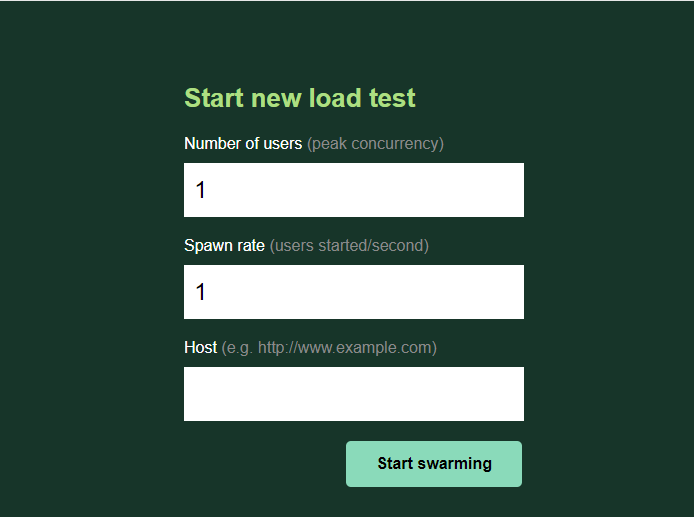

# 시작하기

- locust
  - performance testing tool
  - open source로 개발되었다.
  - 이름이 locust인 이유는 메뚜기 떼가 농장을 습격하듯 사용자들이 웹 사이트를 습격한다고 하여 붙인 이름이다.


- 특징
  - Python code로 test scenario 작성이 가능하다.
  - 많은 수의 유저가 동시에 사용하는 상황을 테스트 가능하다.
    - 이벤트 기반(gevnet 사용)으로 수천명의 동시 사용자를 테스트 가능하다.
  - Web 기반의 UI를 제공한다.
  - 어떤 시스템이든 테스트가 가능하다.
  - 가볍고 변경에 유연하다.


- 단점
  - 하드웨어 모니터링 기능이 없다.


- 설치

  - pip로 설치한다.

  ```bash
  $ pip install locust
  ```

  - 설치 확인

  ```bash
  $ locust -V
  ```


- locust 실행하기

  - fastapi로 아래와 같은 간단한 API를 만든다.

  ```python
  import uvicorn
  from fastapi import FastAPI
  
  app = FastAPI()
  
  
  @app.get("/hello")
  async def hello_world():
      return "Hello!"
  
  @app.get("/world")
  async def hello_world():
      return "World!"
  
  if __name__ == '__main__':
      uvicorn.run(app, host='0.0.0.0', port=8000)
  ```

  - locust로 테스트 시나리오를 작성한다.
    - 테스트 시나리오의 파일 이름은 `locustfile.py`여야한다.
    - 아래 시나리오는 사용자가 `/hello`와 `/world`라는 api에 http requests를 반복적으로 보내는 시나리오이다.

  ```python
  from locust import HttpUser, task
  
  
  class HelloWorldUser(HttpUser):
      @task
      def hello_world(self):
          self.client.get("/hello")
          self.client.get("/world")
  ```

  - 실행하기

  ```bash
  $ locust
  ```

  - `http://localhost:8098`로 접속하면 아래와 같은 화면을 볼 수 있다.
    - Numver of users: 동시에 접속하는 최대 사용자 수를 설정한다.
    - Spwan rate: 시작할 때 몇 명의 사용자로 시작할지, 초당 몇 명씩 사용자를 늘릴지 설정한다.
    - Host: 테스트하려는 API의 주소를 입력한다.

  

  - Command line으로 바로 시작하기
    - Web UI는 부가적인 기능으로 꼭 사용해야하는 것은 아니다.
    - 아래와 같이 command line을 통해서도 실행이 가능하다.

  ```bash
  $ locust --headless --users <최대 사용자 수> --spawn-rate <초당 늘어날 사용자 수> -H <테스트하려는 API 주소>
  ```


# locustfile 작성하기

## User class

- locustfile은 적어도 하나의 사용자 클래스가 있어야 한다.
  - 사용자 클래스인지는 `HttpUser` class를 상속 받은 class의 유무에 따라 판단한다.


- 사용자 클래스는 `HttpUser` class를 상속받는다.
  - 이를 통해 `HttpUser`의 attribute인 `client`에 접근할 수 있게 된다.
  - `client`는 `HttpSession`의 instance로, load test 대상 시스템에 HTTP 요청을 보내는 데 사용된다.


- 시뮬레이팅할 사용자 생성하기

  - class 형식으로 시뮬레이팅할 사용자를 생성한다.

  ```python
  from locust import HttpUser
  
  class QuickstartUser(HttpUser):
      pass
  ```

  - 테스트가 시작되면 locust는 사용자 클래스의 instance를 생성한다.


## 옵션들

- `wait_time`

  - 각 task들의 실행 간격을 설정한다.

    - 주의할 점은 `wait_time`은 하나의 task가 끝나고 난 후부터 시간을 계산한다는 점이다.
    - task안에 몇 개의 request가 있든 하나의 task가 끝아야 시간을 계산하기 시작한다.
    - 따라서 RPS가 1인 상황을 테스트하려고 시간 간격을 1로 줬어도, task 안에 request가 3개라면, RPS는 3이 된다.

  - `constant(wait_time)`

    - 설정한 시간(초) 만큼의 간격을 두고 다음 task를 실행시킨다.

  - `between(min_wait, max_wait)`

    - 최솟값 이상, 최댓값 이하의 값들 중 랜덤한 시간(초)만큼의 간격을 두고 다음 task를 실행시킨다.

  - `constant_throughput(task_runs_per_second)`

    - 시간이 아닌 테스크가 초당 실행될 횟수를 받는다(reqeust per second가 아닌 task per second임에 주의).
    - 테스크가 초당 최대 설정한 값만큼 실행되는 것을 보장한다.

    - 예를 들어 초당 500번의 task를 실행시키고자 하고, 사용자 수가 5000명이라면, 인자로 0.1을 넘기면 된다.
    - 5000명이 초당 0.1번, 즉 10초에 1번씩 task를 실행하므로 초당 500번의 task가 실행된다.
    - 유념해야 할 점은 테스크의 실행 간격을 조정하여 RPS에 맞추는 것이지, 사용자의 수를 조정하는 것은 아니라는 점이다.
    - 따라서 위 예시에서 task의 실행 시간이 10초를 넘어간다면 RPS는 500보다 낮아지게 된다.

  ```python
  # 초당 500번의 task를 실행시키고자 하고 사용자 수가 5000이라고 가정할 때, task는 10초에 한 번씩 수행된다.
  # 그런데 아래 예시와 같이 task가 한 번 수행되는데 소요되는 시간이 10초를 넘어가면 RPS는 500보다 낮아지게 된다.
  class MyUser(User):
      wait_time = constant_throughput(0.1)
      
      @task
      def my_task(self):
          # 11초 동안 실행된다.
          time.sleep(11)
  ```

  - `constant_pacing(wait_time)`
    - 설정한 시간 동안 task가 최대 1번만 실행되는 것을 보장한다.
    - 아래 코드에서 task는 10초에 1번만 실행된다.
    - `constant_throughput`와 수학적으로 반대 개념이다.

  ```python
  class MyUser(User):
      wait_time = constant_pacing(10)
      @task
      def my_task(self):
          pass
  ```

  - custom
    - `wait_time`이라는 메서드를 생성하여 custom이 가능하다.

  ```python
  class MyUser(User):
      last_wait_time = 0
  
      def wait_time(self):
          self.last_wait_time += 1
          return self.last_wait_time
  ```


- 사용자 수 설정하기

  - User class가 둘 이상이라면, locust는 기본적으로 동일한 수의 사용자를 각 user class에서 생성한다.
  - `weight` 
    - 특정 유저가 더 많이 생성되도록 할 수 있다.
    - `WebUser`가 `MobileUser`에 비해 생성될 가능성이 3배 더 높다.

  ```python
  class WebUser(User):
      weight = 3
  
  class MobileUser(User):
      weight = 1
  ```

  - `fixed_count`
    - 각 user class별로 몇 명의 사용자를 생성할지 지정할 수 있다.
    - `weight`를 무시하고 무조건 설정된 수 만큼의 사용자를 먼저 생성한다.
    - 아래 예시에서 `AdminUser`의 instance는 전체 유저수와 무관하게 1명이 생성된다.

  ```python
  class AdminUser(User):
      wait_time = constant(600)
      fixed_count = 1
  
      @task
      def restart_app(self):
          pass
  
  class WebUser(User):
      pass
  ```


## task

- task 생성하기

  - 사용자가 어떤 동작을 할 것인지를 정의한 메서드이다.
  - User class의 method로 선언한다.
    - `@task` decorator를 붙여야한다.
    - 테스트가 시작되면 `QuickstartUser`의 instance들이 생성되고 각 instance들은 `hello_world`를 실행한다.

  ```python
  from locust import HttpUser, task
  
  
  class QuickstartUser(HttpUser):
      @task
      def foo(self):
          self.client.get("/foo")
  ```

  - 복수의 task를 설정하는 것도 가능하며, 각 task별로 가중치를 주는 것이 가능하다.
    - 복수의 task가 선언되었을 경우 task들 중 하나가 무선적으로 선택 되고 실행된다.
    - 가중치는 `@task` decorator 뒤에 `(number)` 형식으로 주면 된다.
    - 아래 예시의 경우 `bar` task가 `foo` task에 비해 선택(되어 실행)될 확률이 3배 높다.

  ```python
  class QuickstartUser(HttpUser):
      @task
      def foo(self):
          self.client.get("/foo")
      
      @task(3)
      def bar(self):
          self.client.get("/bar")
  ```

  


