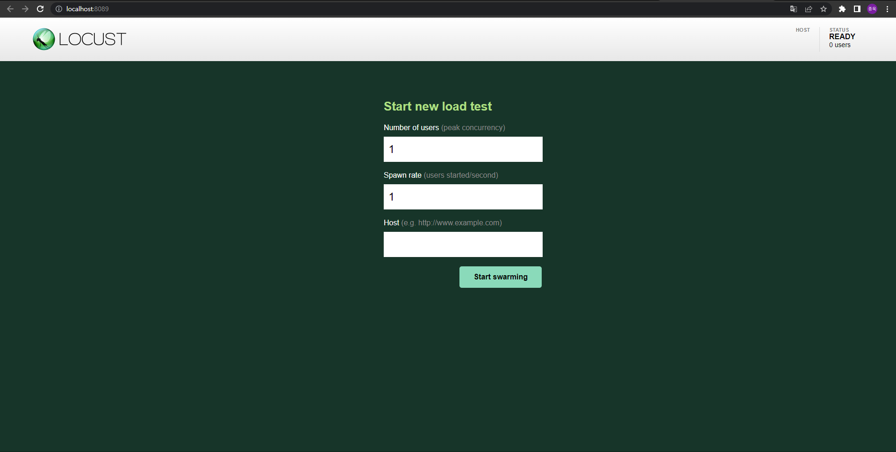

# Locust

- locust
  - performance testing tool
  - open source로 개발되었다.
  - 이름이 locust인 이유는 메뚜기 떼가 농장을 습격하듯 사용자들이 웹 사이트를 습격한다고 하여 붙인 이름이다.


- 특징
  - Python code로 test scenario 작성이 가능하다.
  - 많은 수의 유저가 동시에 사용하는 상황을 테스트 가능하다.
    - 이벤트 기반(gevnet 사용)으로 수천명의 동시 사용자를 테스트 가능하다.
  - Web 기반의 UI를 제공한다.
  - 어떤 시스템이든 테스트가 가능하다.
  - 가볍고 변경에 유연하다.


- 단점
  - 하드웨어 모니터링 기능이 없다.


- 설치

  - pip로 설치한다.

  ```bash
  $ pip install locust
  ```

  - 설치 확인

  ```bash
  $ locust -V
  ```


- locust 실행하기

  - fastapi로 아래와 같은 간단한 API를 만든다.

  ```python
  import uvicorn
  from fastapi import FastAPI
  
  app = FastAPI()
  
  
  @app.get("/hello")
  async def hello_world():
      return "Hello!"
  
  @app.get("/world")
  async def hello_world():
      return "World!"
  
  if __name__ == '__main__':
      uvicorn.run(app, host='0.0.0.0', port=8000)
  ```

  - locust로 테스트 시나리오를 작성한다.
    - 테스트 시나리오의 파일 이름은 `locustfile.py`여야한다.
    - 아래 시나리오는 사용자가 `/hello`와 `/world`라는 api에 http requests를 반복적으로 보내는 시나리오이다.

  ```python
  from locust import HttpUser, task
  
  
  class HelloWorldUser(HttpUser):
      @task
      def hello_world(self):
          self.client.get("/hello")
          self.client.get("/world")
  ```

  - 실행하기

  ```bash
  $ locust
  ```

  - `http://localhost:8098`로 접속하면 아래와 같은 화면을 볼 수 있다.
    - Numver of users: 동시에 접속하는 최대 사용자 수를 설정한다.
    - Spwan rate: 시작할 때 몇 명의 사용자로 시작할지, 초당 몇 명씩 사용자를 늘릴지 설정한다.
    - Host: 테스트하려는 API의 주소를 입력한다.

  

  - Command line으로 바로 시작하기
    - Web UI는 부가적인 기능으로 꼭 사용해야하는 것은 아니다.
    - 아래와 같이 command line을 통해서도 실행이 가능하다.

  ```bash
  $ locust --headless --users <최대 사용자 수> --spawn-rate <초당 늘어날 사용자 수> -H <테스트하려는 API 주소>
  ```


- locust의 기본적인 동작 과정은 다음과 같다.	
  - 설정한 사용자 수 만큼 User class의 instance를 생성한다.
  - user instance는 각자의 green thread 안에서 동작을 시작한다.
  - 각 user instance는 task를 선택하고, task를 실행한다.
  - 그 후 설정된 시간 만큼 대기한다.
  - 대기 시간이 끝나면 다시 다음 task를 선택하고, 실행한다.


## locustfile 작성하기

### User class

- locustfile은 적어도 하나의 사용자 클래스가 있어야 한다.
  - 사용자 클래스인지는 `HttpUser` class를 상속 받은 클래스인가로 판단한다.


- 시뮬레이팅할 사용자 생성하기

  - class 형식으로 시뮬레이팅할 사용자를 생성한다.

  ```python
  from locust import HttpUser
  
  class QuickstartUser(HttpUser):
      pass
  ```

  - 테스트가 시작되면 locust는 사용자 클래스의 instance를 생성한다.


### HttpUser

- 사용자 클래스는 `HttpUser` class를 상속받는다.
  - 이를 통해 `HttpUser`의 attribute인 `client`에 접근할 수 있게 된다.
  - `client`는 `HttpSession`의 instance로, load test 대상 시스템에 HTTP 요청을 보내는 데 사용된다.
    - `HttpSession`은 `requests` 모듈의 `Session`를 상속받는다.


- validating response

  - 기본적으로 response code가 OK면 request가 성공한 것으로 간주한다.
  - 이를 custom할 수 있다.
    - `catch_response`를 True로 준다.

  ```python
  with self.client.get("/", catch_response=True) as response:
      if response.text != "Success":
          response.failure("Got wrong response")
      elif response.elapsed.total_seconds() > 0.5:
          response.failure("Request took too long")
  ```

  - 아래와 같이 400 이상의 status code가 반환되었을 때에도 성공으로 간주하게 할 수 있다.

  ```python
  with self.client.get("/does_not_exist/", catch_response=True) as response:
      if response.status_code == 404:
          response.success()
  ```


- JSON 형식으로 request보내고 응답 받아오기

  ```python
  from json import JSONDecodeError
  ...
  with self.client.post("/", json={"foo": 42, "bar": None}, catch_response=True) as response:
      try:
          if response.json()["greeting"] != "hello":
              response.failure("Did not get expected value in greeting")
      except JSONDecodeError:
          response.failure("Response could not be decoded as JSON")
      except KeyError:
          response.failure("Response did not contain expected key 'greeting'")
  ```


- Grouping requests

  - query parameter를 받는 경우 qeury parameter가 변경될 때마다 각기 다른 endpoint로 요청을 보내는 것으로 간주된다.
    - 즉 아래 예시와 같은 요청은 10개의 endpoint에 대한 요청을 1번씩 보내는 것으로 간주된다.
    - 이럴 경우 나중에 결과를 통계내기 어려워질 수 있으므로 그룹화 해야한다.

  ```python
  for i in range(10):
      self.client.get("/blog?id=%i" % i, name="/blog?id=[id]")
  ```

  - 그룹화하기

  ```python
  # /blog?id=[id] 라는 이름으로 그룹화된다.
  self.client.request_name="/blog?id=[id]"
  for i in range(10):
      self.client.get("/blog?id=%i" % i)
  self.client.request_name=None
  ```

  - boilerplate를 최소화하기 위해 아래와 같이 작성하는 것도 가능하다.

  ```python
  @task
  def multiple_groupings_example(self):
      # Statistics for these requests will be grouped under: /blog/?id=[id]
      with self.client.rename_request("/blog?id=[id]"):
          for i in range(10):
              self.client.get("/blog?id=%i" % i)
  
      # Statistics for these requests will be grouped under: /article/?id=[id]
      with self.client.rename_request("/article?id=[id]"):
          for i in range(10):
              self.client.get("/article?id=%i" % i)
  ```


### 옵션들

- `wait_time`

  - 각 task들의 실행 간격을 설정한다.

    - 주의할 점은 `wait_time`은 하나의 task가 끝나고 난 후부터 시간을 계산한다는 점이다.
    - task안에 몇 개의 request가 있든 하나의 task가 끝아야 시간을 계산하기 시작한다.
    - 따라서 RPS가 1인 상황을 테스트하려고 시간 간격을 1로 줬어도, task 안에 request가 3개라면, RPS는 3이 된다.

  - `constant(wait_time)`

    - 설정한 시간(초) 만큼의 간격을 두고 다음 task를 실행시킨다.

  - `between(min_wait, max_wait)`

    - 최솟값 이상, 최댓값 이하의 값들 중 랜덤한 시간(초)만큼의 간격을 두고 다음 task를 실행시킨다.

  - `constant_throughput(task_runs_per_second)`

    - 시간이 아닌 테스크가 초당 실행될 횟수를 받는다(reqeust per second가 아닌 task per second임에 주의).
    - 테스크가 초당 최대 설정한 값만큼 실행되는 것을 보장한다.

    - 예를 들어 초당 500번의 task를 실행시키고자 하고, 사용자 수가 5000명이라면, 인자로 0.1을 넘기면 된다.
    - 5000명이 초당 0.1번, 즉 10초에 1번씩 task를 실행하므로 초당 500번의 task가 실행된다.
    - 유념해야 할 점은 테스크의 실행 간격을 조정하여 RPS에 맞추는 것이지, 사용자의 수를 조정하는 것은 아니라는 점이다.
    - 따라서 위 예시에서 task의 실행 시간이 10초를 넘어간다면 RPS는 500보다 낮아지게 된다.

  ```python
  # 초당 500번의 task를 실행시키고자 하고 사용자 수가 5000이라고 가정할 때, task는 10초에 한 번씩 수행된다.
  # 그런데 아래 예시와 같이 task가 한 번 수행되는데 소요되는 시간이 10초를 넘어가면 RPS는 500보다 낮아지게 된다.
  class MyUser(User):
      wait_time = constant_throughput(0.1)
      
      @task
      def my_task(self):
          # 11초 동안 실행된다.
          time.sleep(11)
  ```

  - `constant_pacing(wait_time)`
    - 설정한 시간 동안 task가 최대 1번만 실행되는 것을 보장한다.
    - 아래 코드에서 task는 10초에 1번만 실행된다.
    - `constant_throughput`와 수학적으로 반대 개념이다.

  ```python
  class MyUser(User):
      wait_time = constant_pacing(10)
      @task
      def my_task(self):
          pass
  ```

  - custom
    - `wait_time`이라는 메서드를 생성하여 custom이 가능하다.

  ```python
  class MyUser(User):
      last_wait_time = 0
  
      def wait_time(self):
          self.last_wait_time += 1
          return self.last_wait_time
  ```


- 사용자 수 설정하기

  - User class가 둘 이상이라면, locust는 기본적으로 동일한 수의 사용자를 각 user class에서 생성한다.
  - `weight` 
    - 특정 유저가 더 많이 생성되도록 할 수 있다.
    - `WebUser`가 `MobileUser`에 비해 생성될 가능성이 3배 더 높다.

  ```python
  class WebUser(User):
      weight = 3
  
  class MobileUser(User):
      weight = 1
  ```

  - `fixed_count`
    - 각 user class별로 몇 명의 사용자를 생성할지 지정할 수 있다.
    - `weight`를 무시하고 무조건 설정된 수 만큼의 사용자를 먼저 생성한다.
    - 아래 예시에서 `AdminUser`의 instance는 전체 유저수와 무관하게 1명이 생성된다.

  ```python
  class AdminUser(User):
      wait_time = constant(600)
      fixed_count = 1
  
      @task
      def restart_app(self):
          pass
  
  class WebUser(User):
      pass
  ```


- etc

  - host를 미리 지정할 수 있다.

  ```python
  class QuickstartUser(HttpUser):
      host = "http://localhost:8002"
  ```

  - 사용자가 테스트를 시작할 때와 종료할 때 수행할 메서드를 설정 가능하다.
    - `on_start`, `on_stop` 메서드를 선언한다.
    - `on_start`는 사용자가 TaskSet을 실행하기 시작 했을 때, `on_stop`은  `interrupt()`가 호출되거나 해당 사용자가 kill 됐을 때 실행된다.

  ```python
  class QuickstartUser(HttpUser):
      def on_start(self):
          self.client.post("/login", json={"username":"foo", "password":"bar"})
      
      def on_stop(self):
          print("QuickstartUser stop test")
  ```


## Task

- task 생성하기

  - 사용자가 어떤 동작을 할 것인지를 정의한 시나리오이다.
  - User class의 method로 선언한다.
    - `@task` decorator를 붙여야한다.
    - 테스트가 시작되면 `QuickstartUser`의 instance들이 생성되고 각 instance들은 `foo`를 실행한다.

  ```python
  from locust import HttpUser, task
  
  
  class QuickstartUser(HttpUser):
      @task
      def foo(self):
          self.client.get("/foo")
  ```

  - 복수의 task를 설정하는 것도 가능하며, 각 task별로 가중치를 주는 것이 가능하다.
    - 복수의 task가 선언되었을 경우 task들 중 하나가 무선적으로 선택 되고 실행된다.
    - 가중치는 `@task` decorator 뒤에 `(number)` 형식으로 주면 된다.
    - 아래 예시의 경우 `bar` task가 `foo` task에 비해 선택(되어 실행)될 확률이 3배 높다.

  ```python
  class QuickstartUser(HttpUser):
      @task
      def foo(self):
          self.client.get("/foo")
      
      @task(3)
      def bar(self):
          self.client.get("/bar")
  ```


- Task를 user class의 method가 아닌 일반 함수로 선언하는 것도 가능하다.

  - 일반 함수로 선언 후 user class의 `tasks` attribute에 할당한다.
    - user를 인자로 받는다.
    - `tasks` attribute는 callable이나 TaskSet class를 list 형태, 혹은 dict 형태로 받는다.

  ```python
  from locust import User
  
  def my_task(user):
      pass
  
  class MyUser(User):
      tasks = [my_task]
  ```

  - 가중치 설정하기
    - dict 형태로 선언한다.
    - key에 task를, value에 가중치를 넣는다.

  ```python
  from locust import User
  
  def my_task(user):
      pass
  
  def another_task(user):
      pass
  
  class MyUser(User):
      # another_task에 비해 my_task가 3배 더 실행될 확률이 높다.
      tasks = {my_task:3, another_task:1}
  ```


- Tag 설정하기

  - `@tag` decorator를 통해 tag 설정이 가능하다.
    - 테스트 실행시에 `--tags` 혹은 `--exclude-tags` 옵션으로 어떤 tag가 붙어있는 task를 수행할지, 혹은 수행하지 않을지 지정 가능하다.
    - 예를 들어 `locust --tags tag1`은 task1과 task2만 실행한다.

  ```python
  from locust import User, constant, task, tag
  
  class MyUser(User):
      wait_time = constant(1)
  
      @tag('tag1')
      @task
      def task1(self):
          pass
  
      @tag('tag1', 'tag2')
      @task
      def task2(self):
          pass
  
      @tag('tag3')
      @task
      def task3(self):
          pass
  
      @task
      def task4(self):
          pass
  ```


## Event

- test시작, 종료시에 실행될 코드 작성하기

  - `@events.test_start.add_listener`, `@events.test_stop.add_listener` decorator를 사용한다.

  ```python
  from locust import events
  
  # test_start라는 event에 대한 listener를 추가한다.
  @events.test_start.add_listener
  def on_test_start(environment, **kwargs):
      print("A new test is starting")
  
  # test_stop이라는 event에 대한 listener를 추가한다. 
  @events.test_stop.add_listener
  def on_test_stop(environment, **kwargs):
      print("A new test is ending")
  ```


- `init` event

  - 각 locust process가 시작될 때 trigger 된다.
  - 분산 모드에서 각 locust process가 initialization이 필요할 때 유용하다.

  ```python
  from locust import events
  from locust.runners import MasterRunner
  
  @events.init.add_listener
  def on_locust_init(environment, **kwargs):
      if isinstance(environment.runner, MasterRunner):
          print("I'm on master node")
      else:
          print("I'm on a worker or standalone node")
  ```


- 더 상세한 event hook은 아래 링크 참고

  - https://docs.locust.io/en/stable/api.html#event-hooks

  - command line의 option을 custom하거나 각 request event마다 특정 동작을 수행하는 것이 가능하다.


## Library로 사용하기

- `locust` command 대신 python script로 test를 실행할 수 있다.

  - 코드
    - tag 등은 Environment를 통해 넣으면 된다.


  ```python
  import gevent
  from locust import HttpUser, task, between
  from locust.env import Environment
  from locust.stats import stats_printer, stats_history
  from locust.log import setup_logging
  
  setup_logging("INFO", None)
  
  
  class User(HttpUser):
      wait_time = between(1, 3)
      host = "https://docs.locust.io"
  
      @task
      def my_task(self):
          self.client.get("/")
  
      @task
      def task_404(self):
          self.client.get("/non-existing-path")
  
  
  # Environment의 instance 생성 후 runner 생성
  env = Environment(user_classes=[User])
  env.create_local_runner()
  
  # web ui 호스트와 포트 설정
  env.create_web_ui("127.0.0.1", 8089)
  
  # 테스트 상태가 print되도록 설정
  gevent.spawn(stats_printer(env.stats))
  
  # 과거 테스트 이력을 저장하도록 설정(chart 등에 사용)
  gevent.spawn(stats_history, env.runner)
  
  # 테스트 시작
  env.runner.start(1, spawn_rate=10)
  
  # 테스트 기간 설정
  gevent.spawn_later(60, lambda: env.runner.quit())
  
  # wait for the greenlets
  env.runner.greenlet.join()
  
  # stop the web server for good measures
  env.web_ui.stop()
  
  # aggs 결과 확인
  print(self.env.stats.total)
  
  # 각 task별 결과 확인
  for task, stats in self.env.stats.entries.items():
      print(task)
      print(stats)
  ```


## Locust Test Non Http service

- Locust를 사용하여 대부분의 시스템을 테스트할 수 있다.
  - Locust는 기본적으로 HTTP/HTTPS test만이 내장되어 있다.
  - 그러나 RPC를 사용하면 어떤 시스템이든 테스트가 가능하다.


- gRPC를 활용하여 테스트하기

  - `.proto` 파일 작성하기

  ```protobuf
  syntax = "proto3";
  
  package locust.hello;
  
  service HelloService {
    rpc SayHello (HelloRequest) returns (HelloResponse) {}
  }
  
  message HelloRequest {
    string name = 1;
  }
  
  message HelloResponse {
    string message = 1;
  }
  ```

  - `pb2`파일 생성하기

  ```bash
  $ python -m grpc_tools.protoc -I<proto file이 있는 폴더의 경로> --python_out=<pb2 파일을 생성할 경로> --grpc_python_out=<pb2_grpc 파일을 생성할 경로> <proto file의 경로>
  ```

  - gRPC 서버 작성하기

  ```python
  import hello_pb2_grpc
  import hello_pb2
  import grpc
  from concurrent import futures
  import logging
  import time
  
  logger = logging.getLogger(__name__)
  
  
  class HelloServiceServicer(hello_pb2_grpc.HelloServiceServicer):
      def SayHello(self, request, context):
          name = request.name
          time.sleep(1)
          return hello_pb2.HelloResponse(message=f"Hello from Locust, {name}!")
  
  
  def start_server(start_message):
      server = grpc.server(futures.ThreadPoolExecutor(max_workers=10))
      hello_pb2_grpc.add_HelloServiceServicer_to_server(HelloServiceServicer(), server)
      server.add_insecure_port("localhost:50051")
      server.start()
      logger.info(start_message)
      server.wait_for_termination()
  ```

  - gRPC 클라이언트 겸 사용자를 생성하는 로직 추가.

  ```python
  import grpc
  import hello_pb2_grpc
  import hello_pb2
  from locust import events, User, task
  from locust.exception import LocustError
  from locust.user.task import LOCUST_STATE_STOPPING
  from hello_server import start_server
  import gevent
  import time
  
  # patch grpc so that it uses gevent instead of asyncio
  import grpc.experimental.gevent as grpc_gevent
  
  grpc_gevent.init_gevent()
  
  
  @events.init.add_listener
  def run_grpc_server(environment, **_kwargs):
      # gRPC 서버 시작하기
      # 첫 번째 인자로 spawn할 함수를 받고, 두 번째 인자로 해당 함수의 파라미터를 받는다.
      gevent.spawn(start_server, "gRPC server started")
  
  
  class GrpcClient:
      def __init__(self, environment, stub):
          self.env = environment
          self._stub_class = stub.__class__
          self._stub = stub
  
      def __getattr__(self, name):
          func = self._stub_class.__getattribute__(self._stub, name)
  
          def wrapper(*args, **kwargs):
              request_meta = {
                  "request_type": "grpc",
                  "name": name,
                  "start_time": time.time(),
                  "response_length": 0,
                  "exception": None,
                  "context": None,
                  "response": None,
              }
              start_perf_counter = time.perf_counter()
              try:
                  request_meta["response"] = func(*args, **kwargs)
                  request_meta["response_length"] = len(request_meta["response"].message)
              except grpc.RpcError as e:
                  request_meta["exception"] = e
              request_meta["response_time"] = (time.perf_counter() - start_perf_counter) * 1000
              self.env.events.request.fire(**request_meta)
              return request_meta["response"]
  
          return wrapper
  
  
  class GrpcUser(User):
      abstract = True
  
      stub_class = None
  
      def __init__(self, environment):
          super().__init__(environment)
          for attr_value, attr_name in ((self.host, "host"), (self.stub_class, "stub_class")):
              if attr_value is None:
                  raise LocustError(f"You must specify the {attr_name}.")
          self._channel = grpc.insecure_channel(self.host)
          self._channel_closed = False
          stub = self.stub_class(self._channel)
          self.client = GrpcClient(environment, stub)
  
  
  class HelloGrpcUser(GrpcUser):
      # grpc 서버의 host를 설정한다.
      host = "localhost:50051"
      stub_class = hello_pb2_grpc.HelloServiceStub
  
      @task
      def sayHello(self):
          if not self._channel_closed:
              self.client.SayHello(hello_pb2.HelloRequest(name="Test"))
          time.sleep(1)
  ```


## Worker

- locust는 여러 개의 worker를 생성하여 테스트가 가능하다.

  - 간단한 테스트의 경우에는 하나의 프로세스로도 충분한 throughput을 발생시킬 수 있다. 그러나 복잡한 테스트를 진행하거나, 보다 많은 load를 실행하기 위해서는 여러 프로세스를 생성해야 한다.

  - master는 locust의 web interface를 실행하고, worker들에게 언제 User를 생성하는지나 멈추는 지를 알려주는 역할을 한다.
    - master는 직접 test를 실행하지는 않는다.
  - worker는 User를 생성하고, 테스트를 진행하며, 그 결과를 master에 전송한다.
  - Python은 GIL로 인해 프로세스 당 둘 이상의 코어를 완전히 활용할 수 없다.
    - 따라서 프로세서 코어 하나 당 worker 하나를 실행해야 한다.
    - 또한 하나의 프로세스에 worker와 master를 동시에 실행해선 안 된다.


- 실행하기

  - master 모드로 실행하기

  ```bash
  $ locust --master
  ```

  - worker 실행하기
    - 만일 master와 다른 machine에서 실행한다면 `--master-host` 옵션을 통해 master machine의 host를 입력해야 한다.

  ```bash
  $ locsut --worker
  ```

  - 옵션
    - `--master-bind-host`: master 노드가 bind할 network interface의 host를 입력한다.
    - `--master-bind-port`: master 노드의 port를 설정한다.
    - `--master-host`: worker를 master와 다른 machine에 생성한 경우에 master의 host를 입력한다.
    - `--master-port`: 만일 master의 port를 설정해준 경우에 woreker를 실행할 때 master의 port를 입력한다.
    - `--expect-workers`: master node를 `--headless` 옵션과 함께 실행할 때, master node는 설정값 만큼의 노드가 실행되기를 기다렸다가 테스트를 시작한다.


- 노드 사이의 통신

  ```python
  from locust import events
  from locust.runners import MasterRunner, WorkerRunner
  
  # Fired when the worker receives a message of type 'test_users'
  def setup_test_users(environment, msg, **kwargs):
      for user in msg.data:
          print(f"User {user['name']} received")
      environment.runner.send_message('acknowledge_users', f"Thanks for the {len(msg.data)} users!")
  
  # Fired when the master receives a message of type 'acknowledge_users'
  def on_acknowledge(msg, **kwargs):
      print(msg.data)
  
  @events.init.add_listener
  def on_locust_init(environment, **_kwargs):
      if not isinstance(environment.runner, MasterRunner):
          environment.runner.register_message('test_users', setup_test_users)
      if not isinstance(environment.runner, WorkerRunner):
          environment.runner.register_message('acknowledge_users', on_acknowledge)
  
  @events.test_start.add_listener
  def on_test_start(environment, **_kwargs):
      if not isinstance(environment.runner, MasterRunner):
          users = [
              {"name": "User1"},
              {"name": "User2"},
              {"name": "User3"},
          ]
          environment.runner.send_message('test_users', users)
  ```


# Poetry

- Dependency 관리 및 packaging을 위한 Python package이다.
  - Python 3.8 이상이 요구된다.
  - Windows, Linux, macOS 등에서 모두 사용이 가능하다.
  - Poetry는 반드시 전용 가상환경에 설치해야 한다.
    - 그렇지 않을 경우 Poetry의 dependency들이 의도치 않게 삭제되거나 upgrade 될 수 있기 때문이다.


- pip가 있는 데 Poetry가 필요한 이유

  - Python은 기본적으로 pip라는 package manager(&dependency manager)를 제공한다.
    - 그런데, pip에는 몇 가지 문제들이 있다.

  - pip의 문제점들
    - Dependency 충돌이 발생했을 때 잘 처리하지 못 한다.
    - Lock file이 없어서 사용자가 requirements file을 잘 작성하는 수 밖에 없다.
    - 개발 환경과 운영 환경에서 필요한 package가 다를 경우(예를 들어 운영 환경에서는 black이나 pytest등의 package들은 사용하지 않을 확률이 높다) pip는 각 환경을 위한 requirements file을 따로 작성해야한다.
  - Poetry는 pip의 위와 같은 문제점들을 해결하고자 등장했다.


- 설치

  - Poetry를 설치할 가상 환경을 생성한다.
    - 가상환경을 venv package로 사용해도 되고, conda로 생성해도 된다.

  ```bash
  # venv 사용
  $ python -m venve <가상환경 이름>
  
  # conda 사용
  $ conda create -n <가상 환경 이름> (python=python 버전)
  ```

  - 가상 환경을 활성화한다.

  ```bash
  # venv 사용
  $ source ./<가상환경 이름>/bin/activate
  
  # conda 사용
  $ conda activate <가상환경 이름>
  ```

  - Poetry를 설치한다.

  ```bash
  $ pip install poetry
  ```

  - 자동 완성 활성화하기
    - Poetry는 `tab`을 눌렀을 때 자동완성이 되도록 설정할 수 있다.
    - Bash, Fixh, Zsh에서 자동완성을 지원한다.

  ```bash
  # bash의 경우 아래와 같이 활성화시키면 된다.
  $ poetry completions bash >> ~/.bash_completion
  ```


- 기본적인 사용법

  - 새로운 project 생성
    - `--name` option으로 project의 이름을 지정할 수 있다.
  
  
  ```bash
  $ poetry new <project-name>
  
  # 아래와 같은 구조로 project가 생성된다.
  <project-name>
  ├── pyproject.toml
  ├── README.md
  ├── <project_name>
  │   └── __init__.py
  └── tests
      └── __init__.py
  ```
  
  - `pyproject.toml`
    - Project의 dependency를 관리하기 위한 file이다.
    - 최초 생성시 아래와 같이 생성된다.
  
  ```toml
  [tool.poetry]
  name = "poetry-demo"
  version = "0.1.0"
  description = ""
  authors = ["foo <foo@42bar.com>"]
  readme = "README.md"
  
  [tool.poetry.dependencies]
  python = "^3.9"
  
  
  [build-system]
  requires = ["poetry-core"]
  build-backend = "poetry.core.masonry.api"
  ```

  - Project의 dependency들은 `tool.poetry.dependencies`에 작성하면 되며, 아래와 같이 명령어로도 추가할 수 있다.
  
  ```bash
  $ poetry add <dependency>
  ```

  - 위와 같이 새로운 project를 생성할 수도 있고, 기존 project에 적용할 수도 있는데, 기존 project에 적용하고자 하면 아래와 같이 하면 된다.
  
  ```bash
  $ cd pre-existing-project
  $ poetry init
  ```
  
  - Dependency 설치하기
    - 아래 명령어를 실행하면 `pyproject.toml` file을 읽어 필요한 package들을 설치한다.
    - 설치가 끝나고 나면  `poetry.lock` file을 생성하는데, 여기에는 다운 받은 package들과 각 package들의 version 정보를 작성한다.
    - `poetry.lock` file을 사용하여 project에 참여하는 모두가 동일한 version의 package를 사용할 수 있게 된다.
  
  ```bash
  $ poetry install
  ```
  
  - `poetry.lock` 파일이 있는 상태에서 `poetry install` 명령어를 실행할 경우
    - `poetry.lock` file은 project를 생성할 때 함께 생성되는 것이 아니라, `poetry install` 명령어를 최초로 실행했을 때 생성된다.
    - 따라서 `poetry.lock` file이 있다는 것은 기존에 `poetry install` 명령어를 실행한 적이 있다는 의미이다.
    - `poetry.lock` file이 있다면 `pyproject.toml`에서 설치해야 하는 dependency들을 확인하고, `poetry.lock` file에서 각 package들의 version 정보를 확인하여 정확히 일치하는 version을 설치한다.


- Dependency version 정의하기

  - 아래와 같은 다양한 방식으로 dependency의 version을 정의할 수 있다.
  - Caret requirements
    - Caret requirements는 SemVer(Semantic Versioning)과 호환되도록 version을 정의하는 방식이다.
    - 가장 왼쪽의 0이 아닌 숫자가 달라지지 않는 한 update를 수행한다.
    - 예시는 아래 표와 같다.

  | requirement | versions allowed | explanation                                                  |
  | ----------- | ---------------- | ------------------------------------------------------------ |
  | ^1.2.3      | >=1.2.3 < 2.0.0  | 가장 왼쪽의 0이 아닌 숫자인 major version 1이 변경되지 않는 한 update를 허용한다. |
  | ^1          | >=1.0.0 < 2.0.0  | -                                                            |
  | ^0.2.3      | >=0.2.3 <0.3.0   | 가장 왼쪽의 0이 아닌 숫자인 minor version 2가 변경되지 않는 한 update를 허용한다. |

  - Tilde requirements
    - 오직 patch level의 update만 허용하지만, major version만 입력하는 경우 minor version의 update도 허용한다.

  | requirment | versions allowed | explanation                                                  |
  | ---------- | ---------------- | ------------------------------------------------------------ |
  | ~1.2.3     | >=1.2.3 < 1.3.0  | patch level의 update만 허용한다.                             |
  | ~1.2       | \>=1.2.0 <1.3.0  | patch level의 update만 허용한다.                             |
  | ~1         | \>=1.0.0 <2.0.0  | major version만 입력할 경우, minor level의 update도 허용된다. |

  - Wildcard requirements
    - Wildcard가 허용하는 한 가장 최근 version으로 update한다.

  | requirment | versions allowed | explanation                                                  |
  | ---------- | ---------------- | ------------------------------------------------------------ |
  | *          | \>=0.0.0         | 모든 version이 허용된다.                                     |
  | 1.*        | >=1.0.0 <2.0.0   | 1 major version에 대한 모든 version이 허용된다.              |
  | 1.2.*      | \>=1.2.0 <1.3.0  | 1 major version과 2 minor version에 대한 모든 version이 허용된다. |

  - Exact requirements
    - 특정 version을 설정한다.
    - `==`를 사용한다.

  ```toml
  ==1.2.3
  ```

  - Inequality requirments
    - Version의 범위를 설정하거나, 특정 version을 피하도록 설정할 수 있다.

  ```toml
  >= 1.2.0
  > 1
  < 2
  != 1.2.3
  ```

  - Multiple requirements
    - 콤마로 구분하여 여러 version을 설정할 수 있다.

  ```toml
  >= 1.2, < 1.5
  ```


## pyproject.toml

- `tool.poetry`

  - `name`(required)
    - Package의 name을 설정한다.
    - [PEP 508](https://peps.python.org/pep-0508/#names)에 정의된 유효한 이름이어야한다.
  - `version`(required)
    - Pacakage의 version을 설정한다.
    - [PEP 440](https://peps.python.org/pep-0440/)에 정의된 유효한 version이어야한다.
  - `description`(required)
    - Package에 대한 짧은 설명을 설정한다.
  - `license`
    - Package의 license를 설정한다.
    - 필수는 아니지만 설정하는 것을 강하게 권장한다.
  - `authors`(required)
    - Package의 작성자를 설정한다.
    - 모든 작성자를 배열 형태로 입력할 수 있으며, 반드시 한 명의 작성자는 들어가야한다.
    - `name <email>` 형태로 작성한다.
  - `maintainers`
    - Package의 maintainer를 설정한다.
    - `authors`와 마찬가지로 여러 명을 입력할 수 있으며, `name <email>` 형태로 작성한다.
  - `readme`
    - README file의 경로를 입력한다.
    - `pyproject.toml` file을 기준으로 상대 경로를 입력할 수  있다.
    - 배열 형태로 여러 개의 README file의 경로를 입력할 수도 있다.
  - `homepage`
    - Project의 website URL을 입력한다.

  - `repository`
    - Project의 repository의 URL을 입력한다.
  - `documentation`
    - Project의 documentation의 URL을 입력한다.
  - `keywords`
    - Package와 관련된 keyword들을 입력한다.
    - 배열 형태로 입력한다.
  - `classifiers`
    - Project의 PyPI trove classifier를 입력한다.
  - `packages`
    - 최종 배포에 포함될 package들과 module들을 배열 형태로 입력한다.
    - `from`을 입력하여 package의 위치를 지정할 수 있다.
    - `format`을 사용하여 build format을 설정할 수도 있다(예를 들어 아래의 경우 `sdist` build만이 `my_other_package`라는 package를 포함시켜 배포한다).

  ```toml
  [tool.poetry]
  # ...
  packages = [
      { include = "my_package" },
      { include = "extra_package/**/*.py" },
      { include = "my_package", from = "lib" },
      { include = "my_other_package", format = "sdist" },
  ]
  ```

  - `include`
    - 최종 package에 포함될 package들을 정의한다.

  ```toml
  [tool.poetry]
  # ...
  include = [
      { path = "tests", format = "sdist" },
      { path = "for_wheel.txt", format = ["sdist", "wheel"] }
  ]
  ```

  - `exclude`
    - 최종 package에서 제외 할 package들을 정의한다.
    - VCS의 ignore setting이 있을 경우(git의 경우 `.gitignore` file) `exclude`는 이 내용을 기본적으로 사용한다.
    - 만약 VCS의 `ignore setting`에는 포함되어 있는데, `exclude`에서는 제외시키고자 할 경우 `include`에 정의해주면 된다.

  ```toml
  [tool.poetry]
  exclude = ["my_package/excluded.py"]
  ```


- Dependency 관련 section

  - `tool.poetry.dependencies`
    - 아래와 같이 dependency들을 입력한다.

  ```toml
  [tool.poetry.dependencies]
  requests = "^2.13.0"
  ```

  - Local directory에 위치한 library를 지정해줘야 하는 경우 아래와 같이 설정할 수 있다.

  ```toml
  [tool.poetry.dependencies]
  # directory
  my-package = { path = "../my-package/", develop = false }
  
  # file
  my-package = { path = "../my-package/dist/my-package-0.1.0.tar.gz" }
  ```

  - 만약 특정 git repository에서 package를 설치해야 하는 경우 아래와 같이 설정할 수 있다.

  ```toml
  [tool.poetry.dependencies]
  # 기본형
  requests = { git = "https://github.com/requests/requests.git" }
  
  # branch 지정
  requests = { git = "https://github.com/kennethreitz/requests.git", branch = "next" }
  
  # coomit hash 사용
  flask = { git = "https://github.com/pallets/flask.git", rev = "38eb5d3b" }
  
  # tag 사용
  numpy = { git = "https://github.com/numpy/numpy.git", tag = "v0.13.2" }
  
  # pacakage가 특정 directory에 있을 경우
  subdir_package = { git = "https://github.com/myorg/mypackage_with_subdirs.git", subdirectory = "subdir" }
  
  # ssh connection을 사용하는 경우
  requests = { git = "git@github.com:requests/requests.git" }
  ```

  - Editable mode로 설치하고자 한다면 아애롸 같이 `develop=true` 옵션을 주면 된다.
    - 이 경우 설치 file의 변경 사항이 environment에 바로 반영된다.
  
  ```toml
  [tool.poetry.dependencies]
  my-package = {path = "../my/path", develop = true}
  ```
  
  - 만약 Python version에 따라 dependency의 version이 달라져야 한다면 아래와 같이 설정하면 된다.

  ```toml
  [tool.poetry.dependencies]
  foo = [
      {version = "<=1.9", python = ">=3.6,<3.8"},
      {version = "^2.0", python = ">=3.8"}
  ]
  ```
  
  - `tool.poetry.source`
    - Poetry는 기본적으로 PyPI에서 package들을 찾는다.
    - 만일 다른 저장소에서 package를 설치한다면 아래와 같이 `tool.poetry.source`에 지정해주면 된다.
  
  ```toml
  [[tool.poetry.source]]
  name = "private"
  url = "http://example.com/simple"
  
  # 그 후 tool.poetry.dependencies에 dependency를 입력할 때 아래와 같이 source를 설정해준다.
  [tool.poetry.dependencies]
  requests = { version = "^2.13.0", source = "private" }
  ```
  
  - Dependency들을 group으로 묶는 것도 가능하다.
  
  ```toml
  [tool.poetry.group.test.dependencies]
  pytest = "*"
  
  [tool.poetry.group.docs.dependencies]
  mkdocs = "*"
  ```


- `tool.poetry.scripts`

  - Package를 설치할 때 설치될 script 혹은 실행 파일에 대한 설명을 작성한다.
    - 예를 들어 아래의 경우 `my_pacakge` package의 `console` module에서 `run` function을 실행할 것이라는 의미이다.

  ```toml
  [tool.poetry.scripts]
  my_package_cli = 'my_package.console:run'
  ```

  - 아래와 같이 `extras`와 `type`도 설정할 수 있다.
    - `extras`는 아래 `tool.poetry.extras` 참고

  ```toml
  [tool.poetry.scripts]
  devtest = { reference = "mypackage:test.run_tests", extras = ["test"], type = "console" }
  ```

  - Script에 추가나 변경 사항이 있을 경우 `poetry install` 명령어를 실행해야 project의 가상환경이 이를 사용할 수 있게 된다.


- `tool.poetry.extras`

  - 아래와 같은 것들을 표현하기 위한 section이다.
    - 필수는 아닌 dependency들을 나열
    - Optional한 dependency들을 묶기
  - 예시

  ```toml
  [tool.poetry.dependencies]
  # mandatory는 이 package를 배포할 때 반드시 포함되어야하는 package이다.
  mandatory = "^1.0"
  
  # 반면에 아래 두 개는 반드시 포함되지는 않아도 되는 package이다.
  psycopg2 = { version = "^2.9", optional = true }
  mysqlclient = { version = "^1.3", optional = true }
  
  [tool.poetry.extras]
  # 반드시 포함되지는 않아도 되는 package들을 나열하고
  mysql = ["mysqlclient"]
  pgsql = ["psycopg2"]
  # 반드시 포함되지는 않아도 되는 package들을 묶을 때 extras를 사용한다.
  databases = ["mysqlclient", "psycopg2"]
  ```

  - `poetry install` 명령어 실행시에 `-E`(`--extras`) 옵션으로 package를 설치할지 여부를 결정할 수 있다.

  ```bash
  $ poetry install --extras "mysql pgsql"
  $ poetry install -E mysql -E pgsql
  ```

  - 모든 extra dependency들을 함께 설치하려면 아래와 같이 실행하면 된다.

  ```bash
  $ poetry install --all-extras
  ```

  - 만일 Poetry로 build된 package를 pip로 설치한다면 [PEP 508](https://peps.python.org/pep-0508/#extras)에 따라 아래와 같이 extra를 지정해줄 수 있다.

  ```bash
  $ pip install awesome[databases]
  ```


# Shorts

- faker

  - 언어를 한국어로 설정하고 `catch_phrase()`를 사용하면 무작위로 생성된 짧은 문자열을 얻을 수 있다.

  ```python
  from faker import Faker
  
  fake = Faker("ko-KR")
  print(fake.catch_phrase())
  ```


- Python StateMachine

  - Python을 사용하여 직관적으로 finite state machine(FSM)을 구현할 수 있게 해주는 package

  - 설치

  ```bash
  $ pip install python-statemachine
  ```

  - 실행해보기
    - state와 event를 구현한다.
    - `send()` method에 event로 선언한 변수명을 string 형태로 넣으면 transition이 발생한다.
    - `before_<evnet>` method를 통해 transition이 발생하기 전에 실행할 action을 설정 가능하다.
    - `on_enter_<state>`, `on_exit_<state>` method를 통해 state로 transition될 때, state에서 다른 state로 transition 될 때 실행할 action을 설정 할 수 있다.

  ```python
  from statemachine import StateMachine, State
  
  
  class TrafficLightMachine(StateMachine):
      # state를 정의한다.
      green = State(initial=True)
      yellow = State()
      red = State()
  
      # event를 정의한다.
      cycle = (
          green.to(yellow)
          | yellow.to(red)
          | red.to(green)
      )
      
      def before_cycle(self, event: str, source: State, target: State, message: str = ""):
          message = ". " + message if message else ""
          return f"Running {event} from {source.id} to {target.id}{message}"
      
      def on_enter_red(self):
          print("Don't move.")
      
      def on_exit_red(self):
          print("Go ahead!")
  
  state_machine = TrafficLightMachine()
  print(state_machine.current_state)		# State('Green', id='green', value='green', initial=True, final=False)
  print(state_machine.send("cycle"))		# Running cycle from green to yellow
  print(state_machine.current_state)		# State('Yellow', id='yellow', value='yellow', initial=False, final=False)
  print(state_machine.send("cycle"))		# Don't move.
  										# Running cycle from yellow to red
  print(state_machine.current_state)		# State('Red', id='red', value='red', initial=False, final=False)
  										# Go ahead!
  print(state_machine.send("cycle"))		# Running cycle from red to green
  ```


