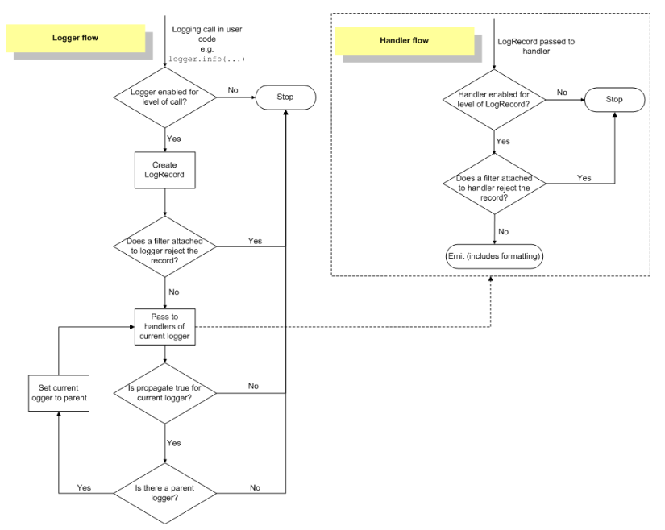

# Logging

> https://docs.python.org/3/library/logging.html#module-logging

- Python은 logging을 위한 `logging` 모듈을 제공한다.
  - `logging`은 log를 남김으로서 program이 동작할 때 발생하는 event들을 추적할 수 있게 해준다.
    - 개발자는 특정 event가 발생했다는 것을 보여주기위해 code에 log를 남긴다.
  - `print`를 사용해도 되는데 왜 굳이 `logging`을 사용해야 하는가?
    - `print`의 경우 중요도에 따라 로그를 분류할 수 없다.
    - 코드를 수정하지 않으면 어떤 log를 출력하고, 어떤 log를 출력하지 않을지 통제할 수가 없다.
    - `print` 되어야 하는 내용과 log로 남겨야 하는 내용이 뒤섞여 구분이 힘들어질 수도 있다.


- Log의 level과 상황별 사용

  - Log의 level
    - 기본값은 WARNING으로, 따로 설정해주지 않을 경우 WARNING 이상의 log들만 보이게 된다.

  | Level    | 용도                                                         |
  | -------- | ------------------------------------------------------------ |
  | DEBUG    | 일반적으로 문제가 발생했을 때 문제를 진단하기 위한 구체적인 정보를 작성한다. |
  | INFO     | Software가 예상대로 동작했음을 확인하기 위해서 사용한다.     |
  | WARNING  | 예상치 못한 일이 발생했거나, 가까운 미래에 문제가 발생할 수 있음(e.g. "disk space low")을 표현하기 위해 사용한다.<br />이 단계 까지는 software가 예상대로 동작하는 것이다. |
  | ERROR    | Software의 특정 function을 사용할 수 없다는 것을 나타내기 위해 사용한다. |
  | CRITICAL | Software 전체가 제대로 동작할 수 없을 정도의 심각한 error를 나타내기 위해 사용한다. |

  - Python의 `logging` module은 다양한 메서드를 지원하는데, 각 상황별 적절한 메서드는 아래와 같다.

  | 상황                                               | 적절한 메서드                                                |
  | -------------------------------------------------- | ------------------------------------------------------------ |
  | 일반적인 output을 보고자 할 때                     | `print()`                                                    |
  | Software의 정상적인 event 발생을 확인하고자 할 때  | `logging.info()`, `logging.debug()`(보다 구체적인 정보를 원하면 `logging.debug()`를 사용) |
  | 특정 runtime event에 관한 경고를 보여줘야 할 때    | `warnings.warm()`: 회피 가능한 issue거나, warning을 제거하기 위해 client app이 수정되어야 하는 경우<br />`logging.warning()`: client app이 warning을 제거하기 위해 할 수 있는게 없을 경우 |
  | 특정 runtime event에 관한 error를 보여줘야 할 때   | Exception을 raise한다.                                       |
  | Exception을 raise하지 않고 error를 suppress할 경우 | `logging.error()`, `logging.exception()`, `logging.critical()` |


- Log를 file에 작성하기

  - `basicConfig`를 사용하여, log를 file에 작성할 수 있다.
    - `encoding`의 경우 Python 3.10부터 추가되었다.
    - 따라서, 이전 버전을 사용하거나, 값을 주지 않을 경우 `open()`에서 기본값으로 사용하는 encoding이 설정되게 된다.

  ```python
  import logging
  
  logging.basicConfig(filename="example.log", encoding='utf-8', level=logging.DEBUG)
  logging.debug('This message should go to the log file')
  logging.info('So should this')
  logging.warning('And this, too')
  logging.error('And non-ASCII stuff, too, like Øresund and Malmö')
  ```

  - `basicConfig()`의 호출은 `debug()`, `info()`, 등의 호출보다 앞에 와야한다.
    - 그렇지 않을 경우 이 함수들은 `basicConfig()`를 기본 옵션들로 호출한다.
  - Log의 format을 설정하는 것도 가능하다.
    - `%()`를 사용하는 이전 방식이 아닌, `str.format()`도 사용 가능하다.

  ```python
  import logging
  logging.basicConfig(format='%(levelname)s:%(message)s', level=logging.DEBUG)
  logging.debug('This message should appear on the console')	# DEBUG:This message should appear on the console
  ```

  - Log format에서 사용할 수 있는 값들

    > 아래에 없는 것들은 https://docs.python.org/3.10/library/logging.html#logrecord-attributes 참조.

    - `asctime`: `LogRecord`가 생성된 시간을 사람이 읽기 편한 형식으로 변환 한 값.
    - `funcNmae`: Logging을 호출한 function의 이름.
    - `levelname`: Log의 level.
    - `message`: Log를 남길 message.
    - `module`: Logging을 호출한 module의 이름.
    - `process`: Process Id.


- 여러 module에서 logging하기

  - `main.py`

  ```python
  import logging
  import mylib
  
  def main():
      logging.basicConfig(filename='myapp.log', level=logging.INFO)
      logging.info('Started')
      mylib.do_something()
      logging.info('Finished')
  
  if __name__ == '__main__':
      main()
  ```

  - `mylib.py`

  ```python
  import logging
  
  def do_something():
      logging.info('Doing something')
  ```

  - 위에서 본 것과 같이 여러 module에서 사용한다고 하더라도 `basicConfig`의 내용이 모두 적용된다.


- Logging library는 module화된 방식을 채택한다.

  - 아래와 같은 다양한 component를 제공한다.
    - `loggers`: 개발자가 직접 사용할 수 있는 interface를 제공한다.
    - `handlers`: `loggers`에 의해 생성된 log를 적절한 목적지로 보낸다.
    - `filters`: 어떤 log가 출력될지를 필터링한다.
    - `formatters`: log의 최종적인 출력 형태를 결정한다.
  - Log event는 `LogRecord`의 instance의 형태로 `loggers`, `handlers`, `filters`, `formatters`를 거친다.

  


- Loggers

  - Logging은 `Logger` class의 instance의 method들을 호출하는 방식으로 수행된다.
    - 각 instance는 이름을 가지고 있으며, namespace에 `.`을 사용하여 계층적으로 저장된다.
    - 예를 들어 scan이라는 이름의 logger는 scan.text, scan.html 의 부모가 된다.
    - Logger 계층의 뿌리를 root logger라 한다.
    - Root logger의 이름은 root라고 출력된다.
  - Logger에 이름을 붙이기 위해 사용하는 convention은 아래와 같다.
    - 각 모듈에서 모듈 수준 logger를 사용하는 것이다.
    - logger 이름을 모듈 이름으로 설정함으로써 로거 이름을 통해 패키지/모듈 계층을 추적하는 것이 가능하다.

  ```python
  logger = logging.getLogger(__name__)
  ```

  - Logger는 아래와 같은 세 가지 역할을 한다.
    - Logging을 위한 메서드를 제공하는 interface를 제공한다.
    - 어떤 log가 처리해야 할 메시지인지를 판단한다.
    - `LogRecord` instance를 handlers에게 전달한다.
  - `getLogger()`는 logger instance에 대한 참조를 반환한다.
    - 만일 특정한 이름을 지정해주면 지정된 이름의 logger가 반환될 것이고, 아니라면 root logger가 반환된다.
    - `getLogger()`를 같은 이름으로 여러번 호출하더라도, 같은 logger instance에 대한 참조를 반환한다.
    - 계층 구조 상에서 하위에 있는 logger는 상위에 있는 logger의 자식 logger이다.

  - Logger를 설정하는 주요 method들은 아래와 같다.
    - `Logger.setLevel()`: 처리할 log의 최소 level을 설정한다.
    - `Logger.addHandler()`, `Logger.removeHandler()`: Handler object를 추가하고 제거한다.
    - `Logger.addFilter()`, `Logger.removeFilter()`: Filter object를 추가하고 제거한다.
  - Log message를 생성하는 method들은 아래와 같다.
    - `Logger.debug()`, `Logger.info()`, `Logger.warning()`, `Logger.error()`, `Logger.critical()`은 각각 method명에 해당하는 level의 log를 생성한다.
    - `Logger.exception()`은 `Logger.error()`와 유사하지만, `Logger.error()`와는 달리 stack trace를 dump한다는 차이가 있다.
    - `Logger.exception()`는 exception handler에서만 사용해야한다.
    - `Logger.log()`는 log level을 인자로 받으며, log level을 custom해야 할 때 사용한다.
  - Logger에는 effective level이라는 개념이 있다.
    - 만약 logger에 명시적으로 지정되지 않는다면, 해당 logger의 부모 logger의 level이 effective level로 사용된다.
    - 만약 부모 logger에도 명시적으로 지정된 level이 없다면, 명시적으로 지정된 level이 있는 조상을 찾을 때 까지 계층 구조를 따라 올라간다.
    - Root logger는 명시적으로 지정된 level(기본값은 WARNING)을 가지고 있으므로, 어떤 부모도 명시적으로 level을 지정해주지 않았을 경우 level은 root logger의 default level인 WARNING이 된다.
    - Effective level에 따라 어떤 log가 handler에 넘겨질지가 결정된다.
  - 자식 logger는 log를 자신의 조상 logger의 handler에게 전파한다.
    - 따라서 부모 logger와 자식 logger의 handler가 같다면, 자식 logger에 handler를 지정해줄 필요가 없다.
    - `Logger.propagte=False`를 통해 이를 막을 수도 있다.


- Handler

  - Log message를 handler에 설정된 목적지까지 보내는 역할을 한다.

  - Handler가 처리할 수 있는 목록들

    > https://docs.python.org/3.10/howto/logging.html#useful-handlers 에서 전체 목록을 확인 가능하다.

    - `StreamHandler`: Log를 stream으로 보낸다.
    - `FileHandler`: Log를 file로 보낸다.
    - `RotatingFileHandler`: Log를 file로 보내되 log file의 최대 크기를 설정하여 해당 크기가 넘어갈 경우 log file이 교체되도록 설정할 수 있다.
    - `TimeRotatingFileHandler`: Log를 file로 보내되, 특정 시간 간격으로 log file이 교체되도록 설정할 수 있다.

  - Handler를 설정하는 method들

    - `setLevel()`: Logger object와 마찬가지로, 처리할 log의 최소 level을 설정한다. Logger에 설정해준 level과 다를 수 있으며, 따라서 logger에서는 처리된 log가 handler에서는 처리되지 않을 수 있다.
    - `setFormatter()`: Formatter object를 설정한다.
    - `addFilter()`, `removeFilter()`: Filter object를 설정하거나 설정에서 제거한다.

  - Handler는 개발자가 직접 instance를 생성하는 식으로 사용하지 않고, logger에 설정해줄 handler를 custom하기 위해 사용된다.


- Formatter

  - Log message의 최종적인 순서, 구조, 내용을 정의한다.
  - Handler와는 달리, 개발자가 직접 instance를 생성하는 식으로 사용이 가능하다.
    - `fmt`에는 message format string을, `datefmt`에는 date format string을 , `style`에는 `fmt`의 style indicator를 넘긴다.
    - `fmt`를 넘기지 않을 경우 raw message가 그대로 출력된다.
    - `datefmt`를 넘기지 않을 경우 `%Y-%m-%d %H:%M:%S` 형태로 출력된다.
    - `style`을 넘기지 않을 경우 `"%"`가 기본값으로 설정된다.

  ```python
  logging.Formatter.__init__(fmt=None, datefmt=None, style="%")
  ```


- Logging 설정하기

  - Logging을 설정하는 방법은 아래 세 가지가 있다.
    - Loggers, handlers, formatters를 명시적으로 설정하는 방법.
    - `fileConfig()`를 사용하는 방법.
    - `dictConfig()`를 사용하는 방법.
  - 명시적으로 설정하는 방식의 예시

  ```python
  import logging
  
  # logger를 생성한다.
  logger = logging.getLogger('simple_example')
  logger.setLevel(logging.DEBUG)
  
  # console handler를 생성한다.
  ch = logging.StreamHandler()
  ch.setLevel(logging.DEBUG)
  
  # formatter를 생성한다.
  formatter = logging.Formatter('%(asctime)s - %(name)s - %(levelname)s - %(message)s')
  
  # formatter를 handler에 설정한다.
  ch.setFormatter(formatter)
  
  # handler를 logger에 설정한다.
  logger.addHandler(ch)
  
  # log를 남긴다.
  logger.debug('debug message')
  logger.info('info message')
  logger.warning('warn message')
  logger.error('error message')
  logger.critical('critical message')
  ```

  - `fileConfig()`를 사용하는 방법
    - Logging 설정을 위한 내용을 file에 저장한 후 해당 file을 읽어와 설정한다.
    - Logging 설정과 관련된 설정과 code를 분리할 수 있으며, 개발자가 아닌 사람도 쉽게 수정이 가능하다는 장점이 있다.

  ```python
  """
  logging.conf
  
  [loggers]
  keys=root,simpleExample
  
  [handlers]
  keys=consoleHandler
  
  [formatters]
  keys=simpleFormatter
  
  [logger_root]
  level=DEBUG
  handlers=consoleHandler
  
  [logger_simpleExample]
  level=DEBUG
  handlers=consoleHandler
  qualname=simpleExample
  propagate=0
  
  [handler_consoleHandler]
  class=StreamHandler
  level=DEBUG
  formatter=simpleFormatter
  args=(sys.stdout,)
  
  [formatter_simpleFormatter]
  format=%(asctime)s - %(name)s - %(levelname)s - %(message)s
  """
  
  import logging
  import logging.config
  
  # file 이름을 지정한다.
  logging.config.fileConfig('logging.conf')
  
  # create logger
  logger = logging.getLogger('simpleExample')
  
  # 'application' code
  logger.debug('debug message')
  logger.info('info message')
  logger.warning('warn message')
  logger.error('error message')
  logger.critical('critical message')
  ```

  - `dictConfig()`는 설정을 dictionary에 저장한 후 해당 dictionary를 읽어 logging 관련 설정을 하는 방식이다.
    - JSON, YAML 형태로 저장해 두었다가 이를 dictionary로 읽어와 설정하는 것도 가능하다.
    
  - `fileConfig()`와 `dictConfig()`의 자세한 사용법은 아래 링크 참조
  
    > https://docs.python.org/3.10/library/logging.config.html#logging-config-api
  


